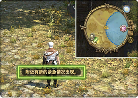
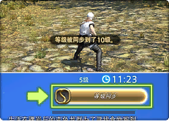
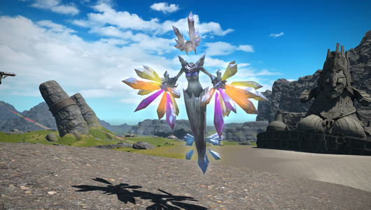

# 临危受命

;;;.guide .cols2
;;;.guide .col

;;;
;;;.guide .col .grow

临危受命（Full Active Time Events，简称FATE）是在野外地图上随机发生的特殊任务，只要抵达FATE所在区域，就会自动进入任务，完成任务目标后可以获得经验值和军票（或双色宝石）奖励。

部分FATE需要与NPC对话进行触发（大部分是护送和收集类的），此时地图上会有一个FATE的标记（但是没有表示范围的蓝圈）。

;;;
;;;

## FATE分类

FATE主要分成5类，具体的任务目标都可以在任务信息部分看到：

|         类型        |   描述     |
| ------------------- | --------- |
| 讨伐小怪 | 范围内会不断刷新小怪，击杀到一定数量即告成功。 |
| 讨伐 BOSS | 范围内会出现一只BOSS级的怪。周围也许还有小怪，但并非击杀目标，可以不管。有的BOSS需要击杀一定小怪后才会出现。 |
| 收集上交材料 | 范围内会出现物品和一些小怪，捡拾物品或击杀小怪都可以获得目标道具，在时间内向NPC上交道具即可。|
| 护送 NPC | 需要护送NPC从FATE起点走到终点，沿途中会出现若干波小怪，需要全部击杀后NPC才会前进，NPC被小怪击杀则危命失败。|
| 防御特定物品。 | 需要保护场地内的特定NPC或物品（可以为对方加血上盾等等），保护好目标的同时击杀一定数量的小怪即告成功。所有目标都被击破则危命失败。|

;;;.guide .cols2
;;;.guide .col

;;;
;;;.guide .col .grow

危命任务结算时，会根据玩家的贡献程度（击杀小怪的数量、对BOSS的伤害、上交道具的数量等等）进行计算，而给予金牌、银牌或铜牌的评价，不同评价所获得的奖励数量是不同的。

;;;
;;;

## 特殊机制

;;;.guide .cols2
;;;.guide .col

;;;
;;;.guide .col .grow

FATE的难度会随着地图上当前的玩家数量，上次刷新该FATE时的参与人数、任务结果等等条件而发生变化。

如果玩家等级高于FATE任务的推荐等级，那么玩家需要点击任务说明上的++等级同步++按钮，或者输入命令`/lsync`来同步等级，否则玩家将无法攻击危命任务目标（再次点击等级同步按钮或输入命令，则可以取消等级同步状态）。

;;;
;;;

### 经验加成

;;;.guide .cols2
;;;.guide .col

迷失者

;;;
;;;.guide .col .grow

在4.0之后的地图（61级以上的地图），会出现两种经验加成的FATE：

* FATE图标右上角有经验值图标，FATE任务信息会提示有额外经验值，完成该FATE后，会根据结算经验值再追加100%的经验。
* 在FATE任务中提示==迷失少女（或迷失者）出现了==，同时出现特殊小怪，在FATE结算之前击杀这只小怪，所有参与FATE的玩家都可以获得（+50%）或（+300%）buff，获得这个buff之后，在本地图完成的下一个FATE任务可以获得额外的经验加成。

;;;
;;;

### 危命任务完成度

在5.0之后的地图（71级以上的地图），以金牌评价完成各个区域的FATE，可以积累危命任务完成度，根据完成度等级不同，可以开放各个地区的**广域交易商**的商品兑换。

| 阶段 | 完成等级 | 需求 |
| --- | -------- | ---- |
|  0  |  1  | 完成 1 次FATE开启完成度评价 |
|  1  |  2  | 以最高评价（金牌）完成6次危命 |
|  2  |  3  | 以最高评价（金牌）完成60次危命 |

5.0地区的危命任务不再奖励军票，取而代之的是**双色宝石**，使用双色宝石向**广域交易商**兑换各种物品，具体兑换列表可以查看[这个页面](https://ff14.huijiwiki.com/wiki/%E5%8F%8C%E8%89%B2%E5%AE%9D%E7%9F%B3)。

## 成就&特殊FATE

游戏几乎每个地图上都会有一个特殊FATE，它有超长的击杀时间（普通FATE限时通常是15min，而特殊FATE大都是限时30min），或者会赠送称号或掉落宠物、乐谱、鸟甲等等特殊道具（**以下列表若未经特殊说明，则仅在以最高评价完成时获得**）。

### 2.0特殊FATE

部分系列FATE名称具有相同的前缀，为了简略叙述，下面的部分FATE名称省略了共同的前缀。

  <table class="ui compact grey striped unstackable table" style="min-width: 38em;">
    <thead>
      <tr>
        <th style="min-width: 8em;">FATE</th>
        <th style="min-width: 7em;">坐标</th>
        <th style="min-width: 23em;">掉落及备注</th></tr>
    </thead>
    <tbody>
      <tr>
        <td>Lv.20 无情的收割者 —— 懒惰口花劳伦斯</td>
        <td>黑衣森林南部林区 九藤 23,29</td>
        <td>
          <item name="魔菇宝" />，成就<strong>收割者克星</strong>。</td></tr>
      <tr>
        <td>Lv.32 死亡的假面 —— 黄道巨蟹</td>
        <td>东拉诺西亚 鲜血滨 31,34</td>
        <td>
          <item name="小壳蟹" />，成就<strong>冥府引路人</strong>。</td></tr>
      <tr>
        <td>Lv.38 斯瓦拉的愤怒</td>
        <td>库尔扎斯中央高地 巨龙首 26,15</td>
        <td>成就<strong>屠龙者</strong>。
           是一个三连 FATE，起始 FATE 是<strong>斯瓦拉的袭击</strong>。如果第二个 FATE<strong>斯瓦拉的恐怖</strong>成功，则会刷新<strong>斯瓦拉的坠落</strong>，失败会刷新斯瓦拉的愤怒，无论是坠落还是愤怒，成功完成 FATE 后都可以获得成就。</td></tr>
      <tr>
        <td>Lv.39 归来的复仇者 —— 史特罗佩斯</td>
        <td>库尔扎斯中央高地 白云崖 15,19</td>
        <td>
          <item name="胖墩跳蜥" />，成就<strong>史特罗佩斯之敌</strong>。</td></tr>
      <tr>
        <td>Lv.49 狂暴巨兽 —— 强化奇美拉</td>
        <td>北萨纳兰 劳班缓冲地 17.14</td>
        <td>
          <item name="小小魔精" />，成就<strong>强杀奇美拉</strong>。</td></tr>
      <tr>
        <td>Lv.49 救世神的活祭：妖异之章</td>
        <td>北萨纳兰 蓝雾 26,22</td>
        <td>成就<strong>杰出的异端审问官</strong>。
           艾玛吉娜秘银废矿里的一个系列 FATE，起始 FATE 是触发型FATE<strong>救世神的活祭：诱拐之章</strong>（在银矿门口）。</td></tr>
      <tr>
        <td>Lv.20 振兴贫女材场 讨伐猛兽</td>
        <td>拉诺西亚高地 橡树原 12,,24</td>
        <td>成就<strong>保护弱女子</strong>。
           是系列 FATE，但只有讨伐猛兽给成就。完成系列任一 FATE 之后一段时间，会出现卢恩人商人，出售<item name="小蝙蝠" />。
        </td></tr>
      <tr>
        <td>Lv.26 跨天桥上的死斗 迎击纳约克・秋</td>
        <td>东萨纳兰 跨天桥 21,21</td>
        <td>成就<strong>跨天桥的英雄</strong>。
           是系列 FATE，初始 FATE 是<strong>跨天桥上的死斗 前哨战</strong>，中间任意 FATE 失败后会触发<strong>跨天桥上的死斗 市民营救战</strong>，然后重新从前哨战开始。成功打倒纳约克・秋之后，可以从跨天桥商人购买<item name="小松鼠" />和<item name="管弦乐琴乐谱：一瞬的光彩" />。</td></tr>
      <tr>
        <td>Lv.32 红腹蜂巢占领战</td>
        <td>黑衣森林南部林区 沉默花坛 22,17</td>
        <td>成就<strong>埋枝村的救世主</strong>。
           是系列 FATE，初始 FATE 是<strong>红腹蜂巢攻略战</strong>。攻略并占领后，原地会继续刷新<strong>红腹蜂巢防卫战</strong>和<strong>红腹蜂巢迎击战</strong>，只要完成占领、防卫、迎击三者任意之一就可以获得成就。但是只有成功完成<strong>红腹蜂巢占领战</strong>后，可以从埋枝村商人处购买<item name="盗龙小宝" />。</td></tr>
      <tr>
        <td>Lv.50 受伤的魔兽贝希摩斯</td>
        <td>库尔扎斯中央高地 白云崖 4,15</td>
        <td>
          <item name="贝希摩斯之角" />，成就<strong>魔兽终结者</strong>。
           前置 FATE 是<strong>传说的魔兽 —— 贝希摩斯</strong>，完成这个 FATE 后，贝希摩斯会逃跑至贝希摩斯的领地，然后刷出该 FATE。
           金牌掉 5 个角，银牌掉 1 个，可以用来兑换物品，点击<item name="贝希摩斯之角" />查看详情。</td>
      </tr>
      <tr>
        <td>Lv.50 上古斗神奥丁</td>
        <td>黑衣森林某处</td>
        <td>
          <item name="奥丁披风" />，成就<strong>铁蹄的弑神者</strong>。
           奥丁出现时，整个黑衣森林的天气会变为绝命。奥丁会在黑衣森林的某一个区域中游荡，玩家需要找到奥丁附近才能看到 FATE 任务的指示圈。
           另外每次奥丁刷新时，都是上次击杀他的玩家的外貌，开战后才会戴上奥丁的头盔。
           金牌掉 5 个披风，银牌掉 1 个披风，可以用来兑换斩铁剑等道具，点击<item name="奥丁披风" />查看详情。</td>
      </tr>
    </tbody>
  </table>

<!-- | FATE | 坐标 | 掉落及备注 |
| ------------------- | --------- | ------ |
| Lv.20 无情的收割者——懒惰口花劳伦斯 | 黑衣森林南部林区 九藤 23,29 | <item name="魔菇宝" />，成就**收割者克星**。 |
| Lv.32 死亡的假面——黄道巨蟹 | 东拉诺西亚 鲜血滨 31,34 | <item name="小壳蟹" />，成就**冥府引路人**。 |
| Lv.38 斯瓦拉的愤怒 | 库尔扎斯中央高地 巨龙首 26,15 | 成就**屠龙者**。 是一个三连FATE，起始FATE是**斯瓦拉的袭击**。如果第二个FATE**斯瓦拉的恐怖**成功，则会刷新**斯瓦拉的坠落**，失败会刷新斯瓦拉的愤怒，无论是坠落还是愤怒，成功完成FATE后都可以获得成就。 |
| Lv.39 归来的复仇者——史特罗佩斯 | 库尔扎斯中央高地 白云崖 15,19 | <item name="胖墩跳蜥" />，成就**史特罗佩斯之敌**。 |
| Lv.49 狂暴巨兽——强化奇美拉 | 北萨纳兰 劳班缓冲地 17.14 | <item name="小小魔精" />，成就**强杀奇美拉**。 |
| Lv.49 救世神的活祭：妖异之章 | 北萨纳兰 蓝雾 26,22 | 成就**杰出的异端审问官**。 艾玛吉娜秘银废矿里的一个系列FATE，起始FATE是**救世神的活祭：诱拐之章**。 |
| Lv.20 振兴贫女材场 讨伐猛兽 | 拉诺西亚高地 橡树原 12,,24 | 成就**保护弱女子**。 是系列FATE，但只有讨伐猛兽给成就。完成系列任一FATE之后一段时间，会出现卢恩人商人，出售<item name="小蝙蝠" /> |
| Lv.26 跨天桥上的死斗 迎击纳约克·秋 | 东萨纳兰 跨天桥 21,21 | 成就**跨天桥的英雄**。 是系列FATE，初始FATE是**跨天桥上的死斗 前哨战**，中间任意FATE失败后会触发**跨天桥上的死斗 市民营救战** ，然后重新从前哨战开始。成功打倒纳约克·秋之后，可以从跨天桥商人购买<item name="小松鼠" />和<item name="管弦乐琴乐谱：一瞬的光彩" />。 ||
| Lv.32 红腹蜂巢占领战 | 黑衣森林南部林区 沉默花坛 22,17 | 成就**埋枝村的救世主**。 是系列FATE，初始FATE是**红腹蜂巢攻略战**。攻略并占领后，原地会继续刷新**红腹蜂巢防卫战**和**红腹蜂巢迎击战**，只要完成占领、防卫、迎击三者任意之一就可以获得成就。但是只有成功完成**红腹蜂巢占领战**后，可以从埋枝村商人处购买<item name="盗龙小宝" /> |
| Lv.50 受伤的魔兽贝希摩斯 | 库尔扎斯中央高地 白云崖 4,15 | <item name="贝希摩斯之角" />，成就**魔兽终结者**。 前置FATE是**传说的魔兽——贝希摩斯**，完成这个FATE后，贝希摩斯会逃跑至贝希摩斯的领地，然后刷出该FATE。 金牌掉5个角，银牌掉1个，可以用来兑换物品，点击<item name="贝希摩斯之角" />查看详情。 |
| Lv.50 上古斗神奥丁 | 黑衣森林某处 | <item name="奥丁披风" />，成就**铁蹄的弑神者**。 奥丁出现时，整个黑衣森林的天气会变为绝命。奥丁会在黑衣森林的某一个区域中游荡，玩家需要找到奥丁附近才能看到FATE任务的指示圈。 另外每次奥丁刷新时，都是上次击杀他的玩家的外貌，开战后才会戴上奥丁的头盔。 金牌掉5个披风，银牌掉1个披风，可以用来兑换斩铁剑等道具，点击<item name="奥丁披风" />查看详情。 | -->

### 3.0 特殊FATE

部分系列FATE名称具有相同的前缀，为了简略叙述，下面的部分FATE名称省略了共同的前缀。

  <table class="ui compact grey striped unstackable table" style="min-width: 38em;">
    <thead>
      <tr>
        <th style="min-width: 8em;">FATE</th>
        <th style="min-width: 7em;">坐标</th>
        <th style="min-width: 23em;">掉落及备注</th></tr>
    </thead>
    <tbody>
      <tr>
        <td>Lv.51 吞噬牦牛的巨人 —— 巨脚雪人</td>
        <td>库尔扎斯西部高地 红沿 20,33</td>
        <td>
          <item name="贝希摩斯耳坠" />，成就<strong>珍兽猎人</strong>。</td></tr>
      <tr>
        <td>Lv.53 坚甲铁龙 —— 塔拉斯克</td>
        <td>龙堡参天高地 阿瓦隆尼亚古陆 13,36</td>
        <td>
          <item name="九宫幻卡：胖陆行鸟" />，成就<strong>粉身碎甲</strong>。</td></tr>
      <tr>
        <td>Lv.57 暴食人形岩 —— 大地饕餮</td>
        <td>阿巴拉提亚云海 蓝天窗 21,13</td>
        <td>
          <item name="淘金热" />，成就<strong>浮岛守护者</strong>。</td></tr>
      <tr>
        <td>Lv.58 全面改造机 ——3 号哥布林装甲 J 型</td>
        <td>龙堡内陆低地 萨雷安精制区 31,22</td>
        <td>
          <item name="卢恩耳坠" />，成就<strong>合金装备</strong>。三连 FATE，起始 FATE 是<strong>恶魔机器</strong>，然后是<strong>复仇者们</strong>。</td></tr>
      <tr>
        <td>Lv.54 天极白垩宫防卫战 救助幼龙
           Lv.54 天极白垩宫防卫战 救助莫古
           Lv。.55 极白垩宫防卫战 讨伐猛龙</td>
        <td>翻云雾海 竖骨岛 13,24
           翻云雾海 竖骨岛 22,21
           翻云雾海 竖骨岛 14,13</td>
        <td>
          <item name="九宫幻卡：暗鳞黑龙" /> 这三个FATE和下面的暗鳞黑龙征讨战FATE一起作为<strong>苍天白龙 —— 维德佛尔尼尔</strong>的前置FATE。
        </td>
      </tr>
      <tr>
        <td>Lv.55 暗鳞黑龙征讨战 决战</td>
        <td>翻云雾海 竖骨岛 18,8</td>
        <td>
          <item name="暗鳞黑龙黑巫腰带" />、
          <item name="暗鳞黑龙强攻腰带" />、
          <item name="暗鳞黑龙御敌腰带" />（随机 3 掉 1），成就<strong>暗龙克星</strong>。
           是三连 FATE，按顺序分别是<strong>白龙支援</strong>、<strong>追击作战</strong>和<strong>决战</strong>，只有完成上一连才会刷出最终的决战。</td></tr>
      <tr>
        <td>Lv.56 苍天白龙 —— 维德佛尔尼尔</td>
        <td>翻云雾海 绿茵岛 11,36</td>
        <td>
          <item name="崇山陆行鸟半装甲" />，成就<strong>白龙劲敌</strong>。
           需要同时成功完成前面的 3 个<strong>天极白垩宫防卫战</strong>FATE，以及<strong>暗鳞黑龙征讨战</strong>FATE（共计 6 个 FATE）才会出现。</td></tr>
      <tr>
        <td>Lv.60 幻影女王 —— 长须豹女王</td>
        <td>龙堡参天高地 彻悟岩窟 12,10
           龙堡参天高地 阿巴拉提亚山麓 31,5
           龙堡参天高地 阿瓦隆尼亚古陆 9.36</td>
        <td>
          <item name="长须豹女王的枝角" />，成就<strong>天不佑女王</strong>。
           是三连 FATE，和奥丁一样不会直接在地图上显示 FATE 范围，需要抵达任务附近才会出现。女王出现时，整个龙堡参天高地会变为
          兽雷天气。
           P1 为<strong>雷兽女王 —— 长须豹女王</strong>（Lv.52 龙堡参天高地 35,25），P2 是<strong>逆袭女王 —— 长须豹女王</strong>（Lv.57 龙堡参天高地 27.21/37,27），只有上一阶段完成后才会刷新下一阶段，每阶段的刷新间隔为 3~9 小时（最长可能有 10 小时），中途失败或成功后过 1.5~3 天刷新 P1。3 个阶段分别掉落 1、3、5 个枝角，可用于兑换豹纹服装，点击
          <item name="长须豹女王的枝角" />查看详情。</td>
      </tr>
      <tr>
        <td>Lv.59 太古威胁 夜光花歼灭战</td>
        <td>魔大陆 6,20 / 27,5 / 38,18</td>
        <td>
          <item name="究极神兵原型装甲板" />
           魔大陆出现
          雷波天气，同时会有究极神兵在天上飞，并且施放有伤害的 AOE 技能。究极神兵消失后，就会刷出夜光花 FATE。和长须豹女王 FATE 一样，需要抵达 FATE 所在区域附近才能看到 FATE 提示。</td></tr>
    </tbody>
  </table>

<!-- | FATE | 坐标 | 掉落及备注 |
| ------------------- | --------- | ------ |
| Lv.51 吞噬牦牛的巨人——巨脚雪人 | 库尔扎斯西部高地 红沿 20,33 | <item name="贝希摩斯耳坠" />，成就**珍兽猎人**。|
| Lv.53 坚甲铁龙——塔拉斯克 | 龙堡参天高地 阿瓦隆尼亚古陆 13,36 | <item name="九宫幻卡：胖陆行鸟" />，成就**粉身碎甲**。 |
| Lv.57 暴食人形岩——大地饕餮 | 阿巴拉提亚云海 蓝天窗 21,13 | <item name="淘金热" />，成就**浮岛守护者**。 |
| Lv.58 全面改造机——3号哥布林装甲J型 | 龙堡内陆低地 萨雷安精制区 31,22 | <item name="卢恩耳坠" />，成就**合金装备**。三连FATE，起始FATE是**恶魔机器**，然后是**复仇者们**。 |
| Lv.54 天极白垩宫防卫战 救助幼龙 Lv.54 天极白垩宫防卫战 救助莫古 Lv。.55 极白垩宫防卫战 讨伐猛龙 | 翻云雾海 竖骨岛 13,24 翻云雾海 竖骨岛 22,21 翻云雾海 竖骨岛 14,13 | <item name="九宫幻卡：暗鳞黑龙" /> |
| Lv.55 暗鳞黑龙征讨战 决战 | 翻云雾海 竖骨岛 18,8 | <item name="暗鳞黑龙黑巫腰带" />、<item name="暗鳞黑龙强攻腰带" />、<item name="暗鳞黑龙御敌腰带" />（随机3掉1），成就**暗龙克星**。 是六连FATE，其中4~6连是**暗鳞黑龙征讨战**，按顺序分别是**白龙支援**、**追击作战**和**决战**，只有完成上一连才会刷出最终的决战。 |
| Lv.56 苍天白龙——维德佛尔尼尔 | 翻云雾海 绿茵岛 11,36 | <item name="崇山陆行鸟半装甲" />，成就**白龙劲敌**。 需要同时成功完成前面的3个**天极白垩宫防卫战**FATE，以及**暗鳞黑龙征讨战**FATE（共计6个FATE）才会出现。 |
| Lv.60 幻影女王——长须豹女王 | 龙堡参天高地 彻悟岩窟 12,10 龙堡参天高地 阿巴拉提亚山麓 31,5 龙堡参天高地 阿瓦隆尼亚古陆 9.36 | <item name="长须豹女王的枝角" />，成就**天不佑女王**。 是三连FATE，和奥丁一样不会直接在地图上显示FATE范围，需要抵达任务附近才会出现。女王出现时，整个龙堡参天高地会变为兽雷天气。 P1为**雷兽女王——长须豹女王**（Lv.52 龙堡参天高地 35,25），P2是**逆袭女王——长须豹女王**（Lv.57 龙堡参天高地 27.21/37,27），只有上一阶段完成后才会刷新下一阶段，每阶段的刷新间隔为3~9小时（最长可能有10小时），中途失败或成功后过1.5~3天刷新P1。3个阶段分别掉落1、3、5个枝角，可用于兑换豹纹服装，点击<item name="长须豹女王的枝角" />查看详情。 |
| Lv.59 太古威胁 夜光花歼灭战 | 魔大陆 6,20 / 27,5 / 38,18 | <item name="究极神兵原型装甲板" /> 魔大陆出现雷波天气，同时会有究极神兵在天上飞，并且施放有伤害的AOE技能。究极神兵消失后，就会刷出夜光花FATE。和长须豹女王FATE一样，需要抵达FATE所在区域附近才能看到FATE提示。 |  -->

### 4.0 特殊FATE

部分系列FATE名称具有相同的前缀，为了简略叙述，下面的部分FATE名称省略了共同的前缀。

  <table class="ui compact grey striped unstackable table" style="min-width: 38em;">
    <thead>
      <tr>
        <th style="min-width: 8em;">FATE</th>
        <th style="min-width: 7em;">坐标</th>
        <th style="min-width: 23em;">掉落及备注</th></tr>
    </thead>
    <tbody>
      <tr>
        <td>Lv.61 树人长老 —— 奇尔尼斯</td>
        <td>基拉巴尼亚边区 15.2,22.7</td>
        <td>
          <item name="管弦乐琴乐谱：铁壁之外" />，成就<strong>了不起的伐树工</strong>。</td></tr>
      <tr>
        <td>Lv.62 做梦的大名 —— 大名观梦螺</td>
        <td>红玉海 17.5,9.2</td>
        <td>
          <item name="管弦乐琴乐谱：火焰之海" />，成就<strong>梦断魂劳</strong>。</td></tr>
      <tr>
        <td>Lv.65 长牙大物 —— 摩西娑苏罗</td>
        <td>太阳神草原 30，23</td>
        <td>
          <item name="九宫幻卡：长毛象" />，成就<strong>以牙还牙</strong>。</td></tr>
      <tr>
        <td>Lv.67 叛逆的巨兵 —— 鬼童丸</td>
        <td>延夏 15.8,10.7</td>
        <td>
          <item name="鬼童丸" />，成就<strong>尘归尘土归土</strong>。</td></tr>
      <tr>
        <td>Lv.68 强大的袭击者 —— 洪巴巴</td>
        <td>基拉巴尼亚山区 15.5,30.5</td>
        <td>
          <item name="峻岭装甲" />，成就<strong>洪巴巴杀手</strong>。
           前置 FATE 是对话触发型 FATE<strong>嘉氏的战士</strong>（阳炎 嘉・娜迦珂）</td></tr>
      <tr>
        <td>Lv.69 白色的大脸 —— 涛尔・马乌恩坦</td>
        <td>基拉巴尼亚湖区 23,25</td>
        <td>
          <item name="九宫幻卡：弗巴德" />，成就<strong>洪巴巴杀手</strong>。</td></tr>
      <tr>
        <td>Lv.70 九尾妖狐玉藻御前</td>
        <td>延夏各处</td>
        <td>
          <item name="杀生石碎片" />
           需要先完成<strong>银狐的心愿</strong>（Lv.63，延夏 19.9,7.4）、<strong>金狐的心愿</strong>（Lv.67，延夏 13,30）、<strong>其名为藻女</strong>（Lv.70，延夏 31,8）三个 FATE，然后等待刷新即可。藻女金牌完成可以获得 1 枚杀生石碎片，玉藻御前金牌可获得 15 枚杀生石碎片。杀生石碎片可以用于兑换外观、宠物，点击<item name="杀生石碎片" />查看详情。</td>
      </tr>
      <tr>
        <td>Lv.70 传说中的雷马 —— 伊克西翁</td>
        <td>基拉巴尼亚湖区 4,15/29,9/16,22</td>
        <td>
          <item name="伊克西翁的雷角" />，成就<strong>断角者</strong>。
           天气会变为
          迅雷，和其他几个变天 FATE 一样，不会直接显示在地图上，需要靠近任务区域才会出现。战斗时需要先使用<item name="幽狱灰" />破除伊克西翁的无敌状态，由于一个幽狱灰效果只能持续 30s，因此需要多名玩家持续使用幽狱灰到击杀完成才可以。掉落的雷角可以兑换坐骑、宠物等，点击<item name="伊克西翁的雷角" />查看详情。</td>
      </tr>
      <tr>
        <td>Lv.65 答塔克的旅程之大王出阵</td>
        <td>太阳神草原各处</td>
        <td>
          <item name="答塔克部旗帜" />，成就<strong>答塔克之旅</strong>。
           俗称草原十三连，是十三个 FATE 组成的一个长的叙述形的剧情系列 FATE，看到以<strong>答塔克的旅程</strong>开头的 FATE 就是，按故事顺序则分别是：消灭噪蜻蜓、铲除獦狚、挤羊奶、猎取犏牛、獦狚再袭、温衮德强袭、营救猎人、讨伐狼獾、象魔强袭、遭遇象魔、营救格洛部、象魔反攻、大王出阵。</td></tr>
    </tbody>
  </table>

<!-- | FATE | 坐标 | 掉落及备注 |
| ------------------- | --------- | ------ |
| Lv.61 树人长老——奇尔尼斯 | 基拉巴尼亚边区 15.2,22.7 | <item name="管弦乐琴乐谱：铁壁之外" />，成就**了不起的伐树工**。 |
| Lv.62 做梦的大名——大名观梦螺 | 红玉海 17.5,9.2 | <item name="管弦乐琴乐谱：火焰之海" />，成就**梦断魂劳**。 |
| Lv.65 长牙大物——摩西娑苏罗 | 太阳神草原 30，23 | <item name="九宫幻卡：长毛象" />，成就**以牙还牙**。 |
| Lv.67 叛逆的巨兵——鬼童丸 | 延夏 15.8,10.7| <item name="鬼童丸" />，成就**尘归尘土归土**。 |
| Lv.68 强大的袭击者——洪巴巴 | 基拉巴尼亚山区 15.5,30.5 | <item name="峻岭装甲" />，成就**洪巴巴杀手**。 前置FATE是对话触发型FATE**嘉氏的战士**（阳炎 嘉·娜迦珂）|
| Lv.69 白色的大脸——涛尔·马乌恩坦 | 基拉巴尼亚湖区 23,25| <item name="九宫幻卡：弗巴德" />，成就**洪巴巴杀手**。 |
| Lv.70 九尾妖狐玉藻御前 | 延夏各处 | <item name="杀生石碎片" /> 需要先完成**银狐的心愿**（Lv.63，延夏 19.9,7.4）、**金狐的心愿**（Lv.67，延夏 13,30）、**其名为藻女**（Lv.70，延夏 31,8）三个FATE，然后等待刷新即可。藻女金牌完成可以获得1枚杀生石碎片，玉藻御前金牌可获得15枚杀生石碎片。杀生石碎片可以用于兑换外观、宠物，点击<item name="杀生石碎片" />查看详情。|
| Lv.70 传说中的雷马——伊克西翁 | 基拉巴尼亚湖区 4,15/29,9/16,22 | <item name="伊克西翁的雷角" />，成就**断角者**。  天气会变为迅雷，和其他几个变天FATE一样，不会直接显示在地图上，需要靠近任务区域才会出现。战斗时需要先使用<item name="幽狱灰" />破除伊克西翁的无敌状态，由于一个幽狱灰效果只能持续30s，因此需要多名玩家持续使用幽狱灰到击杀完成才可以。掉落的雷角可以兑换坐骑、宠物等，点击<item name="伊克西翁的雷角" />查看详情。 |
| Lv.65 答塔克的旅程之大王出阵 | 太阳神草原各处 | <item name="答塔克部旗帜" />，成就**答塔克之旅**。 俗称草原十三连，是十三个FATE组成的一个长的叙述形的剧情系列FATE，看到以**答塔克的旅程**开头的FATE就是，按故事顺序则分别是：消灭噪蜻蜓、铲除獦狚、挤羊奶、猎取犏牛、獦狚再袭、温衮德强袭、营救猎人、讨伐狼獾、象魔强袭、遭遇象魔、营救格洛部、象魔反攻、大王出阵。 | -->

### 5.0 特殊FATE

部分系列FATE名称具有相同的前缀，为了简略叙述，下面的部分FATE名称省略了共同的前缀。

  <table class="ui compact grey striped unstackable table" style="min-width: 38em;">
    <thead>
      <tr>
        <th style="min-width: 8em;">FATE</th>
        <th style="min-width: 7em;">坐标</th>
        <th style="min-width: 23em;">掉落及备注</th></tr>
    </thead>
    <tbody>
      <tr>
        <td>Lv.71 与紫叶团的战斗之座狼参战</td>
        <td>雷克兰德</td>
        <td>成就<strong>卫兵团信赖的同志</strong>。
           是一系列 FATE，相关 FATE 有<strong>樵夫之歌</strong>→<strong>与紫叶团的战斗之袭击樵夫</strong>，<strong>与紫叶团的战斗之开设营地</strong>→<strong>与紫叶团的战斗之建设营地</strong>，这 4 个 FATE 均告成功后，会出现<strong>与紫叶团的战斗之卑鄙陷阱</strong>（触发型 FATE，NPC 名为 “像是旅行商人的男子”。另外同一个位置（雷克兰德 25.1, 12.4）会刷新名为污秽之血的 FATE，触发 NPC 为 “乔布要塞的卫兵”，如果污秽之血或其触发 NPC 在地图上，那么卑鄙陷阱的 FATE 不会刷新）。完成卑鄙陷阱 FATE 之后，如果满足后续条件，NPC 会出现气泡对话，并触发后续<strong>与紫叶团的战斗之集结</strong>→<strong>与紫叶团的战斗之座狼参战</strong>。</td></tr>
      <tr>
        <td>Lv.73 小顽童代恩兄弟之最后的战斗！</td>
        <td>伊尔美格</td>
        <td>成就<strong>妖灵乡的居民</strong>。
           8 连剧情 fate，讲小顽童代恩兄弟的故事，以小顽童代恩兄弟开头的 FATE 均是这个系列。按故事顺序则分别是：目标是仙子！、目标是阿马罗！、目标是恩莫！、幻惑花楸树！、决战来临！、再战！、二人的杀手锏！、最后的战斗！</td></tr>
      <tr>
        <td>Lv.75 缅楠的狩猎之猛追托希尔</td>
        <td>拉凯提卡大森林</td>
        <td>成就<strong>隆卡守护者</strong>。
           是一系列 FATE，是讲缅楠的一系列故事，看到<strong>缅楠</strong>开头的就是这个系列 FATE。按故事顺序分别是：病毒回音、病原毛爬虫、补充弓箭、保护古代守护者、发现托希尔、追击托希尔、追击托希尔、猛追托希尔。（后面托希尔相关的 FATE 就是同一个 BOSS 拆成 4 个阶段打…）</td></tr>
      <tr>
        <td>Lv.76 寻求者之大老之剑</td>
        <td>安穆・艾兰</td>
        <td>成就<strong>荒野中的拾荒者</strong>。
           是一系列 FATE，分为右半边的 “拾荒者” 系列（Lv.70）和左半边的 “寻求者” 系列（Lv.76）。先完成铰颌蚁的陷阱→* 萨迈尔脊骨→库伽仙人刺→废品回收，然后进入地图左半边遭遇强盗→强盗反击→探索遗迹→大老之剑。</td></tr>
      <tr>
        <td>Lv.80 激斗畏惧装甲之秘密武器</td>
        <td>珂露西亚岛 33,22</td>
        <td>
          <item name="畏惧装甲的齿轮" />，成就<strong>自走人偶粉碎者</strong>。
           三连 FATE，前两连危险逼近→新的情报会时常刷新，而 P3 秘密武器会在上次击杀后 1~3 天刷新（否则只会前两连循环）。掉落齿轮可以交换到坐骑和宠物，点击<item name="畏惧装甲的齿轮" />查看详情。</td>
      </tr>
      <tr>
        <td>Lv.80 灾厄的古塔尼亚之深海讨伐战</td>
        <td>黑风海</td>
        <td>
          <item name="古塔尼亚的角" />，成就<strong>大嘴巨兽</strong>。
           七连 FATE，前 5 连：开始追踪、兹姆嘶登场、保护提乌嘶、护卫提乌嘶、收集红血珊瑚会时常刷新，而 P6 会在上次击杀后 1.5~3 天后，完成 P5 时有概率刷新。一旦出现 P6 准备决战并完成，就会出现 P7 深海讨伐战。掉落的角可以兑换
          <item name="蟾蜍服" />等道具，点击 <item name="古塔尼亚的角" />查看详情。</td>
      </tr>
    </tbody>
  </table>

<!-- | FATE | 坐标 | 掉落及备注 |
| ------------------- | --------- | ------ |
| Lv.71 与紫叶团的战斗之座狼参战 | 雷克兰德 | 成就**卫兵团信赖的同志**。 是一系列FATE，相关FATE有**樵夫之歌**→**与紫叶团的战斗之袭击樵夫**，**与紫叶团的战斗之开设营地**→**与紫叶团的战斗之建设营地**，这4个FATE均告成功后，会出现**与紫叶团的战斗之卑鄙陷阱**（触发型FATE，NPC名为“像是旅行商人的男子”。另外同一个位置（雷克兰德 25.1, 12.4）会刷新名为污秽之血的FATE，触发NPC为“乔布要塞的卫兵”，如果污秽之血或其触发NPC在地图上，那么卑鄙陷阱的FATE不会刷新）。完成卑鄙陷阱FATE之后，如果满足后续条件，NPC会出现气泡对话，并触发后续**与紫叶团的战斗之集结**→**与紫叶团的战斗之座狼参战**。 |
| Lv.73 小顽童代恩兄弟之最后的战斗！ | 伊尔美格 | 成就**妖灵乡的居民**。 8连剧情fate，讲小顽童代恩兄弟的故事，以小顽童代恩兄弟开头的FATE均是这个系列。按故事顺序则分别是：目标是仙子！、目标是阿马罗！、目标是恩莫！、幻惑花楸树！、决战来临！、再战！、二人的杀手锏！、最后的战斗！ |
| Lv.75 缅楠的狩猎之猛追托希尔 | 拉凯提卡大森林 | 成就**隆卡守护者**。 是一系列FATE，是讲缅楠的一系列故事，看到**缅楠**开头的就是这个系列FATE。按故事顺序分别是：病毒回音、病原毛爬虫、补充弓箭、保护古代守护者、发现托希尔、追击托希尔、追击托希尔、猛追托希尔。（后面托希尔相关的FATE就是同一个BOSS拆成4个阶段打…）|
| Lv.76 寻求者之大老之剑 | 安穆·艾兰 | 成就**荒野中的拾荒者**。 是一系列FATE，分为右半边的“拾荒者”系列（Lv.70）和左半边的“寻求者”系列（Lv.76）。先完成铰颌蚁的陷阱→*萨迈尔脊骨→库伽仙人刺→废品回收，然后进入地图左半边遭遇强盗→强盗反击→探索遗迹→大老之剑。 |
| Lv.80 激斗畏惧装甲之秘密武器 | 珂露西亚岛 33,22 | <item name="畏惧装甲的齿轮" />，成就**自走人偶粉碎者**。 三连FATE，前两连危险逼近→新的情报会时常刷新，而P3秘密武器会在上次击杀后1~3天刷新（否则只会前两连循环）。掉落齿轮可以交换到坐骑和宠物，点击<item name="畏惧装甲的齿轮" />查看详情。|
| Lv.80 灾厄的古塔尼亚之深海讨伐战 | 黑风海 | <item name="古塔尼亚的角" />，成就**大嘴巨兽**。 七连FATE，前5连：开始追踪、兹姆嘶登场、保护提乌嘶、护卫提乌嘶、收集红血珊瑚会时常刷新，而P6会在上次击杀后1.5~3天后，完成P5时有概率刷新。一旦出现P6准备决战并完成，就会出现P7深海讨伐战。掉落的角可以兑换<item name="蟾蜍服" />等道具，点击<item name="古塔尼亚的角" />查看详情。 | -->