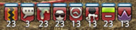

# FF14黑话、玩家常用语词典

为方便玩家检索使用，我们制作了玩家常用语的鼠标划词插件。

::: segment green

[点我安装下载鼠标划词油猴插件](https://cdn.jsdelivr.net/gh/thewakingsands/xivdict@master/xivdict.user.js)

* ==使用方法==：鼠标划过一段文字之后，如果里面有系统收录的缩写、黑话，在这段话右下角会弹出一个“黑话翻译”的小按钮(极偶尔的情况它可能出现在屏幕右上角)，点击这个按钮，就会弹出这段文字中发现的所有黑话及其解释。点击弹窗外的任意位置，弹窗会自动关闭。

* ==目前已知的~~且基本无法解决的~~问题==：
词汇检索比较蠢，比如你鼠标划过“E12”，会同时弹出E1和E12的解释，或者划过“黑话”，会弹出“黑(装备)”的解释。请在使用中自行判断可能的含义。
会展示所有发现的释义。请尽量避免划过过长的文段，可能会导致释义弹窗变得非常非常长。

* ==什么是油猴、如何安装油猴==：油猴是名为Tampermonkey的一个浏览器插件，可以挂载用户自行开发的插件工具。像是购物网站比价工具、视频网站下载工具，都是以用户脚本的方式挂载在浏览器上使用的。目前油猴支持包括Chrome、Edge、UC在内的多款主流浏览器。[Chrome安装](https://zhuanlan.zhihu.com/p/128453110)、[EDGE安装](https://microsoftedge.microsoft.com/addons/detail/tampermonkey/iikmkjmpaadaobahmlepeloendndfphd)、[360安装](https://ext.chrome.360.cn/webstore/detail/dhdgffkkebhmkfjojejmpbldmpobfkfo)，其他浏览器请自行百度，基本上都可以装的。
  安装好插件之后，打开上面的网址，就会弹出一个全是字的界面，找到“安装”按钮，点一下就可以了。

:::

## MMORPG通用词汇
::: segment orange
**索引**：MMORPG、DOT、HOT、跳、AOE、CD、GCD、o-GCD、滑步、SS、T、坦克、肉、奶、N、H、DPS、输出、仇恨、MT、主坦、ST、副坦、OT、换T、换坦、副本、Raid、Buff、Debuff、ADD、110、BiS、Roll、R、尾王、润
:::
::: collapse 查看详情
### MMORPG通用词汇
* MMORPG：大型多人在线角色扮演游戏(~~Many Men Online Role Playing as Girls~~ Massively multiplayer online role-playing games)
* DOT：持续性伤害(FF14中的DOT技能会标注持续时间，及每一跳的伤害)。
* HOT：持续性治疗(FF14中的HOT技能会标注持续时间，及每一跳的治疗量)。
* 跳：DOT、HOT技能会每隔若干秒造成一次伤害/治疗，每一次造成伤害/治疗即称为一跳，FF14中所有DOT、HOT均为每3秒一跳。
* AOE：范围攻击(可以是扇形、圆形、直线、全场或任意形状)。延伸用法：A不到——范围攻击打不到。
* CD、GCD、o-GCD：冷却时间(Cooldown)、公共冷却时间(Global cooldown)，公共冷却时间外(off GCD)。公共冷却时间是指当你使用某个技能之后，其它技能也同时进入CD(技能图标变黑并开始冷却)的时间，而会产生公共冷却时间的技能也被称为GCD技能。
 另外CD在FF14中，还有周获取限制的意思，参见后文“清CD”。
* 滑步：指利用服务器与本地之间计时的时间差，在GCD的间隙进行移动（通常需要施法读条的职业会有此类技巧）。
* SS：技能速度或咏唱速度。另外在战场中，SS指双蛇。
* T、坦克、肉：防护型职业，主要负责抗怪。
* 奶、N、H：治疗型职业，主要负责加血。
* DPS、输出：输出型职业。DPS也指平均每秒伤害。
* 仇恨：怪对玩家的敌视程度，怪物会攻击它仇恨最高的玩家。
* MT、主坦：全程或大部分时间负责抗BOSS的角色。也有可能指代当前正在抗BOSS的那个角色。
* ST、副坦：少数时间抗BOSS，或辅助MT的角色。也有可能指代当前没有在抗BOSS的角色。
* OT：不应承担仇恨的玩家被迫变成引怪角色的情况；在国际服中则是ST的意思。
* 换T、换坦：MT和ST互换位置的一系列操作。
* 副本：就是所谓的迷宫或讨伐战。允许不同队伍玩家分别进入同一个位置，击杀同一个BOSS，而彼此之间互不影响。
* Raid：在MMORPG游戏中，Raid指最高难度的副本，通常会有更复杂的战斗机制，对玩家也有更高的要求，同时会掉落更高级的武器、装备，或有特殊纪念意义的物品等等。
 由于网络游戏需要经常更新，随着版本更新，原本是最高难度的副本也会变得不那么困难，但玩家仍然会称其为Raid，需要注意语境。在FF14中，通常会把零式和绝本称为[Raid](/topic/raid.md)。
* Buff：增益效果，FF14中的Buff图标尖角向上。
* Debuff：负面效果，FF14中的Debuff图标尖角向下 另外在FF14中，上方有一条蓝色横线的Debuff可以驱散(关于驱散请参看后文)
* 110：指在一定范围内往复巡逻的怪。
* ADD：指BOSS战中途刷出的小怪，也指代战斗中途有新怪加入的情况。
* 比如由于远程角色站位不佳，导致副本中往复巡逻的小怪看到玩家并开始攻击，这种情况即被称作ADD(这种ADD通常是不好的)。部分副本会在战斗中途出现新的小怪，这些也被称为ADD，需要T尽快建立仇恨。
* BiS：最佳装备(Best in Slot)，也就是所谓的版本毕业装，通常需要附带版本号(否则默认为当前版本)。
* Roll、R：对掉落战利品进行投掷点数（战利品通知默认出现在窗口右下角）。选择需求、贪婪或放弃后，系统随机从1~99中生成一个数字作为玩家的点数（放弃为0），然后按数字大小进行排列，投掷点数最大的玩家获得该战利品。其中需求优先级无条件大于贪婪（需求1点大于贪婪99点），若非本职可以使用的装备则无法选择需求。
* 尾王：副本中的最后一个BOSS。
* 润：RUN，英语打成了汉字。（快）跑的意思。
:::

## FF14世界观用语
::: segment orange
**索引**：拉拉肥、食材、肥、奥拉、腿精、大猫、白妖精、圣骑、奶骑、彩色职业、战爹、自嗨T、蓝色DPS、暗骑、黑骑、DK、法坦、枪刃、绝*战士、GNB、GB、高贵蓝、白膜、闪耀法师、最强近战、投石机、死炎法师、小仙女的召唤兽、绿色DPS、双子、豆子人、占星、打牌、抽卡、最美职业、垃圾分类、白占、夜占、黑占、优雅绿、扫地僧、猴子、和尚、方向盘、龙骑、躺尸龙、擦炮工、叉鱼的、插头、自嗨DPS、火影、兔忍、诗人、爱豆、手枪、幼年绝枪、工具人、伏地魔、召唤、召日天、真正的远敏、吃馍、红色治疗、红魔、绿魔、赤菩萨、浮游炮、镰刀、死神、低贱红、艾欧泽亚最强职业、休闲职业、LB、极限技、打断、大翅膀、中二盾、中二剑、深喉、最强单奶、大保健、大宝剑、FC、锯、绿斩、红眼、海胆、黑盾、活死人、弗雷、子弹连、超火、背水佬、驱散、真空、为所欲为、神折寿、罩子、闪光弹、小翅膀、贴膜、盾、单盾、群盾、扩散盾、原谅光线、大天使、绿帽、豆子、掐死/手撕小仙女、红卡、贤炮、奶伴、桃园结义、抱拳、钢管舞、标枪、龙炮、红龙炮、肠子、龙肠、龙4、龙5、梭哈、骂人、骂我、兔遁，或大部分与兔相关的词语、背刺、TCJ、天下无敌、魔人 歌、蓝歌、技力歌、旅神、王财、绝顶箭、萝卜、高达、机器人、机工的召唤兽、自爆、舞伴、小舞、大舞、火1/2/3/4、冰1/2/3/4、雷1/2/3/4、毁1/2/3/4、瞬发、病毒、素质三连、魔五连、魔六连、传染、皮卡丘、楼总、风娘、土豆、鸭锁骨、肥龙、轮椅、大水晶、小水晶、雇员铃、铃铛、海都、~拉、拉高、拉外、沙都、~萨、森都、~森、雪都、山都、云海、芭芭拉云海、库啵云海、肥宅城、幽默邦、妖精乡、LaHee、兔子村、矮人村、空岛、死宫、地宫、天宫、寡妇村、极楼神、极灯神、真楼神、水塔、塔1、塔2、塔3、水船、玛哈、撕b谷、翻车谷、坑爹谷、秒退谷、动物园、动画城、血亏堡、霸道、波克曼、ET、十全大补喷、奸商、艾欧泽亚最富有的女人、尊严王、蛮神之耻、云妈、水基佬、大菠萝、电音蟑螂、HQ、NQ、耻辱之力、低保、石头、宝石、经典、天文、禁断、装等、FATE、木桩、身位、板子、AH、金蝶暖暖、跳跳乐、砍树、包邮、古武、魂武、优武、G~、绿图、肥鸡、鸟、狗、龙、富婆衣、校服、小车车、摇摇车、发光摇摇车、成熟号、跑车、丁满、鲨鲨、偷蛋、搬蛋、ULK、新宝岛、新岛、绝育、锁岛、翻新岛、肠粉、冰粉、辣条、水粉、马桶、NM、nmsl、PZZ、男人、P先生、胖猪猪、PDD、礼问、李文、lw、史官、史、头七、t7、问就进洞、进洞、兔子、杀人兔、熊大、举高高、皮皮虾、爆弹、FFN、化石龙、狗子、嫂子、那个女人、LX、lwlx、女人、追梦、ANBS、4花1龙、4素1荤、周冬雨、ZDY、孔乙己、读书人、虫子、银牌、ASG、羊、螃蟹、双牛、圣牛、贝爷、HLS、大眼、舌吻、KX、lwkx、反射、蛾反、塔塔露、椅子、蝎子、海飞丝、海燕、哥布林、gbl、雷军、树人、周树人、鲁迅、YY、狗子、只狼、P女士、水晶龙、花嫁、花嫁龙、花嫁尼德霍格、UFO、支援、BA、猛1、补正、bzy、bzj、高原、SM、CE、GC、QJ、飞机、兽王、大表哥、勇气、抬头、10攻、仙药队、晶簇、jc
:::
::: collapse 查看详情

### 种族
* 拉拉肥、食材、肥：拉拉菲尔族。另外拉拉肥会使用公母区分性别。
* 奥拉：敖龙族。
* 腿精：精灵族。
* 大猫：硌（luò）狮族。
* 白妖精：最白半裸鲁加男。

### 职业
* 圣骑、奶骑、彩色职业：骑士
* 战爹、自嗨T：战士
* 蓝色DPS：战士或枪刃（视版本语境）。
* 暗骑、黑骑、DK、法坦：暗黑骑士
* 枪刃、绝*战士、GNB、GB：绝枪战士
* 高贵蓝：防护型职业，职业图标为蓝色。因排本速度快得名。
* 白膜、闪耀法师、最强近战：白魔法师
* 投石机：白魔法师旧称。
* 死炎法师、小仙女的召唤兽：学者
* 绿色DPS：学者或白魔（视版本语境）。
* 双子：学者和召唤。 在NPC中指阿尔菲诺和阿莉塞。
* 豆子人：学者和召唤
* 占星、打牌、抽卡、最美职业、垃圾分类：占星术士。
* 白占：白昼学派的占星术士，视语境也有可能指白魔+占星的治疗搭配。
* 夜占、黑占：黑夜学派的占星术士，6.0版本起已移除。
* 优雅绿：治疗型职业，职业图标为绿色。
* 扫地僧、猴子、和尚：武僧
* 方向盘：武士（来自职业图标）
* 龙骑、躺尸龙、擦炮工、叉鱼的、插头：龙骑士
* 自嗨DPS：武士，有时也指代武僧或黑魔
* 火影、兔忍：忍者
* 诗人、诗人：吟游诗人。
* 手枪、幼年绝枪：机工士。
* 工具人：指有较强团辅能力的职业，比如提升团队输出的龙骑或诗人，以及开荒时可以复活队友的赤魔。
* 伏地魔：黑魔法师
* 召唤：召唤师
* 召日天：@召唤
* 真正的远敏：@召唤
* 吃馍、红色治疗、红魔、绿魔、赤菩萨：赤魔法师
* 浮游炮：贤者
* 镰刀、死神：钐镰客
* 低贱红：输出型职业，职业图标为红色。由于排本慢被戏称为低贱职业。
* 艾欧泽亚最强职业：雕金或厨子，梗出自调查员系列任务（厨子比雕金强）。
* 休闲职业：钓鱼。

### 技能
* LB、极限技：小队共同积攒使用的大招，根据使用者的职能区分为全团减伤、全团回血（乃至复活）、单体攻击、圆形范围AOE或直线范围AOE。在技能列表-通用技能中可找到。
* 打断：可以打断目标，或令目标陷入眩晕的技能。打断技能包括<Action name="盾牌猛击" />、<Action name="下踢" />、<Action name="扫腿" />、<Action name="插言" />、<Action name="伤头" />（前3个是眩晕，后2个是打断，可以眩晕的技能没有特殊标识（可参看具体副本攻略），可以打断的技能在目标咏唱条上有特殊标注，详情参看[本页](/basic/battle.md)）
* 大翅膀：骑士技能<Action name="武装戍卫" />（效果看起来像大翅膀）。
* 中二盾、中二剑：骑士技能忠义之盾（已删除）、忠义之剑（已删除）。忠义之剑有同名buff。
* 深喉、最强单奶：骑士技能<Action name="深仁厚泽" />（万不可念错）。
* 大保健、大宝剑：骑士技能<Action name="悔罪" />。
* FC、锯：战士技能<Action name="裂石飞环" />。
* 绿斩：战士技能<Action name="暴风斩" />。
* 红眼：战士技能<Action name="原初的解放" />。
* 海胆：暗黑骑士技能<Action name="吸血深渊" />。
* 黑盾：暗黑骑士技能<Action name="至黑之夜" />。
* 弗雷：暗黑骑士技能<Action name="掠影示现" />，或指该技能召唤出的“英雄的掠影”。
* 活死人：暗黑骑士技能<Action name="行尸走肉" />。
* 子弹连：枪刃的<Action name="烈牙" />、<Action name="猛兽爪" />、<Action name="凶禽爪" />连击（需要有子弹晶壤才能使用）。
* 超火、背水佬：枪刃的无敌技能<Action name="超火流星" />（使用时会令玩家血量降为1）。
* 驱散：治疗职能技能<Action name="康复" />，另外诗人的<Action name="光阴神的礼赞凯歌" />，以及夕月小仙女的异想的柔光（已删除）也属于驱散技能。
* 真空、为所欲为：白魔法师技能<Action name="无中生有" />。
* 神折寿：白魔法师技能<Action name="神祝祷" />(近视玩家念法)。
* 罩子：白魔的<Action name="庇护所" />，学者的<Action name="野战治疗阵" />，以及占星的<Action name="命运之轮" />。有些玩家认为占星的<Action name="地星" />和骑士的大翅膀也属于某种“罩子”。
* 闪光弹：白魔技能<Action name="神圣" />，另外法系3格LB属于比较强力的闪光弹（……
* 小翅膀：白魔技能<Action name="节制" />。
* 贴膜、盾：治疗职能技能护盾（已删除），有的时候也指T的防守姿态（骑士钢铁信念、战士守护、黑骑深恶痛绝以及枪刃的王室亲卫），或战士的摆脱，或与下面的单盾意思相同。
* 单盾：学者鼓舞激励之策，夜占的<Action name="吉星相位" />。有的时候也指代白魔的<Action name="神祝祷" />、黑骑的<Action name="至黑之夜" />、骑士的<Action name="干预" />。
* 群盾、扩散盾：学者的<Action name="士气高扬之策" />，夜占的<Action name="阳星相位" />。扩散盾指使用<Action name="展开战术" />获得的群盾效果。
* 原谅光线：学者技能<Action name="以太契约" />(仙女成功发动异想的融光后才算原谅成功)。
* 大天使：学者的炽天使（<Action name="炽天召唤" />）。
* 绿帽：学者技能<Action name="深谋远虑之策" />。
* 豆子：以太超流层数，一层为一个。
* 掐死/手撕小仙女：学者技能<Action name="转化" />。
* 红卡：占星术士奥秘卡<Action :id="4401" name="太阳神之衡" />（4.x版本是占星最主要的DPS辅助卡牌，5.x之后改版，所有卡都可以提升DPS）。
* 贤炮：贤者技能<Action name="魂灵风息" />。
* 奶伴：贤者技能<Action name="关心" />。
* 桃园结义：武僧技能<Action name="义结金兰" />。
* 抱拳：武僧技能<Action name="无我" />。
* 钢管舞：龙骑技能荆棘环刺(该技能已删除)。
* 标枪：龙骑技能<Action name="贯穿尖" />。
* 龙炮、红龙炮：龙骑技能<Action name="武神枪" />，<Action name="死者之岸" />
* 肠子、龙肠：龙骑技能<Action name="巨龙视线" />。肠子也有可能指学者的<Action name="以太契约" />（连线成功之后）。
* 龙4、龙5：龙骑技能<Action name="龙牙龙爪" />、<Action name="龙尾大回旋" />（并非按顺序，比如直刺连的龙4是龙牙龙爪，而樱花连的龙4是龙尾大回旋）。
* 梭哈：武士技能<Action name="照破" />(shoha)
* 骂人、骂我：近战职能技能怒斥（已删除），“骂我”即“对我使用怒斥”，“互骂”即“互相对对方使用怒斥”。
* 兔遁，或大部分与兔相关的词语：忍术结印失败(并召唤出一只兔子)。
* 背刺：忍者技能<Action name="攻其不备" />。
* TCJ：忍者技能<Action name="天地人" />(天地人日文读音缩写)。
* 天下无敌 ：武士的<Action name="纷乱雪月花" />，梗出自某张纷乱雪月花满buff直暴单发14w伤害的截图 不要想了你打不出来的乖乖练手法去
* 后跳：指可以向身后移动的技能。包括诗人的<Action name="后跃射击" />、武士的<Action name="必杀剑·夜天" />、龙骑的<Action name="回避跳跃" />和赤魔的<Action name="移转" />。
* 魔人歌：诗人技能魔人的安魂曲（已删除）。
* 蓝歌：过去指诗人技能<Action name="贤者的叙事谣" />，后指物远职能技能醒神。现在均没有对应效果。
* 技力歌：过去指诗人技能<Action name="军神的赞美歌" />，后指物远职能技能策动>。现在均没有对应效果。
* 旅神：诗人技能<Action name="放浪神的小步舞曲" />。
* 王财：诗人技能<Action name="辉煌箭" />。
* 绝顶箭：诗人技能<Action name="绝峰箭" />。
* 萝卜、高达、机器人、机工的召唤兽：机工技能<Action name="后式自动人偶" />。萝卜有时也指武神罗波那
* 自爆：机工的<Action name="超负荷车式炮塔" />和<Action name="超档后式人偶" />。
* 舞伴：舞者技能<Action name="闭式舞姿" />所选择的目标队友。
* 小舞：舞者技能<Action name="标准舞步" />
* 大舞：舞者技能<Action name="技巧舞步" />
* 火1/2/3/4：黑魔技能<Action name="火炎" />、<Action name="烈炎" />、<Action name="爆炎" />、<Action name="炽炎" />
* 冰1/2/3/4：黑魔技能<Action name="冰结" />、<Action name="冰冻" />、<Action name="冰封" />、<Action name="冰澈" />
* 雷1/2/3/4：黑魔技能<Action name="闪雷" />、<Action name="震雷" />、<Action name="暴雷" />、<Action name="霹雷" />
* 毁1/2/3/4：召唤技能<Action name="毁灭" />、<Action name="毁坏" />、<Action name="毁荡" />、<Action name="毁绝" />
* 瞬发：远程治疗职能技能<Action name="即刻咏唱" />。
* 病毒：过去专指召唤/学者/秘术师技能病毒。现在指法系职能技能<Action name="昏乱" />，某些团队中也指代所有可以降低目标力量智力的技能。
* 素质三连：赤魔技能<Action name="魔回刺" />、<Action name="魔交击斩" />和<Action name="魔连攻" />组成的三连击。或指黑魔的<Action name="三连咏唱" />及其之后的3个技能、枪刃的子弹连。
* 魔五连、魔六连：赤魔技能<Action name="魔回刺" />、<Action name="魔交击斩" />、<Action name="魔连攻" />、<Action name="赤神圣" />/<Action name="赤核爆" />、<Action name="焦热" />组成的连击，魔六连再加<Action name="决断" />。
* 传染：召唤/秘术师技能灾祸（已删除）。
* 皮卡丘：秘术师的宝石兽，通常特指黄宝石兽。
* 楼总、风娘：召唤师召唤兽，迦楼罗之灵。
* 土豆：召唤师召唤兽，泰坦之灵。
* 鸭锁骨：召唤师召唤兽，伊弗利特之灵。
* 肥龙：召唤师召唤的亚灵神巴哈姆特。
* 轮椅：可以提示副本机制的外挂工具。 或指黑魔技能<Action name="以太步" />。

### 地点
* 大水晶：以太之光。玩家与其共鸣后，可以通过传送技能传送。
* 小水晶：城内以太之晶。玩家与其共鸣后，可以在城内的以太之晶之间互相传送。
* 雇员铃、铃铛：雇员传唤铃，用来进行雇员相关操作的入口。
* 海都：利姆萨、罗敏萨。部分情况可能指代整个拉诺西亚地区。
* ~拉、拉高、拉外：~拉诺西亚，如东拉指代东拉诺西亚。拉诺西亚高地、拉诺西亚外地。
* 沙都：乌尔达哈。部分情况可能指代整个萨纳兰地区。
* ~萨：~萨纳兰，如西萨指代西萨纳兰。
* 森都：格里达尼亚。部分情况可能代指整个黑衣森林地区。
* ~森：黑衣森林~部林区，如中森指代黑衣森林中部地区。
* 雪都、山都：伊修加德。
* 云海、芭芭拉云海：阿巴拉提亚云海。偶尔云海会代指翻云雾海。
* 库啵云海：翻云雾海。
* 肥宅城、幽默邦：游末邦
* 妖精乡：伊尔美格
* LaHee：拉凯提卡大森林的BGM，代指拉凯提卡大森林
* 兔子村：拉凯提卡大森林-法诺村
* 矮人村：柯露西亚岛-图拉姆村
* 空岛：云冠群岛（从苍穹街进入，需要有10级以上采集职业）。
* 死宫、地宫：死者宫殿，主要60级以下职业用深层迷宫。
* 天宫：天之御柱，主要61~69级职业用深层迷宫。
* 寡妇村：黑衣森林北部林区秋瓜浮村
* 极楼神：黄金港潮风亭楼顶。
* 极灯神：黄金港潮风亭楼前灯柱上的探索笔记点。
* 真楼神：黄金港望海楼楼顶。
* 水塔、塔1、塔2、塔3：24人水晶塔系列，塔1、塔2、塔3分别指古代人迷宫、希尔科斯塔、暗之世界。
* 水船、玛哈：24人魔航船系列
* 撕b谷、翻车谷、坑爹谷、秒退谷：黄金谷
* 动物园：50级布鲁克斯野营地。
* 动画城：50级8人主线副本 天幕魔导城。
* 血亏堡：50级8人主线副本 帝国南方堡。经验较天幕魔导城少，但时间也快，实际经验时间比（效率）是一样的。
* 霸道：65级副本试炼行路巴儿达木霸道。
* 波克曼：10级行会令讨伐彷徨死灵！

### 其他
* ET：艾欧泽亚时间，可以在[角色设置](/basic/config.htm)中调出。
* 十全大补喷：指魔界花、套索花等同模怪会使用的某种噩梦一样的技能…有时也指代这些怪本身……
* 奸商、艾欧泽亚最富有的女人：罗薇娜
* 尊严王：那布里亚勒斯
* 蛮神之耻：不同版本指代不同蛮神，通常是因其比较简单而得名。
* 云妈：指塔3最终BOSS 黑暗之云。
* 水基佬：A3s BOSS、绝亚历山大开门怪有生命活水，或基拉巴尼亚湖区同模S怪盐和光。
* 大菠萝：影之国最终BOSS 迪亚波罗斯和虚空迪亚波罗斯
* 电音蟑螂：指O11(s)或欧米茄
* 变呱：O3s女王、主线73本机制，使BOSS正面扇形范围的队员<Status :id="439" name="蛙变" />无法使用技能，也指死宫内踩到陷阱蛙变
* HQ、NQ：&#xe03c;/高品质(High Quality)或普通品质(Normal Quality)，高品质装备属性通常比同名普通品质装备属性高。
* 耻辱之力：团灭/任务失败次数过多之后，会为玩家附加“超越之力”buff，直接为玩家增加5%~20%(根据副本不同而不同)的HP上限、魔法攻击力和物理攻击力。由于这个buff只有在挑战失败/副本攻略一定时间团灭后才能* 获得，也因此得名耻辱之力。
* 低保：副本中BOSS掉落的，每人必有一个的道具，可以用来交换坐骑、武器、装备或升级材料等等。有时也指代练级副本结束后，必掉的一个本职业没有的装备。
* 石头、宝石：通常指魔晶石（打石头）。偶尔也指亚拉戈神典石（但神典石通常以名称称呼，即诗学、幻想、奇谭等等）。
* 诗学：亚拉戈诗学神典石，50级~70级所使用的兑换货币。<a href="https://ff14.org/advanced/currency.htm">查看货币介绍</a>
* 经典、天文：亚拉戈神典石的一种。<a href="https://ff14.org/advanced/currency.htm">查看货币介绍</a>
* 禁断：禁忌镶嵌。即超过装备魔晶石孔数量限制的镶嵌(部分装备无法禁忌镶嵌，装备说明上会写)
* 装等：装备的品级数值，或自身装备的平均品级。
* FATE：临危受命。地图上以紫色凹七边形图标显示，放大后会有蓝色范围圈。FATE详细介绍参看[本页](/advanced/fate.md)
* 木桩：野外木人、住宅区木人或木人讨伐战。打爆木桩指在规定时间内完成木人讨伐战。
* 身位：身体位置。技能在怪的特定方位(通常是侧方或后方)才能打出效果，或伤害更高。
* 板子、AH：市场交易板。有的时候板子也指代招募板。
* 金碟暖暖：金碟游乐场项目时尚品鉴
* 跳跳乐：金碟游乐场项目虚景跳跳乐大挑战，也可能指代其他类似的玩法（比如跳上黄金港潮风亭楼顶）。
* 砍树：金碟游乐场小游戏 <a href="https://ff14.org/topic/gs-minigame.htm">孤树无援</a>。
* 包邮：4.x蛮族鲶鱼精日常任务的说话指令“大鲶鱼保佑”的谐音（无特殊含义，可指代鲶鱼精或鲶鱼精日常）。
* [古武](/topic/relic.md)：2.x版本，50级紫色成长型发光武器。
* [魂武](/topic/anima.md)：3.x版本，60级紫色成长型发光武器。
* [优武](/topic/eureka-weapon.md)：4.x版本，70级紫色成长型发光武器。
* 义武、喵武：5.x版本，80级紫色成长型发光武器。<a href="https://ff14.org/topic/resistance.htm">查看制作攻略</a>
* 女王之刃：5.x游戏内容，指南方博兹雅战线相关游戏内容，亦可指代义军武器。<a href="https://ff14.org/topic/bozjan.htm">查看博兹雅攻略</a>
* G~：陈旧的XX地图。从1~12依次是：鞣革、山羊革、巨蟾蜍革、野猪革、毒蜥蜴革、古鸟革（G6）、飞龙革、巨龙革（G8）、迦迦纳怪鸟革、瞪羚革（G10）、绿飘龙革、缠尾蛟革（G12）、赛加羚羊革、金毗罗鳄革（G14）。
* 绿图：鞣革制的隐藏地图。
* 肥鸡：坐骑胖陆行鸟
* 鸟：3.0蛮神坐骑
* 狗：4.0蛮神坐骑
* 龙：5.0蛮神坐骑
* 富婆衣：指每个版本推出的新时装，其中通常有材料需要通过挖宝获得，因此版本更新时通常价格不菲。随着时间推移，富婆衣的价格通常都会有所跌落。
* 校服：职业专属装备，即其他职业无法穿着的装备。通常与每个版本的职业设定图相同。
* 小车车、摇摇车：坐骑威斯帕号
* 发光摇摇车、成熟号：坐骑威斯帕前进号
* 跑车：FFXV联动坐骑雷加利亚
* 丁满：【宠物】狐獴
* 鲨鲨：【宠物】鲨鱼指挥官
* 偷蛋、搬蛋：南森恬静路营地理符任务“搜索任务：精金龟的蛋”。由于该理符无需打怪，所以1级玩家也可以成功完成，受到30级以下玩家的欢迎。

### 优雷卡
* ULK：禁断之地优雷卡
* 新宝岛、新岛：指优雷卡或博兹雅中新开放的副本地图，NM/CE均未触发过，方便玩家进行计时、记录等相关操作。
* 绝育：游戏服务器无法创建新玩家角色。 在优雷卡或博兹雅中，指已经被关闭的副本地图，玩家无法再进入。已绝育的岛有再次开放的可能。
* 锁岛：指优雷卡或博兹雅中已经被关闭的副本地图，玩家无法再进入。已绝育的岛有再次开放的可能。
* 翻新岛：曾经绝育的岛再次开放。记录可能丢失。
* 肠粉、冰粉、辣条、水粉：优雷卡地区中的元灵，有玩家靠近后会释放范围buff，释放若干次buff或被AOE波及之后消失。获得经验提升和攻击提升的增益，有固定刷新位置。
* 马桶：指优雷卡NM刷新的玄学理论。这个理论认为NM触发会互相影响，因而信奉该理论的人经常会阻止其他玩家触发可能会造成影响NM。目前无法证实马桶理论确实存在。
* NM：恶名精英，仅存在于优雷卡之内类似FATE的BOSS。
* nmsl：NM刷了，指优雷卡中的NM刷新了。
* PZZ、男人、P先生、胖猪猪、PDD：禁断之地优雷卡 常风之地等级最高的NM 暴风魔王——帕祖祖，也是常风之地的岛主。
* 礼问、李文、lw：“礼貌地问一下”，请问的同义词。
* 史官、史：优雷卡中NM的刷新、击杀记录，通常使用第三方网页工具维护，维护该记录的玩家也可被称为史官。
* 头七、t7：询问的NM、CE在前不久刚刚打完。
* 问就进洞、进洞：指对方所询问的NM马上开始攻略，或正在攻略中。
* 兔子、杀人兔：指优雷卡中出现的元素冲突幸福兔，其中等级较高的称为大兔子，等级较低的称为小兔子。完成元素冲突后，会有概率获得幸福兔指引财宝，继而可以进行寻宝。
* 熊大：禁断之地优雷卡 常风之地5级NM 行尸走肉——卡利斯托。
* 举高高：禁断之地优雷卡 常风之地10级NM 腐臭贤者——庞巴德。
* 皮皮虾：禁断之地优雷卡 常风之地11级NM 幻魔蝎——塞尔凯特。
* 爆弹：禁断之地优雷卡 常风之地16级NM 放火大王——极其危险物质。
* FFN、化石龙：禁断之地优雷卡 常风之地17级NM 狂乱暗龙——法夫纳。
* 狗子：禁断之地优雷卡 常风之地18级NM 异界魔犬——阿玛洛克
* 嫂子：禁断之地优雷卡 常风之地19级NM 魔王之后——拉玛什图
* 那个女人、LX、lwlx：禁断之地优雷卡 恒冰之地等级最高的NM 苍蓝冰刃——娄希，也是恒冰之地的岛主。
* 女人：禁断之地优雷卡 恒冰之地的娄希 或 禁断之地优雷卡 涌火之地的彭忒西勒亚（均为岛主）。
* 追梦、ANBS：指禁断之地优雷卡 恒冰之地的怪物阿努比斯，击杀变异的阿努比斯会概率获得发生变异的结冰上锁宝箱，宝箱中有概率开出高价的情感动作：好冷（具体价格请参照本服务器的板子售价，随着版本更新和时间变化，售价可能会发生变化）
* 4花1龙、4素1荤：指禁断之地优雷卡 恒冰之地中给武器的刷光方式。
* 周冬雨、ZDY：禁断之地优雷卡 恒冰之地 20级NM 纯白的支配者 —— 雪之女王
* 孔乙己、读书人：禁断之地优雷卡 恒冰之地 21级NM 腐烂的读书家——塔克西姆
* 虫子：禁断之地优雷卡 恒冰之地23级NM 地壳变动之谜——异形魔虫
* 银牌：禁断之地优雷卡 恒冰之地24级NM 融雪的化身——安娜波
* ASG：禁断之地优雷卡 恒冰之地27级NM 硬质的病魔——阿萨格
* 羊：禁断之地优雷卡 恒冰之地28级NM 家畜的慈母——苏罗毗
* 螃蟹：禁断之地优雷卡 恒冰之地29级NM 圆桌的雾王 —— 亚瑟罗王
* 双牛：禁断之地优雷卡 恒冰之地30级NM 唇亡齿寒
* 圣牛：禁断之地优雷卡 恒冰之地31级NM 野牛的救世主——优雷卡圣牛
* 贝爷：禁断之地优雷卡 恒冰之地32级NM 雷云的魔兽 —— 哈达约什。 也可能指库尔扎斯中央高地的FATE 传说中的魔兽——贝希摩斯，或其他与贝希摩斯同模的BOSS。
* HLS：禁断之地优雷卡 恒冰之地33级NM 太阳的使者——荷鲁斯
* 大眼：禁断之地优雷卡 恒冰之地 34级NM 暗眼王 —— 总领安哥拉・曼纽
* 舌吻、KX、lwkx：禁断之地优雷卡 恒冰之地35级NM 模仿犯 —— 复制魔花凯西
* 反射：在禁断之地优雷卡 涌火之地通过文理反射升级。
* 蛾反：在禁断之地优雷卡 涌火之地通过文理反射，反射瓦尔血飞蛾进行武器刷光的方式。
* 塔塔露：禁断之地优雷卡 涌火之地 38级NM 恐怖的人偶 —— 格拉菲亚卡内
* 椅子：禁断之地优雷卡 涌火之地 39级NM 图书守护者——阿斯卡拉福斯
* 蝎子：禁断之地优雷卡 涌火之地 42级NM 灼热的刺剑——来萨特
* 海飞丝、海燕：禁断之地优雷卡 涌火之地 44级NM 落泪的海燕——伊丽丝
* 哥布林、gbl：禁断之地优雷卡 涌火之地 45级NM 奇迹的生还者 —— 佣兵雷姆普里克斯 也可能指代龙堡内陆低地以及亚历山大系列副本剧情相关的NPC哥布林。
* 雷军：禁断之地优雷卡 涌火之地 46级NM 雷兽统领——闪电督军
* 树人、周树人、鲁迅：树人：禁断之地优雷卡 涌火之地 47级NM：樵夫杰科的死亡对决
* YY：禁断之地优雷卡 涌火之地 49级NM 相反的双子 —— 阴・阳
* 狗子、只狼：禁断之地优雷卡 涌火之地 50级NM 斯库尔
* P女士：禁断之地优雷卡 涌火之地等级最高的NM 炎蝶的女王——彭忒西勒亚，也是涌火之地的岛主。
* 水晶龙、花嫁、花嫁龙、花嫁尼德霍格：禁断之地优雷卡 丰水之地 60级NM 水晶之龙——起源守望者
* UFO、支援：禁断之地优雷卡 丰水之地 60级NM 未知的威胁——未确认飞行物体，为BA的支援NM（BA攻略到一定进度后，使用机关触发的特殊NM）。
* BA：巴尔德西昂兵武塔。优雷卡的特殊高难度副本。<a href="https://ff14.org/topic/eureka.htm">查看优雷卡攻略介绍</a>。
* 猛1：在优雷卡中指拥有高补正装备的T，或可以承担反射车头的T 也可能指很能抗的T。
* 补正：拥有优雷卡专用效果或博兹雅战线专用效果的装备。

### 博兹雅
* bzy、bzj：5.x 80级特殊地图玩法南方博兹雅战线。<a href="https://ff14.org/topic/bozjan.htm">查看博兹雅攻略介绍</a>。
* 高原：5.x 80级特殊地图玩法南方博兹雅战线的第二张地图 扎杜诺尔高原。<a href="https://ff14.org/topic/bozjan.htm">查看博兹雅攻略介绍</a>。
* SM：冲突战。南方博兹雅战线及扎杜诺尔高原中随机刷出的类似FATE的战斗。
* CE：紧急遭遇战。在南方博兹雅战线及扎杜诺尔高原中完成特定SM后出现的特殊战斗类型，需要通过博兹雅搜索器申请加入，并通过排队、抽选流程参与。
* GC：南方博兹雅战线特殊CE 帝国湖岸堡攻城战
* QJ：扎杜诺尔高原特殊CE 旗舰达尔里阿达号攻略战
* 飞机：南方博兹雅战线单挑CE 新型飞行型魔导装甲——加百列，也可能指该CE的触发前置。 也可能指加百列同模坐骑，或其他飞机形态的坐骑。
* 兽王：南方博兹雅战线单挑CE百兽之王——兽王莱昂 或 扎杜诺尔高原单挑CE 战栗的百兽之王——兽王莱昂，也可能指该CE的触发前置。
* 大表哥：扎杜诺尔高原单挑CE 惨无人道的强化兵——超级调整兵达波格，，也可能指该CE的触发前置。
* 勇气：博兹雅单挑的抽选系统，落选时勇气值+1，在下次抽选时会有更高几率中选。
* 抬头：指对方询问的CE或天气正在进行，只要看地图上方或抬头看天气就可以知道。
* 10攻：在南方博兹雅战线及扎杜诺尔高原中，要求有10个勇气彗星徽章。
* 仙药队：24女王古殿中，集体使用仙药的速攻打法。<a href="https://bbs.nga.cn/read.php?tid=27115394">仙药速刷队简易手册</a>
* 晶簇、jc：在博兹雅中大量击杀机械类小怪获得博兹雅晶簇的打法。<a href="https://bbs.nga.cn/read.php?tid=25580884" >晶簇车指南</a>。<a href="https://www.bilibili.com/video/BV1254y1H7ps/">晶簇车视频攻略</a>
:::

## 招募组队及副本内用语
::: segment orange
**索引**：真神、真~、Z~、三蛮神、极神、极~、J~、婷婷、蒋婷婷、10王、肥宅、T1~T13、06~09、A1~A12、A1s~A12s、O1~O12、O1s~O12s、E1~E12、E1s~E12s、P1~P4、P1s~、2箱、2x、1箱、1x、0箱、0x、清CD、单清、连清、+1、+2、ts、天书、刷光、测光、刷马、刷鸟、刷狗、刷龙、刷低保、刷~、伐木、farm、炒股、r1p~，r1陪~、老板刷、老板队、全贪、全需、~R、~糖、~T、打工、辛苦费、小红手、一需、观光、开荒、狂暴、渡劫、逃课、暴民、流民、宝宝、吃宝宝、cbb、解除同步、解限、压阶段、锁、H1、H2、D1、D2、D3、D4、冬瓜煲腿、动挂堡退、风险对冲、退逃接、ttyt、adxh、adhx、柯基、有狗、yl、sepg、sep改、sep、zy、菓子、果子、全果、云改、yg、双改、雨果、亚瑟雨果、面基、121、akt十字、akito、狮子、野队一套、死刑、月环、钢铁、扯线、拉线、接线、截线、踩塔、顺劈、分摊、鸳鸯锅、太鼓达人、上天、九连环、地火、大地摇动、a喂狗、国际惯例、杀奶枪、挡枪、噶哦哦、七剑下天山、无限剑制、墙多撸哈、农夫三拳、小拳拳、阿胡拉马自达、黑化、尬舞、一线天、下饺子、跳水、接刀、跳大绳、醒夫18踢、跳舞毯、跳楼机、小黑屋、俯冲、门神、运动会、~运、达达图书飞机墨鱼，图书达达墨鱼飞机、HW(O12s)、老屁股、dd、胡萝卜桑、华容道、大狗、16人塔、塔奇Q、x逆、十字
:::
::: collapse 查看详情
### 招募
* 真神、真~、Z~：~歼灭战。(火神和豪神由于都是H开头，偶尔会被弄混，请注意)
* 三蛮神：一般指土火风神。
* 极神、极~、J~：~歼殛战。(火神和豪神由于都是H开头，偶尔会被弄混，请注意)另外极骑和极邪龙分别是圆桌骑士幻想歼灭战和尼德霍格传奇征龙战。
* 婷婷、蒋婷婷：泰坦、极泰坦。
* 10王：妖灵王缇坦妮雅（妖灵王谐音）。
* 肥宅：无瑕灵君。
* T1~T13：巴哈姆特大迷宫，其中T1~T5对应巴哈姆特大迷宫邂逅之章，T6~T9对应侵攻之章，T10~T13对应真源之章。
* 06~09：巴哈姆特零式大迷宫，层数对应侵攻之章。
* A1~A12、A1s~A12s：亚历山大机神城，其中A1~A4对应亚历山大机神城启动之章，A5~A8对应律动之章1~4，A9~A12对应天动之章1~4。 末尾加了s表示对应层数的亚历山大零式机神城。
* O1~O12、O1s~O12s：欧米茄时空狭缝，O1~O4对应欧米茄时空狭缝德尔塔幻境，O5~O8对应西格玛幻境1~4，O9~O12对应阿尔法幻境1~4。 末尾加了s表示对应层数的欧米茄零式时空狭缝。
* E1~E12、E1s~E12s：伊甸希望乐园，E1~E4对应伊甸希望乐园觉醒之章，E5~E8对应伊甸希望乐园觉醒之章，E9~E12对应伊甸希望乐园再生之章。 末尾加了s表示对应层数的零式伊甸希望乐园。
* P1~P4、P1s~P4s：万魔殿，P1~P4对应万魔殿边境之狱。 末尾加了s表示对应层数的零式万魔殿。
* 按摩店：万魔殿谐音。
* 2箱、2x、1箱、1x、0箱、0x、清CD、单清、连清：针对某些有周获取限制的副本(主要是当前RAID)，当队伍里存在本周已经打通的玩家时，最终掉落的箱子会减少。队伍中所有玩家本周都尚未打通时，为2箱清CD。只清某一层CD的话就是单清，连续清4个副本CD的则称为连清。
* +1：打1把，低保+1
* +2：打2把，低保+2
* ts、天书：指[库洛的奇谈书](/topic/daily.md#天书奇谈（每周）)周常任务。
* 刷光、测光：古武或魂武玩家为了武器刷光阶段而进行的招募。测光指测试是否为加成时段，一般来说若有双倍，则直接接着打，若没有，则就地解散(或者换本测)。
* 刷马、刷鸟、刷狗、刷龙、刷低保、刷~、伐木、farm：反复攻略某一副本。
* 炒股：指刷DPS数据，通常指fflogs上的高排名。
* r1p~，r1陪~：攻略(通常是极神)完成后，需求到坐骑(或武器等)的玩家需要再陪打~把。常见的是r1p3，也有r1p2或r1p5的。
* 老板刷、老板队、全贪、全需：由开招募的玩家付费攻略某一内容。
* 挖图老板队表示由开招募的玩家提供宝图，打工玩家需要放弃所有需要roll点的道具。
* 全贪指打工玩家可选择贪婪(但不可以需求)，相对的全需就是所有人都参与roll点。
* ~R、~糖、~T： 违规招募，请参见[这个说明](https://actff1.web.sdo.com/project/20210621ffviolation/index.html#/qa)进行举报
* 打工：参加老板队的玩家。
* 辛苦费：打工超过~把仍未出现老板所需道具，但老板选择解散队伍，并支付辛苦费(不是每个老板队都有辛苦费)。
* 小红手：给打开宝箱并出现目标道具的玩家的额外奖金(不是每个老板队都有小红手奖金)。
* 一需：进队报需求，只能需求副本中掉落的唯一一样道具，且不能重复(通常是副职武器，由于非本职武器不能点击需求，所以需要其他玩家点放弃)，坐骑不一定属于一需范畴，建议进本前确认。
* 观光：不问手法、进度，看看BOSS长啥样，听听BGM，打几把意思意思就解散。
* 开荒：某一副本见过一定阶段的玩家组成的队伍。通常开荒目的分为见阶段、过阶段或过本，具体由招募内容决定。
* 狂暴：见过BOSS狂暴的玩家，以过本为目的的开荒队(建议有过全员活着见到狂暴经验的玩家开此类招募)。 BOSS狂暴指在副本开战一定时间后，由于副本设定的时间已到，BOSS使用无法回避、无法治疗的超强全屏范围攻击技能，强制灭团的行为。
* 渡劫：见过BOSS血量低于某一定值的玩家，以过本为目的的开荒队，通常5%以下可以称为渡劫。
* 逃课：指主线任务中，通过下线再上线的方式强行跳过过场动画。这个行为属于利用游戏BUG，有被客服追责的风险。
* 暴民、流民：以升级为目的的刷FATE行为。在某一地图内刷的通常为暴民，换地图刷的为流民。
* 宝宝、吃宝宝、cbb：招募板上的宝宝特指队伍中的玩家尚未通过指定副本，所有共通参与通关的玩家可以获得额外点数奖励的情况。
* 解除同步、解限：采用解除人数限制设定，以玩家当前等级装备进入副本(通常是70级)，无法获得BOSS掉落的物品(但是可以获得宝箱)。
 通常用于新人无法匹配副本，想要快速通过；或老版本RAID副本速刷。
* 压阶段：以单奶、单T等非常规组成进入副本，追求以极高的DPS快速压低BOSS血量，以期跳过某些BOSS技能的战术。
* 锁：指招募中锁定固定职业的位置已有他人预定。
* H1：攻略中的治疗站位，默认由纯奶（白魔、占星）担任，其他治疗职业亦可。
* H2：攻略中的治疗站位，默认由盾奶（学者、贤者）担任，其他治疗职业亦可。
* D1、D2：攻略中的DPS站位，通常由近战担任，其他职业亦可。 招募队伍中如果遇到相同职能或其他需要，则需要协商分位置。
* D3：攻略中的DPS站位，通常由远程（远敏）担任，其他职业亦可。 招募队伍中如果遇到相同职能或其他需要，则需要协商分位置。
* D4：攻略中的DPS站位，通常由远程（法系）担任，其他职业亦可。 招募队伍中如果遇到相同职能或其他需要，则需要协商分位置。
* 冬瓜煲腿、动挂堡退、风险对冲、退逃接：排随机主线任务，如果进入天幕魔导城副本，队长挂机；如果进入帝国南方堡，队长主动退本。
* ttyt：随机主线任务中，队员使用逃课插件跳过副本动画，队长挂机避免队伍被整体踢出副本。若有“接”字表示全体出本后，队长可换人继续招募。
* adxh、adhx：暗倒献换。指绝巴哈副本攻略，采用<a href="https://ff14.org/handbooks/ubahamut/"><strong>暗</strong>搓搓</a><strong>倒</strong>三角打法，群龙采用<strong>献</strong>祭打法，在连击大地摇动中，两次大地摇动的安全点要交<strong>换</strong>。
* 柯基、有狗：绝神兵副本攻略中，为玩家标点的工具。
* yl：友利。指绝亚历山大副本使用<a href="https://www.bilibili.com/video/av83454257/">友利郁也的攻略</a>。
* sepg、sep改：sep改指绝亚历山大副本使用separe的<a href="https://bbs.nga.cn/read.php?tid=21637042">改良式打法</a>。
* sep：指绝亚历山大<a href="https://bbs.nga.cn/read.php?tid=20145362">separe式</a>打法。
* zy：指使用<a href="https://space.bilibili.com/293917">子言攻略</a>打法。
* 菓子、果子、全果：指使用<a href="https://space.bilibili.com/932340">菓子君攻略</a>打法
* 云改、yg：云玩家改，指绝亚历山大副本二运使用<a href="https://ngabbs.com/read.php?tid=19507584">云玩家改</a>打法。（链接页面中<strong>红字优化的分组</strong>提到的打法）。
* 双改：指绝亚历山大副本P2使用<a href="https://bbs.nga.cn/read.php?tid=21637042">separe改良式打法</a>，二运使用<a href="https://ngabbs.com/read.php?tid=19507584">云玩家改</a>打法（链接页面中<strong>红字优化的分组</strong>提到的打法）。
* 雨果、亚瑟雨果：E8s副本中，击退镜采用<a href="https://www.bilibili.com/video/BV1Np4y1q7b5">亚瑟打法</a>，其余用<a href="https://www.bilibili.com/video/BV18t4y1X7qY">菓子打法</a>。
* 面基：E9s的八方分散以BOSS面向为基准。
* 121：E10s打法，指MT/H1组以12点逆时针方向找球，ST/H2组以1点方向顺时针找球
* akt十字、akito：E10s十字放黑泥的打法。
* 狮子：指E12s中出现的大小狮子喷火的组合机制。
* 野队一套：综合多种打法的副本攻略法，通常以国服目前主流攻略UP作者的打法为根基，再组合部分其他打法。建议针对副本了解攻略后，进队交流或咨询他人。

### BOSS技能、阶段
* 死刑：对T造成极大伤害的技能，通常需要T玩家开启一定量减伤。
* 月环：BOSS脚下或离BOSS较远位置位置安全，中间区域会吃到伤害的环形AOE型技能。
* 钢铁：钢铁战车，BOSS近身范围AOE，需要适当远离BOSS躲避。
* 扯线、拉线：指队友之间、队员与boss之间需要远离处理的连线（目前大部分的连线机制都是需要远离的，仅有龙肠、仙女肠和火神的连线不能远离）
* 接线、截线：指需要由另一名玩家截断BOSS与队友之间连线的机制。
* 踩塔：场地上出现塔形柱子，并且周围有一圈光环，需要在结算时有至少1名玩家站在里面，否则会造成全场伤害或其他负面影响。另外大部分带有连天光柱特效的地面圆形图案都需要类似处理。
* 顺劈：对BOSS正面一定角度范围内的玩家都造成伤害的技能(从90度到180度均有)。
* 分摊：需要若干名玩家靠近以承受伤害的技能。
* 鸳鸯锅：指将场地分为两半且需要视副本机制站在不同颜色的地板上，包括但不限于塔3老一、魔神、月读、O4s本体，处理失败通常会导致暴毙。
* 太鼓达人：指大太法师及其同模怪物登场的无范围提示半场aoe伤害机制（70级副本岩雁庙、极青龙）。
* 上天：指BOSS或玩家因机制离开地面而无法被攻击/攻击的情况。
* 九连环：特指冰神希瓦的冰柱冲击和妖灵王的冰之符文
* 地火：通常指步进式圆形aoe（O10s、绝巴哈等）
* 大地摇动：指各种对数个点名者释放扇形aoe的机制，需要被点名玩家降扇形引导直场地边缘且尽可能不重叠。
* a喂狗、国际惯例：特指暗之世界老三刻耳柏洛斯的机制，由A队全队处理胃液机制（需要变小后被BOSS吃下），也代指刻耳柏洛斯
* 杀奶枪、挡枪：前者特指极骑神机制，后者泛指需要由其他玩家站在特定玩家之前，挡住BOSS直线AOE伤害的机制（部分副本会严格要求顺序）。
* 噶哦哦：贝希摩斯读条技能==黄道陨石==，读条同时屏幕中央会出现贝希摩斯台词噶哦哦！得名。需要躲在彗星等掩体后躲避。
* 七剑下天山、无限剑制：武神中因不能及时击杀蝴蝶导致的满场都是剑的情况。
* 墙多撸哈：武神蝴蝶阶段后的转阶段技能(一般代指武神)。
* 农夫三拳、小拳拳：魔神中BOSS使用的捶地并击飞的技能。
* 阿胡拉马自达：鬼神转阶段技能(一般代指鬼神)。
* 黑化：美神技能反复无常
* 尬舞：美神转阶段时的精炼表演(
* 一线天：豪神八咫镜的安全区域被雷云完全覆盖的情况。
* 下饺子、跳水：水神和女神中场地倾斜导致全屏击退出场外的情况
* 接刀：指极豪神过场机制
* 跳大绳：指极豪神机制，需要特定玩家在场地两侧左右移动。
* 醒夫18踢：朱雀对当前MT连续攻击(可视为一个死刑)，之后立刻接半场AOE的技能。
* 跳舞毯：朱雀转阶段过场机制，需要玩家在场地圆圈内转动自身面向与地板箭头方向一致，可获得伤害增加buff。
* 跳楼机：朱雀后半段机制，场地会按场边提示顺序炸开，若此时对应场地上有玩家，就会被炸飞(并被叠1层易伤debuff)。
* 小黑屋：BOSS点名特定玩家，将其隔离的技能。
* 俯冲：BOSS由场外穿过场地，并造成直线范围伤害的技能。
* 门神：特指RAID战中，出现于BOSS之前的小怪(O4s门神已经超越一般门神的概念了嘤嘤嘤)
* 运动会：指无法攻击BOSS，需要全员跑动处理机制的阶段。另外，一场战斗中有多次运动会的，则会称为~运。
* 达达图书飞机墨鱼，图书达达墨鱼飞机：指O7s时间轴
* HW：O12s欧米茄本体阶段主要机制==你好世界== (Hello World)。
* 老屁股：80级8人副本 博兹雅堡垒追忆战。
* dd：E4s机制钻石星辰（diamond dust）或深层迷宫（deep dungeon，国际服常用）
* 胡萝卜桑：E8s进入P3的转场动画，因其日语语音“滅ぼさん”发音与胡萝卜桑相似得名。
* 华容道：E9s暗黑天空的机制，需要玩家像华容道中的方块一样行进。
* 大狗：E10/E10s BOSS
* 16人塔：E10s中出现16个塔需要踩的特殊机制。
* 塔奇Q：E11/E11s中的技能燃烧击，因其日语语音“断ち切る”发音与塔奇Q相似得名。有时也指代该副本BOSS原型之一桑克瑞德。
* x逆：E11s中，火属性的元素破技能，T和治疗逆时针找DPS分摊的处理方式。
* 十字：副本机制的处理方式，请根据副本自行查询。
:::

## 其他用语
::: segment orange
**索引**：kkf、JJC、ZC、碎冰、sb、草原、cy、尘封、cf、ys、HW(PVP)、HH、SS、333、闪、撤、偷点、偷家、偷~、打野、、装甲车、玩具车、车头、车轮子、占点、翻白、摸点、打野、A怪、S怪、二段跳、保送、送外卖、有快递、人头狗、流星雨、秦王绕柱走、拆火、采灵芝、钓鱼、单子哥、rp、光战、光呆、萌新、豆芽、豆花、菊花、韭菜花、毒新、爷新、椰新、魔界花、大佬、皇冠、指导者、假皇冠、假火导、波导、导游、心电图、上海地铁、椅子、秃子、肝帝、阿马罗、放浪神、CP、、狼印崽、放生、本分奶、一波、铁头、雷电法王、不动明王、陆行鸟、冰三火三、生杀风遁、赤天开门、螺旋T、陀螺T、坐牢、稿子、9999、1111、2222、8888、7777、狩猎、A、B、S、海呱、地瓜、礼问财、一区、二区、三区、咕哎、库啵、鸟区、猪区、猫区、智障、鲸鱼、拉诺基亚、眼瞎、魔都
:::
::: collapse 查看详情
### PVP用语
* kkf：【战场】看看分。提醒队友注意比分，不要保送。
* JJC：狼狱水上竞技场。4人小队进行的PVP战斗类型，将在6.1关闭。
* ZC：战场纷争前线，三方阵营进行的多人大型混战PVP。
* 碎冰、sb：荣誉野（碎冰战）。战场的一种场地。<a href="https://actff1.web.sdo.com/project/160810event/page4_3.html">规则介绍</a>
* 草原、cy：昂萨哈凯尔（竞争战）。战场的一种场地。<a href="https://actff1.web.sdo.com/project/160810event/page4_4.html">规则介绍</a>
* 尘封、cf：尘封秘岩（争夺战）。战场的一种场地。<a href="https://actff1.web.sdo.com/project/160810event/page4_2.html">规则介绍</a>
* ys：隐塞（机动战）。48人战场的一种场地。<a href="https://actff1.web.sdo.com/project/160810event/page5_2.html">规则介绍</a>
* HW、HH、SS：分别指黑窝、恒辉、双蛇。这里指的是战场上的阵营，而非玩家自己所加入的大国防联军。
* 333、闪、撤：撤退
* 偷点、偷家、偷~：占领敌方根据地，阻止对方根据地加点。
* 打野：几人脱离团体单独行动，负责打击敌方落单成员、偷小冰、偷家。
* 19、16、15、14、12、11、10、8：战场中下次大冰刷新时间，单位为分钟。
* 装甲车：战斗力非常强悍的组排。
* 玩具车：和装甲车对应，战斗力较弱的组排。
* 车头：组排中玩T负责指挥的玩家。
* 车轮子：组排中的其他玩家。
* 占点：阵地战和碎冰战中占领据点，阻止敌方据点跳分并为己方加分的行为。
* 翻白：占领敌方据点使其处于中立状态，但并不继续占领将其据为己有。
* 摸点：CF中右键点击石柱读条占领的行为。
* 打野：小部队脱离大部队打击敌方落单人员并偷点翻点的行为。
* A怪：原指战场中进入了<Status :id="653" name="斗志昂扬" />状态的玩家，该设定现已移除。
* S怪：原指战场中进入了<Status :id="654" name="战意高涨" />	状态的玩家，该设定现已移除。
* 二段跳：利用平台的缓冲防止从高处落下暴毙的行为。
* 保送：第二名和第三名打的热火朝天，第一名坐山观虎斗等分跳嬴得情况。**保送是极端恶劣的行为，无论任何情况请不要保送！**
* 送外卖、有快递：落单的人被敌方或我方抓到，常发生于偷家失败
* 人头狗：有时指对人头数很多但是输出数据平平的调侃，有时指为了收割人头看不见敌群非要追人去拿人头的玩家
* 流星雨：战场常见，控住地方后，队伍中法系远程集体放奋战技。
* 秦王绕柱走：利用地图障碍卡视角，阻止敌人尤其是远程的进攻。
* 拆火：利用控制和减伤技能阻止敌人集火或降低其集火效率。
* 采灵芝：指有击退能力的职业在高处将地方落单玩家击退摔死以获得击杀数的操作。
* 单子哥：代打的人。<strong>代打是违规行为！请通过<a href="https://actff1.web.sdo.com/project/20210621ffviolation/index.html#/qa">举报平台</a>进行举报。</strong>

### 玩家、行为称呼
* rp： Role Play（角色扮演），指玩家自发进行的角色扮演。在ff14中有大量不同的rp玩法。<a href="https://ff14.org/topic/relax.htm">rp玩法介绍</a>
* 光战、光呆：宣传CG动画中的小哥，一般指代任意FF14玩家。
* 萌新、豆芽：游戏中的新入玩家，名字前会有一个标识。游戏在线时间超过168小时，且完成主线任务<quest name="英雄挽歌" type="main" />之后会自动脱离新人状态。
* 豆花、菊花、韭菜花：超过45天未登录过的回归玩家，名字前会有一个标识。
* 毒新、爷新、椰新、魔界花：不讲礼貌，行事自我，独断专行，缺乏团队意识的新人或回归者。
* 大佬、皇冠、指导者：完成指导者要求，并在游戏中申请成为指导者的玩家。
* 假皇冠、假火导、波导：通过非常规手段获得指导者资格的玩家，通常并不能完成指导他人的工作。
* 导游：对战指导者（完成战斗指导者要求即可）。
* 心电图、上海地铁：指玩家名牌前出现红色图标，表示该玩家目前与服务器失去连接。
* 椅子：暂时离开，名牌前会有椅子图标。
* 秃子、肝帝：通常指全职业满级玩家，或多个职业毕业、精通玩家。
* 阿马罗：一种坐骑，指代玩家时指全战斗职业80级的玩家。
* 放浪神：原指游戏背景设定中的十二神之一。现经常指代跨服旅行的玩家，其名牌后标识有“放浪神加护”字样。
* CP：指搭档陆行鸟，或生产职业的“制作力”，或永结同心的对象。
* 狼印崽：在PVP对抗中只想获得少量狼印战绩而放弃竞争对抗的玩家。
* 放生：治疗放弃治疗某名玩家的行为。
* 本分奶：指过度治疗而较少参与输出，或没有输出意愿的治疗，部分治疗用本分奶自嘲打的低。
* 一波：指T玩家在4人迷宫中，一次性拉超过一批的小怪，优点是可以较快清理道中的小怪，缺点是如果队伍中有问题（如输出较慢、减伤分布有问题或治疗跟不上等情况）很容易导致团灭。
* 铁头：为了追求高DPS而故意吃下某些BOSS技能的行为，容易导致被放生。
* 雷电法王、不动明王：豪神中被雷云点名而站着不动，导致全团被电的玩家。
* 陆行鸟：玩家技能速度非常高的情况，通常也指代龙骑。来源：[视频——三个龙骑](https://www.bilibili.com/video/av2232149/)
* 冰三火三：黑魔基础循环手法，同时也指代那些不会使用其他技能，DPS很低的黑魔。
* 生杀风遁：国服产品经理丝瓜在直播中打出的忍者经典错误手法，指代循环有低级错误的忍者。
* 赤天开门：指赤魔利用连续咏唱特性反复拉起很多很多玩家。
* 螺旋T、陀螺T：绕着怪旋转，阻止近战打身位的T。
* 坐牢：指因开荒或其他原因长期受困于某种玩法（如反复尝试攻略副本、反复刷fate等）而没有乐趣。
* 稿子：指在副本中不好好处理机制/输出的人。可能表现为总是死机制，或输出低得离谱。

### 地图喊话
* 9999：(9的数量任意)求救。通常配合自己坐标使用。
* 1111：(1的数量任意)求组队。
* 2222、8888：(2、8数量任意)部分服务器表示本还未抵达，请勿开怪。请根据本服情况判断。
* 7777：(7的数量任意)部分服务器表示人未到(同上条)，部分服务器表示本小队人齐。请根据本服情况判断。
* 狩猎、A、B、S：大地图上的恶名精英怪，ABS为精英怪的等级。
* 海呱、地瓜：5.0特殊FATE灾厄的古塔尼亚之深海讨伐战（海呱）和激斗畏惧装甲之秘密武器（地瓜），关于FATE的详细介绍可以查看[这里](/advanced/fate.md)。
* 礼问财：老板队打完之后，询问在什么地方结算工资。

### 服务器称呼
* 一区、咕哎、鸟区：陆行鸟区，原名中国区，为区分二区也叫一区，陆行鸟的叫声是“咕哎”。
* 二区、库啵、猪区：莫古力区，原名中国二区，莫古力的口癖是“库啵”。猪的称呼来自于对莫古力的爱称（飞天猪）。
* 三区、猫区：猫小胖区。
* 智障：执掌峡谷(已被合并至萌芽池)
* 鲸鱼：静语庄园
* 拉诺基亚：拉诺西亚
* 眼瞎：延夏
* 魔都：摩杜纳
:::