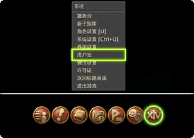
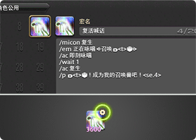

# 宏指南

宏是一些自动指令的集合，很多游戏中的宏命令都可以完成很丰富、强大的功能，然而FF14游戏的宏被设计为弱功能的指令系统，缺少编程中的基础功能（判断和循环），并且每条宏只能保存15个指令，这使得FF14的宏相较于很多其他支持宏命令的游戏来说，显得有些鸡肋，但是在实际使用的探索中，它仍旧展现出很强的实用价值。

## 宏的基础

;;;.guide .cols2
;;;.guide .col


;;;

;;;.guide .col .grow

从“系统→用户宏”中就可以打开宏的编辑窗口。现在每名玩家可以创建200个宏，其中100个是跨角色共享的。

;;;
;;;

;;;.guide .cols2
;;;.guide .col


;;;

;;;.guide .col .grow

随意点击一个数字就可以编辑宏（宏的编号是固定的，如果你想把某个宏从8号位移动到28号位，只能使用剪切、粘贴功能，并且会失去热键栏中的对应键）。

在编辑窗口输入文本指令，一行只能输入一条指令，输入后的本文指令会自动保存。

可以把编辑好的宏图标拖到技能栏中，宏技能的右上角会有一个小齿轮，借以和普通非宏技能区分。

;;;
;;;

所有的文本指令可以在宏编辑界面右下角按钮查询，也可以使用[WIKI分类查询](https://ff14.huijiwiki.com/wiki/%E6%96%87%E6%9C%AC%E6%8C%87%E4%BB%A4)

我们可以先来尝试一个最简单的宏：

```
/micon 行礼 emote
/行礼 motion
/em 非常感谢<t>。
```

把这个宏图标从左边的宏列表拖到技能栏中，点击使用就可以看到效果了。

关于更多宏基础的讲解，请看[《宏学》上篇 宏基础](/advanced/macrology-1.md)。

## 宏应用

通常战斗职业并不需要用到宏来输出，因为宏的等待序列只能为整数秒，而玩家技能的GCD通常是2.3~2.5s不等，这意味着直接使用宏编写输出循环是不可能的。

但是也有玩家利用宏的操作指令做出了损失相对较小的战斗输出宏，具体做法请参考[《宏学》中篇 宏进阶](/advanced/macrology-2.md)。

在战斗之外，常用到宏的地方还有：生产、狩猎（喊话），副本站位（通常一个副本有多种打法，默认按照进本发宏的人所要求的打法打），情感动作互动等等。当你在网上看到以`/`斜杠开头的文本时，它们大都是宏，你可以把它们复制下来，然后贴到自己的宏里试用一下。

另外也可以利用宏命令来制作菜单折叠，具体做法可以参考[《宏学》中篇 宏进阶](/advanced/macrology-2.md)。

虽然宏本身不能执行循环和判断命令，但是配合游戏机制，它可以达成一定的状态机效果，也有玩家将其玩成了“另一种游戏”：
- [宏五子棋](https://www.bilibili.com/video/BV1vt411Q7jN)
- [宏劲舞团](https://www.bilibili.com/video/BV1vz411e7Hh)
- [宏贪吃蛇](https://www.bilibili.com/video/BV1UB4y1P79k)

::: segment orange

## 宏学

FF14的宏相对于其他MMORPG的宏功能上是非常弱的，你可能会觉得研究这些东西有什么用呢？法拉第曾对税务官说过：一个刚出生的婴儿有什么用呢？只有经过精细研究和设计，宏才能展现出他的价值。
- 宏学(Macrology)在英语中意为繁冗，宏正是一种相当繁冗的事物，只有对宏进行繁冗的精雕细琢，才能实现一些具有较高价值、有高度创造性的功能。如果你有志于用宏为自己做些有价值的事情，请认真研究它，并发挥超凡的创造力来强化它。
- 在开始正题之前，我给各位读者一句忠告：不要使用任何你没弄清原理的宏。你没有弄清楚宏的原理，你就不知道它在什么样的情况下可能会出错，出错了该怎么解决。你对宏的认识没有得到提升，你只是装上了一个不可控的炸弹。

宏学博大精深，新理论和新技术层出不穷，作者水平有限，文章不足或错误之处，恳求广大读者指正。

> 目录
> - [《宏学》上篇 宏基础](/advanced/macrology-1.md)
> - [《宏学》中篇 宏进阶](/advanced/macrology-2.md)
> - [《宏学》下篇 宏拾遗](/advanced/macrology-3.md)
>

《宏学》由艾欧泽亚宏学研讨会编纂完成。欢迎加入艾欧泽亚宏学研讨会，QQ群号774176444。
:::