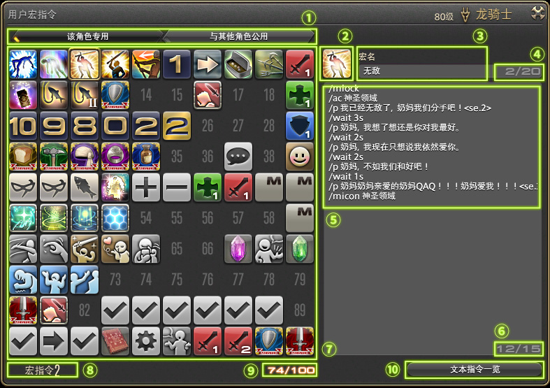
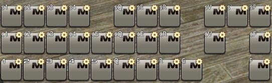

# 宏基础
<FloatTOC />
::: segment blue

## 绪论

这个部分主要讲述一些宏的基本知识，面向对宏缺乏基本认知的玩家。当然，里面还包括很多熟手也不清楚的细节，相信无论读者宏学水平高低都能有所收获。

学习这个部分，你可以从零开始:
- 自如的操作用户宏界面
- 理解宏的基本原理
- 理解热键栏的独立与客观存在
- 分辨出比较明显的掉输出宏
- 对一些比较重要的指令拥有比较充分的认识
- 写一些简单的宏，不再需要伸手求宏
:::

## 宏面板介绍

;;;.guide .cols2
;;;.guide .col

;;;

;;;.guide .col .grow

按ESC，选择用户宏，或者选右下角快捷菜单的系统分类内的用户宏来打开你的用户宏面板(你也可以在键位设置中设置一个快捷键)

;;;
;;;


1. 宏面板翻页按钮，第一页是本角色专用的宏，第二页是与在本客户端上启动的任何角色共用的宏。实际上并没有太大意义，只要复制主要角色文件夹里的macro.dat到其他帐号文件夹里就可以实现200个宏共用。
2. 宏图标，默认为，点击可以选择一些系统提供的图标，也可以使用/micon 进行指定。
3. 宏名称，鼠标暂留时会显示，手柄十字热键栏也会显示。
4. 宏名称当前字数/字数限制，最多20字，一个英文字母和一个汉字都算一个字。
5. 宏内容，由文本指令构成，每行最多180字，一个汉字算3个字，英文字母算一个字。
6. 宏当前行数/行数限制，最多15行。
7. 宏列表，每一个方格可以储存一个宏，点击可以拖动到热键栏上，但是不能拖动到别的方格上，可以右键呼出次级菜单。
8. 当前选中的宏的编号。
9. 当前页已占用宏格子的数量。
10. 打开文本指令一览，请善加利用。如果记得写法，但是由于里面的项太多找不到，善用/?,或[拜访wiki]，或前往日基的[文本指令一览]

次级菜单说明：
- 执行：执行一次这个宏。
- 复制：复制这个宏到宏剪贴板(不能复制到聊天框发给别人！)。
- 粘贴：复制或剪切后出现，把宏剪贴板内的宏粘贴在这个位置，覆盖这个位置上原来的宏。
- 剪切：将这个宏剪切到宏剪贴板，若热键栏上有这个宏的热键，将自动删除。
- 删除：删除这个宏，若热键栏上有这个宏的热键，将自动删除。
- 撤销：删除、剪切、恢复或粘贴后出现，取消最近一次删除、剪切、恢复或粘贴操作，若操作涉及热键栏上的宏热键被删除，热键栏上的宏热键不会恢复。
- 恢复：撤销后出现，取消上一个撤销操作，若操作涉及热键栏上的宏热键被删除，热键栏上的宏热键不会恢复。

## 文本指令与宏

在FF14中，宏是一种替代玩家进行一部分操作的文本指令集合程序。

::: segment blue

### 文本指令

玩家通过键盘或鼠标点选技能热键来释放技能，而通过输入`/ac 技能名`，玩家也可以施放技能。输入文本指令`/ac`替代了玩家点选技能热键的操作。文本指令可以嵌套代名词，`<me>`这个代名词替代了玩家在文本指令中输入自己名字的操作。

因为FF14没有专用的文本指令输入区域，所有的文本指令都在聊天框内输入。为了区别于聊天文字，系统规定输入文本指令时，以`/`这个符号起头表示这是一句文本指令而不是一句话。如果你不慎在`/`前方打了一个空格，你的指令就会被当做聊天内容发送出去（这非常丢人！）。

大部分文本指令都有包括中文写法在内的多种写法，笔者主要用英语写法展示。由于文本指令实在是太多了，笔者只能挑一些很重要，很难理解的文本指令在这篇文章中说明，如果你还有什么不明白的指令，试用一下是最好的学习方法!

:::

输入文本指令是非常繁琐的，我们把常用的文本指令存储在一个批处理程序里，这样我们就可以直接执行这个程序来快速输入文本指令，这个程序就是宏。一个宏最多可以保存15行文本指令。

宏的实际效果相当于在极短的时间（如果没有`/wait`）内将储存的15行内容依次输入聊天框发送，因此如果你的宏中有不是`/`起头的语句，它会被作为一句话发送到当前默认聊天频道（这非常丢人！）。

如果你的宏中有一行什么也没有，系统会自动认为这个宏已经结束，不再继续发送空行后方的内容。

宏除了可以运行几乎所有文本指令以外，还可以使用自己专用的指令:`/micon`，`/wait`，`/mlock`等。

## 宏的基本特征


宏有两个显著的特性：**单路径**和**单线程**。

**单路径**是指宏连续发送文本指令从第一行到第一个空白行为止，是依次进行的，在上方的会先发送，在下方的会后发送。每一行指令执行完毕后才发送下一行，同时不接受判断结构和循环结构。宏不会判断这个指令执行的结果怎样，现在角色的状态怎样，只会按部就班的依次发送预存的文本指令并遵循宏专用指令的控制。在运行中止时，也不会记录是否运行完成，运行到了哪。同样，这意味着FF14的宏无法实现任何基于输入条件的编程化指令。执行完毕是指指令已经发送，而不是角色实际作出了动作。例如系统执行`/ac`指令只要一帧，`/ac`指令被执行的时候，当前人物状态不能释放技能，那么这个指令也算是执行完毕了。系统做的事情是命令人物现在立刻马上释放指定技能，人物现在不能释放这个技能，那就反馈告诉你，现在不能这么做，指令结束。

**单线程**是指只有一个宏可以处在运行状态。如果在一个宏未运行完之前运行另一个宏，当前运行的宏会立刻停止运行。如果正在运行的宏有宏锁保护，那么在运行完之前，任何其他宏都无法运行。但是，直接输入文本指令并不会打断宏的运作，也不受宏锁的控制，因为文本指令不是宏，宏只会被宏打断，宏锁只阻止宏的执行。

## 代名词

代名词，是宏命令的一种组成元素。与其他元素不同，代名词表达的是一个可随当前状态改变而改变的逻辑对象。

由于其英文placeholder在编程领域通常被翻译为占位符，因此本文中代名词与占位符指代的都是同一概念。

代名词一般具有<...>的形式，表示一个特定的逻辑名称，是唯一可以即时接受外部信息做出改变的文本指令。

在一句话中，使用代名词，发送时会自动替换成被指代的内容。例如，==已退避<2>！==，假设2号队员叫XXX，那么发送时会变成==已退避XXX！==。指代的内容不存在时，会显示为空（注意不是空格）。例如当前没有组队，则会发送==已退避！==

代名词可以在文本指令里使用，除了在喊话中指定人名/地名以外，还可以用于指定文本指令的一些参数和对象。如最常用的`<tt>`——目标的目标，一般是MT，这样用代名词为文本指令指定的目标我们称为逻辑目标。

在4.5跨服移动被实装后，原先所有除了`/tell`以外的可以直接指明角色名的文本指令，现在都只能使用代名词来指明。

由于代名词在游戏内的文本指令一览中查不到，可以查阅[代名词一览](https://ff14.huijiwiki.com/wiki/%E6%96%87%E6%9C%AC%E6%8C%87%E4%BB%A4#.E4.BB.A3.E5.90.8D.E8.AF.8D)。

::: collapse 常用代名词一览
| 代名词 | 解释 |
| -- | -- | 
| `<t>` | 当前选中目标的名字 |
| `<tt>` | 当前选中目标的选中目标的名字 |
| `<me>` | 自己的名字 |
| `<1~8>` | 队伍列表中对应编号的人的名字 |
| `<f>` | 焦点目标的名字 |
| `<lt>` | 上个选中的目标的名字 |
| `<le>` | 上个选中的敌人的名字(当你的当前目标是敌人时，会显示你的当前目标) |
| `<la>` | 上个对自己造成伤害的敌人的名字 |
| `<c>` | 自己的陆行鸟的名字 |
| `<p>` | 自己的召唤物的名字 |
| `<pos>` | 自己的当前坐标，可以被点击插旗 |
| `<flag>` | 当前插旗地点的坐标，可以被别人点击插旗 |
| `<mo>` | 当前鼠标指向的目标的名字，指向小队列表/仇恨列表/目标模型都算。手柄注意：手柄的预选中状态不算 |
| `<item>` | 最近选择过“展示道具属性”的道具链接。装备上的魔晶石、签名、精炼度、耐久等全部不能正确显示，只能显示基本属性 |
| `<recast.技能名>` | 指定技能的剩余冷却时间，格式为--:--(分:秒)，因此不能用来作为wait的时间参数。已冷却完毕的技能会显示为--:--。只有当前职业的技能可以被正确显示，并且不能用定型文。 |
| `<attack1~5>` | 被标记了“攻击1~5”记号的单位的名字，同理还有`<bindX>`，`<stopX>`，`<cross>`等。 |
| `<r>` | 上一个悄悄话你的人的名字 |
| `<hp>` | 自己的当前hp值/最大hp值，同理还有`<mp>`(魔力)、`<bhp>`(你的陆行鸟hp) |
| `<hpp>` | 自己的当前hp百分比，同理还有`<mpp>`、`<bhpp>`、`<thpp>`(当前选中目标)、`<fhpp>`(焦点目标) |
| `<job>` | 自己的当前职业(等级)，同理还有`<targetjob>`(当前选中目标)、`<focusjob>`(焦点目标) |
| `<e1-4>` | 群狼盛宴专用，直接指代对方1-4号 |

还有几个具有代名词的形式但意义有所不同的用法，官方也将其归为代名词，笔者认为有别于以上代名词，在此单独列出：
- `<wait.X>`：等同于/wait X，在发言中使用不会在发言中显示，但同一排后面的内容会消失，具体说明见下文。
- `<se.1~16>`：发出提示音，只在小队/团队/默语频道有效果。可以认为是指代了一个本来不能用语言描述的“声音”，会显示在发言中。
:::

## 本地处理

宏是连续发送文本指令替代玩家操作的程序，无论是玩家操作还是文本指令在系统内部都转化成统一的指令。

玩家的所有操作都是本地的，这些操作指令发送到服务器，服务器反馈数据结果。宏不涉及任何服务器数据，所以宏也是本地的。通过宏所进行的翻页，复制等会立刻实行，不受网络因素干扰。

但是这一事实和体感略有偏差，我们总感觉网络延迟较高时，宏的运转不正常。这是因为网络延迟高时，宏在正常运转，但服务器回传数据没有跟上。

以生产宏为例，当延迟较高时，部分技能会被卡掉，这不是宏的行为被网络延迟干扰了，而是网络延迟导致宏照常发出指令时角色正处于不能接受指令的状态。

## 技能队列与技能宏

技能队列是为了补偿FF14除了极少数例外技能（<action name="抽卡" />和<Action name="天之印">结印</Action>），所有的技能都在服务器判定而产生的延迟的一个机制。

当你按下一个技能热键，你当前状态不能释放这个技能，但是在大约0.5s以内就可以释放这个技能，那么这个技能就会加入技能队列，并在你变得可以释放这个技能的瞬间自动释放出去。

因此，通过按热键释放GCD技能，可以平滑的过渡到下一个技能，使得GCD永远处于冷却中，没有GCD转好→按下技能这一过程浪费的因人而异的零点几秒。**注意：通过文本指令释放技能不享受技能队列。**

### /ac

官方对/ac指令的说明如下：
```
/技能 技能名 代名词
/action、/ac
对指定目标使用指定技能。以自己为目标的技能可以省略输入代名词。
如果身处无法使用技能的环境，或者还没有学会指定技能，则命令无效。
在技能会使用到地面目标的情况下，会对指定目标使用指定技能。省略代名词时则会启动地面目标模式。
>>示例
/技能 重劈 <目标>
对当前所选择的对象执行技能“重劈”。
/技能 治疗 <2>
对小队列表中的2号队员执行技能“治疗”。
```
笔者注：
- 以其他人为目标的技能也可以省略输入代名词，技能的目标与你在当前状态下正常通过热键使用技能的目标一致。
- 如果当前按下这个热键不能立刻发动技能（没有合适的目标，技能处于冷却中），这个指令无效。
- 只能使用代名词，不能指定一个特定的固定目标或玩家。
- 技能名必须为原始技能名，不能是衍生技能名，例如<action name="纷乱雪月花" />必须写作`居合术`，<action name="赤神圣" />必须写作`赤疾风`。
- 指定对目标使用的地面技能为圆形范围时，会以目标环的圆心为技能圆心放置。如果目标环圆心超出技能圆心射程，即使技能范围可以扫到，技能仍然不会释放。这一点在目标距离较远/目标体积巨大时需要特别注意。
- 如果指定的技能已被升级后的技能取代，会自动改为释放升级后的技能，若指定未学会的升级后的技能，会自动改为升级前技能。
- 执行一行/ac花费的时间是**一帧**，称为指令延迟。

可以说，99%的玩家的战斗宏之旅都是从这里开始的。这个简单粗暴的命令似乎有着无穷的魅力，诱惑萌新去使用。配合着wait指令，在2.X时代那个对宏机制还不太清楚的年代，人们想当然的写了一些一键输出宏，一键爆发宏等。

但是，很快人们发现，这个指令很坑。

**通过/ac指令来释放技能，技能不会进入技能队列。** 这对GCD技能来说是致命伤，也是“用宏会卡GCD掉输出”这句话的来源。

但请注意，这句话的完整表述是:**“连续使用单独的/ac 指令的宏释放GCD技能会导致GCD卡顿而掉输出”**，并不是什么宏都掉输出的，这一点常常导致宏的风评被害。

因为这样的缺点，这个指令我们一般不会单独使用，而是在较为复杂的宏中充当补丁的作用。当然，这个指令也有一些时候会单独使用，因为/ac 指令在优先级思想方面的表现很棒。
::: segment grey

优先级思想是指有若干个技能，功能基本相同，但效率有差别，那么我们肯定希望先使用效率最高，冷却最短的，效率最高的无法使用、冷却最短的已经在冷却时再使用效率次高、冷却次短的。

或者一个技能会触发另一个技能，不先把触发的技能打掉就会造成触发被覆盖，会被覆盖的那一个就是优先的技能。

例如，集中加工和加工，消耗完全相同，集中加工只能在高品质及以上使用，而加工可以在任何时候使用。显然集中加工的效率最高，但不一定能使用。基于宏的线性运行，我们可以这样做：
```
/ac 集中加工
/ac 加工
```
这样做就可以实现优先级：集中加工可以使用的时候就使用集中加工，不能使用的时候就使用加工。
:::
下面是一些常用的单独使用/ac 指令的用法：

- 释放一个一定在GCD空转，没有动作后摇存在的时间(或者这个技能空转不影响战斗)里发动的GCD技能，比如“演武”。
 ```
/ac 演武
/hotbar copy 武僧 6 武僧 1
/e 进入魔猿形
```
- 按照优先级释放能力技，虽然这样做手感不是很好，但在不需要卡CD到0.1s等级的精确度使用能力的情况下，不影响战斗。但是，由于指令延迟有小概率发生优先级低的技能先放出的情况。
```
/ac 扇舞·急
/ac 扇舞·序
```
- 释放指定地面目标的能力技，这样可以省去点击地面的时间，但是有些情况下不能灵活的调整放置的地点。
```
/ac 野战治疗阵 <t>
```
- 在不选中目标的情况下对目标使用技能，主要应用于输出职业使用单体团辅技能不损失自动攻击，和治疗职业奶人不切换目标。后者会损失GCD，但治疗职业使用GCD治疗技能奶人的频率很低，对战斗影响不大。
```
/ac 大地神的抒情恋歌 <tt>
```
```
/ac 救疗 <mo>
```
- 释放非战斗职业的技能，比如一键生产宏，一键精选宏。(生产职业所有制作、加工、观察、专家技能后wait3，松弛、其他buff技能后wait2，采集职业精选buff技能后wait1，甄别技能后wait3，若网络条件不佳，可适当延长)优先级的思想同样适用(主要针对秘诀、集中加工、审美眼等)。
```
/ac 审美眼 <wait.1>
/ac 直觉甄别 <wait.3>
/ac 审美眼
/ac 聚精会神 <wait.1>
/ac 直觉甄别 <wait.3>
/ac 审美眼
/ac 聚精会神 <wait.1>
/ac 慎重甄别
```
[进阶向]防止技能进入技能队列，发生多按错按(主要针对忍者结印) [宏印忍者(内容已过期但思路可用)](https://bbs.nga.cn/read.php?tid=14676340)

### /wait与 &lt; wait.X &gt;

官方对/wait指令的说明如下：

```
/等待 等待时间
/wait
在宏指令中用来调整时间的命令。
等待时间设为“1”相当于1秒。
等待时间最多可以设置为60，超过60会按不等待处理。
```

- wait指令被读取时，本应以高速继续输入的后续文本指令会停顿规定的秒数，然后继续输入。
- wait限定只接受整数，输入小数会被四舍五入。
- “超过60会按不等待处理” 这句话是翻译错误，超过60会按60处理。
- `<wait.X>`与/wait具有相同的作用，但是`<wait.X>`可以不单独占用一排，能更充分利用15排指令的宏空间。
- 等待时间可以省略，自动默认为1s，而不是所谓的“等待硬直结束”或“等待动画结束”。
- wait指令不是宏专用的，在对话框中输入可以在当前正在执行的指令执行完毕后等待规定的时间再执行下一条，如果正在执行的指令也是wait，前一个wait会被撤销。

由于宏单线程的特性，没有宏锁的wait很容易被其他宏打断，有宏锁的wait有时会阻碍其他操作，所以我们一般不会使用比较长的wait，除非一定时间内没有别的宏需要被使用。

wait指令比较常见的用法如下：

- 开本前倒计时给有特殊需求的职业（请根据队内队友协商需要多少秒的）。
```
/cd 20
/p 还有20s开怪 <se.1><wait.8>
/p 还有12s开怪 <se.1><wait.2>
/p 还有10s开怪 <wait.1>
/p 还有9s开怪 <wait.1>
/p 还有8s开怪 <wait.1>
/p 还有7s开怪 <wait.1>
/p 还有6s开怪 <wait.1>
/p 还有5s开怪 <wait.5>
/p 开！ <se.5>
```
- 在一键挖宝划水输出宏里发光发热~~并假装自己可以wait2.5~~
```
/ac 神圣 <wait.3>
/ac 神圣 <wait.3>
/ac 神圣 <wait.3>
/ac 神圣 <wait.3>
/ac 神圣 <wait.3>
/ac 神圣 <wait.3>
/ac 神圣 <wait.3>
/ac 神圣 <wait.3>
/ac 神圣 <wait.3>
/ac 神圣 <wait.3>
/ac 神圣 <wait.3>
/ac 神圣 <wait.3>
/ac 神圣 <wait.3>
/ac 神圣 <wait.3>
/ac 神圣 <wait.3>
```
- 在发动技能后等待一段时间喊话提示，如无敌。
```
/ac 神圣领域
/p 我已经天下无敌了！！！<se.1>
/wait 10
/p 停一停奶妈快爱我！！！<se.2>
```
在带喊话的能力宏中将wait插入技能与喊话之间，在按键连打时防止刷屏。
```
/ac 退避 <2>
/wait 1
/p 我听说你打得很高，这个死刑你吃吧<se.3>
```
- [进阶向]在生产宏中打时间差，实现5仓促中任换至多一个为集中加工一类的高级功能
```
/ac 集中加工 <wait.1>
/ac 仓促 <wait.2>
/ac 仓促 <wait.1>
/ac 集中加工 <wait.1>
/ac 仓促 <wait.2>
/ac 仓促 <wait.1>
/ac 集中加工 <wait.1>
/ac 仓促 <wait.2>
/ac 仓促 <wait.1>
/ac 集中加工 <wait.1>
/ac 仓促 <wait.2>
/ac 仓促 <wait.1>
/ac 集中加工
/ac 加工 <wait.3>
```
解析请参考[能工巧匠大型综合攻略2.4.2](https://bbs.nga.cn/read.php?tid=12513963)

## 热键栏

热键栏（hotbar），是摆放热键（hotkey）的栏，经常被称做技能栏。其实除了技能还有很多东西可以放在热键栏上，比如宏、道具、制作笔记、快捷指令等，它们都称为热键。

每个职业（包括基础职业）都有10条专用热键栏，还有10条各职业共用的热键栏，共390条。

共用热键栏的编号会显示方框镂空数字（<i class="xiv square-6"></i>），而专用热键栏是无外框数字（<i class="xiv number-6"></i>）

一条热键栏有12格，从1-12依次编号。

游戏中还存在十字热键栏（crosshotbar），一般只有手柄玩家会使用，但键鼠玩家一样可以在角色菜单中将其调出。十字热键栏与普通热键栏特性基本相同，只是数量和格子编号有所区别。每个职业有8条十字热键栏，一条十字热键栏有16个格子，由3个字母按一定的规则编号：首先是L/R指代LT按下或者RT按下，然后是D/A指代十字键/ABXY，最后是是U/D/L/R分别指代上下左右。连起来就是LAD/RDU这一类的字符串编号。十字热键栏也接受按1-16的格号编号，但是规律因为转圈圈不是很直观。双十字热键栏和增强十字热键栏都是显示其他十字热键栏的情况。十字热键栏和普通热键栏是相互独立，同时存在的。

pvp热键栏（pvphotbar）和pvp十字热键栏（pvpcrosshotbar）也是独立的热键栏，它们不能和pve热键栏通过copy等方式相互沟通。

热键栏的称呼：
- 专用热键栏：职业名 编号
- 共(公)用热键栏：share 编号

一名玩家始终拥有390条热键栏(8个生产职业、3个采集职业、9个低阶战斗职业、18个战斗特职、一个"共用职业")，与当前设置、状态、职业无关,即使你并未开放某个职业，它的技能栏仍然客观存在并可被`/hotbar copy`指令操作。

玩家同时最多能显示10条，专用技能栏只能显示本职业的，且同编号的专用与共用热键栏不能同时显示。系统初始状态默认显示1、2号两条，默认配置1、2、3号为职业专用，其他为共用。

切换热键栏的显示与否可以在设置、界面设置里进行，也可以输入文本指令`/hotbar display X on/off`进行切换。

将同编号的共用与专用热键栏切换显示可以在设置里进行，也可以输入文本指令`/hotbar share X on/off`进行切换（这要方便很多）。

注意：share是一个独立的热键栏，不会因为解除share显示而使上面的内容消失。
::: segment red
热键栏具有独立性和客观存在性。（一句话概括：“共通快捷栏和每个职业的快捷栏都是独立存在互不影响的”）

**独立性**指一条热键栏独立存在，不会因为其他同编号热键栏的修改而发生变化。例如在龙骑士4号热键栏上做修改，共用4号热键栏和赤魔法师4号热键栏不会发生变化（此时它们并不能被显示）。注意：1号技能栏可以被翻页，显示其他热键栏并应用1号热键栏的键位。这并不影响1号热键栏上的内容。

**客观存在性**指热键栏是客观存在的，不以人的意志为转移，是否可见不影响其存在，不会因为被隐藏而无法被其他操作读取。最典型的是share问题：你的10号热键栏开启了共用并放了一些热键，现在你关掉10号热键栏的共用，并不意味着你的10号共用热键栏上放的东西消失了——它们从你眼里消失了，但它们客观存在。同样你可以通过`/hotbar copy`指令往没有开启share的123号热键栏上放置一些热键。例如你可以隐藏1号技能栏，但你仍然可以按键释放1号热键栏上的技能(只要你记得键位)。但是如果你将1号技能栏切换为share，你将只能释放share1上的技能，因为热键栏的键位对应的是编号。此时使用`/hotbar copy`指令，你仍然可以把专用1号栏上的内容复制出来，虽然它没有显示。
:::
热键栏是进阶宏的核心操作对象，在开发过程中你会大量使用被隐藏的热键栏来做文章，记得哪些热键栏被用来做了什么是很重要的，否则你可能在操作过程中不慎覆盖了其他宏系统利用的热键栏而导致系统混乱。

你甚至可能需要一张excel的帮助（图略）

### /hotbar
先来看一看官方的讲解：
```
/热键栏 子命令
/hotbar
对热键栏进行操作及设置。只能在非对战区域内使用。
>>子命令
设置(set)或技能(action) 技能名 编号1 编号2
将指定技能设置到编号1热键栏的编号2位置上。编号1可以用“当前(current)”来表示当前热键栏1位置的热键栏。省略编号2会默认为设置到编号最小的空位上。两个编号都省略则会默认设置到编号最小热键栏的编号最小空位上。
青魔法技能(blueaction) 青魔法名 编号1 编号2
将指定青魔法设置到编号1热键栏的编号2位置上。设置规则与“设置(set)”相同。
共通技能(general) 共通技能名 编号1 编号2
将指定共通技能设置到编号1热键栏的编号2位置上。设置规则与“设置(set)”相同。
道具(item) 道具名 编号1 编号2
将指定道具设置到编号1热键栏的编号2位置上。设置规则与“设置(set)”相同。
情感动作(emote) 情感动作名 编号1 编号2
将指定情感动作设置到编号1热键栏的编号2位置上。设置规则与“设置(set)”相同。
搭档(buddy) 搭档技能名 编号1 编号2
将指定搭档技能设置到编号1热键栏的编号2位置上。设置规则与“设置(set)”相同。
召唤兽(pet) 召唤兽技能名 编号1 编号2
将指定召唤兽技能设置到编号1热键栏的编号2位置上。设置规则与“设置(set)”相同。
宠物(minion) 宠物名 编号1 编号2
将指定宠物设置到编号1热键栏的编号2位置上。设置规则与“设置(set)”相同。
坐骑(mount) 坐骑名 编号1 编号2
将指定坐骑设置到编号1热键栏的编号2位置上。设置规则与“设置(set)”相同。
标记(marking) 标记名 编号1 编号2
将指定标记设置到编号1热键栏的编号2位置上。设置规则与“设置(set)”相同。
场景标记(waymark) 场景标记名 编号1 编号2
将指定场景标记设置到编号1热键栏的编号2位置上。设置规则与“设置(set)”相同。
更换(change) 编号
将指定编号的热键栏切换到默认热键栏1的位置。编号用“下一个(next)”或“上一个(prev)”可以将当前热键栏1位置所表示的技能切换到上一组或者下一组热键。
复制(copy) 职业名1 编号1 职业名2 编号2
将职业名1的编号1热键栏的内容复制到职业名2的编号2热键栏上。职业名设置为“当前(current)”时会指定当前的职业。职业名设置为“共通(share)”时会指定共通热键栏。
显示(display) 编号 开(on)
显示指定编号的热键栏。
显示(display) 编号 关(off)
关闭显示指定编号的热键栏。
显示(display) 编号
在显示和不显示之间切换。
共通(share) 编号 开(on)
将指定编号的热键栏设置成全职业共通。
共通(share) 编号 关(off)
将指定编号的热键栏从全职业共通改为当前职业专用。
共通(share) 编号
设置指定编号的热键栏在当前职业专用和全职业共通之间切换。
清除(remove) 编号1 编号2
解除编号1热键栏编号2位置上的技能或用户宏指令。编号2设置为“全部(all)”的时候会将该热键栏上的所有指令都解除。
>>示例
/热键栏 设置 随机坐骑 1 1
将“随机坐骑”放入热键栏1的位置1中。
/热键栏 更换 2
将热键栏2的内容切换到默认热键栏1的位置。
```

是不是超级复杂_(:3rz)_从这里起，你就要步入宏的进阶内容了。在这个文本指令下的东西与你之前接触过的文本指令复杂得多，我们先分别讲述一下它的子命令。

此处以普通热键栏为例，十字热键栏将hotbar改为chotbar便可套用。如果你想操作PVP专用热键栏，改为/pvphotbar即可套用，这个指令只能在PVP区域内使用。同样，你不能在PVP区域内使用/hotbar 。

/hotbar指令有一个特殊之处，如果他的最后若干个子命令有错误，而有错误的子命令前的命令能构成一句完整的命令，那么错误部分会被忽视。

#### share
标准格式`/hotbar share 热键栏号 on/off`

将指定编号的热键栏切换为显示公用热键栏/当前职业专用热键栏。on/off省略时，将在on与off之间切换。

这个切换并不影响公用热键栏和专用热键栏上的内容，它们是相互独立的，被切换的只是显示哪一个。

主要用法：

- 替代打开角色设置-热键栏-点选是否将指定的技能栏设置为显示公用技能栏这个麻烦的操作。
- [进阶向]切换战斗、生活和宏设置模式。
```
/hotbar share 1 off
/hotbar share 2 off
/hotbar share 3 off
/hotbar share 4 off
/hotbar share 5 off
/hotbar share 6 off
/hotbar share 7 off
/hotbar share 8 off
/hotbar share 9 off
/hotbar share 10 off
/hudlayout 3
/hotbar display 4 on
/hotbar display 6 on
/hotbar display 8 on
/hotbar display 10 on
/e 切换到宏设置模式
```
- [进阶向]在强化翻页宏中使用，进行2种状态的切换。[宏魔法师DLC(内容已过期但思路可用)](https://bbs.nga.cn/read.php?tid=13813382)

#### display

标准格式`/hotbar display 热键栏号 on/off`

将指定的技能栏设置为显示/隐藏。隐藏与否不影响其上的内容，若被隐藏的热键栏设置有键位，仍然可以正常按键起效。on/off省略时将在on与off间切换。

主要用法：

- [进阶向]切换战斗、生活与宏设置模式。
```
/hotbar share 1 off
/hotbar share 2 off
/hotbar share 3 off
/hotbar share 4 on
/hotbar share 5 on
/hotbar share 6 on
/hotbar share 7 on
/hotbar share 8 on
/hotbar share 9 on
/hotbar share 10 on
/hudlayout 1
/hotbar display 4 on
/hotbar display 6 off
/hotbar display 8 off
/e 切换到战斗模式
```
- [进阶向]折叠菜单宏(后文详述)

#### set
标准格式`/hotbar set 技能名 热键栏号 格号`，将指定的技能热键摆放到指定的位置。

热键栏号可以用 ==当前(current)== 来表示当前热键栏1位置的热键栏（用change翻页后会变）。省略编号2会默认为设置到编号最小的空位上。

两个编号都省略则会默认设置到编号最小热键栏的编号最小空位上，就像你新学了一个技能时系统自动摆放的位置。

如果指定的位置已经摆放了热键，那么原有的热键会被覆写删除。

指定的热键栏号默认为当前share状态，不能在其他职业的热键栏上/本职业被share/未设置的share的热键栏上摆放热键。

摆放的是技能热键，本身不涉及释放技能的动作，不受除了读图以外的任何状态限制，摆放的技能热键能享受技能队列。

技能名必须是原始技能名，衍生技能名不能正常摆放。例如：纷乱雪月花应写作居合术。

如果指定的技能已被升级后的技能取代，会自动改为放置升级后的技能，若指定未学会的升级后的技能，会自动改为升级前技能。

该技能必须是本职业的技能。

生产职业很特殊，8个生产职业中，如果是任意一个职业都还未学会的技能，则不能被set，但只要有一个职业学会了，其他未学会的职业都可以set。

主要用法：

- 快速将一堆只在少数场合使用的固定的热键放置到指定的位置。
```
/hotbar set 灵攻 7 1
/hotbar set 三重灾祸 7 2
/hotbar set 能量吸收 7 3
/hotbar set 灵攻II 7 4
/hotbar set 灵攻 7 5
/hotbar set 龙神附体 7 6
/hotbar set 灵攻II 7 7
/hotbar item 2级智力之幻药[HQ] 7 8
/hotbar set 毁荡 7 9
/hotbar set 三重灾祸 7 10
/hotbar set 溃烂爆发 7 11
/hotbar set 毁荡 7 12
/e 召唤绝亚起手放置完毕
```
- [进阶向]将一个行使完功能的技能宏覆盖为真正的技能热键，使得它能够进入技能队列。（后文详述）
```
/micon 行吟
/ac 行吟
/hotbar set 行吟 1 10
/s 山峦起伏，伴我形骸放浪；
/em ：万世箴言，予我生息容量；
/y 正直圣盾，护我无罪羔羊！
/wait 1
/hotbar copy 弓箭手 7 吟游诗人 1
```
#### general
标准格式`/hotbar general 共通技能名 热键栏号 格号`。将指定的共通技能热键摆放到指定的位置。

基本与set没有区别，唯一目前发现的区别是共通技能“跳跃”只能用这个子命令摆放，因为龙骑有个同名技能。

#### pet buddy emote item mount minion marking waymark……
将指定的召唤兽技能/陆行鸟指令/情感动作/道具/坐骑/宠物/标记/地图标记热键摆放到指定的位置。

基本与set规则相同。

#### remove

标准格式`/hotbar remove 热键栏号 格号`。将指定位置的热键删除。

指定的热键栏号默认为当前share状态，不能在其他职业的热键栏上/本职业被share/未设置的share的热键栏上删除热键。

格号填all可以将整条热键栏上的热键清空。

主要用法：

- 将部分用过的热键/不适合用的热键删除，以免失误/重复按到。
```
/cl
/e -​-​-​-​-​-​-​-​-​-​-​-​-​-​-​-​-​-​-​-​-​-​-​-​-​-​-​-​-​-​-​-​-​-​-​-​-​-​-​-​-​-​-​-​-​-​-​-​-​-​-​-​-​-​-​-​-​-​-​<se.2>
/e 混沌的连续剑：直线-月环-八方
/e 复仇的连续剑：月环-八方-直线
/e -​-​-​-​-​-​-​-​-​-​-​-​-​-​-​-​-​-​-​-​-​-​-​-​-​-​-​-​-​-​-​-​-​-​-​-​-​-​-​-​-​-​-​-​-​-​-​-​-​-​-​-​-​-​-​-​-​-​-​<se.2>
/hotbar remove 4 4
```
- 清空键位重新设置~~删库跑路~~
```
/hotbar remove 1 all
/hotbar remove 2 all
/hotbar remove 3 all
/hotbar remove 4 all
/hotbar remove 5 all
/hotbar remove 6 all
/hotbar remove 7 all
/hotbar remove 8 all
/hotbar remove 9 all
/hotbar remove 10 all
```

#### change
标准格式`/hotbar change 热键栏号`

热键栏号可以填入next（当前活动热键栏编号+1）、prev（当前活动热键栏编号-1）

将1号热键栏更换为显示指定编号的热键栏，并套用1号的键位设置。

1号热键栏本身不会被改变，只是不显示。此时在显示的热键栏上做改动，会立刻反应到源热键栏上。

默认指定的热键栏号为当前share状态，不能切换显示其他职业的热键栏/本职业被share/未设置的share的热键栏。

主要用法：
- [进阶向]翻页宏(后文详述)

#### copy
标准格式`/hotbar copy 职业名1 热键栏号1 职业名2 热键栏号2`

职业名设置为“当前(current)”时会指定当前的职业。职业名设置为“共通(share)”时会指定共通热键栏。

将先指定的热键栏(被复制栏)上的所有内容复制到后指定的热键栏(目标栏)上，无视除了过图、看动画以外的任何限制。

可以指定当前未显示的其他职业的热键栏，本职业被share的热键栏等。

目标栏上原有的内容将被覆写删除。

当前唯一可以凭空创造宏热键的命令(因为没有 /hotbar macro)，为了实现hotbar macro的效果，你需要把宏先存储在一条与复制到栏几乎一模一样的热键栏上，然后将其复制过来，使其似乎是只摆放了一个宏。

主要用法：
- 将当前热键栏设置储存到其他地方备份。
```
/micon 军神的赞美歌
/hotbar copy 吟游诗人 1 弓箭手 4
/hotbar copy 吟游诗人 2 弓箭手 5
/hotbar copy 吟游诗人 3 弓箭手 6
/e 战斗键位备份完毕
```
- [进阶向]在指定位置摆放宏。
- [进阶向]菜单宏(后文详述)
- [进阶向]在强化翻页宏中使用，替代change实现更多功能(后文详述)

## 发送信息的文本指令

初等战斗宏的目的大部分是为了传递信息，提示队友，这里陈列了一些发送/处理聊天框信息的文本指令及各个频道的特征：

| 文本指令 | 对应频道及说明 |
| -- | -- |
| /s | 说话频道，可见范围比较小，对连续发言有限制——大约在0.76s-1s内只能在该频道说一句话，多的会被吞掉——其他玩家看不到，但是系统仍然认为你说了这句话，任务要求说话的能被成功判定。例如：<br>/s 1111111111<br>/s 有库啵果哦<br>/s 线轴<br>/s 展翅高飞<br>/s 乌姆·阿拉<br>/s 乘风而起<br>后面五行都不会被其他玩家看见。<br>/s的上屏延迟大约是0.16s，一句话可以压掉下面五句话。 |
| /em | 情感动作频道，和说话频道基本相同，ID和内容之间没有冒号。限制连续发言——尽管你在连续发言时不会收到系统提示。 |
| /y | 呼喊频道，可见范围比说话频道大一些，对连续发言有限制 |
| /sh | 喊话频道，该地图内全屏可见，对连续发言有限制，se提示音没有效果 请不要再试图在报点宏上加声音了 |
| /tell | 悄悄话频道，格式`/tell 人物名@服务器名(同服省略) 内容`，对连续发言有限制，省略内容将改变悄悄话默认目标 |
| /reply | 悄悄话频道，送信目标为上一个给你发悄悄话人，不会因为下线而消除 |
| /p | 小队频道，不限制连续发言，se提示音有效 |
| /a | 团队频道，不限制连续发言，se提示音有效 |
| /fc | 部队频道，不限制连续发言 |
| /pvpteam | 战队频道，~~我还没有~~ |
| /cwlx | 跨服通讯贝频道，x为通讯贝编号，省略则为最近一个激活的通讯贝——最近一个激活可以是用指令发言(未切换频道)或者主动切换默认频道(不管有没有发言)，省略内容将改变默认频道，不限制连续发言 |
| /lx | 通讯贝频道，x为通讯贝编号，省略则为最近一个激活的通讯贝——最近一个激活可以是用指令发言(未切换频道)或者主动切换默认频道(不管有没有发言)，省略内容将改变默认频道，不限制连续发言 |
| /b | 新人频道，不限制连续发言 |
| /e | 默语频道，仅自己可见，发送速度比其他频道都快得多，se提示音有效 |
| /cth | 清除悄悄话记录，清除的实际上是曾悄悄话过的对象而不是悄悄话内容 |
| /cl | 清空聊天窗口的所有信息 |

## 宏专用文本指令
宏专用文本指令主要指/micon 、/mlock、/merror和/mcancel，下面将逐个说明。

#### /micon
```
/宏图标 图标名 分类名
/macroicon、/micon
用户宏专用。在热键栏上显示指定图标名的图标，在同一个用户宏命令内只能生效一次。
>>分类名
技能(action)
…将技能名指定到图标名上，可以显示出该技能的图标及技能的复唱时间、所需魔力或技力等情报。
对战技能(pvpaction)
…将对战技能名指定到图标名上，可以显示出该技能的图标及技能的复唱时间、所需魔力或技力等情报。
共通技能(general)
…将共通技能名指定到图标名上，可以显示出该技能的图标及技能的复唱时间。
情感动作(emote)
…将情感动作名指定到图标名上，可以显示出该情感动作的图标。
搭档(buddy)搭档名
…将搭档技能名指定到图标名上，可以显示出该技能的图标。搭档名可以省略。
召唤兽(pet)召唤兽名
…将召唤兽技能名指定到图标名上，可以显示出该技能的图标及技能的复唱时间。召唤兽名可以省略。
宠物(minion)
…将宠物名指定到图标名上，可以显示出该宠物的图标。
坐骑(mount)
…将坐骑名指定到图标名上，可以显示出该坐骑的图标。
道具(item)
…将道具名指定到图标名上，可以显示出该道具的图标和持有数量。
标记(marking)
…将标记名指定到图标名上，可以显示出该标记的图标。
场景标记(waymark)
…将场景标记名指定到图标名上，可以显示出该场景标记的图标。
套装(gearset)
…将套装编号指定到图标名上，可以显示出该套装的图标。
职业(classjob)
…将职业名指定到图标名上，可以显示出该职业的图标。
*省略分类
…会按照技能名来处理。
```
标准格式`/micon 图标名 分类名`这个指令是用来装饰你的宏的，你总不希望你的热键栏是这样的：



如果指定的技能已被升级后的技能取代，会自动变为升级后的技能的技能图标，若指定未学会的升级后的技能，会自动变为升级前技能的技能图标。如果在其他职业下，会显示为该技能的最低级图标。

这个指令可以指定衍生技能名并正确显示出他们的图标。

指定道具作为图标的时候，你的背包里必须有该道具才能成功，且HQ与否必须对应。

8制造职业的名字相同而图标不同的技能会自动跟随职业变换，在非生产职业下显示为刻木匠的图标。

为了区别真正的热键和只是指定为该热键图标的宏，宏的右上角会有一个小齿轮。

PS 在宏编辑界面，直接右键宏名称左边的图标，也可以在预置图标中选择。

#### /mlock
```
/锁定宏指令(/锁宏)
/macrolock、/mlock
宏指令专用，使用该命令之后，在同一个宏内的所有指令完成之前不允许执行其他宏指令。
```
这个指令可以防止重要的宏被打断，同时，它也会降低宏的灵活度。是否要使用它因人而异。

宏锁的保护只对这行指令的下方指令起效。 不要再把宏锁写在最后面了没用的

将有宏锁的宏打断的方法是使用`/mcancel`或者“停止宏指令”快捷键(没有默认键位，需要自己在键位设置-系统里设置)

适合使用宏锁的宏：一旦被打断就会导致系统崩溃的宏。

#### /merror
```
/宏错误提示 子命令
/macroerror、/merror
宏命令专用。设置是否显示在运行宏命令的过程中出现的错误提示。宏命令运行前默认为显示状态。宏命令结束后，即使之前设置成了不显示状态，也会自动回到默认的显示状态。
>>子命令
开(on)
显示错误提示。
关(off)
不显示错误提示。
无子命令
在显示与不显示之间切换。
```
一般只用/merror off,可以屏蔽一些因为复合宏逻辑而产生的对话框报错。

只能关闭宏报错，即`<tt>`、`<t>`、`<f>`、`<6>`等不存在、宏锁保护此宏不被打断、 你输入的文本指令不存在 等，不能关闭技能报错如技能还未冷却完毕、魔力不足、超出射程、看不到目标等。

#### /mcancel
```
/取消宏
/macrocancel、/mcancel
只能在对话栏中输入。停止正在执行的宏指令。
```

只能在对话栏中输入，放在宏里执行无效，但也算执行了一个空宏，所以可以打断无宏锁的宏。

想给这个功能设置键位可以去键位设置里设置“停止宏指令”快捷键(没有默认键位，需要自己在键位设置-系统里设置)

## 其他推荐

#### 文本指令类：
- `/?` 文本指令主命令：查询官方对该文本指令的解释 请不要再来问这个命令是什么意思了！ 。
- `/gs change 套装编号/套装名 投影模板编号`：更换套装和投影模板。投影模板编号可省略。
- `/hudlayout 界面设置编号`：改变界面UI设置至保存的一套，编号省略则打开设置面板。
- `/ta 目标名`：选中目标，必须使用代名词
- `/mk 标记名 目标名`：对目标打上标记，战场常用指令。
- `/waymark 标记名 目标名`：对目标所在位置标出地面标记，战场常用指令。
- `/facetarget`：面向目标
- `/automove on/off`：开关自动行走，省略on/off则在开关间切换。
- `/nt`：右侧选中最近敌人(相当于tab)
- `/tenemy`: 选中视野内最近的敌人，战场常用指令
- `/tlt`：选中上次选定的目标。
- `/tle`：选中上次选定的敌人，如当前选中的目标是敌人则不切换目标。
- `/busy on/off`：开关忙碌模式，省略on/off则在开关间切换。
- `/battleeffect 目标(self/party/other) 类型`：改变特效演出程度 快速关闭他人特效防止显卡爆炸 ，省略类型则在全开和关之间切换。
- `/playtime`：显示自己累积在线时间。
- `/title set 称号名`：快捷改称号，可以与切职业宏绑定。
- `/shutdown`：关闭游戏

#### 整宏类：
- 可以替代tab的功能，方便拉拉肥转火小怪/奶人以后重新选中比较高大的敌人。但是会打断其他宏。
```
/merror off
/nt
/ta <le>
/micon 从左至右切换敌人
```
- 一键收起你的召唤物，宠物，陆行鸟并关闭所有其他人的特效，防止世界fate和狩猎车显卡爆炸。
```
/micon 士气高扬之策
/merror
/pac 回收
/cac 离开
/minion
/battleeffect party
/battleeffect other
```
- 整合上马和冲刺，可以上马的地方上马，不能上马的地方开冲刺。如果想在可以上马的地方开冲刺，需要跳起来按。
```
/micon 冲刺
/mount 猪大仙(请自己改喜欢的坐骑)
/ac 冲刺
```
- 五彩斑斓鲜艳夺目的近距离求组宏，提高被组的概率~~和被拉黑的概率~~
```
/sh 111111111111111
/y 111111111111111
/s 111111111111111
/em ：111111111111111
/e 111111111111111
```
- 蛮族任务常见喊话一键解决
```
/s 超级小可爱线轴看见乌姆·阿拉展开不屈之翼乘风而起，展翅高飞，翱翔天际，高呼：有库啵果哦，大鲶鱼保佑！
```
- 战场集火宏，快速选中常见集火标记，如果有多个可能会混乱
```
/merror off
/选中最近敌人
/ta <attack>
/ta <bind>
/ta <三角>
```

## 宏事故分析法

对于宏新手来说，最头疼的问题就是刚写的宏出故障又不知道怎么回事。宏故障的原因多种多样，但始终有迹可循。

这里我们先来解析一下文本指令的构造。一个文本指令以/开头，紧随文本指令的主命令。如果这个主命令没有子命令或可以不加子命令，这就是一个完整的文本指令了。

然后是子命令的结构。子命令与主命令间以空格分隔，对于有多级子命令的文本指令，各级子命令间以空格分隔，并从第一个子命令开始编号。

如果事故不幸发生了，而且不能一眼看出哪里错了，我们一般以这样的顺序分析：删掉宏里的`/merror off`（如果它存在），再执行它一遍，看看对话框是否出现报错。如果有报错，那这事情还比较简单。

- ==“......”出现问题：该命令不存在。==
恭喜你，你打了一个错别主命令，赶快去纠正吧。
- ==“......”出现问题：X号指定的......不正确。==
这个情况比较多，我们分情况讨论。
  + 在/ac里，一般只会出现1号指定的技能名不正确和2号指定的目标名不正确。
  + 1号指定的技能名不正确有可能是这个技能不是当前职业的，还没有学会，或者是没有设置的职能技能。当然，还有可能是你打了错别技能名，这里有一系列经典的错别技能名：
比格尔的祝福 快速制作 简约加工 维修 冰彻 死焰法 弃暗投明 武装戎卫 生杀夺予 强点破甲突 通灵之术·大蛤蟆 光速咏唱 星体爆轰 后跳射击 污浊 转移...
我们强烈建议你把热键拖到宏文本框内，这样可以让技能名自动上屏。或者使用定型文来写宏。
  + 2号指定的目标名不正确，这个要么是你指定的逻辑目标现在不存在，要么就是打错代名词了。

在/hotbar命令里出状况的就非常多了。hotbar的1号子命令肯定是那几个(写错了一眼就能看出来)，从2号开始事情就比较麻烦了。

- share、display和change都只有2号可以出现问题：你输入了不存在的热键栏号。
- remove比上面那三个多一级子命令可以错误：3号指定的技能栏编号不正确。这里要注意一件事情，这里的技能栏编号是指上面说的格号，因为技能栏编号相当容易和热键栏编号搞混，所以我单独定义了一个名词。
- set系(set general pet buddy emote item mount minion marking waymark……)报错主要是因为输入了不正确的技能名或分类名，请对照前面的讲解检查是否指定了衍生技能或错别技能名。热键栏编号和格号不存在的情况不再赘述。
- copy的经典错法就是职业名和热键栏号之间没打空格，或者职业名打错了。

其它指令里子命令报错的不多见。

如果没有报错，但是宏就是没有实现预想的功能，那事情就比较麻烦了。首先，我们要确认发生了什么。这个很难分情况讨论，我只讲述一些很常见的情况。
- `/ac 技能 <逻辑目标>` 没有正确对预想的目标释放：如果是一个单独的`/ac`，检查逻辑目标是否正确。如果是复数个`/ac`组成的整合宏，从上到下依次检查理论上的执行结果。治疗宏的问题大多出在`<tt>`出现位置太靠前，目标的目标是敌人所以奶自己。
- `/hotbar change`后出现非预设的热键栏：指定的热键栏可能改变了share状态。
- `/hotbar copy`后热键栏被清空：预设的热键栏出了错误。检查一下你在预设热键栏时是否解除了share。
- wait后的内容没有执行：可能是前一条指令对应动作的后摇过大，导致wait后仍然无法做出动作，或期间其他宏打断了该宏的执行。建议增加wait时间或增加宏锁后再试。
- 没有wait的宏的内容没有完整的执行：检查宏内是否有空排；增加宏锁再试；适当wait等待部分后摇；增加默语完成提示再试。
- 偶发性流程宏卡宏：改善网络状况。
- 宏图标不正确：检查分类名是否正确，名字是否正确，(如果是物品)物品是否持有，是否是HQ没有加记号。
::: segment blue
## 上篇小结

学习了这个部分后，你应该能够:
- 自如的操作用户宏界面
- 理解宏的基本原理
- 理解热键栏的独立与客观存在
- 分辨出比较明显的掉输出宏
- 对一些比较重要的指令拥有比较充分的认识
- 写一些简单的宏，不再需要伸手求宏

到这里宏学的上篇就结束了，如果你认真读到这里，你已经不需要伸手求宏了。上篇的内容，足以让你写出伸手能得到的宏了，而比这更高级的宏，已经是十分个性化，不可能伸手得到的了。这些更高级的宏将在中篇中讲解，并且讲解的思路可能会非常跳跃，当你读不懂时，回到上篇来看一看也许会有一些收获。

由于文本指令实在是太多了，笔者只能挑一些很重要，或是很难理解的文本指令在这篇文章中说明，如果你还有什么不明白的指令，试用一下是最好的学习方法！
:::
:::segment grey

本文内容来自艾欧泽亚宏学研讨会，原文链接：[[资治通鉴新编]《宏学(第三版)》](https://bbs.nga.cn/read.php?tid=22108275)，欢迎加入艾欧泽亚宏学研讨会，QQ群号774176444。

:::