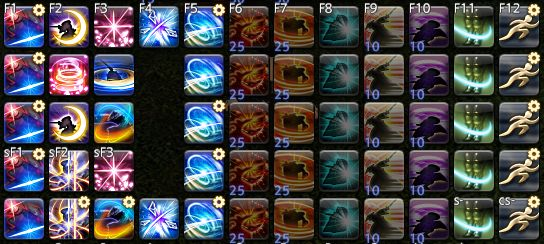
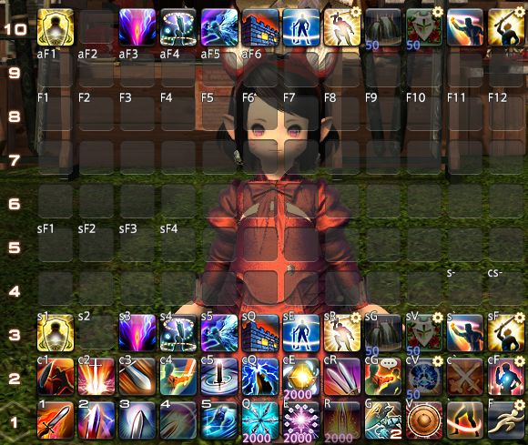
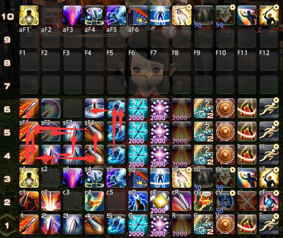
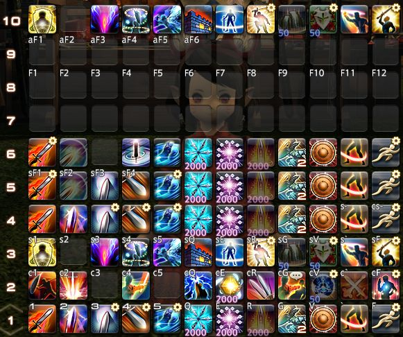
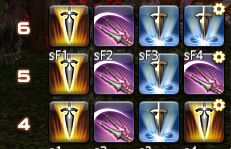
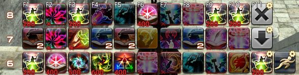
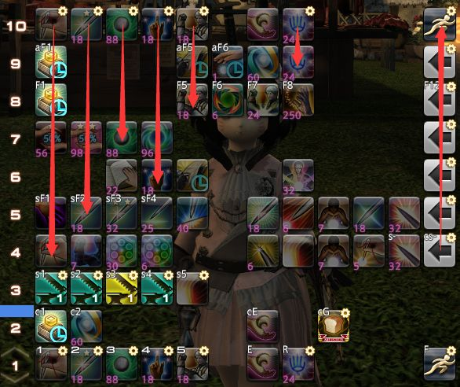
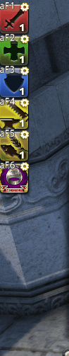

# 宏进阶
<FloatTOC />
::: segment blue

## 中篇前言
从这里开始，你就进入了宏进阶领域。接下来的叙述中我会对之前提过的东西以很简略的形式描述。一些专有名词，我会在第一次出现的时候用破折号或者括号解释，此后再出现时不再解释，如果遇到了不认识的名词，建议回头再读一下前面。建议在对上篇内容有充分的学习认识后再阅读中篇。

在这里，我要说的是，进阶宏的本质是排键位，如果说无宏的键位是人跑来跑去找键位，那进阶宏就是一个智能传送带把你最需要的热键送到手边——当然也有可能送来你不需要的，毕竟宏不够智能。

宏学的操作体系是比较独立，与不用宏的操作体系差别较大，可能会对读者的常识造成一定冲击，很多被认为不可能的事情在宏学中不断发生。当然，适合自己的才是最好的，你也有可能更适合无宏的操作体系，这篇文章只是给有需求的人的一个介绍，增加一种选择，并不是说谁好谁不好。

我除了讲解该怎么做以外，会更多的讲解我们是怎么想到这样做的，这才是对一个宏研者最有意义的事情。抄作业学不到太多，宏学是创造力的表现，最好的宏也只能自己创造，自己使用。

我们介绍的思路是先从无宏到有宏，再升级优化宏，现在宏的升级方向是减少宏位消耗，毕竟200个宏位太少了。虽然这样做会增加热键栏消耗，但是390条热键栏还是比较充足的。

世界上没有绝对完美的宏，我会客观分析这些宏系统的优缺点，以及相应的缺点弥补方案。修正一个缺点往往会造成新的缺点。宏的完美，是基于使用者的完美，每个人的操作习惯不同，完美的定义就不同。没有对于每个人都完美的宏，但是，对于个人来说，专用的完美宏是一定存在的。
:::
## 大型FAQ

- Q：有没有XX职业的宏/有没有作业抄
A： 没有。 首先，宏是为了解决具体的问题而存在的(但宏学不是)，在问宏之前先明确自己要解决什么问题，否则只会事倍功半，得不偿失。至于有宏吗，肯定有，但是你抄不了，进阶宏非常个性化，只有理解了才能用好。进阶宏一大特点是不能直接复制，需要根据自己的操作习惯和热键排布来调整。所以我在这篇文章中主要讲述思路，只略举一些例子，若不加思考的抄袭，只会给自己带来麻烦。这些举例的宏也并不完美，使用者在自己的理解基础上可以进一步扩大功能，真正完美的宏其实是存在的，但是是不可被复制的，只有属于自己的宏才能发挥100%的威力。
- Q：手柄是不是与宏学无缘了？
A：本文以/hotbar指令来展示各种宏只是因为作者是键鼠玩家，手柄玩家同样可以使用/chotbar指令用相似的思路制作宏系统。宏学只是一种做宏的思想，真正应用还要看使用者自己。手柄拥有自己独特的优势，但也拥有独有的困难，需要多多思考才能解决问题。
- Q：太长了，看不懂，设置好麻烦
A：宏学的英文Macrology原义为繁冗的语句，不是我们要把简单的事情变复杂，宏本来就很复杂，之前觉得简单是因为研究不够深入。如果这个东西不麻烦就不需要写那么长的文章了，简单的宏达不到目的，不适合使用，又要简单又要好用是不可能的。看不懂的话，实际操作一下是最好的学习方法。实际上熟练后看一眼宏就可以知道大致用途，十几分钟就能做一套宏系统。
- Q：为什么好多人都说宏掉输出，还会卡宏？
A：因为它们用的是没有雕琢过的原始宏。这些原始宏大多具有不能进入技能队列的缺点，导致了卡宏，掉输出。这些人基本没有看过现代宏学技术的成果，根据自己瞎写写的体验和道听途说得出了宏很辣鸡的结论，没有经过自己的思考，它们的言论是没有说服力的。你只需要反问他：宏为什么掉输出？宏为什么会卡宏？你有没有想过怎么让宏不卡宏？你听说过不会卡的宏吗？
- Q：(用宏/GCD技能用宏/用ac宏)会(卡宏/掉输出)
A：只有用/ac指令最终释放技能才一定会卡宏。进阶宏系统经常在开头打个ac补丁针对GCD已经在空转的情况，这个ac正常情况下都会被卡掉，因此不会卡宏。另外卡宏不一定掉输出。如能力技ac宏会卡宏，但是一般不会影响GCD，如果一场战斗中因为卡宏损失的时间不足以让该能力多释放一次，便不掉输出。GCD技能同理，卡宏卡的GCD时间不足以在战斗中多打一个GCD，就不掉输出。一些进阶的手法可以大幅缩小ac宏GCD损失，使得不频繁使用的ac宏GCD技能加入战斗成为可能。
- Q：到底什么叫卡宏？
A：这个词在大众中定义很广泛，概括起来就是一句话：宏做的和我想的不一样。在宏学中说的狭义的卡宏一般是指因为技能没有进入技能队列导致的技能衔接不流畅或没能使出技能。
- Q：宏最大的问题在于网络延迟
A：所有的宏都是本地运行的，只有涉及wait的宏才受网络延迟影响发生一些意外，只要合理规避，就能正常处理。如果是稳定的延迟，可以调整wait的时间来抵消影响。至于不稳定的延迟(心电图)，这一把你已经快凉了，宏出不出问题都是小事，赶紧想办法~~害死队友重来~~止损。
- Q：那么多宏占那么多热键栏不摆别的东西吗
A：宏学正在不断优化宏技术，减少宏位消耗，至于热键栏，我不认为390条热键栏会比200个宏位先用完。如果你觉得宏系统影响了你的其他界面布置，那很有可能是你写得有问题，没有充分利用隐藏的热键栏。
- Q：用宏简化操作怎么感觉变得更复杂了
A：做宏的过程比较复杂，但是做好了用起来就很简化，一个地方简化了肯定有另一个地方要变复杂。宏的复杂主要是语句有些多，但是逻辑其实很简单，就是把几个热键栏复制来复制去，只要理清了各个语句的作用，就十分简单了。画个逻辑图也是很好的方法。
- Q：宏不能处理变化的情况
A：FF14的战斗随机性比较低，所有的情况都可以穷举，不能处理说明你的宏还没有考虑到足够多的情况需要，还有需要改进的地方。多增加一些应急的方案总是有好处的。
- Q：错误操作可能导致宏系统崩溃
A：首先，有一点无法否认的是，无论用宏还是不用，失误和错误操作都会带来惩罚，这是不变的。而对于惩罚的弥补，宏需要针对性的处理，建设以复位为核心的失误处理机制，虽然这需要一定的练习。有人认为用宏的失误几率是循环失误率+宏操作失误率，但宏其实减少了循环犯错几率。视操作者水平，循环失误率+宏操作失误率可能小于无宏状态的循环失误率。
- Q：花这么多精力研究宏还不如研究输出细节/打木桩
A：打木桩是为了熟悉循环，写宏必须建立在高度理解循环和输出细节上，才能写出好宏。在付出这些精力写宏的同时，也会加深对输出细节/循环的认识。没有对循环的理解和对细节的把握就写宏，会出现各种问题。两者相辅相成，并不冲突。再者，宏的本质其实是键位排布，排了键位一样要打木桩练习。花费更多的时间写宏无非就是排了一个更合理的键位，自己打得更舒服。一个更合理的键位，也能有效降低木桩练习到熟练需要的时间。写宏只是再次优化一下键位和界面，并不影响你的输出循环。
- Q：为了做宏而做宏是不好的/这个宏没用/这么简单的职业还需要宏？
A：每个宏都是为了解决问题，你觉得这个宏没用说明你不认为这是个问题，但是不代表其他玩家不认为这是个问题。比如从近战起手的玩家认为打连击是基本中的基本，但远程起家新转职的近战就经常会不小心连续把一个技能打两下。
- Q：不用宏我已经打得很好了，是不是宏学对我没啥用
A：研究宏学也许可以让你更轻松的打得一样好，或者让你打得更好。宏是一种思想，它可以应用在方方面面，不仅仅是为了简化操作，还可以用来做各种规划。宏可以精细到每一个副本，精细处理到每一个细节，这都值得我们探索。就算是刷榜队伍成员也不一定能百分之百保证每一次战斗输出都是绝对的正确。如果我们可以用宏让输出循环更简单，那是不是就有更多精力去处理机制，去减少失误，甚至去多脏到几个GCD的输出呢？举个例子，赤魔作为开荒万金油不仅仅因为复活，也因为操作相比之下更简单，在开荒这种高压、紧急情况频出、注意力不停摇摆的时候，因为操作简单，更容易打出更接近上限的输出。即使是熟练的主职业，只要肯想肯试，也一定能找到可以用宏优化的地方。宏学发展到今天，最大的困难其实是改变自己去适应新技术，这和人类发展的规律其实是很相似的，因为写出一个完整合理的宏系统需要充分的理解，在形成这种理解的同时已经形成了一种操作习惯，而宏又会改变这种习惯。人们总是希望停留在安逸的环境中。宏研是一种对可能性的探索，每个人都有丰富的可能性，每个人也有属于自己的宏，甚至宏可以精细到每一个副本，精细处理到每一个细节，这都是可以去探索的事物，这和配装、调整循环、对齐爆发等一样有趣，也一样有价值。
- Q：宏学是面向副职、新手还是面向主职、老手？
A：这个问题其实宏研内部没有统一的答案。随风一跃认为宏系统需要拥有深刻的职业理解才能写好用好，因为他是一名刷榜选手，他要求他的宏要能打到logs100才行。迷子认为宏是简化操作的工具，适合用来提高不追求极限的副职游玩和摸鱼体验，可以接受一部分有损的宏，因为他是一名经常开小号甚至会多开打本的咸鱼玩家。蜡笔桶认为宏学是探索宏能做到什么，能想到的东西都可以用宏做出来当玩具，无所谓有没有用，因为他是一名喜欢数据挖掘和机制探索的工匠。而我的想法是，宏学面向有志者，只要你喜欢宏，有志于宏，无论是新手上路还是熟练工都可以研究宏学，创造自己需要的宏。
- Q：为什么要研究宏学，有什么意义？
A：首先，这是爱好。用户宏是游戏提供的玩法之一，它很有意思，研究宏是一种对可能性的探索，是一种对游戏机制的挑战，这让我们十分快乐。宏可以精细到每一个副本，精细处理到每一个细节，这都是可以去探索的事物，这和配装，调整循环，对齐爆发等一样有趣，也一样有价值。正是因为很多人认为用宏战斗“不可能”，我们才有这样的动力研究下去。其次，宏可以优化很多游戏操作和界面，让人更轻松方便的游戏，并降低游戏难度，提高游戏体验。具体有多大意义是根据每个人的观看角度和悟性不同而不同的。通过思想的碰撞，也许能获得新的灵感，获得对某事物的更多理解，这也是宏研创立的初衷。
::: segment blue
## 宏进阶黑话集
为了更容易描述比较复杂的概念，缩减描述篇幅，我们在这里定义一些黑话：
- 操作热键栏：玩家实际显示在界面中，一般设置有键位(或鼠标点)的热键栏。
- 辅助热键栏：不直接显示在界面中，但被其他宏指令调用其中内容的热键栏。包括储存热键栏和中转热键栏。
- 储存热键栏：在进阶宏中，由于操作热键栏频繁变化，我们将热键配置储存在隐藏的热键栏上，通过copy到操作热键栏来调用，使得改变操作热键栏的操作都会在部分操作后还原。
- 中转热键栏：在更高级的宏中，为了节省宏位，实现高级功能，不直接将储存热键栏copy到操作热键栏，而将其先copy到中转热键栏，再从中转热键栏copy到操作热键栏。
- 显示器：一般是操作热键栏，特指本身不储存热键，通过不断的被复制到来显示储存在不同热键栏上的热键。在显示器中改变热键，不会改变对应的储存热键栏上的热键，下次复制的时候又会恢复原样。
**以上热键栏称呼都是基于在宏系统中的功能命名的，本质都是普通的热键栏，没有区别。**
- set系：指/hotbar (set/emote/pet/minion...)等多种和/hotbar set功能差不多的子命令。
- 转到：将某栏复制到显示器上的操作。
- 预设热键栏：在使用宏系统前将热键放置到辅助热键栏中的操作。
- 复位：将储存热键栏复制到操作热键栏使其恢复原状的操作。
- 反存：将操作热键栏复制到辅助热键栏中的操作。
:::
## aswc式喊话宏
在上篇中，我们已经提过了防止喊话宏刷屏的方法：`/ac wait1` 喊话。这种方法最大的缺点是不能进入技能队列，并且喊话延后，不能起到及时提示的作用。如何解决这个问题呢？

首先我们先分析为什么传统的宏会刷屏。传统的宏，因为`/ac`不进入技能队列，必须要连打保证其释放成功。但是考虑到操作习惯，就算进入技能队列，许多玩家也喜欢激情连打。

所以我们要解决2个问题：让技能进入技能队列，并且激情连打也不会刷屏。
只有通过正常热键释放的技能能进入技能队列，所以只有用/hotbar set创造一个热键将宏取代，才能让技能进入队列。
因此，核心思路就是用/hotbar set指令创造一个热键把宏覆盖掉。这样连续按热键2次，第一次触发宏，发生喊话同时创造出热键覆盖宏，防止宏刷屏。第二次按到刚刚创造的热键，使得技能进入队列。**注意：必须按2次键才能使技能进入队列！**

很好，两个问题都解决了，但是有个新问题出现了：宏在以上操作后已经被覆盖了，这是个一次性的宏。我们需要想个办法在事后把宏放回原位，而唯一可以生成宏的指令是`/hotbar copy`。
我们在执行上面的过程前，可以先用`/hotbar copy`把宏所在的热键栏复制到别处保存，完事以后再复制回来。为了保证复制回来之前技能已进入技能队列并成功释放，我们需要视操作习惯等待1-2s。
整个过程是双击宏：(第一下)反存热键栏-技能热键覆盖宏-喊话-(第二下)按到刚覆盖上来的技能热键-进入技能队列-1s经过-宏返回原位。

最后，考虑当前没有硬直，本身就可以释放技能的时候，为了避免双击键间的时间损失，在最前端加上一行`/ac`，在有特殊需要的时候也可以不加。
这个是最后加的，但是在宏的最前面，很多杠精看到开头一个/ac就开始杠，实际上删除这行ac也没有什么问题。

那么整个宏的构架完成了。这种宏我们简称==aswc，即ac-set-wait-copy的缩写==。以后我们还会在其他地方见到这种形式的宏。

我以放置在骑士第三栏第8格的无敌宏为例：(假设骑士4是空热键栏，括号内的是注解)
```
/micon 神圣领域
/ac 神圣领域 (补丁，可以删除)
/hotbar copy 骑士 3 骑士 4 (反存)
/hotbar set 神圣领域 3 8 (放下热键)
/p 神圣之光涡旋流转，天堂之门现于世间，誓约之剑君临九天！无敌！！！<se.2>
/wait 1
/hotbar copy 骑士 4 骑士 3 (复位)
```
1. 这样看起来有一点抽象，我们来看一下图例：

2. 我们先按下宏，此时还在技能后摇中，`/ac 神圣领域`释放技能失败，`/hotbar copy 骑士 3 骑士 4 `备份完成，
`/hotbar set 神圣领域 3 8 神圣领域`热键出现在刚才的键位上，同时喊话已经发送

3. 接下来不用我说怎么办了吧，直接摁技能就行啦

4. 技能发动，`/wait 1`
`/hotbar copy 骑士 4 骑士 3 `复位启动，热键栏返回原状。


最后连贯起来看一遍：


接下来讨论更多可能的问题。

- 这个宏有wait指令。如果在wait期间需要插入别的宏：例如挑衅宏后立刻使用退避宏，最后的copy会被打断而无法复位。此时最简单的办法是在可能将其打断的宏上都增加一行将其复位的指令，或者在一个使用频率更高的GCD翻页宏上绑定一个复位。
当然你觉得wait1太长了，跟不上你对观察热键栏的需要，也可以不用wait，换成一些没有意义的指令拖延时间用高手速完成操作。
- 这个宏的技能是由普通热键释放的，因此不能指定逻辑目标。一定要指定逻辑目标的话有一个折中的方法：在宏的最前加上/ta <逻辑目标>，末尾加上/tle，这会使你的目标从敌人身上移开1s而可能丢失AA。你也可以把/tle改成手动用tab切回来减少AA损失。

## 状态机
角色有很多状态，一些是系统规定的状态，一些是人为规定的状态。若在某个状态下，有应该使用的技能和不应该使用的技能，就可以成为一个技能状态。

例如，黑魔的星极火和灵极冰状态是系统规定的，在星极火状态下，冰澈被系统强制禁用，冰结、冰冻虽然可以用，但绝对不该用，这就是一个技能状态。

再例如，武士打出阵风后，绝对不该打雪风、士风、花车，这是人为规定的状态，也是一个技能状态。

为了防止在一个技能状态中失误使用错误的技能，并节约键位，更容易按到正确的技能，我们可以通过某种方法，把不应该打出的技能从热键栏上消去，把应该打出的技能放到最顺手的键位上，高效的利用顺手的键位，这样的体系称为状态机。

接下来的几个宏思路都与状态机原理有关。

## 翻页宏
所谓翻页宏，早期是利用`/hotbar change`指令进行翻页，各技能状态分别保存在一条热键栏上。
多条热键栏通过翻页轮流利用1号热键栏上的顺手键位，可以让技能顺手、节省键位和防止误触。

实现这样一个状态机需要解决一个问题：如何判定技能状态的改变而翻页？

技能状态的改变除了连击中断以外，都来自技能释放，所以将释放某改变技能状态的技能与翻页绑定是不增加操作量的最好选择。随之而来的问题是，如何让这个改变技能状态的技能绑定在宏里后仍然进入技能队列？
思路仍然相同，要设法点击普通技能热键。在aswc宏中，我们依靠用set覆盖宏来实现这一热键创造。但是翻页宏中，热键栏在按下宏的瞬间切换，因此，我们并不需要set，只需要在翻页后同一个位置放上普通技能热键就可以了。

整个过程就是双击宏2次：（第一下）按下宏-翻页-（第二下）按到翻出来的技能热键-进入技能队列。
同样，考虑当前没有硬直，本身就可以释放技能的时候，为了避免双击键间的时间损失，在最前端加上一行/ac。在有特殊需要的时候同样可以不加。

整个宏非常简单，以第一栏第2格士风为例：(武士6是阵风后的技能状态所用的热键栏)
```
/micon 士风
/ac 士风(补丁，可删去)
/hotbar change 6
```
就这么点。这个宏指令很简单，复杂的是你的构建逻辑。你要想清楚这个技能状态应该干什么，不应该干什么，发生意外时可能要干什么，怎样排布键位最合理，并预设好热键栏。上面的这个例子中，在武士6上，应该在与第2格的士风宏同位的第三格上放上士风，其最近的第3格上放上最应该使用花车，整栏上不该放月光、阵风、雪风。为了花车后再次开始新的连击，或防止一些原因导致连击中断，应该在1格上放置翻到刃风状态的宏，并把其他同一热键栏上的技能都保持其出现，防止需要时无法找到这些技能。


这只是系统的一个状态，你需要把所有状态及其相互翻页都设计好才能顺利运行。武士单体本来应该有打出刃风后、打出雪风后、打出士风后、打出阵风后、打出花车后、打出月光后、明镜止水中7种状态，但是我们可以通过适度整合来减少状态数。打出雪风、月光、花车后都是无连击状态。打出刃风后如果打雪风，那下一个又该打刃风，这样翻页没有多大意义，所以我们将刃风、雪风、月光、花车后作为同一个状态。

因此武士单体的技能状态最少有4种。我们将刃风和雪风、士风宏、阵风宏放在一条热键栏上(起始状态)、刃风宏、士风和花车放在一条热键栏上(花闪状态)、刃风宏、阵风和月光放在一条热键栏上(月闪状态)、刃风宏、雪风、月光、花车放在一条热键栏上(明镜止水状态)。刃风是所有连击的起点，所以至少需要起始状态翻到花闪状态/月闪状态的2个宏，翻到明镜止水状态的一个宏以及翻页返回起始状态的一个宏。如果将风雅、满月和樱花加入系统，需要更多的宏来调整。



(想一想：图示的这套宏系统在持续群怪爆发时有一个缺点，就是明镜止水后樱花和满月不在热键栏上。要如何修改宏并如何操作，才能在明镜止水后打出樱花和满月？)

1. 我们再来看一下图例：

2. 此时我按下士风宏，可以看到GCD还没转好，`/ac 士风`没有成功释放
`/hotbar change 6`完成翻页

3. 这时我再按了一下，士风进入队列

4. 可以看到我没有再按一下，士风成功通过技能队列释放


最后连贯起来看一遍：


刚才我说过早期的翻页宏是利用`/hotbar change`的，就是说现在已经有了更好的选择，之所以介绍早期形式是因为这种翻页宏简单明了，便于调整，直观可见，很适合逻辑想象力不足的新手。但是这种宏有一些很不方便的地方。`/hotbar change`只能在本职业内翻页，并且会保持热键栏的share状态。刚才介绍的武士翻页宏体系有4个状态，需要4条热键栏，放其他能力技大概需要1-2条热键栏，放一些别的热键，比如切职业，情感动作需要……很多热键栏，现在你10条热键栏用完了。现在还想再弄一条热键栏来显示技能监控而且不想删掉别的热键栏，怎么办？`/hotbar copy`是更好的选择。我们可以将武士的四种状态存储在武士4567上，然后打开share4567，就可以翻页宏和界面UI互不干扰了。因此我们的宏也相应的改变一下形式，还是以上面那个第2格的士风为例：
```
/micon 士风
/ac 士风
/hotbar copy 武士 6 武士 1
```
还是那么简单的语句，它在系统设计和运行效果上与`/hotbar change`式翻页没有什么差别，但是在设置上有个小问题。现在操作热键栏固定为武士1，它是个显示器，当你进入月闪状态，它就显示武士6上的内容，当你进入明镜止水状态，它就显示武士7上的内容，如果你想修改一下上面的内容，在显示器上修改是没有作用的。你必须要到对应的储存热键栏上去修改。另外，copy式翻页宏消耗的热键栏比change式翻页宏多一条，因为copy式翻页宏需要一个额外的不能储存热键的显示器1，而change式中1可以储存热键。如果实在对这个缺点很烦恼，你也可以在每一个状态翻走之前加一个反存，但这需要更多的宏，因为你需要区分从花车返回刃风与从月光返回刃风来保证反存到正确的位置。

总结一下，change式翻页宏的优点在于修改能够立刻保存，逻辑比较直观，而copy式翻页宏对热键栏的消耗更多，修改起来更复杂，但可以调用更多隐藏的热键栏，大大增加可用热键栏数目，并实现更多复杂的功能。

最后我们讨论一种特殊情况：根据当前技能状态不同，使用同一个技能后会进入不同技能状态，如星灵易位、演武。这种情况下我们需要区分几种状态，分别用不同的宏。以星灵易位为例，需要区分冰转火星灵与火转冰星灵。显然冰转火星灵在冰状态栏上，火转冰星灵在火状态栏上，但是星灵易位只有一个技能，我们不希望一个技能占2个键位，所以我们做一点小操作。在翻页后为了保证星灵移位释放成功，我们需要星灵移位以普通技能热键的形式出现，但设置时或一会需要再次星灵易位时我们又需要它变回宏。你可以在翻页前将拟翻到页反存到它处，翻页后立刻set星灵易位(注意热键栏编号变化)，wait1后将反存的热键栏复位回来。如果是copy式翻页宏，可以不用反存。
- change式：
```
/micon 星灵易位
/mlock
/ac 星灵易位
/hotbar copy 黑魔法师 6 黑魔法师 10(反存)
/hotbar change 6
/hotbar set 星灵易位 6 5
/wait 1
/hotbar copy 黑魔法师 10 黑魔法师 6
```
- copy式
```
/micon 星灵易位
/mlock
/ac 星灵易位
/hotbar copy 黑魔法师 10 黑魔法师 1
/hotbar set 星灵易位 1 5
/wait 1
/hotbar copy 黑魔法师 10 黑魔法师 1
```
有没有觉得这个宏有点像aswc？其实这就是aswc和翻页宏的复合。这个小技巧还在一些其他的复杂aswc中需要用到。
由于wait1，你需要保证这个宏不被打断，否则你的宏系统就崩溃了，所以建议加上宏锁。如果你的循环里还有别的宏，你可以把复位绑到那个宏上，或者你也可以手动复位。
你也可以巧用空闲的share来实行交换。

当然，滚动宏也是个办法。通过增加一个辅助热键栏，每次星灵易位时交换冰火热键栏，具体方法，想像一下将两杯水交换杯子的方法。我会在后面讲解。

## 翻页宏逻辑构建图解
这个翻页宏的逻辑系统初学者建构是比较困难的，这里我介绍一种思维模式：

;;;.guide .cols2
;;;.guide .col


;;;

;;;.guide .col .grow
1. 制作一个调试用宏，绑定一个UI存档，把1-10号热键栏整齐的排列，将所有热键栏全部显示，关闭所有热键栏的share，显示热键栏编号，显示未设置的格子。

参考调试宏：
```
/hotbar share 1 off
/hotbar share 2 off
/hotbar share 3 off
/hotbar share 4 off
/hotbar share 5 off
/hotbar share 6 off
/hotbar share 7 off
/hotbar share 8 off
/hotbar share 9 off
/hotbar share 10 off
/hudlayout 3
/hotbar display 4 on
/hotbar display 6 on
/hotbar display 8 on
/hotbar display 10 on
```
显示热键栏编号，显示未设置的格子没有文本指令，只能去角色设置面板里操作。

;;;
;;;

;;;.guide .cols2
;;;.guide .col

;;;

;;;.guide .col .grow

2. 想象链接关系，把想要做宏系统的连击热键在空闲的热键栏上排布成理想的样子并画出连击关系图。

核心思路：一条热键栏上是一套连击，同时应包含其他连击的起点。各套连击的起点应当尽量保持在同一键位。

- 4号热键栏：正在打沥血连或王权连中，此时不能打赎罪剑否则会中断连击。
- 5号热键栏：打完沥血连或王权连，可以打赎罪剑，因为想再打暴乱剑必定先打先锋剑，所以把暴乱剑替换成赎罪剑。
- 6号热键栏：正在打AOE连，如果之前有没打完的赎罪剑也可以酌情打掉

;;;
;;;

;;;.guide .cols2
;;;.guide .col

;;;

;;;.guide .col .grow
3. 为每个纵向发出箭头的技能做一个宏，宏的内容为`/hotbar copy current 箭头指向的那一栏 current 操作热键栏`。

图中的四个宏分别是：
```
/micon 先锋剑
/ac 先锋剑
/hotbar copy 骑士 4 骑士 1
```
```
/micon 王权剑
/ac 王权剑
/hotbar copy 骑士 5 骑士 1
```
```
/micon 沥血剑
/ac 沥血剑
/hotbar copy 骑士 5 骑士 1
```
```
/micon 全蚀斩
/ac 全蚀斩
/hotbar copy 骑士 6 骑士 1
```

;;;
;;;

## ASWC一键连击宏
这个思路起源于4.0更新的PVP系统。在远古时代，对战技能和PVE技能组是一样的。在4.0更新时，官方把PVP做了一套专用的技能组，并将各个近战职业的各套连击整合到了一个键位上，跟随连击状态自动切换。

显然官方完全可以做出来，但是就是不想给你做PVE版一键连击。吉田不想做那我们自己做，用宏同样可以做到类似的系统，我们先分析一下这样做要解决哪些问题。

首先是解决切换连击阶段。连击阶段是一个技能状态，它同样是只因打出技能和连击中断而切换。所以我们同样将技能与切换指令绑定。我们在这里直接沿用aswc宏的思路，aswc喊话宏的最后一步`/hotbar copy`是为了将宏恢复原样，如果我们修改一下，让下一个连击状态被复制过来就大功告成了。
==整个过程需要按宏2次：(第一下)按下宏-技能热键覆盖宏-(第二下)按下技能热键-进入队列-1s经过-转到下一个连击状态==

以第一栏第4格的精准刺为例：
```
/micon 精准刺
/mlock
/ac 精准刺(补丁，可以删去)
/hotbar set 精准刺 1 4
/wait 1
/hotbar copy 枪术师 5 枪术师 1
```

同样，你需要预设热键栏，建立合理的技能状态热键栏及其相互转换。在上面的例子中，脉冲枪的下一段开膛枪应该做成与之相似的，链接到樱花怒放的宏然后放在与脉冲枪宏同位的第5栏第4格上。其他热键应该保持一致。



1. 我们来看一下图解：

2. 我点击精准刺宏，因为这个时候GCD正在空转，补丁`/ac 精准刺`直接成功发动技能，因为GCD已经在空转所以ac不会卡GCD

3. 1s后，`/hotbar copy 枪术师 5 枪术师 1`生效，贯通刺宏出现在原来的位置

4. 我点击贯通刺宏，此时GCD还没转好，`/ac 贯通刺`发动技能失败，
`/hotbar set 贯通刺 1 4 贯通刺`热键出现在原来的位置

5. 我再次点击，贯通刺热键使贯通刺进入技能队列

6. 可以看到，贯通刺成功通过技能队列释放

7. 1s后，`/hotbar copy 枪术师 6 枪术师 1 `生效，直刺宏出现在原来的的位置


连贯起来看一遍：


这种方案中连击的每一个技能都要做宏，很浪费宏位，并且有一些比较麻烦的问题。aswc一键连击虽然很方便，**但容错率很低，需要做大量的弥补失误准备。**

你必须控制按键连打的速度，不要在CD转好1s前就开始激情连打，或是激情连打超过1s以上，否则可能会发生技能未成功释放就已转到下一段的问题。一个折中解决方案是在宏的最后加上wait1(用于延长宏锁)，这可以减少你太过提前按键的机会，但仍然不能完全解决问题。

如果不幸的事故发生了，在技能打出前连击状态就切换了，你还需要一个回退宏或者其他备用热键让你重新能够打出刚才的技能，如果反应够快还可以避免损失。

为了节约回退宏的个数，我们可以利用反存，固定回退到中转栏，而每次按宏时将当前栏反存到中转栏。例如：
```
/micon 精准刺
/mlock
/ac 精准刺
/hotbar copy 枪术师 1 枪术师 7
/hotbar set 精准刺 1 4
/wait 1
/hotbar copy 枪术师 5 枪术师 1
```
```
/e 复位宏
/hotbar copy 枪术士 7 枪术师 1
```

因为这些原因，**我们不推荐操作不熟练、按键喜欢激情乱按的玩家使用aswc一键连击，这个宏系统更适合操作精确的节奏大师玩家。**

aswc一键连击是容错率很低的宏，你必须防止误点、漏点、多点，在GCD还有半秒左右转好的时候高速点击2次。一般来说，我们认为，远距离瞬发技能是最不容易发生事故的。因为读条技能可能会中途断条，近战技能可能会因为射程差一点点摸不到怪。即使这样，你仍然可能遭遇Boss突然飞天遁地导致技能释放失败的情况，**需要熟练掌握复位方法。**

最后考虑如果打出一段中间连击后长时间的转阶段导致的连击中断问题。在最后加上`/wait 15`后跳转回无连击状态看起来是个不错的办法，但是我不建议加，因为这个宏的wait1一旦被打断系统就会崩溃，所以我们要加宏锁，而这个设计需要允许宏被打断，这两个需要是冲突的。还有一些debuff爆炸算玩家使用技能会打断连击的奇怪机制（比如：O4s叉形闪电），需要复位调整回无连击状态，这又要一个复位到无连击的宏。一来一去，就把节约的键位都亏回去了。

## 一字排开

有一些职业爆发阶段技能繁多但是顺序基本固定，而我们在需要一边处理复杂机制一边爆发时很容易手忙脚乱。有些玩家会选择拉出一栏，从左往右依次摆技能，爆发用鼠标从左往右点。
如果能移到键盘上，并且只有爆发时显示，不爆发即隐藏是不是更好一些？因此，我们可以使用这种一字排开宏来简化操作。

最典型的例子是忍者。忍者有相当多的技能需要打在自己的背刺爆发中，其中还包含若干忍术。一旦手忙脚乱起来，搓出个兔子就全完了。
因为我的忍者还在练级，所以使用召唤来作为示例：



- 6号热键栏是我备份的1号热键栏，用于打完后恢复。
- 7-8号热键栏上是召唤的起手爆发技能顺序。
- 6号热键栏第11格的宏是启动起手爆发宏，它的功能是预读毁3并将起手爆发第一排复制到1号热键栏：
```
/micon 毁荡
/ac 毁荡
/hotbar copy SMN 7 SMN 1
```
7号热键栏第11格的宏是将下一排的起手爆发第二排复制到1号热键栏：
```
/hotbar copy SMN 8 SMN 1
```
8号热键栏第11格的宏是打完起手爆发，把热键栏还原成正常状态：
```
/hotbar copy SMN 6 SMN 1
```

我们来看一下演示：


是不是看起来非常无脑滚键盘？这样的一字排开宏能优化爆发的体验，只需要按一下启动，然后就可以从左往右滚键盘了。

这个宏虽然可以把复杂的钢琴爆发变成从左到右按技能，但也存在一些缺陷。
假如在之前的战斗中发生了一些意外，某些爆发技能因为boss的机制推迟了，本来固定的爆发安排就会改变。
这种问题你无法设计进去，所以你最好还是把手动弹钢琴也好好练一练，或者将可以移动位置的技能放到一字排开范围外。其中还有些其他问题请自行摸索。

考虑更复杂的情况。爆发阶段根据不同的情况有几种循环的职业，如果采取何种循环可以在爆发开始前预知，可以设置若干个宏来应对不同的情况。
以枪刃为例，枪刃根据本轮爆发是否有血壤，爆发的循环有一点小变化，我们可以做两个启动爆发滚键盘的宏，根据血壤是否转好来选择按哪个。
当然分支更多的职业直接这样设计的话需要消耗很多宏位了。用滚动宏的方法可以大幅减小这个消耗，具体的方法我会在后面介绍。

注：巧用第二键位，可以在已经更变了默认热键的情况下继续1234567890-=滚键盘。
## 菜单宏

### 跳转菜单宏

拨打10086，你会听到：查询流量套餐请按1，办理套餐请按2，办理国际漫游业务请按3，转人工服务请按*，返回上一级菜单请按#...（以上内容纯属虚构）
这是一个跳转菜单，通过对功能分类，用户可以更快找到需要的功能，并节约有限的按键数。利用这种思路来做菜单宏习惯上称为跳转菜单宏。

生产职业技能众多，且包含大量同类技能。许多生产玩家还会使用大量的宏来进行批量制作，键位有时不是很够用。
通过跳转菜单宏可以大幅减少键位。我们参考以上菜单的逻辑，推进展请按1，推品质请按2，恢复耐久请按3，加buff请按4，起手技能请按5，收尾技能请按R，返回菜单请按F...
每一个分类我们用一个宏和一条热键栏来制作(主菜单也算一个分类)，我们在主菜单上放置跳转到各子菜单的宏，这个宏应该是`/hotbar copy`。
生产职业技能8职业间通用，菜单宏用copy制作可以在一个职业制作后通过current全职业共用。
例如，我将裁衣匠4-10分别作为主菜单、作业、加工、耐久、buff、起手、收尾分类热键栏，那么使用`/hotbar copy 裁衣匠 X current 1`就可以在其他生产职业下复制生产菜单。



这张图中，4号热键栏上的是推进度用的技能，5号热键栏上是推品质用的技能，6号热键栏上是上强化buff的技能，7号热键栏上是耐久续航的技能，8号热键栏上是起手用的技能，9号热键栏是收尾用的技能，10号热键栏是主菜单。

我们先在各行热键栏上放置需要的子菜单，再制作一些宏分别链接到这些子菜单就可以了。

我相信我不需要再赘述这些宏的具体内容了，如果你不理解，请回去看翻页宏制作思路图解。我只举出一个稍微有一点变化的宏，第12格上的那个返回主菜单宏。
```
/hotbar copy 裁衣匠 10 current 1
/hotbar copy 裁衣匠 2 current 2
/hotbar copy 裁衣匠 3 current 3
```
第一句是执行返回主菜单，第二、三句是将裁衣匠2、3复制到当前职业的第2、3排，实现将我在裁衣匠职业下调整的键位同步到其他生产职业。
(2号热键栏上是一些触发的监控，3号热键栏上是当前版本常用生产宏)
这样我在一个职业下设置的键位就可以给全生产职业通用了。当然，这样做的缺点是，我只有切换到裁衣匠调整键位才有效。

我们来看一个最终效果：


看起来是不是很方便？虽然生产职业确实更多时候是在直接用15行流程宏在制作，但是5.2高难度配方已经在路上了，拥有这样一套简洁明了的跳转菜单宏对技能进行分类能够有效提高你上手的速度。

如果一个跳转菜单中除了返回上一级菜单没有任何不能被set系指令放置的东西，并且这个菜单没有下属的二级菜单，有一个比`/hotbar copy`更简单的方案。
我们可以通过`/hotbar set`，将除了返回以外的各格依次set覆盖过去，这样做可以节约一条热键栏，并且调整更加方便：预存的热键栏需要反存或转到对应职业去修改，而使用`/hotbar set`只需要去宏面板修改。
例如：
```
/micon 随机宠物
/hotbar minion 邮差莫古力娃娃 4 1
/hotbar minion 蓝闪蝶 4 2
/hotbar minion 幼碧企鹅 4 3
/hotbar minion 萌神乐团 4 4
/hotbar minion 食果花鼠 4 5
/hotbar minion 小树袋熊 4 6
/hotbar minion 南方度假獭獭 4 8
/hotbar minion 软软垫子 4 9
/hotbar minion 舞海月 4 10
/hotbar minion 旅雀儿 4 11
/hotbar minion 朱孔雀 4 12
```
这个菜单在4号热键栏上，它的第七格是返回键。
我们来看一看实际效果：


看起来是不是有一种动态的效果？这样不但好看而且方便，如果我新获得了一个喜欢的宠物，我只需要打开宏面板把它的名字替换到宏里面去就可以了，省得去宠物面板一大堆宠物里寻找。

### 折叠菜单宏
打开最终幻想14官网，鼠标点击上方的导航栏上就能弹出子菜单，同时母菜单不消失。在需要打开子菜单时才显示，其他时候隐藏，可以大幅节约界面空间。利用这种思路来做菜单宏习惯上称为折叠菜单宏。

由于FF14中一名玩家可以游玩所有职业，有很多玩家的热键栏被一大堆换职业热键塞满。我们可以用折叠菜单宏来改善这种情况。
我们需要1个母菜单，一个子菜单显示器和若干子菜单储存器。我们在母菜单上可以利用系统预置宏图标将职业分为5类：坦克 奶 DPS 生产 采集。
然后我们需要将其对应的子菜单储存器预置好，例如我在刻木匠6-10上分别放置了5类职业的切换热键。
利用`/hotbar display`指令，事先隐藏子菜单显示器，当点击母菜单的宏时，将对应的储存栏复制到显示器并将隐藏的显示器显示，这样就实现了折叠的功能。

我们希望在弹出子菜单，选择了职业后，子菜单能够自己消失，所以我们根据子菜单上的热键数估计选出需要热键的最长时间，在wait后隐藏。
但是如果你有一些切职业绑定了宏，那么切职业宏会将子菜单隐藏打断。最好的办法是在所有切职业宏上都绑定隐藏子菜单显示器。
例如：
```
/hotbar copy 刻木匠 7 share 8
/hotbar display 8 on
/wait 5
/hotbar display 8 off
/hotbar remove 8 all
```
这是一个最简单的折叠宏。5个全部做好以后我们来看一看效果：



是不是很方便呢？赶快把你乱七八糟的热键栏分类收纳一下吧！

这只是一个最简单的折叠宏，我们可以再在上面加一些有用的东西。

例如，很多工匠都有忘记开收藏品制作buff的经历。~~曾经有一位脚本哥，让全猫区人民喝上了平价魔匠药水HQ~~
我们可以在展开工匠职业的子菜单，延时收起后加一个开收藏buff。
你还可以把各种有意思的东西加入宏中，例如弹出辅助菜单，更换称号，初始化跳转菜单宏……

我举一个超级复杂的例子：
```
/hotbar copy 刻木匠 9 share 8
/hotbar display 5 off
/hotbar display 8 on
/title set 裁衣金针
/hotbar copy 裁衣匠 10 裁衣匠 1
/hotbar copy 裁衣匠 10 锻铁匠 1
/hotbar copy 裁衣匠 10 铸甲匠 1
/hotbar copy 裁衣匠 10 烹调师 1
/hotbar copy 裁衣匠 10 制革匠 1
/hotbar copy 裁衣匠 10 炼金术士 1
/hotbar copy 裁衣匠 10 雕金匠 1
/hotbar copy 裁衣匠 10 刻木匠 1 <wait.3>
/ac 收藏品制作
/hotbar display 8 off
/hotbar remove 8 all
```
和那个最简单的对比一下，这个宏多了几个功能：

- /hotbar display 5 off(关闭我的战斗职业专用辅助菜单)
- /title set 裁衣金针 (切换一个适合生产职业的称号)
- /hotbar copy 裁衣匠 10 XXX 1 (初始化跳转菜单宏，让我最近修改过的键位立刻同步)
- /ac 收藏品制作 (开收藏品buff，妈妈再也不用担心我搓出HQ魔匠药水了)

是不是看起来非常高科技？

刚才我顺便说了一嘴我的战斗职业专用辅助菜单，这个菜单也是一个类似折叠菜单的东西，折叠开关在我的职业切换宏上。
我也解读一下这个宏的作用，想要把切职业宏嵌套在这样的折叠菜单宏里，需要经过一点小小的处理：
```
/micon 学者 classjob
/hotbar display 8 off (关闭子菜单显示器，因为运行这个宏会打断3s后自动关闭子菜单显示器的指令)
/hotbar copy 学者 5 share 5 (将我储存在隐藏区域的辅助菜单复制出来)
/hotbar display 5 on
/gs change 创造现实的魔纹 (切换职业，5.1更新后，可以用套装的名字替代套装序号，这样即使更改了套装顺序也不会切错)
/hotbar remove 8 all (清除子菜单显示器上的内容，因为我的子菜单显示器上有键位，即使已经隐藏了也仍然可能误按)
/title set 博学 (设置一个适合学者身份的称号)
/e 战术乃创造理想现实的途径。(一句职业任务中喜欢的座右铭)
```
是不是感觉到菜单宏的无限可能？我只讲述了菜单宏在非战斗中的应用，但是战斗中也一样可以使用！例如用跳转菜单宏来进行滚键盘爆发，用折叠菜单宏监控技能冷却......
::: segment blue
## 中篇小结
当你认真读到这里，相信你已经掌握了绝大多数的有普遍实用意义的宏系统的写法和基本思路。

只要熟练掌握了`/hotbar set`和`/hotbar copy`两个进阶指令的应用，我相信你也可以在十几分钟内信手拈来写出一套完整有效的宏系统。

剩下的下篇，是一些当你深入宏学一段时间后才会遇到的一些问题，例如200个宏位真的写满了什么的，和一些看起来没有什么用的，仔细想想可能有大用也可能完全没有用的玩具。

如果宏学是如此吸引你，想用宏学的方法在艾欧泽亚，至少在你身边的队友中开辟一个新的时代，那么就继续往下看吧。

我相信对于这样的你，我已经不需要再配一些详细的写法和图例了。
:::
:::segment grey

本文内容来自艾欧泽亚宏学研讨会，原文链接：[[资治通鉴新编]《宏学(第三版)》](https://bbs.nga.cn/read.php?pid=428649631)，欢迎加入艾欧泽亚宏学研讨会，QQ群号774176444。

:::