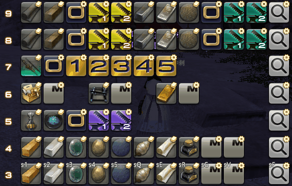
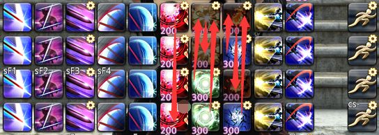

# 宏拾遗
<FloatTOC />

## 流程引导宏
在比较长的战斗中，不熟练的玩家容易在较后期的阶段忘记时间轴、机制处理方法或站位分配，引发团灭惨案。
如果能在关键机制前发言提示，就能大幅降低开荒阶段的失误率。有一些玩家会制作单独的喊话宏提示队友，但操作这些宏容易分散使用者的注意力，因此我们可以用更自动化的方式来处理。

首先，我们选定一些相隔不太远，比较标志性又几乎不需要立刻分心处理机制的事件（例如转阶段、机制开始读条），将它作为一个时间零点，然后参考时间轴制作对应阶段的提示，设置合理的wait使其在重要机制开始前进行提示。然后...然后就没有然后了，这个东西本体很简单。
举个例子：
```
/p ---大海啸2---<se.2>
/p 菊D站最前然后去1 <wait.5>
/p 1点两奶+菊D，2点其余3D，三角站最前，T出去诱导三角喷水 <wait.5>
/p 冲浪D站最前背对人群 <wait.5>
/p 冲浪T站最后面对人群，大圈T去场边
```
不过这个东西因为长延时，和大部分的宏都不兼容，如果你不使用任何战斗宏，你可以考虑装载它。

流程引导宏一般都是开荒阶段使用，使用者自己也对流程不是很熟，有时候会忘记点，或者忘记点到哪了。
因此我们点击后可以用`/hotbar remove`自我消除。如果热键栏很富裕，也可以采用aswc，点一个自动换到下一个（并且可以绑定一个按键）。
对于有多套时间轴的BOSS，我们可以记录一个关键的分支事件，然后在那里弹出分支选项，在选择分支时切换热键栏。

基于流程引导宏有一个更强大的手法，如果你在流程中有一些固定安排在某个时间的技能，你可以让它在那个时间set到一个顺手的位置。例如减伤安排，嵌入到流程宏中，你甚至可以用一个键控制所有减伤。例如：
```
/e 大海啸1，帐篷 大仙女 秘策单盾展开
/hotbar set 野战治疗阵 5 1
/hotbar set 炽天召唤 5 2
/hotbar set 慰藉 5 3
/hotbar set 秘策 5 4
/hotbar set 鼓舞激励之策 5 5
/hotbar set 展开战术 5 6
/hotbar set 慰藉 5 7
```
这样当机制开始的时候，不需要思考，从左点到右就可以了。

FF14的战斗应该像一场表演一样，一切都在安排中，不存在任何意外。
为了追求极限，每个人都应该是仔细规划的，仔细到每个GCD的规划，然后在战斗中严格的打出来，不应该有一丝一毫的偏差。
不过，规划是一回事，实际打起来是另一回事，经常会有遗忘和失误，这使得挑战极限需要大量重复练习来记住规划。
而宏，它最擅长做固定的事情。我们只需要把针对副本有特殊改动的地方进行处理---这是对某一个副本专用的宏。
例如某处要留技能，提前爆发等，这些与标准循环不同的地方因为肌肉记忆会容易误操作，我们在这些地方把热键栏重排，这样来上一排额外热键栏，就像我之前讲的菜单宏一样操作。

你甚至可以安排到每一个GCD，每一个GCD都用宏控制，然后你就只需要123412341234滚键盘就可以完成所有的规划（但是点名点谁，触发情况什么的就不可控了）……这会非常消耗热键栏，你可能需要一个崭新的配置文件来装载这些宏。
当然，有些随机事件是会改变你的安排的，但随机事件都是可以穷举的，你应该对每个随机事件都有相应的安排。由于200个宏位的限制，我们不可能控制全场战斗，只能控制其中的几个阶段。
我4.5版本末无聊的时候制作过一套能够控制一场武士木桩战打出极限输出的娱乐宏，它非常好用，能刚好在3分钟的时候把闪和剑气刚好用光，但仅限3分钟真木桩，不能提前打爆。
我能说的也只有那么多，更多的细节只有亲自制作一次体验一次才能体会到。

## 用宏优化优先级机制
有一类机制，它会需要队伍中的随机几个角色分别去不同的位置站位处理。
虽然可以灵性处理，但是要知道灵性是很不可靠的，灵性欠费的时候经常会发生互相让、撞车或者二人转事故。
因此，在要求比较高的副本中，为了减少不可靠的灵性影响，攻略一般会制定一个优先级。

假设随机点名两个DPS需要去左右两方处理机制，我们把左>右制定为优先顺序，D3>D4>D1>D2指定为优先级，那么这个机制的处理方法如下：
- D3：被点名无脑去左
- D4：被点名后观察D3，若D3没有被点名则去左，否则去右
- D1：被点名后观察D2，若D2没有被点名则去右，否则去左。
- D2：被点名无脑去右。
这样就出现了一个问题：除了优先级最高和最低的人，都需要观察其他玩家是否被点名来确定自己去哪里，并且优先级越居中的玩家，需要观察的人数越多。
如果点名有buff还好一点，只有头上一个标记你可能还无法一眼认出来他是D几，需要更长的判断时间。
这还只是4人选2个位置，8青魔挑战因为没有职能分化，所有人都有可能被点名，观察难度呈几何数上升。

该机制的登峰造极就是绝神兵泰坦三连桶。该机制要求8名玩家在很短的时间按照石牢点名排出3个点位的优先级。
这个机制难度相当大，因此玩家们也做了大量的相关手段来处理该机制，例如在版内随处可见的多种版本泰坦三连桶标点科技。
但是，使用这些插件是用户协议的灰色地带，不排除有封号的风险，以及在版本刚刚更新时无法使用。
通过宏学的方法，我们可以优化优先级机制的处理方法：

### 标记法
`/mk`这个命令有一个有趣的特点，如果只指定标记，但不指定标记序号(例如只指定“攻击”，不指定1-5)，那么系统会自动使用当前未被使用的最小序号。
因此，我们可以让每个可能被点名的玩家都做一个宏：
```
/mk attack <me>
```
玩家一旦发现自己被点名，立刻按下这个宏，头顶就会出现一个数字。这个数字是几，就去优先顺序第几位的位置。
例如我在被点石牢后立刻按宏，发现我头顶上是2，我就立刻知道了我要去中间。
为了防止有人不小心按了两次宏，并用完后把标记消除方便下次再处理优先级机制，我们可以写成这样：
```
/mlock
/mk attack <me> <wait.3>
/mk off <attack>
```
但是如此做会干扰其他宏的运作，见仁见智的使用吧。

这样做的优点是不需要观察其他玩家的任何行为，也不需要等待其他玩家的任何操作，只需要自己操作，观察自己头顶的数字即可确定自己的优先级。
但是，该方法有个缺点。这个优先级是根据谁按得快来指定的，在一定的情况下，可能会导致近战罚站。

### 信息法
这是之前在版面内看到的一个有趣的方法，但是已经找不到原帖了。
有这样8个宏（每排是一个，我把它们写在一起）：
```
/p MT--------------
/p --ST------------
/p ----D1----------
/p ------D2--------
/p --------D3------
/p ----------D4----
/p ------------H1--
/p --------------H2
```
每人携带一个对应自己位置的宏，一旦发现自己被点名，立刻点击该宏。
在被点名的人全部点击宏后，聊天栏中就会排列出正确的优先级。该方法无论顺序，即使多次按宏也不会有问题。如D4、ST、D2顺序按宏，且ST不小心在D2按宏后又多按了一次，聊天栏中就是这样：
```
(A)----------D4----
(B)--ST------------
(C)------D2--------
(B)--ST------------
```
此时被点名的玩家看到聊天窗中的文字阶梯形状就能知道ST站1位，D2站2位，D4站3位了。

理想是美好的，但现实是残酷的，这个方法有一个很大的缺点：如果玩家的名字长度差距太大，可能会造成错位：


虽然还是可以通过读出文字，脑补排序的方式来完成优先级排序，但是效果无疑差了很多。
因此，这个方法仅在队内成员同服且名字差不多长的情况下效果比较好。

## 滚动宏
通常情况下，在一条显示器上要利用多少条储存热键栏就需要至少多少个宏(可能更多)，但如果能构成一个固定循环，就可以用1-2个宏解决一切。这两个宏分别是“将一条固定的辅助热键栏复制到显示器”和“让不同的辅助热键栏轮流出现在将被复制的辅助热键栏”。这两个功能可以分开也可以合二为一。
它的逻辑是，现在有很多非一次性纸杯装着不同的饮料，我永远只喝一个杯子，但每个杯子里的饮料都想尝一口，于是我需要一个空杯子，把喝过的杯子里的水倒进去，把下一杯没喝过的饮料倒过来。循环此过程就是滚动宏的原理。 因此又被称作倒水宏

滚动宏能够节约宏位，但增加热键栏消耗。我们将若干套生产宏存储在5条热键栏上，分别编号12345，当切换宏按下时，将1号栏上的内容复制过来。那么，操作栏就是1号栏的固定显示器。
之前用到显示器原理的宏中，显示器轮流显示不同热键栏，**切换的是显示器显示谁**，这里显示器固定显示1栏，那么我们就应该反过来，**切换1栏上的内容**。

现实中如果有5杯饮料，想要交换杯子就需要一个空的杯子来中转。当切换宏按下时，将1号栏复制到一个空闲的6号中转栏，然后将2复制到1，3复制到2，4复制到3，5复制到4，6复制到5。
这样每按一次切换，1号栏上的内容就会变换一次，我们始终复制1号栏，这样就实现了只用1个宏在5套生产宏间切换。
由于交换量比较大，需要数帧来执行，最好加上宏锁防止被打断而崩溃。

示例：
```
/mlock
/hotbar copy 烹调师 4 烹调师 9
/hotbar copy 烹调师 5 烹调师 4
/hotbar copy 烹调师 6 烹调师 5
/hotbar copy 烹调师 7 烹调师 6
/hotbar copy 烹调师 8 烹调师 7
/hotbar copy 烹调师 9 烹调师 8
/hotbar copy 烹调师 4 current 3
```


这里面只有3号热键栏是显示出来的，用于展示当前的状态和操作。
就像这样，好像滚动的广告板，各热键栏能够通过一个操作轮流出场。
一个特例，如果待交换的热键栏只有2个，是操作栏，并且对应的share空闲(我觉得应该没有人会用share1)，通过/hotbar share可以便捷的交换两条热键栏，不需要额外的空杯子。(即前文所述的星灵移位冰火转换法)

滚动宏具有巨大的生命力，它为可怜的200个宏位提供了更丰富的操作空间，当你把你的宏面板塞得满满当当时，你会非常需要它的力量。

## 用宏实现伪随机
人生充满了选择，我们时常会困扰选择哪一套喜欢的幻化、喜欢的LB台词、挖宝开哪个门等。
但是小孩子才做选择题，我全都要！几个都带着，要用的时候随机选择一个就好了。
那么，怎样实现随机呢？你需要宏学的帮助。

这个游戏的真随机指令只有`/random`和5.2新增的`/dice`，我们只能用不会刻意计数的东西来充当伪随机数种子。
例如我是一名召唤，想在放LB的时候随机从两句台词里抽选一句。谁会记得自己打了多少个毁3呢？巧用aswc的结构，再加上滚动宏的技巧，我们可以制作这样一个宏：
```
/micon 毁灭
/mlock
/ac 毁灭
/hotbar copy 召唤师 1 召唤师 6
/hotbar set 毁灭 1 1
/hotbar copy 召唤师 9 召唤师 3
/hotbar copy 召唤师 9 召唤师 10
/hotbar copy 召唤师 8 召唤师 9
/hotbar copy 召唤师 10 召唤师 8
/wait 1
/hotbar copy 召唤师 6 召唤师 1
```
召唤师8和9上是预置了两种不同LB宏的热键栏，召唤师10是倒水的中转。

因为它们的图标都一样，你在按宏的时候看不到实质性的变化，你也不会记得你按了多少次宏，这样就构成了一个伪随机。
另外，这个宏即使误按，乱按，被打断，都不会对战斗产生影响，顶多就是不随机了而已。
当然，如果你是个节奏大师，还把一个副本熟练到每一场打的毁3数量都一样，那么这个伪随机也就不随机了。

如果你已经搭载了一款翻页宏，你也可以把这个功能整合到翻页宏里：
```
/micon 刃风
/mlock
/ac 刃风
/hotbar copy 武士 4 武士 1
/hotbar copy 武士 9 武士 3
/hotbar copy 武士 9 武士 10
/hotbar copy 武士 8 武士 9
/hotbar copy 武士 10 武士 8
```

## 多级回退宏
之前我们在讲解aswc一键连击宏的时候，提到了为了修正错误跳转，并节约回退宏的个数，可以利用反存，每次按宏时将当前栏反存到中转栏，固定回退到中转栏。
但是，这样的回退只有一级。如果我们连续误触了两次，需要回退两级怎么办？我们需要用栈的思想和滚动宏的方法来改进一下。

我们先确定最大回退次数，以龙骑5连为例，最大回退5次。于是我们预留5条热键栏，将之前的aswc宏修正成这样：
```
/micon 贯通刺
/mlock
/ac 贯通刺
/hotbar copy 龙骑士 7 龙骑士 6
/hotbar copy 龙骑士 8 龙骑士 7
/hotbar copy 龙骑士 9 龙骑士 8
/hotbar copy 龙骑士 10 龙骑士 9
/hotbar copy 龙骑士 1 龙骑士 10
/hotbar set 贯通刺 1 1
/wait 1
/hotbar copy 龙骑士 5 龙骑士 1
```
而我们的回退宏也修正一下：
```
/hotbar copy 龙骑士 10 current 1
/hotbar copy 龙骑士 9 龙骑士 10
/hotbar copy 龙骑士 8 龙骑士 9
/hotbar copy 龙骑士 7 龙骑士 8
/hotbar copy 龙骑士 6 龙骑士 7
```
这样一来便可以想怎么倒退就怎么倒退了。

但是仔细看看，这之中蕴含了一个问题。从按宏到热键被摆放，整整经历了5行插入内容来入栈。1帧我们可以基本忽视，5帧在低帧数下就不是很好说了。
因此我们要再拿一条热键栏出来做一点小小的处理：
```
/micon 贯通刺
/mlock
/ac 贯通刺
/hotbar copy 龙骑士 1 枪术师 10
/hotbar set 贯通刺 1 1
/hotbar copy 龙骑士 7 龙骑士 6
/hotbar copy 龙骑士 8 龙骑士 7
/hotbar copy 龙骑士 9 龙骑士 8
/hotbar copy 龙骑士 10 龙骑士 9
/hotbar copy 枪术师 10 龙骑士 10
/wait 1
/hotbar copy 龙骑士 5 龙骑士 1
```
这样就恢复到了没有这个回退设计的指令延迟水平。

要对翻页宏做多级回退是一样的手法，在操作热键栏前先把当前热键栏复制走，操作完再到后台去入栈即可：
```
/micon 刃风
/mlock
/ac 刃风
/hotbar copy 武士 1 枪术师 10
/hotbar copy 武士 4 武士 1
/hotbar copy 龙骑士 7 龙骑士 6
/hotbar copy 龙骑士 8 龙骑士 7
/hotbar copy 龙骑士 9 龙骑士 8
/hotbar copy 龙骑士 10 龙骑士 9
/hotbar copy 枪术师 10 龙骑士 10
```
奇怪我还在用龙骑士和枪术师吗？你应该再看看刚才的回退宏，然后你会突然发现：这个回退宏可以给所有做了倒水回退设计的宏共用。

## 一宏多用和辅助热键栏共用

在上面一节的例子中，你应该已经意识到了在一定的设计下，多套宏系统可以共用一组辅助热键栏和一组宏。一个宏在一定的设计下也可以同时执行多种功能。

还记得之前我说aswc一键连击每个技能都要做宏吗？实际上，巧用滚动宏的技巧也可以实现一个宏完成一套连击，不用给每个技能做宏。
```
/mlock
/hotbar copy 枪术师 1 枪术师 8
/horbar copy 枪术师 4 枪术师 1
/hotbar copy 枪术师 4 枪术师 7
/hotbar copy 枪术师 5 枪术师 4
/hotbar copy 枪术师 6 枪术师 5
/hotbar copy 枪术师 7 枪术师 6
/hotbar copy 龙骑士 7 龙骑士 6
/hotbar copy 龙骑士 8 龙骑士 7
/hotbar copy 龙骑士 9 龙骑士 8
/hotbar copy 龙骑士 10 龙骑士 9
/hotbar copy 枪术师 7 龙骑士 10
/wait 1
/hotbar copy 枪术师 8 枪术师 1
```
枪术师部分是aswc一键连击~~恐怕现在应该叫ccccccwc了~~的滚动部分，而龙骑士的部分是回退宏的入栈部分，回退宏依然是上一节那个。
辅助热键栏上就不需要放宏了，全部放技能热键即可。

当然，缺点也很明显，你不能给他指定一个能变换的宏图标，只能随便指定一个GCD图标自己凭感觉打。
另外，这个宏不能打ac补丁，而且真的有点长得眼花缭乱了。

如果同是三连击式的一键连击宏，你还可以在不同的职业上用相同的逻辑放辅助热键栏，然后换成current，多职业共用。
翻页宏同样也可以整理成相同的逻辑结构，用current多职业共用。
分体式倒水宏(滚动和显示在不同的宏里)，就跟刚才的回退宏一样，也可以共用。

上面说的都是用一个宏替代多个相似的宏，或用一组辅助热键栏替代多组同功能的辅助热键栏的方法。
但是在一定的条件下，一个宏可以实现不同的功能。

在aswc模型中，只要我们删除补丁ac，那么只按一下，就只会执行宏中绑定的指令，而不会发动技能。
利用这一点，可以做出一些奇妙的一宏多用，用来省下复位键的位置。
例如，在我的赤魔法师宏系统中，按下摇荡后，会用翻页宏把旁边两个键位变成风和雷，而按下风和雷后会用aswc把风和雷变成石和火。按下石或火会分别用翻页宏把旁边一个键位变成雷或风。按下连攻后会恢复为风和雷。



但是有一个小问题，在打完近战三连+神圣/核爆后，我要按下摇荡键来打出焦热，这会导致旁边刚被神圣/核爆触发的石/火变成风/雷而无法打出。

解决这个问题的秘密就在我的冲击宏上。它在2号热键栏上，没有展示出来。
```
/micon 散碎
/mlock
/hotbar copy 赤魔法师 2 赤魔法师 9
/hotbar set 散碎 2 6
/hotbar set 赤飞石 1 7
/hotbar set 赤火炎 1 8
/wait 1
/hotbar copy 赤魔法师 7 赤魔法师 1
/hotbar copy 赤魔法师 9 赤魔法师 2
```
赤魔法师7是我储存着石/火宏的热键栏。当我打出焦热后需要继续咏唱石/火时，我按一下这个冲击宏，不会发动技能，只会把石/火切换到技能栏上。
这样做就节约了一个复位宏。不过，因为热键先出现，翻页宏后出现，在咏唱开始后还要再按几下，保证等wait1出来的宏能被按到来完成翻页。

其实这套宏还有一个缺点，就是使用即刻连发风/雷和同属性短长条连续攻击时不好操作。
你可能想效仿上述方法在摇荡上绑一个切换到长读条，但是有个问题比较致命：长读条是瞬发的，而且长读条上绑的是aswc宏，不能像石火一样乱点先读条再按宏翻页。

## 低帧数下的特殊宏
承接上节，为了解决用摇荡复位到长读条的问题，我们仔细观察以后，发现问题所在是wait1太长了。
有没有办法实现低于1s的wait呢？跳出wait命令本身，也跳出有实际意义的命令本身，回到宏最基本的性能上，我们回想起，每一行指令执行耗时一帧。
那我们用无意义的指令，不就可以造出低于1s的延迟了吗？
当然，考虑到手速的限制，一帧是来不及让我们在热键栏还原前使出技能的。60帧每秒下10帧是0.16s，基本可以符合手速的限制了。
如果你的电脑跑到了144帧或更高，那恐怕就很困难了。

那么我们来解决刚才的问题：
```
/micon 摇荡
/hotbar set 摇荡 1 6
/hotbar set 摇荡 1 6
/hotbar set 摇荡 1 6
/hotbar set 摇荡 1 6
/hotbar set 摇荡 1 6
/hotbar set 摇荡 1 6
/hotbar set 摇荡 1 6
/hotbar set 摇荡 1 6
/hotbar set 摇荡 1 6
/hotbar set 摇荡 1 6
/hotbar set 摇荡 1 6
/hotbar set 摇荡 1 6
/hotbar set 摇荡 1 6
/hotbar copy 赤魔法师 4 赤魔法师 1
```
13行没有实际意义的`/hotbar set 摇荡 1 6 `为我争取了0.21s的按键时间，让我可以双击它把摇荡释放出去，而如果我只单击一下就只会复位到长读条，不会释放摇荡。

这个技巧也可以用于加速aswc一键连击宏或类似的宏的翻页速度，在`/wait 1`处用若干行`/ac `填充替代即可。

如果你的帧数压到了30帧，你会发现一件有趣的事情。15行/ac的覆盖时间是0.5s，而技能队列的预输入时间差不多也是0.5s，这意味着在很低的帧数下我们可以用15行/ac来模拟技能队列。
甚至在15帧水平下，15行能耗费整整1秒，可以一键结出2个印。


如果你不是故意压帧数而是本来就电脑差，不必担心这比正版技能队列的衔接速度慢，因为在FF14这个游戏里，客户端接收指令是每帧一次的。
也就是说，30帧的玩家，平地跑步比60帧玩家慢，打个十几分钟木桩也会比60帧玩家少打一个GCD。
宏学核心泛用搭载框架
我们直接来看几组宏。
;;;.guide .cols2
;;;.guide .col .grow
```
/micon 挑衅
/ac 挑衅
/p 挑衅→<t> <se.2>
```
;;;

;;;.guide .col .grow
```
/micon 挑衅
/ac 挑衅
/hotbar set 挑衅 3 12
/p 挑衅→<t> <se.2>
/wait 1
/hotbar copy current 10 current 3
```
;;;
;;;

;;;.guide .cols2
;;;.guide .col .grow
```
/micon 挑衅
/ac 挑衅
```
;;;

;;;.guide .col .grow

```
/micon 挑衅
/ac 挑衅
/hotbar set 挑衅 3 12
/wait 1
/hotbar copy current 10 current 3
```
;;;
;;;

先看第一排，右边的宏是aswc喊话宏，而左边的是原始ac喊话宏。
再看第二排，和上面的两个宏基本一模一样，只是删去了一行喊话。
ac喊话宏去掉喊话就是普通ac宏，那aswc喊话宏去掉了喊话呢？普通aswc宏？普通aswc宏有什么作用？
让技能进入技能队列的同时...同时做的事情已经被删了，就是让技能进入技能队列。
你应该发现了，**aswc宏可以看作一种上位ac宏**，它除了能进入技能队列，和ac宏的功能是完全一致的。
接下来我们把那个挖出来的空位填点东西进去。ac____宏和aswc____宏，这个空格里你可以填进去你想写的任何东西，比如“翻页”、“选择目标”、 “螺旋飞天爆炸”

现在你应该发现了，aswc是一个万能的指令搭载框架。只要你想在释放一个技能的同时执行一句文本指令，你就可以使用aswc宏做执行载体。
因此为了写起来方便，我们可以口头定义一个函数文本指令：/aswc 技能 搭载文本指令
所以讨论起来的时候，我们经常会说用aswc搭载一个xxxx，说的就是这个意思。

同理，翻页宏也同样具有作为万能指令搭载框架的潜力。
如果你不喜欢aswc宏的wait1手感，你也可以多付出几个宏位做一些无意义的翻页来搭载功能。
例如我们都知道aswc式喊话宏了，我现在来做一个翻页式喊话宏：


血溅宏中挂载了一句`/em 给<t> 拜 年 了！`

当然，该框架因为翻页宏的特点，不能连续使用血溅的时候每次都喊话，不过这也降低了你被拉黑的几率。

写宏的思路是不是一下开阔了许多？

## 其他小技巧

还有一些能够节约几条热键栏或宏位，实现一点小功能的小技巧，因为没有独立成章讲解的必要，就放到这里提一下。

#### share set share
set系的指令都是受share影响的，当share6打开的时候，我们无法直接在专用6上set技能，但有时候我们需要这么做。因此只需要一瞬间关掉share放上技能，立刻恢复就可以了。例如：
```
/mlock
/hotbar share 6 off
/hotbar set 冲击 6 1
/hotbar share 6 on
```

#### another choice
状态机中有很多时候我们会将最好的选择放在最顺手的位置，但是不那么好的选择，我们往往会忽略它。这往往导致发生意外，不得不换一个选择的时候，那个技能不在热键栏上。
所以，我们可以用一个其他的键位来完成这个another choice。这个功能可以整合到别的宏上。

根据意外的种类，我们需要不同的another choice，这个意外可能是心电图、提前跳转，也可能是触发buff消失。对于前者，我们需要一个回退，而后者则对应触发buff消失后应该做的事情。
这个我没有办法说明太多，只能靠自己试错总结经验。

#### 反技能队列
有些技能的冷却时间极短，仅有0.5s-1s，如果不慎连打，就会连续发动2次。为了避免这种情况出现，我们可以利用/ac不能进入技能队列的特点，用倍化ac来解决问题。这些技能都是能力技，卡GCD使用频率不会太高，虽然理论有损，但倍化后基本没有影响。

#### 热键栏叠加
如果一条热键栏上存在两个状态机，那么需要两者状态数相乘条数的热键栏，这非常麻烦。

如果你有一条空闲的显示热键栏，你可以将另一个状态机转移到上面去，然后把它和操作热键栏叠放在一起，给另一条热键栏设置局部替代操作热键栏的键位，使得它们看起来像是一条热键栏，但copy翻页彼此独立。这样就可以把乘算变成加算，节约热键栏。

但是，这样布置这两条重叠的热键栏上的热键就会比较困难，需要熟练使用set和remove。
因为十字热键栏只有一条显示，所以不能使用这个技巧。
## 难以解决的问题
宏的基本目的是解决实际问题，但是宏学理论证明了一些问题是无法解决的，这里会给出无法解决的详细原因。当然，随着技术进步，将来这些问题可能也会得到解决。

#### 使不选中目标释放的技能进入技能队列
要不选中目标就释放技能，只有/ac指令能够做到，但是/ac必定不进入技能队列。
一个折中的方法：
```
/micon 再生
/ta <逻辑目标>
/ac 再生
/hotbar copy 白魔法师 3 幻术师 10
/hotbar set 再生 2 1
/wait 1
/hotbar copy 幻术师 10 白魔法师 3
/tle
```
这会使你的目标从敌人身上移开1s。你也可以把`/tle`改成手动用tab切回来。如果你的帧数比较低也可以把`/wait`换成若干行无意义的指令。

#### 使按优先级整合的技能进入技能队列
只有技能热键可以让技能进入技能队列，但是一个技能热键只能让一个技能进入技能队列。

用/ac宏实现整合则必定无法进入技能队列，用其他方法快速的按优先级点击多个技能，无论从高到低还是从低到高都会出现逻辑问题，释放出优先级低的技能。

## 宏学杂技
在看了那么多宏的应用以后，你是否有一点累，觉得还少了一点什么？
对，宏为什么一定要“应用”？

宏学并不等于宏的应用，后者其实只是一个分支而已。
随之而来的就是一个新的问题，
假如脱离“实际”需求，宏学能用来做什么自娱自乐、华而不实的事情呢？

宏指令本身是没有目的性的，所以我们还是要人为设置一个目的，比如说......

拿来沙雕？

宏在很多方面类似于编程，可以看作是对内存（热键栏）的操作汇编。
那么做小游戏练习编程是再自然不过的事情。
虽然受到了有限的宏位、热键栏和指令的限制，
但是只要不顾宏位和热键栏的消耗，我们可以用宏做很多乱七八糟的玩具。

只要精心设计，你可以在FF14里下[五子棋](http://www.bilibili.com/video/av37468982)、黑白棋、扫雷、贪吃蛇乃至玩[劲舞团](http://www.bilibili.com/video/BV1vz411e7Hh)和节奏大师。

## 宏学思想
文本指令和宏是FF14的游戏内容之一，玩宏是玩这个游戏的一部分。
宏不是什么复杂深奥的东西，最多也就是一个职业循环求解的难度。
如果你把宏当作一个简单的工具，你自然无法用好宏。
但如果你把宏当成一个职业一样研究，那么宏自然会将他最强大的地方展现出来。

世上不存在绝对的完美，解决了一个缺点，就必然暴露出新的缺陷，宏也是如此。
宏的出现解决了一些不用宏很难解决的困难，而它的出现也产生了自己独有的缺陷。
我们也努力修改过这些缺陷，但每解决一个缺陷，都会随之产生新的缺陷。
用aswc解决了ac不进技能队列，随之而来的是wait1的手感影响；用指令延迟解决了低于1s的延迟，随之而来的又是对帧数和手速的要求。
所以宏的缺陷是解决不完的，我们做的补丁不过是在多个缺陷中权衡，选择自己能接受的那一种缺陷。

在普通玩家眼中，文本指令、宏、宏系统与宏学这4个词都是在说宏。
但是作为已经如此深入的宏学研究者，我们还是有必要区分一下这些概念的。
- **文本指令**就是那一行指令；
- **宏**是若干行文本指令的集合；
- **宏系统**是用若干个宏组成的能实现一定功能的系统；
- **宏学**是研究以上所有内容的科学。

如果要向新人科普宏的概念与作用，我会这样总结：
- 宏是一种能代替你进行一部分操作的可简易编程的工具。
- 这种编程的单个功能弱小而局限，需要复杂的组合来强化，
- 同时也因为其高度的可组合性，可以衍生出个性化而丰富强大的功能。
- ~~如果你玩过MC，想想原版红石电路~~

## 我的宏分享
我能想到要讲的东西只有那么多了，但是大家都知道每个玩法都有些无法言传的东西。
剩下的内容，只能在一些实际应用和观察中才能学到了。
我在这里列一些我自己在用的宏，可以作为一些观察练习素材。
::: collapse 我的宏分享

笔者写的太多了我懒得搬了，欢迎[查看原文](https://bbs.nga.cn/read.php?&tid=22108275&pid=428649722)。

:::
::: segment blue
## 后记
宏学文化博大精深，作者水平有限，书中不足或错误之处，恳求广大读者指正，以便编辑时纠正。
献给古往今来一切宏研究者，无论成功还是失败，你们的昨日镌写在宏学的历史中灿灿生辉，照亮着宏学的现在与将来。
宏指令丰富多样，宏学知识海洋浩瀚无边，新理论与新技术层出不穷，本文疏漏及不当之处诚请同行专家及读者指正。

倾听 感受 思考，
用无限的想象力把有限的宏发挥到极限。
不断倾听，倾听宏的他人意见；
不断感受，感受宏的便与不便；
不断思考，思考宏的改进路线；
**你一定能成为一个更优秀的宏学家，创造出更好的宏，创造一个更好的世界！**
:::
:::segment grey

本文内容来自艾欧泽亚宏学研讨会，原文链接：[[资治通鉴新编]《宏学(第三版)》](https://bbs.nga.cn/read.php?&tid=22108275&pid=428649722)，欢迎加入艾欧泽亚宏学研讨会，QQ群号774176444。

:::
