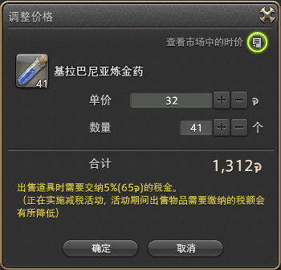

# 雇员系统

FF14的仓库及出售系统叫做**雇员**，它有一套完整的从仓储到销售的物品系统。

另外游戏还有**陆行鸟鞍囊**作为扩展背包，在副本以外的地方都可以随时打开，可以理解为随身携带的雇员。

## 雇佣雇员

;;;.guide .cols2
;;;.guide .col
<!--少张图，小地图吧-->
;;;

;;;.guide .col .grow

完成17级主线任务<quest name="加入拂晓" type="main" />之后，==塔塔露==为冒险者准备了雇员~~不得不吐槽在黄昏湾谁记得住回去雇人~~，雇员既是仓库，也交易员，同时也能够为玩家带来一些微薄的收入和些许意外之喜……

主线任务解锁雇员之后，回到主城市场，找到“雇员窗口”选择“想雇佣雇员”就可以了。

;;;
;;;

目前国服每名玩家可以拥有2名免费雇员，然后可以在官网[后勤补给站](http://act.ff.sdo.com/project/141028dgf/index.asp)购买额外雇员，一共可以购买6名额外雇员（加起来就是8名）。官方时不时会有雇员打折活动，可以看准时机再出手。

雇佣新雇员之后就可以捏脸了……对，创建雇员的流程跟建新号差不多，要起名选择职业然后捏脸（这是1.0~~真实的交易系统~~留下的遗产，目前而言如果你购买了房产，也可以让雇员站在你家院子里帮你卖东西（仅限1人）。雇员可选择的职业是所有战斗及采集职业（黑骑占星机工武士赤魔则需要雇员先达到50级才能转职）。

**由于雇员的等级不能高于玩家已有等级，所以请务必以你正在玩的职业/马上玩的职业为主，不满级的雇员什么都不如。**

## 仓储与销售

成功雇到雇员之后，就可以在**传唤铃**把雇员叫出来了（主城、金碟、魔都田园神拳才有传唤铃）。叫出来的雇员首先可以存取道具、金钱、水晶晶簇等等。雇员存储上限是175个/人，水晶碎晶钱跟玩家一样上限。

选择==出售(玩家所持物品)==就可以卖东西了。

;;;.guide .cols2
;;;.guide .col

;;;

;;;.guide .col .grow

卖东西的时候需要设定单价、出售个数，设定价格的时候可以点窗口右上角的按钮查看==当前市场上这件物品的价格==，在查价格的窗口右上角还有个一样的按钮，可以查看历史成交价及时间（由于只能查看最近20次成交记录，所以如果遇到扫货等情况会导致板子价格波动剧烈）。

;;;
;;;

另外出售的时候请注意，出售货物会收取5%的税金，这部分税金会直接从定价中扣除。而每个月会有一次主城减税活动，获得减税优待的城市销售只需支付3%的税金。
::: collapse 举个栗子
我在板子上以1000G的价格出售神眼六，成功售出后，我可以获得1000*(100%-5%) = 950G，如果是在减税活动的城市出售，那么就可以获得 1000*(100%-3%) = 970G
:::
因此部分商人会选择在板子上逃税销售价值比较高的东西。

出售列表一共有20个位置，可以随时改价或更换商品，是低价倾销整组道具，还是高价少量出售都是可行的销售策略。

另外销售所得会直接进入雇员的钱包，记得理财哦~

## 雇员大冒险
获得雇员之后就可以在任意主城接任务<quest name="雇员大探险" type="plus" />，完成任务之后就可以使用==探险币==派遣雇员出门冒险了。

虽然我们一开始为雇员设置了职业，但是雇员是没有初始主手的，需要在主城的==武器/工具商==购买==风化XX（对应1级职业）==武器/工具（尽量在职业行会所在主城购买，否则有可能买不到）。

而探险币可以通过蛮族日常奖励货币、狩猎点或军票交换获得（个人推荐军票，练级到最后军票很容易溢出，官方攻略本则推荐大型理符或者FATE获得军票）。

一开始只有筹集委托和探索委托2种，分别对应1h(或40、50min)和18h，委托时间结束之后，雇员就会带回来一些对应的道具并获得一些经验。雇员10级之后还会开放自由探索委托，更能够带回来一些珍稀道具(对！说的就是你！无暇白！)。
*筹集委托：筹集指定的素材，战斗雇员的皮还有采集雇员的限时采集品都比较受欢迎，其中若想采集雇员进行采集，要自己先采集过该物品才可以。具体可委托列表[请看这里](https://ff14.huijiwiki.com/wiki/%E9%9B%87%E5%91%98%E6%8E%A2%E9%99%A9/%E4%BB%BB%E5%8A%A1%E4%B8%80%E8%A7%88)。
*探索委托：18小时的探索，适合睡觉+上班/上学/约会的现充玩家，通常会带回来一些钱+某些道具(包括一些普通垃圾素材还有特殊道具)。
*自由探索委托：1小时的探索，适合长时间在线玩家为雇员练级，以及获取一些特殊道具。目前60以下练级本绿装都进入了自由探索获取套餐，可以说是撞脸的不二之选。

通常说到雇员选什么职业比较好的问题时，都以他能带回来什么作为评判标准，像正在练生产(制革)的玩家，有一个战斗雇员为他带粗皮和部分线就很划算。有满级高装等装备的玩家，也可以拼脸看雇员能不能带回稀有物品。
### 探索委托
等级较高的探索委托对雇员的等级及装等/获得力都有一定要求，满足要求之后才能够派遣对应等级的探索。较高等级的探索委托还有概率获得稀有道具。
::: collapse 探索委托可获得的稀有道具及概率 
表格太大
:::

### 自由探索委托
自由探索委托属于拼脸的委托，如果能获得珍惜的道具，同时获得的经验值也会变多。而光之雇员的大名其实也来源于此…

蛮神武器、蛮神材料、制作好的蛮神武器，开服时几百万一件的时装、装备，成本几百万一套的房屋外观，飞空艇才能带回来的限定材料，杂交N久才能出货的种子，甚至巴哈的乐谱等等，都有可能获得。

另外还有一些“设定上的”珍贵物品，当派遣雇员的时候提示==雇员的装备水平已经足够探索到珍贵物品了。==就表示满足下表中的指定要求，并能够探索到对应职业的珍贵物品，这里的珍惜道具及对应属性要求如下：
<!--表格-->
总而言之就是个剧毒的隐藏概率卡池，如果获得了珍贵物品，在收货的时候会同时提示===OOO探索到了珍贵物品XXX！===

## 彩蛋
在游戏里，野外，偶尔是能见到雇员的身影的，他们可能在努力垂钓，也有可能在奋力杀敌，还有可能在狼狱找工作人员换奖品，当然也有可能在哪随便找了条臭鱼烂虾准备回来交差。

当你在野外溜达的时候，也可以四处张望一下，看看能不能遇到我们的雇员呢。