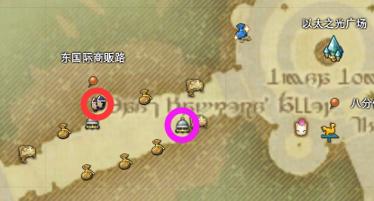

# 雇员系统

FF14的仓库及出售系统叫做**雇员**，它有一套完整的从仓储到销售的物品系统。

另外在获得专属陆行鸟后，还同时获得**陆行鸟鞍囊**作为扩展背包，在副本以外的地方都可以随时打开，可以理解为随身携带的雇员。

## 雇佣雇员

;;;.guide .cols2
;;;.guide .col

雇员窗口（红色）与传唤铃（紫色）位置
;;;

;;;.guide .col .grow

完成17级主线任务<quest name="拂晓血盟" type="main" />之后，==塔塔露==为冒险者准备了雇员~~不得不吐槽在黄昏湾谁记得住回去雇人~~，雇员既是仓库，也交易员，同时也能够为玩家带来一些微薄的收入和些许意外之喜……

主线任务解锁雇员之后，回到主城市场，找到“雇员窗口”（<pos name="利姆萨·罗敏萨下层甲板" :x="8.3" :y="11.5" />或<pos name="乌尔达哈来生回廊" :x="13.3" :y="9.7" />等等）选择“想雇佣雇员”就可以了。

;;;
;;;

目前国服每名玩家可以拥有2名免费雇员，也可以在官网[后勤补给站](https://actff1.web.sdo.com/project/141028dgf/index.html)购买额外雇员，一共可以购买7名额外雇员（加起来就是9名），另外在后勤补给站还可以购买神典石服务，可以额外获得一名雇员，和月租[鸟包](/basic/item.md)。官方时不时会有雇员打折活动，可以看准时机再出手。

雇佣新雇员之后就可以捏脸了……对，创建雇员的流程跟建新号差不多，要起名选择职业然后捏脸（这是1.0~~真实的交易系统~~留下的遗产，目前而言如果你购买了房产，也可以让雇员站在你家院子里帮你卖东西（仅限1人）。雇员也有<item name="雇员幻想药" />可以使用，很多玩家在使用幻想药给自己换形象之前，也会选择通过雇员幻想药进行试验。

::: collapse 雇员职业及转职需求
雇员初始可以选择的职业与玩家建号相同，均为基础职业。当雇员到达一定等级之后，就可以转职为特职或其他战斗职业。

| 目标职业 | 转职条件 |
| -- | -- |
| 基础职业所对应的特职 | 玩家自身该特职50级以上，雇员该基础职业30级以上 |
| 暗骑、机工、占星、武士、赤魔 | 玩家自身该特职50级以上，雇员任意战斗职业50级以上 |
| 绝枪、舞者 | 玩家自身该特职60级以上，雇员任意战斗职业60级以上 |
| 镰刀、贤者 | 玩家自身该特职70级以上，雇员任意战斗职业70级以上 |

在雇员窗口选择==想让雇员转为特职==，然后消耗40探险币获得<item name="特职心得" />，然后就可以在雇员菜单中==设置雇员职业==时，为雇员转职。

雇员转职为其他基础职业、采集职业时，等级会重置为1级；转职为本职的特职时，等级会继承；转职为没有基础职业的特职时，等级会重置为该特职的最低等级。
:::

**由于雇员的等级不能高于玩家已有等级，所以请务必以你正在玩的职业/马上玩的职业为主，不满级的雇员什么都不如。**

## 仓储与销售

成功雇到雇员之后，就可以在**传唤铃**把雇员叫出来了（主城区域才有传唤铃）。叫出来的雇员首先可以存取道具、金钱、水晶晶簇等等。雇员存储上限是175格/人，水晶碎晶钱跟玩家一样上限。

选择 ==出售(玩家所持物品)== 就可以卖东西了。

;;;.guide .cols2
;;;.guide .col

;;;

;;;.guide .col .grow

卖东西的时候需要设定单价、出售个数，设定价格的时候可以点窗口右上角的按钮查看==当前市场上这件物品的价格==，在查价格的窗口右上角还有个一样的按钮，可以查看历史成交价及时间（由于只能查看最近20次成交记录，所以如果遇到扫货等情况会导致板子价格波动剧烈）。

;;;
;;;

另外出售的时候请注意，出售货物会收取5%的税金，这部分税金会直接从定价中扣除。而每个月会有一次主城减税活动，获得减税优待的城市销售只需支付3%的税金，因此部分商人会选择在板子上逃税销售价值比较高的东西。
::: collapse 举个栗子
我在板子上以1000<i class="xiv gil"></i>的价格出售神眼六，成功售出后，我可以获得1000*(100%-5%) = 950<i class="xiv gil"></i>，如果是在减税活动的城市出售，那么就可以获得 1000*(100%-3%) = 970<i class="xiv gil"></i>
:::

每名雇员的出售列表一共有20个位置，可以随时改价或更换商品，是低价倾销整组道具，还是高价少量出售都是可行的销售策略。

另外销售所得会直接进入雇员的钱包，记得理财哦~

## 雇员大冒险
获得雇员之后就可以在任意主城接任务<quest name="雇员大探险" type="plus" search/>，完成任务之后就可以使用==探险币==派遣雇员出门冒险了。

虽然我们一开始为雇员设置了职业，但是雇员是没有初始主手的，需要在主城的 ==武器/工具商== 购买 ==风化XX（对应1级职业）== 武器/工具（尽量在职业行会所在主城购买，否则有可能买不到）。

而探险币可以通过蛮族日常奖励货币、狩猎点或军票交换获得。

一开始只有筹集委托和探索委托2种，分别对应1h（或40、50min）和18h，委托时间结束之后，雇员就会带回来一些对应的道具并获得一些经验。雇员10级之后还会开放自由探索委托，更能够带回来一些珍稀道具。

* **筹集委托**：筹集指定的素材，战斗雇员的皮还有采集雇员的限时采集品都比较受欢迎，其中若想采集雇员进行采集，要自己先采集过该物品才可以。具体可委托列表[请看这里](https://ff14.huijiwiki.com/wiki/%E9%9B%87%E5%91%98%E6%8E%A2%E9%99%A9/%E4%BB%BB%E5%8A%A1%E4%B8%80%E8%A7%88)。
* **探索委托**：18小时的探索，适合睡觉+上班/上学/约会的现充玩家，通常会带回来一些钱+某些道具（包括一些普通素材、稀有宠物等等）。等级较高的探索委托对雇员的等级及装等/获得力都有一定要求，满足要求之后才能够派遣对应等级的探索。
* **自由探索委托**：1小时的探索，适合长时间在线玩家为雇员练级，以及获取一些特殊道具。目前80以下练级本绿装都进入了自由探索获取套餐，可以说是撞脸的不二之选。

通常说到雇员选什么职业比较好的问题时，都以他能带回来什么作为评判标准，像正在练生产（制革）的玩家，有一个战斗雇员为他带粗皮和部分线就很划算。有满级高装等装备的玩家，也可以拼脸看雇员能不能带回稀有物品。

### 自由探索委托
自由探索委托属于拼脸的委托，运气好的话可以获得相当昂贵的道具，而光之雇员的大名其实也来源于此…

蛮神武器、蛮神材料、制作好的蛮神武器，开服时几百万一件的时装、装备，成本几百万一套的房屋外观，飞空艇才能带回来的限定材料，杂交N久才能出货的种子，甚至巴哈的乐谱等等，都有可能获得。

雇员装等级到上限后，在自由探索有概率获得<item name="雇员的宝箱" />，雇员的宝箱会有包括<item name="无瑕白染剂" />、<item name="煤玉黑染剂" />等染剂或<item name="雇员幻想药" />。

另外雇员装等满足一定条件时，会有可能获得HQ装备，更好的绿装，或者是获得的物品数量增加，此时会提示“==自由探索委托完成时获得了特别收获！==”。

## 彩蛋
在游戏里，野外，偶尔是能见到雇员的身影的，他们可能在努力垂钓，也有可能在奋力杀敌，还有可能在狼狱找工作人员换奖品，当然也有可能在哪随便找了条臭鱼烂虾准备回来交差。

当你在野外溜达的时候，也可以四处张望一下，看看能不能遇到我们的雇员呢。
