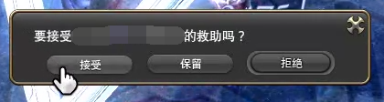

# 战斗机制
<FloatTOC />

本节内容是[战斗基础](/basic/battle.md)的补充内容，推荐先阅读并理解战斗基础后，再来阅读本节内容。

## GCD 

;;;.guide .cols2
;;;.guide .col

GCD技能和能力技示意  ~~非正确循环，按键顺序请勿参考~~
;;;

;;;.guide .col .grow

如图，当按下左边中间的技能时，其他技能依旧可用。而按下左下角的技能时，它右边的两排技能都一起进入冷却动画，无法使用。但左边中间和最上面一排的技能，却可以不受影响随时使用（它们也有各自的冷却时间）。

因此下方的5个会一起冷却的技能就是GCD（Global cooldown）技能，在技能描述的分类中通常是“战技”或“魔法”，而左边中间和上排的技能则是oGCD技，在技能描述中的分类是“能力”。玩家会以==GCD技能==和==能力技==来称呼这两类技能。

由于FF14的GCD时间非常长（没有任何加速时是2.5秒），因此永远让你的GCD技能在冷却中（也就是俗称的不浪费GCD），是从入门到毕业都要面对的难题。

;;;
;;;

;;;.guide .cols3
;;;.guide .col .figcap

GCD介绍
;;;
;;;.guide .col .figcap

常见GCD问题
;;;
;;;.guide .col .figcap

GCD注意事项 图片概念来自[the Balance Discord](https://discord.gg/thebalanceffxiv)
;;;
;;;

FF14的技能体系，就是通过GCD技能构建基础循环，然后插入各种能力技，提升总体伤害。

::: segment blue
### 技能队列

在GCD还有0.5s结束的时间内，按下的技能会进入被称为为“技能队列”的缓存区，当GCD结束的瞬间就可以立刻施放技能队列中的技能，以确保技能GCD衔接流畅顺滑。

因此在实际操作时，要比GCD结束时间点稍早按下下一个技能（可以通过连续按键确保技能在技能队列里，也可以通过练习找到让技能进入队列的时间点）。

部分共通技能（冲刺）、使用道具以及所有的宏都无法进入技能队列，因此其施放时间点会略微晚于一般技能，更容易造成卡GCD的情况。

:::

### 身位与连击

;;;.guide .cols3
;;;.guide .col

在背侧交界处（红圈位置）输出， 就可以很轻松地在不同身位之间切换。
;;;

;;;.guide .col .grow

选中怪物的时候，怪物脚下会出现一个“目标圈”，目标圈展示了怪物当前的**面向**：有一个突出的粗箭头的方向为正面，有线框小箭头的为侧面，没有圈的地方为背面。

近战职业的攻击会有身位要求，在指定身位下才能打出更高的伤害，不过在野外自己做任务的话就比较随缘了（因为怪会跟着你转），记住自己技能的身位是很重要的。

;;;
;;;.guide .col

有一些怪的圈是完整的，这种怪没有身位， 在它的任意方向都可以触发正确的身位效果。
;;;
;;;

;;;.guide .cols2
;;;.guide .col

可以触发的连击技能 会有高亮边框显示
;;;

;;;.guide .col .grow

同时还有一些技能有连击要求，如果按照正确的连击顺序使用技能，就能够对敌人造成更高的伤害，或者获得特殊的buff。当我们说到XX连击时，指的是以XX技能结束的一套技能组合，而非单指XX技能。

;;;
;;;

::: collapse 技能描述中的身位与连击

;;;.guide .cols2
;;;.guide .col

;;;

;;;.guide .col .grow

比如樱花怒放这个技能，平时威力是100，但是从背面攻击时威力就是140。

同时它还和精准刺、开膛枪形成连击，如果按照精准刺、开膛枪、樱花怒放的顺序使用技能，那么樱花怒放连击成功的威力是220。

而如果是从背面攻击且成功连击，那么威力则上升到260（这和一开始的100威力有着天壤之别）。

;;;
;;;
:::

技能的身位以++释放技能时的位置++为准，你技能按出去的动画、boss的移动都不会影响位置的判定。

##  DOT

DOT全称随时间伤害（Damage over time），比如上面樱花怒放中，若连击成功，则追加“持续伤害”，这就是一个DOT。

所有职业的DOT都是3s造成1次伤害，比如上图中樱花怒放的DOT，持续伤害威力40，持续时间24s，因此最多能造成(24/3=)8次伤害，一共是(40*8=)320威力。如果BOSS身上有易伤、或玩家带有增强buff，那么DOT每一跳的实际伤害，都以DOT生效/刷新时的那一次状态为准，这被称作++快照机制++。

::: collapse 快照机制举例

龙骑士在**猛枪**buff还剩5s的时候，打出了樱花怒放的dot，那么5s后，虽然**猛枪**buff时间结束，但是那个樱花怒放余下25s里的dot每一跳的伤害，仍旧按照带有**猛枪**buff的威力进行计算。直到这个樱花怒放的持续时间结束，或者玩家再次使用樱花怒放。

:::

所有职业的DOT技能威力总和都是非常高的，应该尽可能保持DOT全程存在，在DOT剩余时间较低或有增益buff的时候刷新它。只有一种情况可以放弃续DOT：DOT在目标身上的存续时间过短，其所能造成的伤害总和不如其他单发技能时。

## 延迟

FF14所有的技能都是**服务器判定**，你看到的伤害、读条，都比实际判定时机略晚一些，因此如果你是在技能提示框消失前的最后一刻出圈，那么你就已经中技能了。

读条类职业读80%左右，就已经判定这个技能咏唱完成了（因此读条职业有滑步的技巧）。这个延迟大概是在0.3~0.5s左右（根据网络情况有所波动），如果你总是莫名中技能，请保证提前躲闪，或者升级电脑、网络设备。

目前游戏中只有忍者结印和占星抽卡采用本地化操作。另外反过来说，FF14也有踩动画回位的做法，即当范围提示圈消失之后，与BOSS的技能动画放出的同时回到自己的位置上。

各个战斗职业在各个阶段的输出思路和循环，请参见[职业专题](/before/job.md)。常见用语可查询[用语词典](/advanced/glossary.md)

> 一些[让战斗变得更方便的设置](/ui/battle.md)

## 其他

### 打断

部分敌人咏唱的技能有特殊效果，目标咏唱条有这样的特效时，可以使用打断技能打断。打断技能有：<role name="tank" /><action name="插言" />、<role name="ranged" /><action name="伤头" />。

部分技能带有眩晕特效（比如<action name="下踢" />、<action name="盾牌猛击" />、<action name="神圣" />、<action name="扫腿" />等等…），眩晕可以打断部分怪物的咏唱技能。但是眩晕效果有衰减，在1分钟之内，第一次使用眩晕技能，眩晕时长是100%，第二次为50%（时长覆盖），第三次是25%，第四次开始会产生抗性，无法再眩晕（从最后一次使用眩晕技能开始1分钟后，抗性消失）。对于眩晕时长较长的技能（<action name="盾牌猛击" />、<action name="神圣" />）来说，适当延后第二次眩晕的时机，可以让怪被晕的更久一点。

### 生还
;;;.guide .cols2
;;;.guide .col

;;;

;;;.guide .col .grow

当玩家在战斗中因HP归零而陷入无法战斗的状态时，可以由其他玩家<Status :id="148" name="复活" />，此时无法战斗的玩家会收到一个弹窗。

选择==接受==会立刻瞬移到最后一个复活你的玩家当时的位置，并获得5s<Status :id="418" name="生还" />buff。从接受复活到<Status :id="418" name="生还" />buff消失的时间里，玩家处于无敌状态（但会受到击退等附加效果），部分机制不会触发，使用任何技能（包括冲刺等共通技能）都会取消生还buff。[🤣](https://www.bilibili.com/video/BV1PV411t7PD/?share_source=copy_web&vd_source=a27684e75b64dfdbfe344bd9edf85d7c)

;;;
;;;

选择==保留==会暂时收起弹窗（可随时在屏幕右下角处打开，最长可保留60s），长按==拒绝==会直接取消复活buff。

在正确的时机复活可以利用<Status :id="418" name="生还" />buff的无敌时间规避致命伤害，而复活时机不当则会让你再次回归大地，判断时机是比较困难的，需要对副本有更多的理解。若暂时无法判断时机是否合适，可以先==接受==复活，如果起来后发现BOSS正在读条，那么先观察场上形势不要乱动，等BOSS读条结束或血量安全后再继续投入战斗。

### 技能属性分类

FF14的所有技能都可以分为物理和魔法两大类，虽然部分技能会标注“属性”，但是这些属性并无实际意义（只有[青魔法师](/job/bluemage.md)的技能在假面狂欢中有对应的强弱克制关系）。

有部分技能只能对特定伤害起效（从6.3版本开始显示伤害的类型，目前暂无直接的查询手段）
* 和物理伤害有关的技能：<action name="复仇" />、<action name="亲疏自行" />、<action name="伪装" />
* 和魔法伤害有关的技能：<action name="弃明投暗" />、<action name="暗黑布道" />、<action name="光之心" />、<action name="异想的幻光" />、<action name="抗死" />
* 依技能类型效果有所不同的技能：<action name="牵制" />、<action name="昏乱" />
