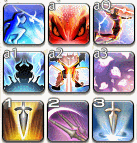
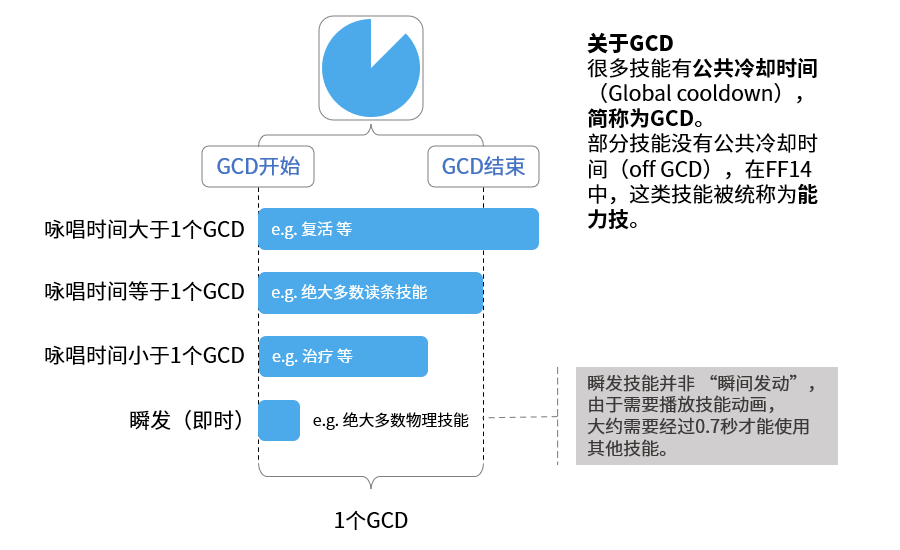
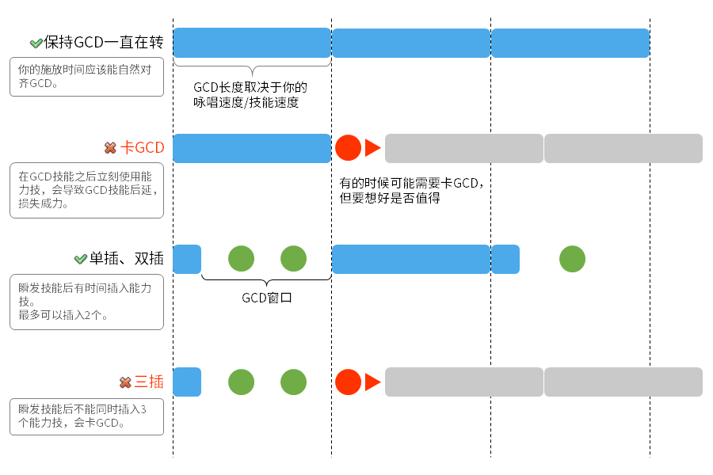
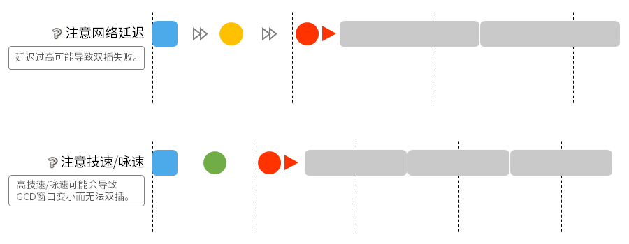
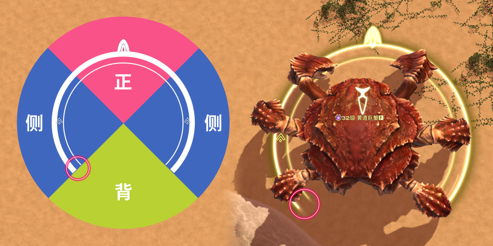
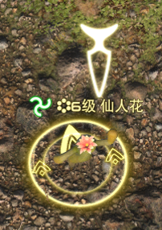

# 战斗机制

## GCD 

;;;.guide .cols2
;;;.guide .col

GCD技能和能力技示意  ~~非正确循环，按键顺序请勿参考~~
;;;

;;;.guide .col .grow

如图，当按下左边中间的技能时，其他技能依旧可用。而按下左下角的技能时，它右边的两排技能都一起进入冷却动画，无法使用。但左边中间和最上面一排的技能，却可以不受影响随时使用（它们也有各自的冷却时间）。

因此下方的5个会一起冷却的技能就是GCD（Global cooldown）技能，在技能描述的分类中通常是“战技”或“魔法”，而左边中间和上排的技能则是oGCD技，在技能描述中的分类是“能力”。玩家会以==GCD技能==和==能力技==来称呼这两类技能。

由于FF14的GCD时间非常长（没有任何加速时是2.5秒），因此永远让你的GCD技能在冷却中（也就是俗称的不浪费GCD），是从入门到毕业都要面对的难题。

;;;
;;;

;;;.guide .cols3
;;;.guide .col .figcap

GCD介绍
;;;
;;;.guide .col .figcap

常见GCD问题
;;;
;;;.guide .col .figcap

GCD注意事项 图片概念来自[the Balance Discord](https://discord.gg/thebalanceffxiv)
;;;
;;;

FF14的技能体系，就是通过GCD技能构建基础循环，然后插入各种能力技，提升总体伤害。

### 身位与连击

;;;.guide .cols3
;;;.guide .col

在背侧交界处（红圈位置）输出， 就可以很轻松地在不同身位之间切换。
;;;

;;;.guide .col .grow

选中怪物的时候，怪物脚下会出现一个“目标圈”，目标圈展示了怪物当前的**面向**：有一个突出的粗箭头的方向为正面，有线框小箭头的为侧面，没有圈的地方为背面。

近战职业的攻击会有身位要求，在指定身位下才能打出更高的伤害，不过在野外自己做任务的话就比较随缘了（因为怪会跟着你转），记住自己技能的身位是很重要的。

;;;
;;;.guide .col

有一些怪的圈是完整的，这种怪没有身位， 在它的任意方向都可以触发正确的身位效果。
;;;
;;;

同时还有一些技能有连击要求，如果按照正确的连击顺序使用技能，就能够对敌人造成更高的伤害，或者获得特殊的buff。当我们说到XX连击时，指的是以XX技能结束的一套技能组合，而非单指XX技能。

::: segment blue

;;;.guide .cols2
;;;.guide .col

;;;

;;;.guide .col .grow

比如樱花怒放这个技能，平时威力是100，但是从背面攻击时威力就是140。

同时它还和精准刺、开膛枪形成连击，如果按照精准刺、开膛枪、樱花怒放的顺序使用技能，那么樱花怒放连击成功的威力是220，而如果是从背面攻击且成功连击，那么威力则上升到260（这和一开始的100威力有着天壤之别）。

所有的近战（包括T）都有技能连击系统，按下技能后，能够与它形成连击的技能会自动高亮（边缘发光）。注意仔细阅读技能说明或职业攻略，安排好技能，打出更高的伤害吧！

;;;
;;;
:::

技能的身位以++释放技能时的位置++为准，你技能按出去的动画、boss的移动都不会影响位置的判定。

##  DOT

DOT全称随时间伤害（Damage over time），比如上面樱花怒放中，若连击成功，则追加“持续伤害”，这就是一个DOT。

所有职业的DOT都是3s造成1次伤害，比如上图中樱花怒放的DOT，持续伤害威力40，持续时间24s，因此最多能造成(24/3=)8次伤害，一共是(40*8=)320威力。如果BOSS身上有易伤、或玩家带有增强buff，那么DOT每一跳的实际伤害，都以DOT生效/刷新时的那一次状态为准，这被称作++快照机制++。

::: collapse 快照机制举例

龙骑士在**猛枪**buff还剩5s的时候，打出了樱花怒放的dot，那么5s后，虽然**猛枪**buff时间结束，但是那个樱花怒放余下25s里的dot每一跳的伤害，仍旧按照带有**猛枪**buff的威力进行计算。直到这个樱花怒放的持续时间结束，或者玩家再次使用樱花怒放。

:::

所有职业的DOT技能威力都是非常高的，应该尽可能保持（除非小怪很快就死了，DOT无法造成足量伤害）。

## 延迟

FF14所有的技能都是**服务器判定**，你看到的伤害、读条，都比实际判定时机略晚一些，因此如果你是在技能提示框消失前的最后一刻出圈，那么你就已经中技能了。

读条类职业读80%左右，就已经判定这个技能咏唱完成了（因此读条职业有滑步的技巧）。这个延迟大概是在0.3~0.5s左右（根据网络情况有所波动），如果你总是莫名中技能，请保证提前躲闪，或者升级电脑、网络设备。

目前游戏中只有忍者结印和占星抽卡采用本地化操作。另外反过来说，FF14也有踩动画回位的做法，即当范围提示圈消失之后，与BOSS的技能动画放出的同时回到自己的位置上。

各个战斗职业在各个阶段的输出思路和循环，请参见[职业专题](/before/job.md)。常见用语可查询[用语词典](/advanced/glossary.md)

[让战斗变得更方便的设置](/ui/battle.md)。

## 极限技（LB）

;;;.guide .cols2
;;;.guide .col

;;;

;;;.guide .col .grow

<Action :id="4242" name="极限技" />（Limit Break），俗称LB，在技能-共通技能中，是只有组成小队才能使用的特殊技能。默认极限技能量槽是1~3格（根据小队人数和副本难度变化），默认情况下，会出现在屏幕左上角，小队列表上方。不同的职能使用极限技会有不同的效果：

* T极限技：全队减伤20%(一段)、40%(二段)、80%(三段)
* 近战极限技：近战范围单体目标大伤害。
* 法系极限技：指定目标范围AOE伤害。
* 物远极限技：以指定目标为方向的直线范围AOE伤害。
* 治疗极限技：恢复全队25%(一段)、60%(二段)、100%(三段)体力和魔力。奶3段LB同时附带有复活全队的功能。

极限技的能量槽是全队共享的，因此通常副本都是由近战在最后使用LB砸BOSS，部分4人本也可以由远程放LB清小怪（物远的直线AOE，瞄准是个技术活），少部分副本（通常是8人高难度Raid）中会需要T放3格LB给全队做减伤。治疗LB通常用于团队死亡人数过多时救场。如果在副本里有人打字叫你[“LB”](https://www.weibo.com/5176404806/I0kQdaj1i)，那可不是说你lowB的意思哦。

另外极限技的特效非常华丽，可以看[这个视频](https://www.bilibili.com/video/av17998143/)了解。

;;;
;;;

PVP中有专门分类为“极限技”的个人专属大招，使用方法请参见[PVP介绍](/topic/pvp.md)。

## 技能属性分类

FF14的所有技能都可以分为物理和魔法两大类，虽然部分技能会标注“属性”，但是这些属性并无实际意义（只有[青魔法师](/job/bluemage.md)的技能在假面狂欢中有对应的强弱克制关系）。目前没有比较直观的方式查看敌人技能的属性，需要通过其他工具或者亲自尝试。

部分敌人咏唱的技能有特殊效果，目标咏唱条有这样的特效时，可以使用打断技能打断。

部分技能带有眩晕特效（比如<action name="下踢" />、<action name="盾牌猛击" />、<action name="神圣" />、<action name="扫腿" />等等…），眩晕可以打断部分怪物的咏唱技能。但是眩晕效果有衰减，在1分钟之内，第一次使用眩晕技能，眩晕时长是100%，第二次为50%（时长覆盖），第三次是25%，第四次开始会产生抗性，无法再眩晕（从最后一次使用眩晕技能开始1分钟后，抗性消失）。对于眩晕时长较长的技能（<action name="盾牌猛击" />、<action name="神圣" />）来说，适当延后第二次眩晕的时机，可以让怪被晕的更久一点。