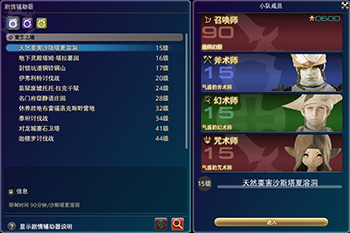

# 战斗基础

冒险者的主要任务，就是与黑恶势力作斗争，因此掌握正确的战斗技巧能够大幅提升你的游戏体验。

## 战斗基础

### 连击与循环

;;;.guide .cols2
;;;.guide .col

;;;

;;;.guide .col .grow

FF14不同的职业有不同的战斗方式，比如近战需要按特定顺序按下某些技能，这被称为“连击”，比如左图中3个技能从左到右构成一套连击。当按下顺序中的第一个技能时，第二个技能边缘会发亮，此时使用第二个技能，会获得更高的技能威力，或者会触发其他效果。

;;;
;;;

魔法类职业虽然没有这样的连击系统，但是也各自拥有自己的安排技能先后顺序的方式，这些技能的使用顺序就被称为“技能循环”。你可以查看自己的技能说明（默认快捷键`P`）来尝试理解、构建循环，也可以查看[本站职业指南](/job/)了解自己职业的循环基础。

FF14的战斗节奏和其他游戏有很大不同，在早期，几乎所有技能都有2.5s GCD，很多人会因此觉得乏味、无趣。但等到满级之后，每个职业都是手忙脚乱的。更多[关于GCD的介绍](/basic/battle-mech.md)。

::: collapse 为什么2.5s还能手忙脚乱

;;;.guide .cols2
;;;.guide .col

;;;

;;;.guide .col .grow

FF14的技能分为“战技/魔法”和“能力技”两种，战技/魔法使用2.5s GCD，而能力技则是瞬发技能（但是有不同的CD时间），FF14职业的技能循环，基本上以战技/魔法中间插入能力技构成。

图片是FF14玩家之间流传极广的搞笑图（技能是示意，并非正确循环），展现刚满级新人面对满级循环时的心情，可谓十分真实了。

;;;
;;;

:::

### 仇恨

当玩家攻击怪、或使用仇恨类技能时，怪物会对技能使用者产生仇恨，“仇恨”就是敌人挨打之后的“生气指数”。怪会攻击它仇恨最高的玩家，游戏中有以下2种方式查看怪对自己的仇恨：

 

在野外，自己打怪时，一般都会持有所有怪的仇恨（敌对列表都是红色圆圈）。而在副本中，应该是<Role name="tank" />T玩家持有仇恨，如果其他玩家被怪攻击了，则被称为OT，OT是非常不好的，应该尽量避免。

FF14的T需要对仇恨有更多理解，可参看[防护职业攻略](https://bbs.nga.cn/read.php?tid=12512061)理解。

::: segment orange
关于“仇恨”  小队列表和敌对列表会在战斗中显示“仇恨”的状况。在小队列表中，仇恨越高的人，名字前面的数字越小，写有[引战]的成员则是承受敌人攻击的人。    **“仇恨”是如何累加的？**  一般都是由<Role name="tank" />坦克负责吸引仇恨，但是攻击和治疗都会使仇恨上升，所以进攻职业和治疗职业也有可能成为被攻击的目标。发生这种情况的话，就需要坦克抢回仇恨。    **要如何处理呢？**   <Role name="tank" />**坦克：**  使用能够增加仇恨的技能，吸引仇恨吧。   <Role name="dps" />**DPS（进攻职业）：**  使用可以降低仇恨的技能，和坦克攻击同一个目标。坦克获得仇恨之后，再全力攻击敌人吧。   <Role name="healer" />**治疗：**  如果有可以降低仇恨的技能，就使用它，在条件允许的范围内调整治疗策略，帮助坦克获得仇恨吧。     如此一来，坦克集中了所有的仇恨，DPS专心进攻，治疗也可以安心治疗，坦克就能够切实地接受到治疗的爱。   随着等级的提升，管理仇恨也会成为重中之重，一点点习惯它吧！

:::

### 极限技（LB）

;;;.guide .cols2
;;;.guide .col

;;;

;;;.guide .col .grow

Limit Break<Action :id="4242" name="极限技" />，俗称LB，可以在技能菜单`P` > 共通技能中找到它，是只有组成小队才能使用的特殊技能。默认极限技能量槽是1~3格（根据小队人数和副本难度变化），默认情况下，会出现在屏幕左上角，小队列表上方。不同的职能使用极限技会有不同的效果：

* <role name="tank" />T极限技：全队减伤20%(一段)、40%(二段)、80%(三段)
* <role name="melee" />近战极限技：近战范围单体目标大伤害。
* <role name="magic" />法系极限技：指定目标范围AOE伤害。
* <role name="ranged" />物远极限技：以指定目标为方向的直线范围AOE伤害。
* <role name="healer" />治疗极限技：恢复全队25%(一段)、60%(二段)、100%(三段)体力和魔力。奶3段LB同时附带有复活全队的功能。

极限技的能量槽是全队共享的，因此通常副本都是由近战在最后使用LB砸BOSS，部分4人本也可以由远程放LB清小怪（物远的直线AOE，瞄准是个技术活），少部分副本（通常是8人高难度Raid）中会需要T放3格LB给全队做减伤。治疗LB通常用于团队死亡人数过多时救场。如果在副本里有人打字叫你[“LB”](https://www.weibo.com/5176404806/I0kQdaj1i)，那可不是说你lowB的意思哦。

另外极限技的特效非常华丽，可以看[这个视频](https://www.bilibili.com/video/av17998143/)了解。

;;;
;;;

PVP中有专门分类为“极限技”的个人专属大招，使用方法请参见[PVP介绍](/topic/pvp.md)。

> * [了解自己职业的基础循环](/job/)
> * [了解更多关于GCD的内容](/basic/battle-mech.md)
> * [FF14木桩位置一览](/basic/dummy.md)

在战斗中，玩家除了需要输出，还需要躲避/处理各种机制。由于FF14的战斗采用服务器结算，因此很多在其他游戏中的“骚操作”是无法在FF14中复现的。当你看到地面上有橙黄色的范围提示时，务必尽快走出提示圈，如果你等怪物读条到最后1s才走，很有可能仍然会吃到技能伤害。

当然FF14也有很多自己独有的“骚操作”，这一点可以随着游戏的深入自己体会。

> * [了解更多战斗机制的细节](/basic/battle-mech.md)
> * [副本攻略了解副本机制](/duty/)

## 副本迷宫

虽然这个游戏在满级前更像一个大型单机游戏，但是在某些时间点仍旧需要玩家突破副本迷宫。虽然叫迷宫，但是FF14作为一个网络游戏，副本中“迷”的成分已经非常少了，只要按顺序突破副本中的若干BOSS即可挑战成功。然而BOSS本身可能会出现各种各样的机制，需要正确处理才能确保安全。

副本需要若干名玩家共同探索挑战，一般的副本迷宫需要4名玩家，其中需要1名<Role name="tank" />坦克（T）+1名<Role name="healer" />治疗（H/N）+2名<Role name="dps" />（DPS）。在菜单 > 任务情报 > 任务搜索器（默认快捷键`U`）可以打开任务搜索器，勾选自己想要参加的副本并点击下方的==参加==，就可以由系统自动匹配其他玩家。

;;;.guide .cols2
;;;.guide .col

;;;

;;;.guide .col .grow

在部分副本中，游戏还提供了剧情辅助器系统。使用剧情辅助器，可以以单人的形式参与副本迷宫挑战，其余的职能将有电脑控制的NPC填补。

在==菜单 > 任务情报 > 剧情辅助器==中可以打开剧情辅助器菜单。在剧情辅助器中，不同的副本可以选择不同的NPC参战。**和NPC共同挑战副本时，通关所获得的奖励会少于与其他玩家通关副本时获得的奖励。**

;;;
;;;

> 副本是需要4人合作完成的，积极沟通保持交流，可以让你玩得更轻松。
> * [副本相关介绍](/basic/dungeon.md)：游戏为挑战副本的玩家提供了非常多功能，推荐阅读了解。
> * [副本攻略](/duty/)：预习副本攻略是礼貌的体现，本站攻略尽可能做到简洁无剧透，可放心阅读。