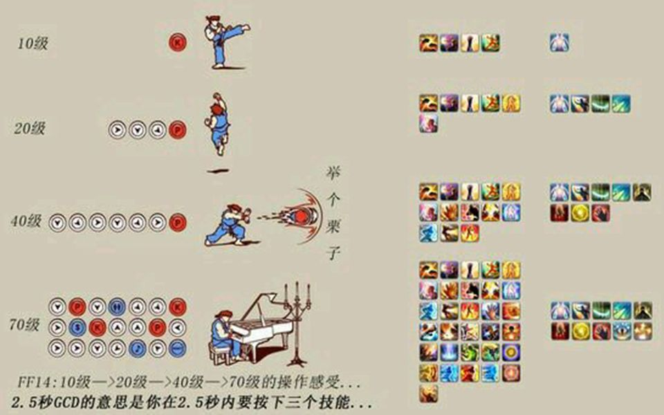
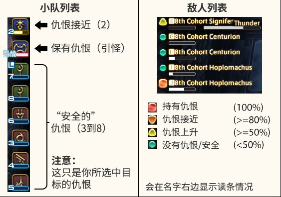
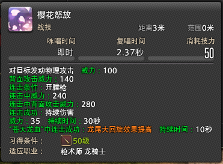
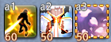
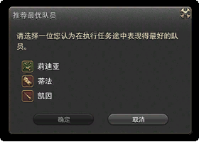
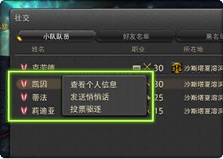
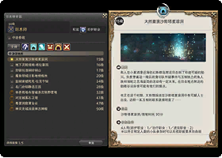
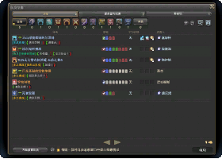
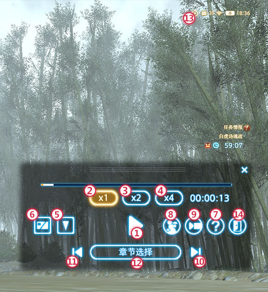

# 战斗基础与副本

FF14的战斗节奏和其他游戏有很大不同，在早期，所有技能都有2.5s GCD，很多人会因此觉得乏味、无趣。但等到满级之后，每个职业都是手忙脚乱的。

::: collapse 为什么2.5s还能手忙脚乱

;;;.guide .cols2
;;;.guide .col

;;;

;;;.guide .col .grow

FF14的技能分为“战技/魔法”和“能力技”两种，战技/魔法使用2.5s GCD，而能力技则是瞬发技能（但是有不同的CD时间），FF14职业的技能循环，基本上以战技/魔法中间插入能力技构成。

图片是FF14玩家之间流传极广的搞笑图（输出循环当然并不对），展现刚满级新人面对满级循环时的心情，可谓十分真实了。

;;;
;;;

:::

另外FF14所有的技能都是**服务器判定**，如果你是在技能提示框消失前的最后一刻出圈，那么你就已经中技能了。

读条类职业读80%左右，就已经判定这个技能咏唱完成了（因此读条职业有滑步的技巧）。这个延迟大概是在0.3~0.5s左右，如果你总是莫名中技能，请保证提前躲闪，或者升级电脑、网络设备。

目前游戏中只有忍者结印和占星抽卡采用本地化操作。另外反过来说，FF14也有踩动画回位的做法，即当范围提示圈消失之后，与BOSS的技能动画放出的同时回到自己的位置上。

各个战斗职业在各个阶段的输出思路和循环，请参见[职业专题](/before/job.md)。常见用语可查询[用语词典](/advanced/glossary.md)

## 仇恨

当玩家攻击怪、或使用仇恨类技能时，怪物会对技能使用者产生仇恨，怪会攻击它仇恨最高的玩家，游戏中有以下2种方式查看怪对自己的仇恨：

 

在野外，自己打怪时，一般都会持有所有怪的仇恨（敌对列表都是红色圆圈）。而在副本中，应该是T玩家持有仇恨，如果其他玩家被怪攻击了，则被称为OT，OT是非常不好的，应该尽量避免。

FF14的T需要对仇恨有更多理解，可参看[防护职业攻略](https://bbs.nga.cn/read.php?tid=12512061)理解。

## 身位与连击

近战职业的攻击会有身位要求，在指定身位下才能打出更高的伤害，不过在野外自己做任务的话就比较随缘了（因为怪会跟着你转），注意仔细阅读技能说明或职业攻略，记住自己技能的身位是很重要的。
同时还有一些技能有连击要求，注意观察阅读。

::: segment blue

;;;.guide .cols2
;;;.guide .col

;;;

;;;.guide .col .grow

比如樱花怒放这个技能，平时威力是100，但是从背面攻击时威力就是140。

同时它还和脉冲枪、开膛枪形成连击，如果按照脉冲枪、开膛枪、樱花怒放的顺序使用技能，那么樱花怒放连击成功的威力是240，而如果是从背面攻击且成功连击，那么威力则上升到280（这和一开始的100威力有着天壤之别）。

所有的近战（包括T）都有技能连击系统，按下技能后，能够与它形成连击的技能会自动高亮（边缘发光）。仔细安排技能，打出更高的伤害吧！

;;;
;;;
:::

##  DOT

DOT全称随时间伤害（Damage over time），比如上面樱花怒放中，若连击成功，则追加“持续伤害”，这就是一个DOT。所有职业的DOT都是3s造成1次伤害，比如上图中的DOT，持续伤害威力35，持续时间30s，因此最多能造成(30/3=)10次伤害，一共是(35*10=)350威力。

所有职业的DOT技能威力都是非常高的，应该尽可能保持（除非小怪很快就死了，DOT无法造成足量伤害）。

## 极限技（LB）

极限技（Limit Break），俗称LB，在技能-共通技能中，是只有组成小队才能使用的特殊技能。默认极限技能量槽是1~3格（根据小队人数和副本难度变化），默认情况下，会出现在屏幕左上角，小队列表上方。不同的职能使用极限技会有不同的效果：

* T极限技：全队减伤20%(一段)、40%(二段)、90%(三段)
* 近战极限技：近战范围单体目标大伤害。
* 法系极限技：指定目标范围AOE伤害。
* 物远极限技：以指定目标为方向的直线范围AOE伤害。
* 治疗极限技：恢复全队25%(一段)、60%(二段)、100%(三段)体力和魔力。奶3段LB同时附带有复活全队的功能。

极限技的能量槽是全队共享的，因此通常副本都是由近战在最后使用LB砸BOSS，部分4人本也可以由远程放LB清小怪（物远的直线AOE，瞄准是个技术活），少部分副本（通常是8人高难度Raid）中会需要T放3格LB给全队做减伤。治疗LB通常用于团队死亡人数过多时救场。如果在副本里有人打字叫你[“LB”](https://www.weibo.com/5176404806/I0kQdaj1i)，那可不是说你lowB的意思哦。

另外极限技的特效非常华丽，可以看[这个视频](https://www.bilibili.com/video/av17998143/)了解。

（PVP中也有类似极限技的技能，不过那个是个人独享的，只有一格，叫奋战技，不要搞混了）

## 关于副本

虽然这个游戏满级前接近单机游戏，但它仍然有打本的要求（类似单机游戏的打迷宫）。在菜单-任务情报-任务搜索器（默认快捷键`U`）可以打开任务搜索器，选择对应分类就能找到需要的副本了。

### 副本交流

在副本中，你会与同副本的玩家组成一个小队，聊天频道会为这个小队形成专用的小队频道，在这个频道里的聊天内容，其他人不会看到。在聊天框里输入`/p`，或者点击输入框前面的小气泡，并选择“小队”，就可以在小队里发言了。

默认小队频道的聊天颜色是亮蓝色，如果看到聊天窗口中有亮蓝色的文字，那就是队友在说话了。如果发现队友在跟你说话，你又顾不过来打字，可以在不需要打怪的间隙先打个`==`（等于号，意思是等等），然后停下来慢慢打字。（要注意自己的发言频道，如果不是小队频道，那队友是看不到你说话的）

FF14的副本机制较为复杂， 不乏有机制杀的现象。如果是初次进本不熟悉攻略，不妨刚进本就在小队频道打字说一句“初见，请多关照”，心地善良的老司机通常会愿意一句话讲解。交流是团队合作非常重要的一部分，只要好好交流，很多问题都可以迎刃而解。

#### 遇到很好的队友

;;;.guide .cols2
;;;.guide .col
 
;;;

;;;.guide .col .grow

在打完副本的最后一个BOSS之后，屏幕右下角的通知区域会弹出**最优队员推荐**的提示，点击提示，就可以打开推荐最优队员的窗口。

虽说叫“最优队员”，其实无论是努力的队员，还是有趣的队员，又或者是友善的队员，都可以为他点赞。

怀着友好愉快的心情，为你的队友点赞吧~

;;;
;;;

#### 遇到出状况的队友

;;;.guide .cols2
;;;.guide .col
 
;;;

;;;.guide .col .grow

如果你的队友站在原地发呆迟迟不动，在小队频道怎么也叫不到，又或者他掉线之后再也没回来，或者他出口成脏，让人气愤，遇到这些情况都可以使用驱逐队友功能。

按`O`（或菜单 - 小队 - 小队队员）可以打开当前小队的队员列表，在你想要驱逐的玩家上右键“投票驱逐”，就可以在“离开”、“离线”、“不良行为”和“作弊行为”中选择一项，并发起驱逐投票。

这时队伍中的其他玩家会收到投票窗口，如果有超过半数的玩家同意驱逐，那么被投票的玩家就会被强制驱离该副本。

同一玩家不可连续发起驱逐投票，所以要慎重行事哦。

;;;
;;;

### 随机副本

;;;.guide .cols2
;;;.guide .col
 
;;;

;;;.guide .col .grow

菜单-任务情报-任务搜索器（默认快捷键`U`）可以打开任务搜索器，搜索器第一页的随机任务推荐每天都打一次，每日随机会给大量经验（如果没多少时间打随机，推荐优先打随机练级和随机讨伐，随机团队可选，随机主线耗时极长但奖励极多，如果有2小时游戏时间可以打一打，剩下的不推荐）。如果不打每日随机的话，会比较容易出现等级跟不上主线要求的情况。

;;;
;;;

### 副本攻略

FF14的副本会随着等级的提升有明显的变化，逐渐增加的机制让副本充满变化，我们准备了没有剧透的简易文字攻略，如果遇到问题可以及时查看。

[副本攻略](/advanced/dungeonGuide.md)，另外也推荐[副本机制综合介绍视频(大约15分钟)](https://www.bilibili.com/video/av17541239/)。

### 招募

;;;.guide .cols2
;;;.guide .col

;;;

;;;.guide .col .grow

在菜单-小队-队员招募中可以打开招募板，国服玩家大都通过招募板进行高难度副本或其他游戏内容的组队。

未开放的内容会显示为++未开放任务++，新人玩家可以在招募板上**吃宝宝**(不知道吃宝宝什么意思？[点我学黑话](/advanced/glossary.md)，通常非当前版本的Raid副本也会通过招募+[解除限制](#副本解除限制)的方式进行速刷。

当然招募板上还会有固定队组队的招募、RP店的广告、商人出售装备的广告等等（如果看到有买卖金、买卖房的广告请不要相信，顺手点一波举报维护游戏环境哦~[举报指南](http://ff.sdo.com/web8/index.html#/newstab/newscont/299956)）。

;;;
;;;

### 副本解除限制

;;;.guide .cols2
;;;.guide .col
 <!--缺图片-->
;;;

;;;.guide .col .grow

等级为70以下的副本，可以解除等级和人数限制进入。

在任务搜索器选择副本的时候，它窗口左上角有一个小齿轮按钮，点击齿轮打开设置，就能看到“解除人数限制”的选项。

解除限制之后，高等级玩家可以以本来的等级、属性和技能进入副本，这样可以大大提升副本的攻略速度。但是所有玩家都不再能够获得击杀小怪的经验值，和掉落物(副本宝箱除外)。

通常解限打本用在极神坐骑速刷，或者新人着急通过主线副本（不想要经验）的时候。

;;;
;;;

### 副本录像

FF14为部分高难度副本提供“录像”功能。每个版本可供“录像”的副本任务都不相同，版本更新之后，以往的录像可能会无法播放。

首先需要在==菜单 - 任务情报 - 任务回顾==中启用任务记录设置，接下来在进入可录像的副本之后，需要在5分钟内进行“记录准备确认”。

当小队队员全部同意后，会进行战斗倒计时并开始记录。接下来团灭了的话，也推荐使用战斗倒计时功能来进行倒计时（这样录像会自动分段）。

录像记录最多保存3场（以进入副本任务，并全员确认记录准备开始，到退出副本任务为一场），新的录像会自动覆盖最早的录像。

;;;.guide .cols2
;;;.guide .col

;;;

;;;.guide .col .grow

录像过的副本，可以在主城的旅馆里进行回放。进入旅馆后，打开==菜单 - 任务情报 - 任务回顾==窗口，就可以看到录像记录。

在回放的过程中，玩家可以选择自己、队友，甚至BOSS为主视角，欣赏自己的英姿，或观察队友的走位，或者看看出糗搞笑的瞬间。

::: collapse 播放器按钮说明
（1）播放／暂停
（2）播放速度：1倍速
（3）播放速度：2倍速
（4）播放速度：4倍速
（5）设置/解除焦点目标
（6）显示/隐藏HUD
（7）显示帮助
（8）启动集体姿势
（9）启动景观摄像
（10）下一章
（11）上一章
（12）选择章节
（13）回顾播放中的图标
（14）回顾结束
:::

;;;
;;;
