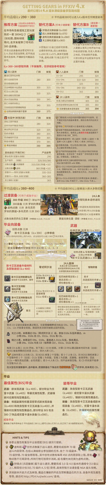

## 满级到毕业

如果你不打算挑战零式副本，买一身450HQ的制作装（零式开放之后）就可以继续享受咸鱼生活了。

如果你希望挑战高难度副本，获取最强的装备，就需要收拾好行装，开始零式的挑战之旅。

FF14的“毕业装”通常保质期是2个小版本，大约半年，在新的高难度副本更新的同时，全体玩家的装备品级会同时更新。

[如何判断装备的强弱](/basic/equip.md#装备信息)。

## 毕业装的获取

<!--::: collapse 文字版

:::-->

5.0版本最先获得的满级装备是430品级的校服（旧化的XX）（完成80级职能任务之后，回海底做灯任务的==盖雷诺尔特==处领取），80级四人本（高随）掉落430品级的腰带及饰品。

满级的同时开启魔典神典石的兑换（没有周获取上限，总上限2000），可以使用魔典兑换440全套装备。

接下来以混搭装备挑战版本初期的2位极蛮神，分别掉落450饰品和450武器。

11月19日开启普通伊甸，普通伊甸掉落可以兑换450全套装备（武器除外，但是含饰品）。

普通伊甸开启后四到五周（丝瓜语）开启零式伊甸，同时开启幻想点数和450HQ装备生产。

::: segment blue
### 总结

由于此次是大版本更新，装备获取方式比较特殊，分成两段：

* 开服 - 零式开放之前：毕业装备为450品，不需要刻意追求，因为这套装备只保值2个月左右，有一个主玩职业能打极蛮神即可。不追求极蛮神的玩家可以直接去做别的了。
* 零式开放之后：以450HQ满禁断为主要装备，配合幻想点数装备挑战零式伊甸，毕业装为470（武器为475），咸鱼玩家买一套450HQ就可以等尼尔联动或者玩别的了。

:::