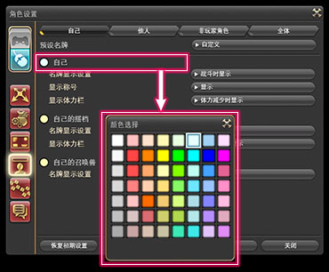
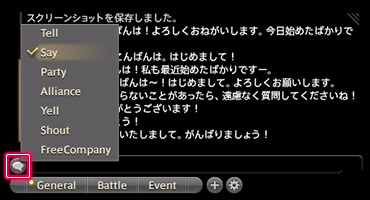
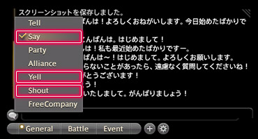
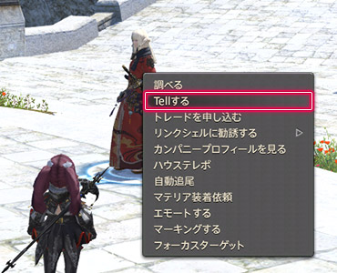
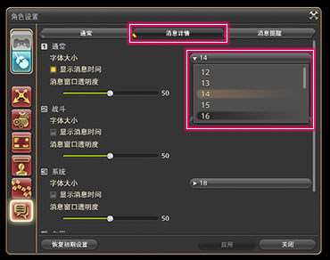
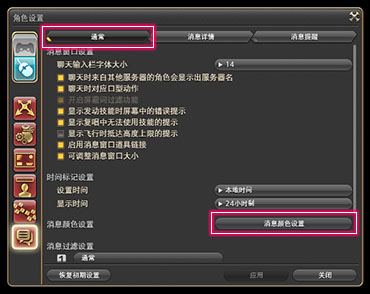
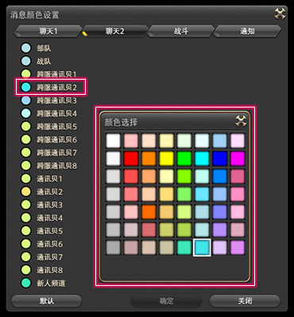

# 玩家交流

在FF14的世界中，有大量和我们一样的玩家，也有原本就生活在这个世界中的非玩家角色（NPC）。利用名牌的颜色区分玩家，和大家友好地交流吧！

## 名牌

;;;.guide .cols2
;;;.guide .col

;;;

;;;.guide .col .grow
区分目标角色是玩家还是NPC的方法，就是查看角色头顶名牌的颜色。

在默认情况下，浅绿色的是NPC，而蓝色的则是其他玩家操作的角色。
;;;
;;;

;;;.guide .cols2
;;;.guide .col

;;;

;;;.guide .col .grow
自己看到他人名牌的颜色，会根据自己与对方的关系不同而发生变化。

默认情况下，对方如果是好友的话，名牌就是橙色，如果是小队成员的话，则是浅蓝色。
;;;
;;;

;;;.guide .cols2
;;;.guide .col

;;;

;;;.guide .col .grow
角色名牌的颜色可以通过快捷指令 > 系统 > 角色设置 > 名牌设置中的各个标签进行改变。

选择想要改变颜色的对象，点击后就会打开调色板，选一个你中意的颜色吧。

Tips：
每项下面的下拉菜单可以改变名牌显示的规则。如果看不清画面的话，可以在这里将部分名牌设置为不显示。
;;;
;;;

## 聊天

在最终幻想14里，可以通过聊天窗口轻松地与其他冒险者进行聊天。
和其他玩家交流是MMO游戏的精髓，放心大胆地发言吧！

游戏内的聊天，根据聊天对象的距离、所属分组而区分了很多对话频道。
因此，需要选择恰当的对话频道与交流对象进行交谈。
使用文本指令的话，不切换频道也可以快速在指定频道发言。

| 交流频道           | 目标对象                                   | 可见范围       | 文本指令                                             |
| -------------------- | -------------------------------------- | ------------------------ | ------------------------------------------------------------ |
| 说话(/s)                  | 自身周边小范围的人     | 仅限自己周围小范围 | /说 你好！ /s 你好！                       |
| 呼喊(/y)                 | 自身周边大范围的人     | 仅限自己周边大范围 | /呼 你好！ /y 你好！                      |
| 喊话(/sh)                | 同一地图的所有角色     | 自己所在的地区     | /喊 你好！ /sh 你好！                    |
| 悄悄话(/t)                 | 指定的1名角色         | 无论对方在哪都可以看到   | /悄   角色名@服务器名 你好！ /t 角色名@服务器名   你好！ |
| 小队(/p)                | 小队成员 适合在副本中与队员交流              | 无论对方在哪都可以看到   | /队 你好！ /p 你好！                     |
| 团队(/a)             | 团队成员 适合在副本中与团队成员交流              | 无论对方在哪都可以看到   | /团 你好！ /a 你好！                |
| 部队(/fc)          | 所属部队成员           | 无论对方在哪都可以看到   | /部 你好！ /fc 你好！            |
| 通讯贝(/l[编号]) 例：/l1、/l2            | 所属通讯贝成员 适合与朋友闲聊         | 无论对方在哪都可以看到   | /讯[编号]   你好！ /l[编号] 你好！       |
| 跨服通讯贝(/cwl[编号]) 例：/cwl1、/cwl2 | 所属跨服通讯贝成员     | 无论对方在哪都可以看到   | /跨[编号] 你好！ /cwl[编号] 你好！           |
| 新人频道(/b)             | 新人频道成员          | 无论对方在哪都可以看到   | /新   你好！ /b 你好！                |

不管向哪个频道说话，都要使用聊天窗口。

##### 来试试聊天吧！

1. 从左边的小气泡按钮中选择想要发言的交流频道！

;;;.guide .cols2
;;;.guide .col

;;;

;;;.guide .col .grow
点击聊天窗口左下角的小气泡按钮，会弹出子命令菜单，从中选择想要使用的交流频道。

※如果你没有加入对应组别，有部分频道可能不会显示。
※选择频道之后，输入框上方会显示频道名。
;;;
;;;

2. 按`回车`键，或者单击输入框就可以输入了！

;;;.guide .cols2
;;;.guide .col

;;;

;;;.guide .col .grow
向各个频道发言的方法，根据你是否开启了直接聊天模式而有所区别。

**未开启直接聊天模式**
🖱 先按下`回车`键或单击输入框，然后输入想说的话。
🎮 先按`BACK`键激活输入框，然后输入想说的话。

**开启直接聊天模式**
直接输入想说的话。

::: collapse 直接聊天模式是什么？

在角色设置 > 操作设置中的设置聊天模式可以打开直接聊天模式，通常推荐手柄玩家使用直接聊天模式。键鼠模式的玩家开启直接聊天模式，会严重地影响游戏正常进行。

:::

;;;
;;;

3. 再次按下`回车`键，就可以发送聊天内容了！

;;;.guide .cols2
;;;.guide .col

;;;

;;;.guide .col .grow
输入完内容之后，再次按`回车`键，就可以向指定频道发送内容了！

※聊天窗口中也会出现自己的发言。
;;;
;;;

;;;.guide .cols2
;;;.guide .col

;;;

;;;.guide .col .grow
不选择特定的对象，想跟周围的人聊天时，可以使用【说话】【呼喊】【喊话】频道！

不同频道可传播的距离是不一样的。

【说话】频道只能传播到周围很小范围的人群，而【呼喊】的传播范围要比【说话】大得多，而【喊话】频道的发言可以传播到当前地图的每一个角落。

;;;
;;;

;;;.guide .cols2
;;;.guide .col

;;;
;;;.guide .col

;;;
;;;

只想两个人说悄悄话的时候，就使用【悄悄话】频道吧！

只要对方在线，无论他在哪里，都能收到【悄悄话】频道的聊天信息（在副本战斗、剧情动画中，会提示无法使用悄悄话功能）。

**开始聊天的方法**
1. 右键聊天对象的角色名，选【择发送悄悄话】！
2. 输入文字！
3. 按`回车`键发送！

### 聊天窗口的设置

消息窗口的文字尺寸，可以在菜单 > 系统 > 角色设置 > 消息窗口设置中的字体大小中设置。

;;;.guide .cols2
;;;.guide .col

;;;
;;;.guide .col

;;;
;;;

Tips：
同一个地方还有消息窗口透明度的设置，如果背景太亮看不清字，可以适当调低。

分不清聊天内容的时候，也可以单独修改某一个聊天频道的文字颜色！

1. 角色设置 > 消息窗口设置 > 全体选项卡中找到信息颜色设置！

;;;.guide .cols2
;;;.guide .col

;;;

;;;.guide .col .grow
角色设置 > 消息窗口设置 > 全体选项卡中找到信息颜色设置。
;;;
;;;

2. 在信息颜色设置中选择想要改变颜色的地方，从跳出的“颜色选择”窗口中选择颜色！

;;;.guide .cols2
;;;.guide .col

;;;

;;;.guide .col .grow
在信息颜色设置中选择想要改变颜色的地方，从跳出的“颜色选择”窗口中选择颜色。

※选择好信息颜色之后，对应部分的颜色图标也会改变颜色。
;;;
;;;

3. 在信息颜色设置中点击【确认】按钮就完成了！

;;;.guide .cols2
;;;.guide .col

;;;

;;;.guide .col .grow
想要保存新设置的信息颜色的话，点击【确认】按钮就可以了。
;;;
;;;

## 新人频道

当玩家初次进入游戏之后，ID前会获得一个豆芽标识，这就意味着这是一名“新人玩家”。有豆芽标识的玩家就可以受邀请加入新人频道：

;;;.guide .cols2
;;;.guide .col

;;;

;;;.guide .col .grow
新人频道是为了帮助刚刚开始冒险的新人而准备的专用频道。

在这个频道里，会有被称作“指导者”的老练冒险家，遇到不明白的事情就问他们吧！

另外，和其他新人一起交流，互相帮助，一定能建立起新的友谊。
;;;
;;;

;;;.guide .cols2
;;;.guide .col

;;;

;;;.guide .col .grow
只有接受了身为“指导者”的老练冒险家的邀请，才能够加入新人频道。

收到邀请，会弹出一个专用窗口，点击“加入新人频道”就可以了。
;;;
;;;

连续45天以上未上线的玩家，并且有任意职业大于等于50级，上线后会获得豆花标识，这意味着这是一名“回归者”，有回归者标识的玩家会自动加入新人频道。

::: segment blue 
### 如何退出新人频道

- 新人（豆芽）玩家：
  - 游戏时间超过(12.5天*24=)300小时，并且完成90级最后一个主线任务<quest name="迈向明日的一步" />就会自动解除新人状态并退出新人频道（俗称脱芽、摘芽）。 
    - 输入`/游戏时间`可以查询当前的游戏时间。
  - 输入`/退出新人频道`：可以直接退出新人频道。
  - 输入`/新人状态 off`：可以关闭新人状态并自动退出新人频道。
  - 输入`/新人邀请 off`：可以自动拒绝新人频道加入邀请。
- 回归者（豆花）玩家：
  - 回归后游戏累计时长超过72小时则自动解除回归者状态。
  - 输入`/解除回归者状态`：可以直接解除回归者状态。

:::
