# 游戏设置详解
<FloatTOC />

> 如果你还看不懂界面，或只想简单了解基本必要的设置，可先阅读以下小节：
> - [游戏界面介绍](/ui/how.md)
> - [如何进入游戏设置](/ui/config.md)
> - [热键栏设置](/ui/hotbar.md)
> - [让战斗更方便的设置](/ui/battle.md)

<IncludePage file="_includes/basic/install.md" />

## 设置云同步

所有UI都是本地化保存的，换电脑就没有了。可以通过复制`游戏安装文件夹\最终幻想XIV\game\My Games`文件夹来备份键位，也可以通过在登录界面上传来保存键位设置：

;;;.guide .cols2
;;;.guide .col


两个圈分别表示账号设置和角色设置，建议是都做备份。
;;;

;;;.guide .col .grow

建议同时做本地备份和云同步。在My Games文件夹中：
- `FFXIV_CHR一串十六进制数字`的文件夹是你的角色文件夹，每个角色对应一个文件夹。+一堆十六进制数字的，就是你的角色设置文件夹，每个在你电脑上登陆过的角色一个。
- `FFXIV_CHARA_一串数字.dat`是捏人数据，在国际服或Benchmark上捏人保存的数据也可以通过改名的方式移动过来，也可以通过复制这个文件分享捏人数据。
- `MACROSYS.dat`是账号通用宏（100条）
- `FFXIV.cfg`系统设置，如果游戏总是莫名卡死，可以尝试删除该文件重置设置。

;;;
;;;

## 游戏内设置

> - [硬件配置及系统设置常见问题](https://docs.qq.com/doc/p/82ef87fd40aa52c3c58fce8cc6deb0846736cb20)

菜单 > 系统 > 角色设置/系统设置中有很多可以手工设置的内容，下面对这些设置内容进行具体介绍。

### 角色设置

;;;.guide .cols2
;;;.guide .col
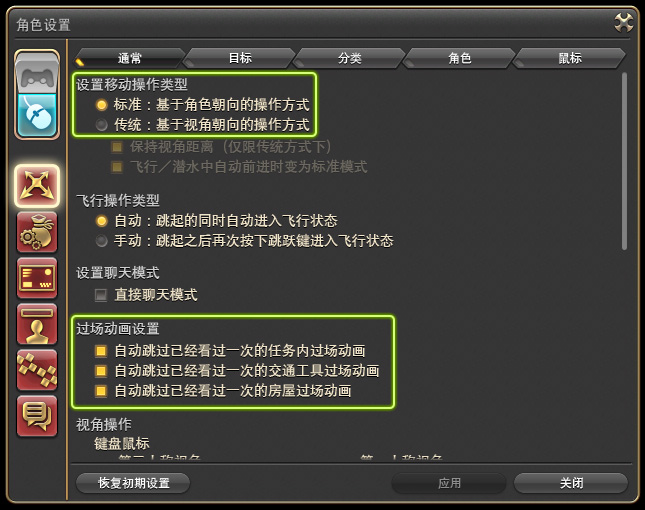

操作设置 - 通常
;;;

;;;.guide .col .grow

推荐修改的设置：

* 过场动画设置：3个自动跳过已经看过的动画都推荐勾选。
* 开启技能发动时的演出效果：<Role name="blm" />黑魔等职业部分技能的震屏、全屏模糊动态特效，关闭后可以提升流畅度，但会减少打击感，推荐保留。
* 使用遥感/键盘时的视角回转速度：推荐调整到50以上。
* 角色转身速度：推荐调整到80以上。
* 第三人称视角俯视角度：镜头拉远时，自己在屏幕上的位置，也可以在游戏中按`Ctrl`+`↑↓`键直接调整，推荐在自己觉得舒服的范围里尽可能拉大数值。
;;;
;;;

| 移动操作的类型 | 标准 | 传统 |
| -- | -- | -- |
| 操作方式 | 默认`A` `D`为向左转、向右转，`Q` `E`为向左平移、向右平移，`S`为倒退移动（步行）；按住<i class="xiv mouse-left-button"></i>拖动为转动相机视角，按住<i class="xiv mouse-right-button"></i>拖动为转动角色面向，同时按下<i class="xiv mouse-left-right-button"></i>为向相机面向前方移动。 | 默认`A` `D`为向左移动、向右移动（按住不放会原地走一个大圆形），`Q` `E`为向左平移、向右平移，`S`为转身并向后移动；按住<i class="xiv mouse-left-button"></i>或<i class="xiv mouse-right-button"></i>拖动为转动相机视角，同时按下<i class="xiv mouse-left-right-button"></i>为向相机面向前方移动。|
| 对比特点 | 优点：可以任意调整角色与相机的方向夹角；<br>缺点：角色面向和相机方向各自独立控制，在移动中施法会导致角色移动方向自动偏离。 | 优点：可以保持移动方向施法；<br>缺点：无法与需要观测的目标保持特定夹角移动。 |
| 常见调整方式 | 将`A` `D`键改为左右平移;将角色转身速度调至100。<br>在需要移动施法时，按住<i class="xiv mouse-left-right-button"></i>轻甩鼠标保持面向。 | 需要左右平移时，按住<i class="xiv mouse-left-button"></i>或<i class="xiv mouse-right-button"></i>的同时按`A` `D`；<br>需要保持正面倒退步行时，需要同时按住`Q` `E`和`S` ；<br>需要观测BOSS同时移动时，根据自己与BOSS的夹角选择移动方向。 |

这两种操作方式没有优劣之分，只要适合自己就是最好的，可以在战斗中多多体会琢磨，选择让自己打得最舒服的操作方式。

;;;.guide .cols2
;;;.guide .col
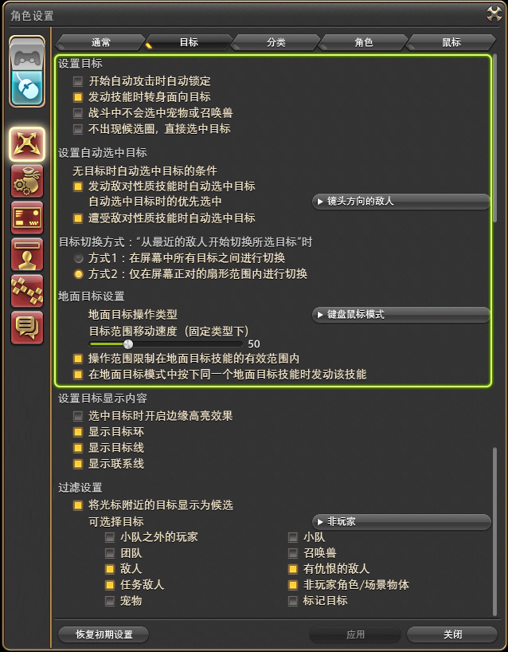

操作设置 - 目标（示意）
;;;

;;;.guide .col .grow

* 设置目标：
  * 开始自动攻击时自动锁定：这个功能是给手柄用的，锁定后，会变为强制以目标为圆心移动，不推荐勾选。
  * 发动技能时转身面向目标：这个选项在绝大多数场合都**不能取消**，否则你需要手动调整面向才能正常施放技能。
  * 战斗中不会选中宠物或召唤兽：**推荐勾选**。
* 设置自动选中目标：
  * 发动敌对性质技能时 & 遭受敌对性质技能时自动选中目标：**推荐勾选**，可以部分解决不小心点到地板丢失目标的情况，但是不能解决不小心点到队友的情况。
* 目标切换方式：两种方式其实都不太好用，可以选个自己觉得舒服的。
  * “从最近的敌人开始切换所选目标”的键位可以在键位设置中调整，默认键位为`Tab`。
* 操作范围限制在地面目标技能的有效范围内：缩地等技能可以自动卡到最远距离，**推荐勾选**。
* 在地面目标模式中按下同一个地面目标技能时发动该技能：连按两次技能，自动以鼠标位置为中心放下技能，**推荐勾选**。
* 设置目标显示内容：
  * 选中目标时开启边缘高亮效果：被选中的目标边缘有一圈黄色高亮。
  * 显示目标环：目标脚下标示面向和身位信息的环，不推荐关闭。
  * 显示目标线：显示玩家的施法目标的连线，只有修改目标且目标不为自己时会显示，不推荐关闭。
  * 显示联系线：小怪之间的仇恨共享线，被链接的野怪会共享仇恨，不推荐关闭。
* 过滤设置：目标过滤（默认快捷键`X`）使用，可以不用更改。
  * 将光标附近的目标显示为候选：会在候选目标身上出现一个光点。
;;;
;;;

操作设置 - 分类：手柄用，可以为不同状态下过滤不同目标分类，方便进行目标选择操作。

;;;.guide .cols2
;;;.guide .col
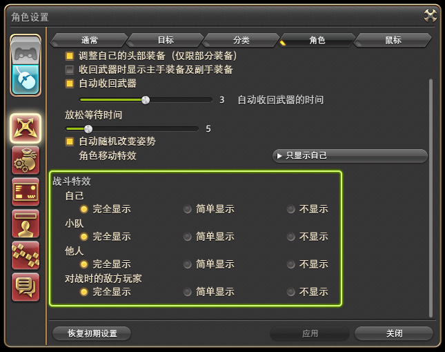

操作设置 - 角色
;;;

;;;.guide .col .grow

* 战斗特效：在人数较多的战斗中，战斗特效会非常影响机制的阅读判断，通常建议关闭他人战斗特效，并简单显示小队特效。另外如果电脑硬件配置较低，也可以适当关闭特效，减轻硬件压力。

不建议关闭队友战斗特效，会影响地面放置类技能的观察。敌人特效指PVP中敌方的技能特效。

低特效宏：
```
/战斗特效 自己 简单
/战斗特效 小队 简单
/战斗特效 他人 关
/战斗特效 敌人 简单
```
;;;
;;;

;;;.guide .cols2
;;;.guide .col
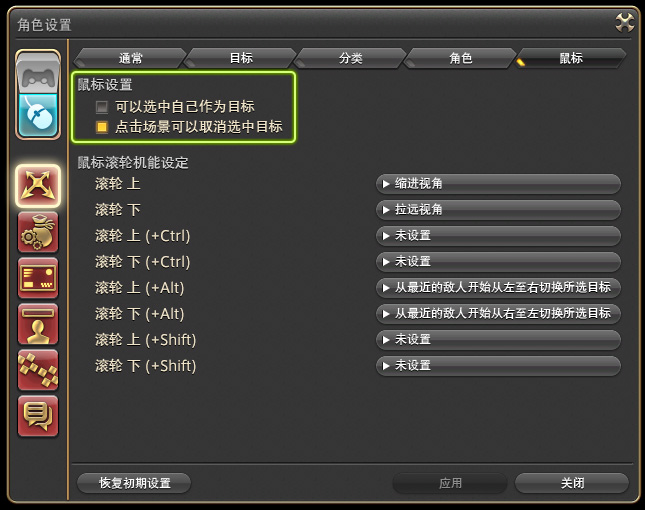

操作设置 - 鼠标
;;;

;;;.guide .col .grow

* 鼠标设置：
  * 可以选中自己作为目标：可以不勾选。当玩家选中敌人或未选中目标时，对友方单位使用的技能会默认自动以自己为目标。
  * 右键不可选中xx作为目标：按需勾选，标准操作模式玩家在移动视角时有可能会误选。
  * 点击场景可以取消选中目标：按需勾选，若经常误点导致操作失误可以取消勾选。

* 滚轮设置：只能设置为选择目标，不可用于绑定按键。

;;;
;;;

;;;.guide .cols2
;;;.guide .col
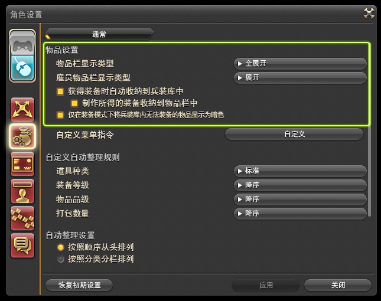

物品设置 - 通常
;;;

;;;.guide .col .grow

* 物品栏显示类型：推荐选择**全展开**（需要DX11），会令所有物品在一页显示。
* 雇员物品栏显示类型：推荐选择**展开**（需要DX11），会同时显示2页物品。
* 获得装备时自动收纳到兵装库中：按需勾选。

;;;
;;;

;;;.guide .cols2
;;;.guide .col
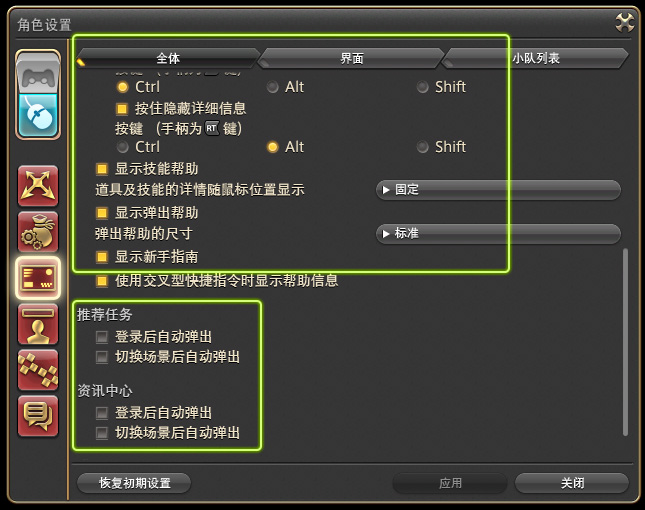

界面设置 - 全体（示意）
;;;

;;;.guide .col .grow

* 帮助信息
  * 显示道具帮助：道具信息，不推荐取消。
    * 按住切换显示普通品质/优质详细信息：QQ截图经常会误触导致截图失误，如果没有工匠制作需求建议取消勾选。
  * 显示技能帮助：技能介绍文本，不推荐取消。
  * 道具及技能的详情随鼠标位置显示：如果觉得弹出帮助遮挡画面，可以选择==固定==。
  * 显示弹出帮助：图标的说明文字，不推荐取消。
  * 显示新手指南：**不推荐取消**，所有初见的游戏系统都会有指南弹出！
* 推荐任务：推荐取消勾选。
* 资讯中心：链接到[官网活动中心](https://actff1.web.sdo.com/Project/20181018ffactive/index.html)，推荐取消勾选。
* 任务用肖像：副本任务中展示肖像的设定，[自己的肖像介绍和编辑方法参见这里](/topic/plate.md)
  * 显示队员介绍的通知：如果选中，可以在副本任务中右下角通知的位置重新打开队员介绍。

;;;
;;;

;;;.guide .cols2
;;;.guide .col
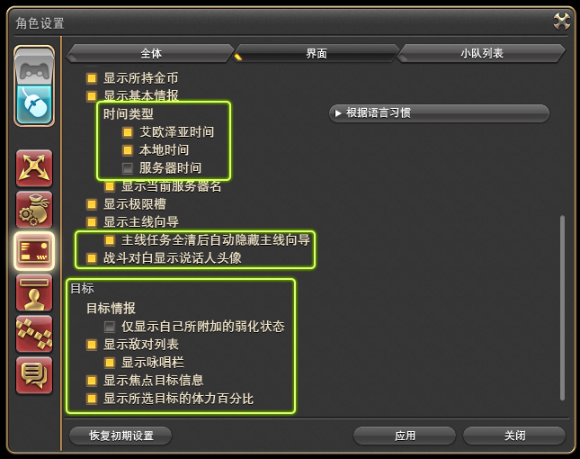

界面设置 - 界面
;;;

;;;.guide .col .grow

大多数参数都可以在界面设置中修改，这里主要说明一些无法在界面设置中修改的：
* 跳出文字：自己造成的伤害、治疗数字，推荐保留，尺寸随意。
* 弹出文字：敌人、队友造成的效果，推荐保留，尺寸随意。
* 目的列表：按需选择
* 时间类型：推荐勾选**艾欧泽亚时间**和**本地时间**，其中艾欧泽亚时间经常用于[狩猎](/topic/hunt.md)、[钓鱼](/topic/fisher.md)等活动。
* 显示主线向导：推荐保留
  * 主线任务全清后自动隐藏主线向导：推荐勾选。
* 战斗对白显示说话人头像：推荐勾选。

- 仅显示自己所附加的弱化状态：推荐不选，会影响对团辅技能的判断。自己所附加的弱化状态倒计时数字为浅绿色。
- 显示敌对列表：推荐保留
  - 显示咏唱栏：推荐保留，用于观测副本中不可选中的小怪读条。
- 显示所选目标的体力百分比：**推荐勾选**，很重要，务必选中。

;;;
;;;

;;;.guide .cols2
;;;.guide .col
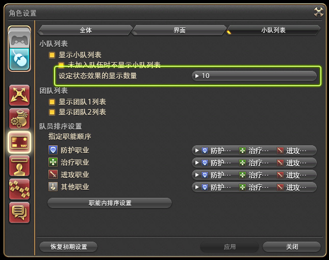

界面设置 - 小队列表
;;;

;;;.guide .col .grow

大多数参数都可以在界面设置中修改，这里主要说明一些无法在界面设置中修改的：

* 设定状态效果的显示数量：如果屏幕比较大推荐选10，如果屏幕小很挤，可以适当减少。
* 显示状态效果的剩余时间：官方说明说如果发现游戏有卡顿的话，可以关闭该功能（但一般不推荐关闭）。

;;;
;;;

;;;.guide .cols2
;;;.guide .col
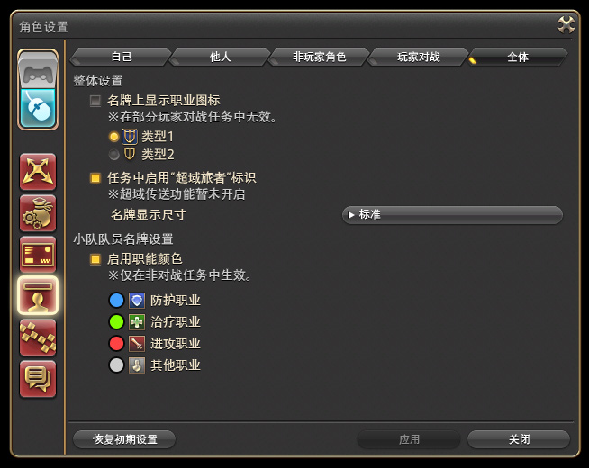

界面设置 - 名牌设置
;;;

;;;.guide .col .grow

可以修改所有名牌的颜色、显示规则，也可以修改称号、血条等等信息的显示规则，按需修改即可。

上方可切换分类，包括自己/他人/NPC或物体/PVP。

在==全体==选项卡中，可以为名牌前加上职业图标、修改名牌尺寸、改变小队队员名牌颜色，可以更方便地在战斗中快速区分队友了！

;;;
;;;

;;;.guide .cols2
;;;.guide .col
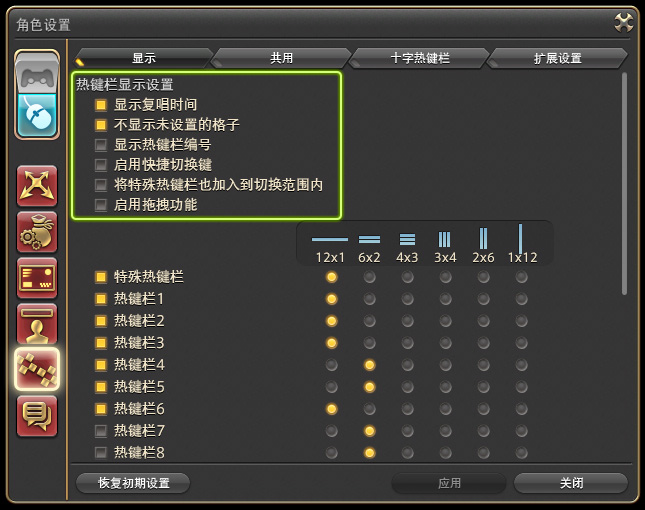

热键栏设置 - 显示
;;;

;;;.guide .col .grow

* 显示复唱时间：**推荐将倒计时显示位置改为图标中央**。
* 不显示未勾选的格子：可以选中保持美观，也可以用来做特殊形状的布局。
* 启用拖拽功能：建议关闭，如果需要移动位置可以在界面设置中调整。
* 热键栏布局：按需选择

==热键栏设置 - 共用热键栏==可以调整共用热键栏：共用热键栏是指不随职业切换而切换的热键栏，通常可以配合宏用来做菜单/折叠宏，具体做法可以参照[宏指南](/advanced/macrology-2.md)。

十字热键栏和扩展是针对手柄所用的十字热键栏的设置，具体设置可以参见[手柄设置指南](https://bbs.nga.cn/read.php?tid=24728851)。
;;;
;;;

;;;.guide .cols2
;;;.guide .col
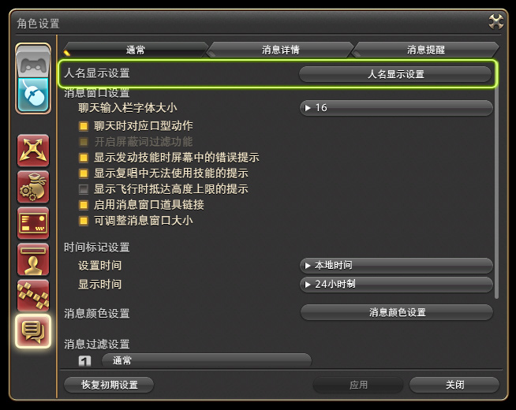

消息窗口设置 - 通常
;;;

;;;.guide .col .grow

左下角消息窗口的设置，也可以点击消息窗口的小齿轮打开该设置窗口。

* 输入栏字体大小：只调整输入栏的字号，消息记录的字号需要在==消息详情==中调整。
* 消息颜色设置：设置各个频道的颜色，可以为不同通讯贝单独设置颜色。
* 消息过滤设置：<i class="xiv mouse-left-button"></i>可以设置消息栏显示的信息类型；<i class="xiv mouse-right-button"></i>右键可以修改消息栏标题，或删除不用的消息栏。

更详细的设置和用法可以查看[玩家交流](/basic/communication.md)。

;;;
;;;

;;;.guide .cols2
;;;.guide .col
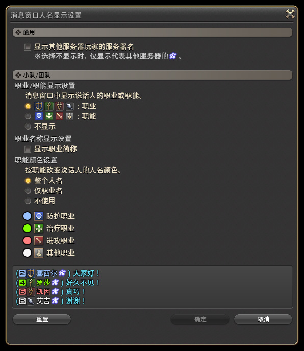

消息窗口设置 - 人名显示设置
;;;

;;;.guide .col .grow

左下角消息窗口中，发言者的相关信息设置：

* 通用：显示/隐藏其他服务器玩家的服务器名
* 小队/团队：当玩家在小队/团队频道发言时，职业/职能的显示规则。
  * 可以在下方预览窗口中查看显示效果，按需要选择即可。推荐显示职业图标+整个人名改变颜色。

;;;
;;;

### 系统设置


;;;.guide .cols2
;;;.guide .col
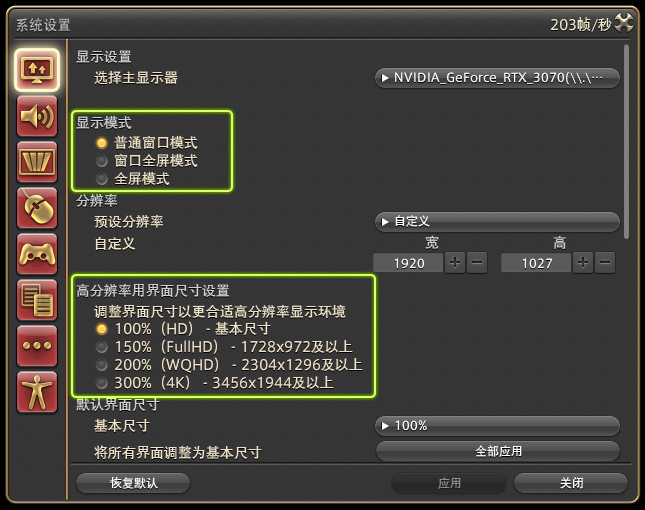

显示设置
;;;

;;;.guide .col .grow

画面分辨率等相关方面的设置：
* 显示模式：按需选择，部分电脑在全屏模式下可能会出现卡顿的现象，切为窗口全屏可能会有好转，也有一些人是反的，总之可以都试试。
* 高分辨率用界面尺寸设置：UI缩放基准倍率，可以按自己显示器种类直接选择，也可以在界面设置中单独调整。
* 默认界面尺寸：缩放UI，和上面的选项有叠加效果。
* 伽马修正：明暗对比调整，但是对于夜晚、洞窟等场景很难有较好改善，建议按自己舒适度调整，实在不行可以加显卡滤镜等画质改善。
* 帧数限制：建议**无锁定**，如果确实需要压低渲染帧数，建议在显卡设置中调整。
  * 程序在游戏窗口处于非激活状态时限制帧数：推荐勾选
  * 离开时限制帧数：可以勾选

;;;
;;;

如果游戏在100%缩放的前提下仍然感觉文字边缘模糊，请检查你的系统缩放（在Windows设置中，找到显示设置 > 缩放与布局），若系统缩放不为100%，则需要找到你游戏文件夹中的`ffxiv_dx11.exe`，右键 > 属性 > 兼容性 > 更改高DPI设置 > 高DPI缩放替代，勾选“替代高DPI缩放行为”，同时下拉框改成“应用程序”，再在游戏中进行缩放调整。

;;;.guide .cols2
;;;.guide .col
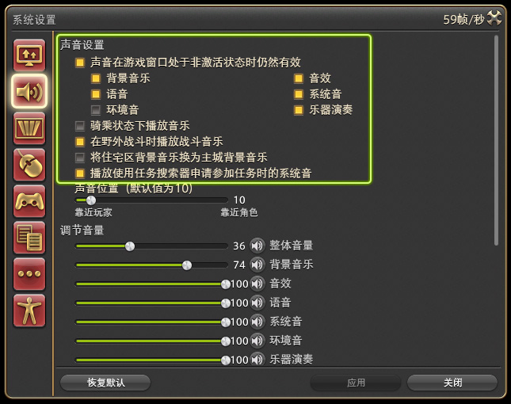

声音设置
;;;

;;;.guide .col .grow

* 声音在游戏窗口处于非激活状态时仍然有效：推荐勾选，方便排本的时候切窗口出去做点别的事情。排本确认的效果音属于==系统音==。
* 骑乘状态下播放音乐：坐骑自带BGM，不勾选时则会播放地图的BGM。

其他按需选择即可。

;;;
;;;

;;;.guide .cols2
;;;.guide .col
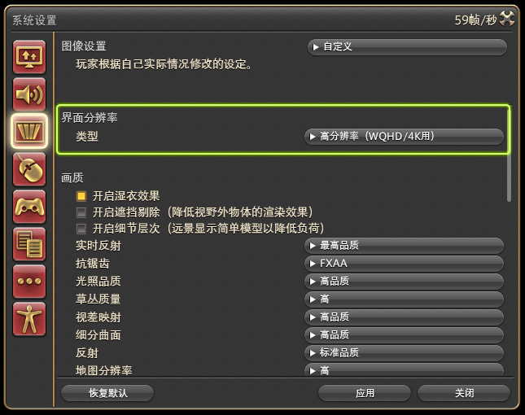

图像设置
;;;

;;;.guide .col .grow

界面分辨率 - 类型：**务必修改为“高分辨率（WQHD/4K用）”**，哪怕你是标清屏幕，修改这个设置也能获得极大的画面改善。修改后所有的图标、文字都将使用高清资源显示。

如果画面卡顿比较严重，难以流畅运行的话，可以尝试降低以下设置（均对性能影响较大）：
* 实时反射：标准品质或关闭
* 抗锯齿：关闭
* 影子：细节层次关闭，子选项全部调到最低
* 摇晃表现：除自己全关闭
* 画面特效：
  * 径向模糊：关闭
  * 屏幕空间环境光遮蔽：弱或关闭。**A卡用户建议优先降低该设置，HBAO+为N卡专利，非常吃性能** 

另外关闭战斗特效，关闭技能发动时的演出效果，减少同屏人数也可以有效提升流畅度。
;;;
;;;

如果关闭特效后仍有卡顿，可尝试在分辨率设置中**开启动态分辨率**，该设置为自动调整画面分辨率，可有效提升画面流畅度，但会导致画面模糊（该功能仍在实验中，将来可能会有改善）。

另外亦可将游戏分辨率缩小，然后使用[MAGPIE](https://github.com/Blinue/Magpie)放大游戏画面，该工具可以将标清窗口画面放大到4K，也可以将小窗口放大到标清。

;;;.guide .cols2
;;;.guide .col
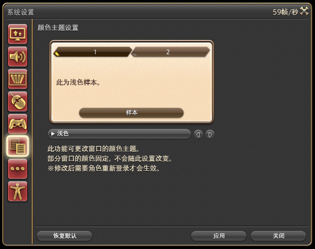

颜色主题设置
;;;

;;;.guide .col .grow

有4种UI配色主题可选，默认为深色，另3种为浅色、最终幻想经典（像素）和浅蓝。

更改选择后需要重启游戏。亦可直接使用美容师，不作任何修改，退出即可。

;;;
;;;

;;;.guide .cols2
;;;.guide .col
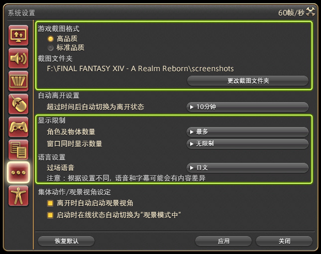

其他
;;;

;;;.guide .col .grow

* 游戏截图格式：建议选择高品质，在按下`PrintScreen`截图键的时候，游戏会自动将画面切换到高品质画面保存截图，然后再切换回原本的设定。如果是配置比较低的电脑，在非常激烈的战斗中可能会导致微小的卡顿。
* 截图文件夹：只能手工输入地址，可以在系统资源管理器中建立好文件夹后，将路径复制回游戏。如果截图文件夹不存在的话，会导致截图保存失败，另外也会导致退出游戏时报错。
  * 默认截图文件夹保存在My Games文件夹中，建议更改。

- 显示限制：如果电脑配置较低，或参与大量人数活动（如狩猎）时，可以将==角色及物体数量==设置为最少。窗口同时显示数量没有用，不用管。
- 过场语音：在有配音的战斗、过场动画中，语音的语言。部分语音和文本不同，还有部分语音没有文本，要注意。

;;;
;;;

;;;.guide .cols2
;;;.guide .col
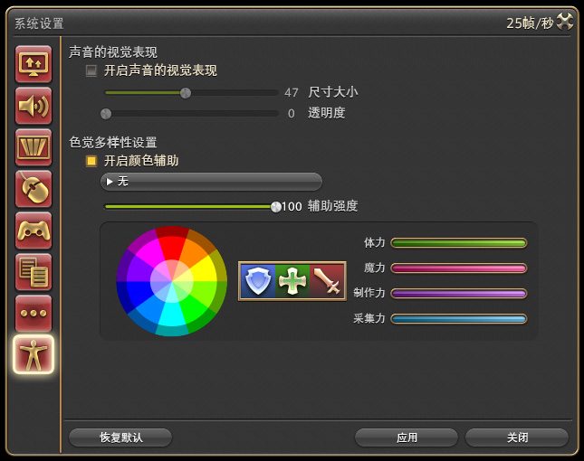

辅助功能设置
;;;

;;;.guide .col .grow

针对听障和视障人群的辅助设置：
* 声音的视觉表现：将声音以波形的形式显示在屏幕两侧，并且区分左右声道，在像水神那样需要通过声音判断方位的副本很有帮助。
* 色觉多样性设置：调整画面的整体颜色，方便色觉异常玩家进行游戏。

;;;
;;;

### 界面设置

;;;.guide .cols2
;;;.guide .col
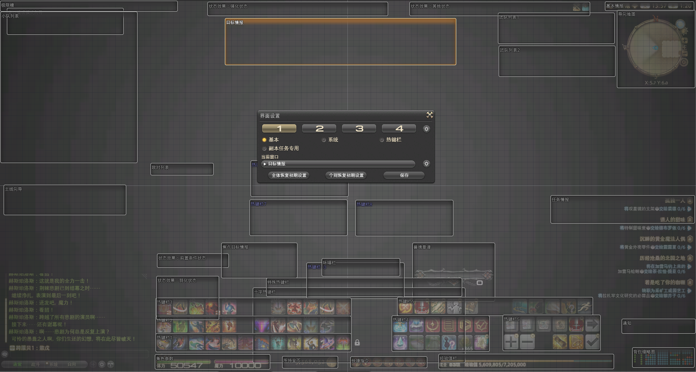

界面设置
;;;

;;;.guide .col .grow

FF14的界面UI都可以调整，在菜单 > 系统 > 界面设置，就可以打开界面设置。

* 使用<i class="xiv mouse-left-button"></i>可以激活窗口组件，拖动就可以随意调整位置，按住`Shift`拖动可以对齐网格，也可以用小键盘`2` `4` `6` `8`进行上下左右的微调。按`Ctrl+HOME`可以缩放窗口组件。
* 单击<i class="xiv mouse-right-button"></i>可以切换窗口组件的显示/隐藏（标题显示为白色的是显示组件，紫色的为隐藏组件）。
* 不方便使用鼠标选择的组件，也可以在窗口的下拉菜单中寻找。下拉菜单右边的齿轮可以调整窗口组件的缩放、透明度。另外如果选中的是热键栏，也可以通过齿轮调整热键栏的布局方式。

另外玩家可以保存4组UI布局，可以应对不同的需求（比如副本、PvP、社交娱乐等等）快速切换不同的界面布局。

关于界面设置的详细介绍，参见[界面指南](/ui/how.md)。
;;;
;;;

另外还有以下一些设置推荐修改：

#### 拆分BOSS信息

;;;.guide .cols2
;;;.guide .col

;;;

;;;.guide .col .grow

这个设置可以将BOSS的血条、咏唱条和buff栏拆分展示：
* 体力栏：目标的HP和它的目标。
* 咏唱栏：在高难副本中如果需要观察BOSS的读条，可以把这栏拖出来放大。
* 状态效果：如果总是看不清BOSS身上的DOT情况，可以把这一栏拖出来放大。

大家可以按需摆放、缩放这些状态栏，把它们放在最舒服的位置上。
;;;
;;;

#### 拆分buff为4栏

;;;.guide .cols2
;;;.guide .col

;;;

;;;.guide .col .grow

默认所有状态效果都挤在一起，不易分辨，可以在这里将状态栏拆为3、4栏：
* 强化状态：可以增强输出的状态。
* 前置条件状态：触发型的buff，对于需要监控触发的玩家来说，可以把这一栏拖出来放大，并放在显眼的地方。
* 弱化状态：负面状态，大部分副本的机制buff也都属于此类，如果在高难度副本需要特别观察BOSS点名的buff，可以把这一栏放大。
* 其他状态：像是部队特效、优惠券等，以buff形式存在，但不会对战斗产生即时影响的状态。

大家可以按需摆放、缩放这些状态栏，把它们放在最舒服的位置上。

;;;
;;;

#### 简单显示职业量谱
职业量谱会随着职业等级提升而开放，一开始是没有的(附图是以前版本的职业量谱，和现在的图样可能不同，一切以游戏中实际样式为准)：


## 常用热键及指令

除了背包`I`（兵装库`Ctrl+I`、陆行鸟鞍囊`Ctrl+Shift+I`）、角色信息`C`、任务搜索器`U`等等常用按键，还有一些一般玩家不是特别常用，但实际非常方便的FF14特有热键：

* `ScrollLock`可以隐藏屏幕中的所有UI组件，方便截图。在对话框输入`/gpose`则可以打开拍照模式，按`R`或`鼠标中键`就可以打开设置界面。
* `R`或`鼠标中键`默认自动前进键，只要按任意方向键就可以解除自动前进状态。
* `X`可以隐藏玩家名牌，在人非常多（比如活动任务）时，点不到NPC或任务点的话，按住`X`就可以轻松点到了。
* `小键盘0`确认/交互键，在野外会自动选中离自己最近的可交互物体。
* `/+字母`可以快速切换到指定频道：`/p`表示小队频道，`/s`表示说话频道，`/b`表示新人频道，更多关于聊天频道的问题可以看[这里](/basic/communication.md)。
* `/召唤兽尺寸 全部 小`可以缩小召唤的全部召唤兽尺寸，这个设置是本地生效的，也就是会影响到你看到的所有召唤的召唤兽（而其他人看到的大小由他们设置）。
* 所有的键盘热键都可以在 菜单 > 系统 > 键位设置 中进行修改。
* 关于其他文本指令可以看[这里](https://ff14.huijiwiki.com/wiki/%E6%96%87%E6%9C%AC%E6%8C%87%E4%BB%A4)。

::: segment blue 

### 其他键位说明

* 移动
  * 控制移动：相当于鼠标同时按下<i class="xiv mouse-left-right-button"></i>（此时鼠标按键无效，甩动鼠标即是同时改变相机和移动方向）
  * 左转/向左移动；右转/向右移动：通常会取消这两个键位，将`A` `D`键改为左右平移，`Q` `E`键拿去绑定技能。但这2个键在`/gpose`中是左右平移镜头，因此如果有经常拍照的需求，还是建议绑定两个不常用键位。
  * 飞行/潜水：下降：默认键位会跟中文输入法切换冲突，建议改键。在未解锁飞行坐骑的地区，只能通过这个键位下潜。
  * 翻转视角：`V`键可以用于绑定技能热键，这个功能方便观察身后的机制，如果你习惯这个操作可以为它保留热键，或更换为其他顺手的热键。
* 目标：按需设置、选择。
  * 从最近的敌人开始切换所选目标：选择范围可以在角色设置中修改
* 快捷键：基本就是菜单的那些，和技能-特别指令，按需设。
* 聊天：大部分都用处不大，但 ==临时回复（顺序）== 可以方便快速回复私聊，建议保留或更换为其他顺手的热键。
* 系统
  * 确定操作/取消操作：推荐保留或更换为其他顺手的热键。
  * 隐藏所有窗口：隐藏所有UI的热键，推荐推荐保留或更换为其他顺手的热键。
  * 目标过滤：按住只显示过滤的名牌，可以在角色设置 > 操作设置 > 目标的过滤设置中更改。默认情况下会隐藏其他玩家的名牌，非常方便在人多的时候点选任务点、水晶、NPC等，推荐推荐保留或更换为其他顺手的热键。
  * 扩大消息栏：将聊天窗口单独放大置于屏幕中央，方便聊天的按键。如果有经常聊天的需要，可以为其设置热键。
  * 鼠标位置：高亮鼠标当前位置，打本的时候如果经常给找不到鼠标，可以为其设置热键。
  * 任务通用键：FATE等级同步/竞技场战况确认窗口热键。
* 热键栏：按习惯和需要调整，不必拘泥于默认的67890或者Ctrl+12345，舒服最重要。
  * 任务指令1/2：在部分副本任务中才会出现的特殊指令，通常有特殊的用途，如果不习惯用鼠标去点技能的话，还是推荐绑定2个热键。
* 手柄：手柄的键盘映射，在部分装修特殊操作中需要使用。

:::