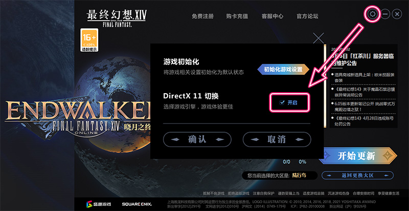
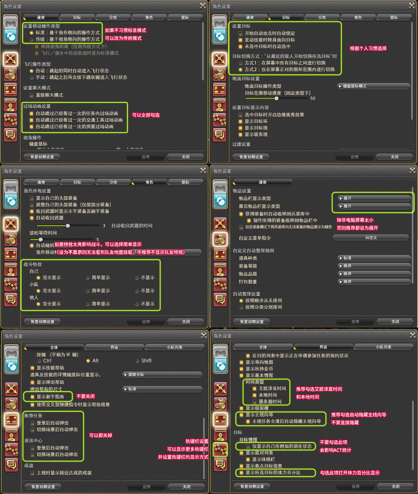
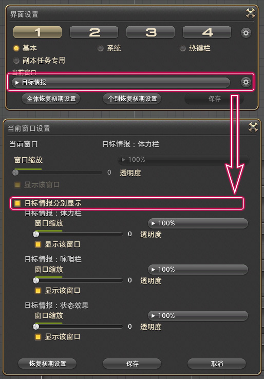
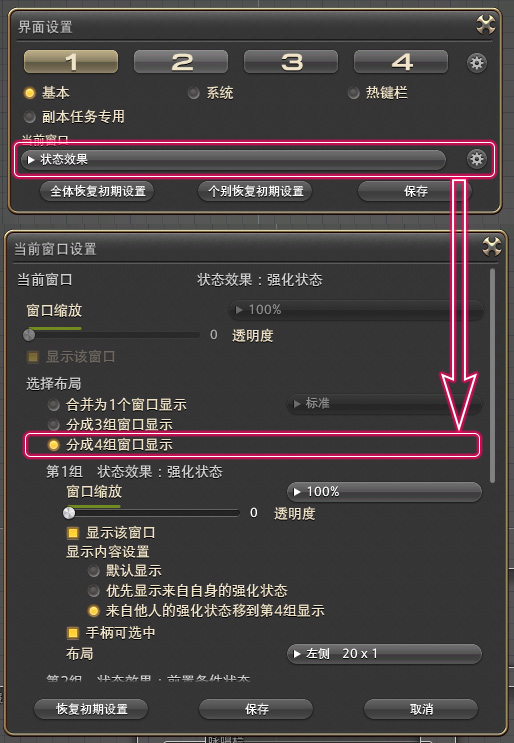
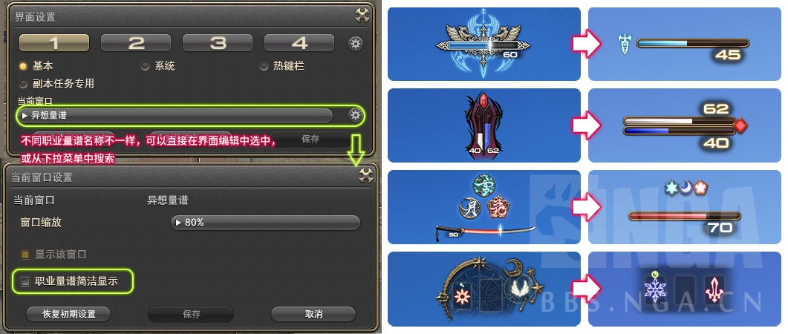
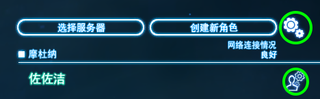

# 常用设置及热键

## 游戏内设置

DX11在登录器右上角齿轮开启，电脑支持DX11的玩家记得去开。

菜单-系统-角色设置/系统设置中有很多需要手工调整的设置，下面是一些新人常用的设置[[视频]游戏基本操作及游戏设置要点](https://www.bilibili.com/video/av24058024/)：

角色设置：

系统设置：

界面设置
FF14的界面UI都可以调整，在菜单-系统-界面设置中，只要鼠标拖动就可以调整界面布局，或单个缩放UI，下面两个设置是比较推荐萌新修改的：
拆分buff为3栏：

简单显示职业量谱(职业量谱会随着职业等级提升而开放，一开始是没有的)

## 计算机设置

Win10系统自带输入法跟游戏冲突，搜狗会吞字，如果发现有输入问题可以考虑换输入法。

所有UI都是本地化保存的，换电脑就没有了。可以通过复制游戏文件夹→game→My Games文件夹来携带键位，也可以通过在登录界面上传来保存键位设置：

## 常用键盘热键

除了背包`I`（兵装库`Ctrl+I`、陆行鸟鞍囊`Ctrl+Shift+I`）、角色信息`C`、任务搜索器`U`等等常用按键，还有一些一般玩家不是特别常用，但实际非常方便的FF14特有热键：

* `ScrollLock`可以隐藏屏幕中的所有UI组件，方便截图。如果输入`/gpose`则可以打开拍照模式，按`R`或`鼠标中键`就可以打开设置界面。
* `R`或`鼠标中键`默认自动前进键，只要按任意方向键就可以解除自动前进状态。
* `X`可以隐藏玩家名牌，在人非常多（比如活动任务）时，点不到NPC或任务点的话，按住`X`就可以轻松点到了。
* `小键盘0`确认/交互键，在野外会自动选中离自己最近的可交互物体。
* `/+字母`可以快速切换到指定频道：`/p`表示小队频道，`/s`表示说话频道，`/b`表示新人频道，更多关于聊天频道的问题可以看[这里](/ui/communication.md)。
* `/巴哈姆特尺寸 小`可以缩小召唤的巴哈姆特尺寸，这个设置是本地的，也就是会影响到你看到的所有召唤的巴哈姆特（而其他人看到的大小由他们设置）。
* 关于文本指令可以看[这里](https://ff14.huijiwiki.com/wiki/%E6%96%87%E6%9C%AC%E6%8C%87%E4%BB%A4)。
