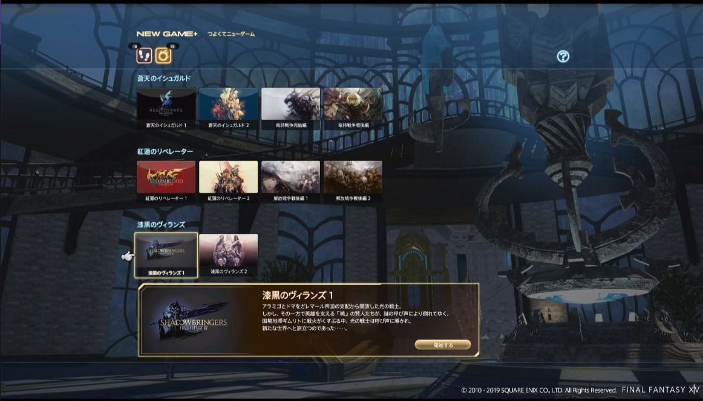

# 新人必知必会

++这个游戏里唯一必须要做的事，就是做主线任务。++

<IncludePage file="_includes/basic/level.md" />

因此无论是否使用了直升包道具，主线都是最优先需要完成的。

## 绝对禁止的事项

FF14严格禁止任何形式的代打、代练、买金卖金（RMT）、脚本、外挂，并且禁止辱骂、人身攻击、消极游戏（对他人造成影响）、破坏游戏秩序等行为。

处罚方式从警告到永久冻结账号（永封）都是有可能的，千万不要以身试法！官方微博每周都会发布最新一期的封号榜单，如果你遇到了上述行为，可以通过[官方渠道](http://ff.sdo.com/web8/index.html#/newstab/newscont/299956)进行举报。

## 主线剧情

FF14作为FF系列的正统续作，以优秀的**单机剧情**为主要卖点之一，主线任务就是FF14的剧情部分，剧情本身非常优秀，随着剧情的不断推进，NPC的对话也会发生变化（非常有单机游戏特色）。我们现在玩到的主线剧情，是经过5年时间不断追加形成的长度，因此一口气玩下来会有一定困难，这时候也可以[做点别的](#不想做主线的时候能做什么？)。

玩家从1~35级的主线任务是新人冒险者入门，以教学为主，顺带会开启各种基本功能，内容略微琐碎。

35级开始会迎来剧情上的发展和转折，一直到50级结束第一段故事，从50级中段开始进入新剧情的铺垫，这之中登场的任务和牵涉的关系，严重地关系到接下来51~60级的3.0版本主线任务。<strike>这也是剧情党不希望新玩家使用直升包的主要原因，直升包会跳过这段故事和人物关系的铺垫。</strike>

60级的任务也同样分为两个阶段，前半段为整个剧情做总结，而后半段为接下里的篇章做铺垫。61~70级4.0版本的故事顺应之前的脉络，进入新的篇章，并直接揭露了从一开始就一直存在的敌人的部分真相。

;;;.guide .cols2
;;;.guide .col

;;;

;;;.guide .col .grow
5.1 追加的 NEW Game + 模式，允许玩家以完全单机的模式重新体验主线剧情。但是目前 NEW Game + 并未适配 2.x 部分的剧情，因此暂时无法回顾到全部的剧情。

最新的5.0版本剧情将会收束从2.0到4.0铺垫的故事，并揭开大量伏笔。

如果使用剧情直升包，虽然可以在闲下来之后重新补剧情故事，但是初次遇到具有冲击力的剧情时，就难以理解它与之前伏笔的对应，也难以感同身受。是否要将这珍贵的“第一次感受”拱手相让，就看你的选择了。
;;;
;;;

## 初入游戏

;;;.guide .cols2
;;;.guide .col .grow
1级新豆芽刚刚进入游戏时，是初期教学模式，建议详细阅读教学文字和说明（**不要关闭**新手指南），这个游戏没有自动寻路，地图和任务说明将成为你最重要的游戏手段。

教学任务会带你走访==冒险者行会==、==职业行会==、==市场==等重要地点，务必记住它们的位置，以后会时常造访。

完成教学后就算正式迈入了艾欧泽亚大地了，此时如果有人邀请你进入==新人频道==，请不要拒绝。有任何问题都可以在这里咨询，不小心被野怪揍死或意外横尸荒野，也可以在这个频道里呼救。

如果你有好朋友的[部队]()的话，在充值激活后就可以立刻加入（别忘了[前面提到的绑定老司机](/before/pay.html#萌新招待领多重福利)，进入游戏后记得加他好友）。
;;;

;;;.guide .col 
### 新人常见问题
* [界面看不懂？](/ui/know.html)
* [地图怎么看？](/basic/map.html)
* [装备怎么搞？](/basic/equip.html)
* [打怪手感差？](/basic/battle.html)
* [怎么升级快？](/upgrade/guide.html)
;;;
;;;

;;;.guide .cols2
;;;.guide .col
<!--图要换-->
;;;

;;;.guide .col .grow

游戏自带的新手指南详细完备，图文并茂，非常方便，并且会随着你的游戏进程而解锁更多内容。

如果你能好好利用这份游戏自带教学，可以解决你在游戏中遇到的绝大多数问题哦！

※ 可能有的时候太详细了，显得有点啰嗦，但是认真看绝对是值得的！

;;;
;;;

::: collapse 从零玩到满级大概要多久？

根据你对日系RPG和MMORPG的熟悉程度不同，甚至职能不同，你的主线游戏时间可能会有较大差别。通常来说认真看剧情(不跳过对话和动画)的情况下2.0(1~50级)需要50小时左右(平均T奶职业排本速度能比DPS职业快20分钟~半小时)，2.1~2.5(50满级后的主线任务)大概需要40小时左右。3.0(51~60级)、3.x(60满级后的主线任务)、4.0(61~70)、4.x（70满级后的主线任务）、5.0各自需要40~50小时。

这只是一个约数，实际情况与你的游戏进度有出入是正常的。按照设计，2.0、3.0、4.0各自是一个单机游戏容量，2.x、3.x、4.x则分别是各自的DLC，2.x的DLC最长，接近又一个单机游戏的容量，3.x的DLC相对2.x来说短一点。最快的情况下有玩家可以一周之内满级。
第一个职业满级(完成主线)后，其他职业练级效率会高很多，初始为1级的职业练到70级，最快大约20~30小时。

:::

## 不想做主线的时候能做什么？

如果你等级还很低，可以选择前往[金碟游乐场]()消遣一下，或者去学习[生产]()或者[采集]()职业，试着在艾欧泽亚挣下第一桶金，或者干脆学个[渔夫]()，挥霍一下时间与心情。

如果你主线进度超过30级了，可以前往狼狱停船场，感受一下[PVP]()的不同氛围。

如果你主线进度超过50级了，可以接极神任务，打开[招募板]()找找刷坐骑的队伍，拿到自己的第一个发光坐骑。

如果你什么都不想打，也可以选择那些[休闲玩法]()：去森都听听诗人弹琴卖艺，去住宅区找RP店倾诉心情，跟着探索笔记的指引去探索艾欧泽亚的美景等等。