# 木桩与木人

FF14提供了各种木桩、木人方便玩家自主练习技能循环。这些木桩遍布艾欧泽亚大江南北，下面进行分类介绍。

**注意**：目前FF14的命中率由等级差和身位决定，低等级玩家打高等级怪物（含木桩），会根据等级差产生固定的Miss率。因此在找木桩进行练习时，应找不高于自身等级的木桩，否则会因为Miss导致连招失败。

## 住宅区

游戏中可以在住房庭院内放置木人，因此不少部队庭院中都会有木人。

如果你已经加入了部队，可以在自己部队附近逛逛（传送列表中可以直接传送到部队庭院，价格十分实惠），但务必注意等级差（避免打高等级的木桩）。

另外也可以自己随便逛逛住宅区，随手找个木人来打。[住宅区开放任务](/basic/quest.md#住宅区开放任务)

## 副本特化木桩

FF14的高难度副本会有专门的特化木桩，木桩会针对不同副本、职业而有所不同，战斗时间限制在3分钟，如果你能在3分钟之内把副本对应的木桩打爆（把木桩血量打为0），那么就证明你的这个职业的基本输出在这个副本中是及格的。

在挑战高难度副本之前，推荐先通过木桩了解自己的装备、基本循环是否达到输出要求。

* 60级，<quest name="一二三，木头人" type="plus" />，开放60级副本特化木桩战斗。战斗入口在指路的好心冒险者<Pos name="龙堡内陆低地" :x="18.4" :y="10.9" />。
  * 70级，<quest name="木人修行" type="plus" />，开放70级副本特化木桩战斗。战斗入口在满身伤痕的壮汉<Pos name="基拉巴尼亚边区" :x="30.1" :y="11.3" />。
  * 80级，<quest name="实力测试训练场" type="plus" />，开放80级副本特化木桩战斗。战斗入口在态度温和的退役士兵<Pos name="珂露西亚岛" :x="23.8" :y="37.8" />。

## 野外木桩

FF14同样在野外放置了大量木桩，方便玩家随时探访：
### 1级木桩
;;;
;;;

;;;.guide .cols2
;;;.guide .col .figcap
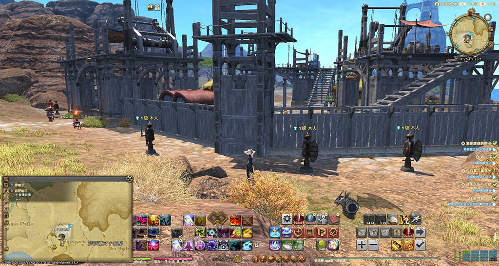

毒蝎交易所<Pos name="西萨纳兰" :x="25.4" :y="26.7" />
;;;
;;;.guide .col .figcap
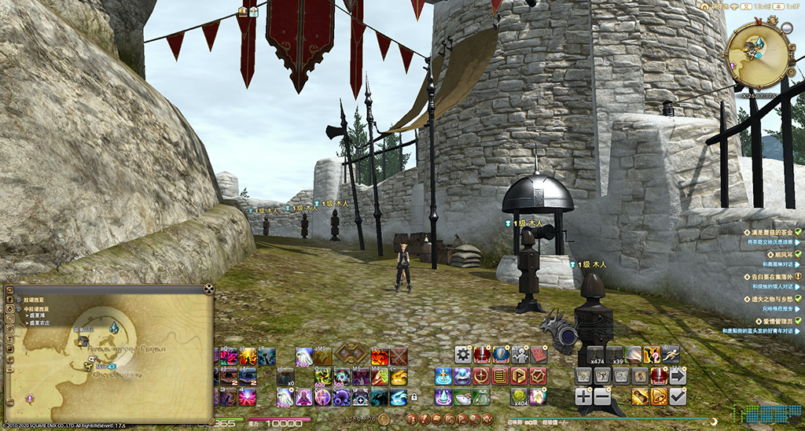

盛夏农庄<Pos name="中拉诺西亚" :x="26.0" :y="17.5" />
;;;
;;;

;;;
;;;

;;;.guide .cols2
;;;.guide .col .figcap
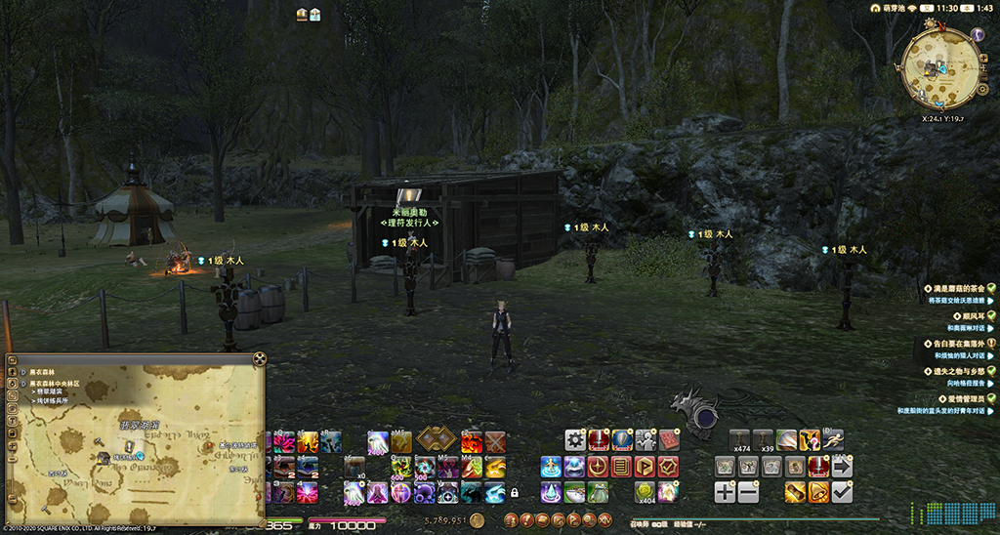

烤饼练兵所<Pos name="黑衣森林中央林区" :x="24.1" :y="19.7" />
;;;
;;;.guide .col .figcap

白云崖前哨<Pos name="库尔札斯中央高地" :x="13.1" :y="17.0" />
;;;
;;;

### 50级木桩
;;;
;;;

;;;.guide .cols2
;;;.guide .col .figcap
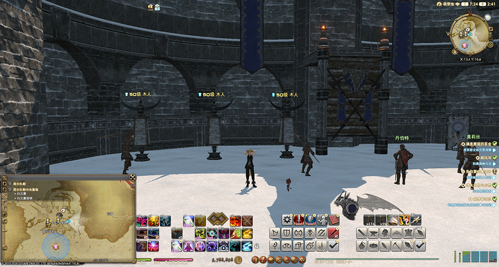

白云崖前哨<Pos name="库尔札斯中央高地" :x="13.3" :y="16.8" />
;;;
;;;.guide .col .figcap
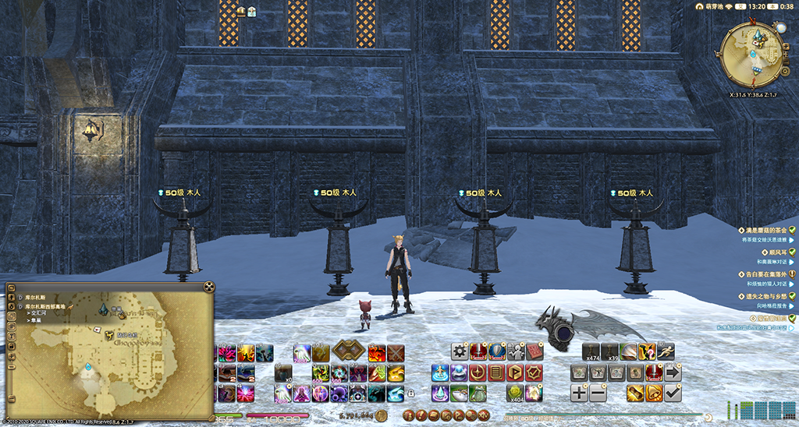

隼巢<Pos name="库尔札斯西部高地" :x="31.5" :y="38.6" />
;;;
;;;

;;;
;;;

;;;.guide .cols2
;;;.guide .col .figcap
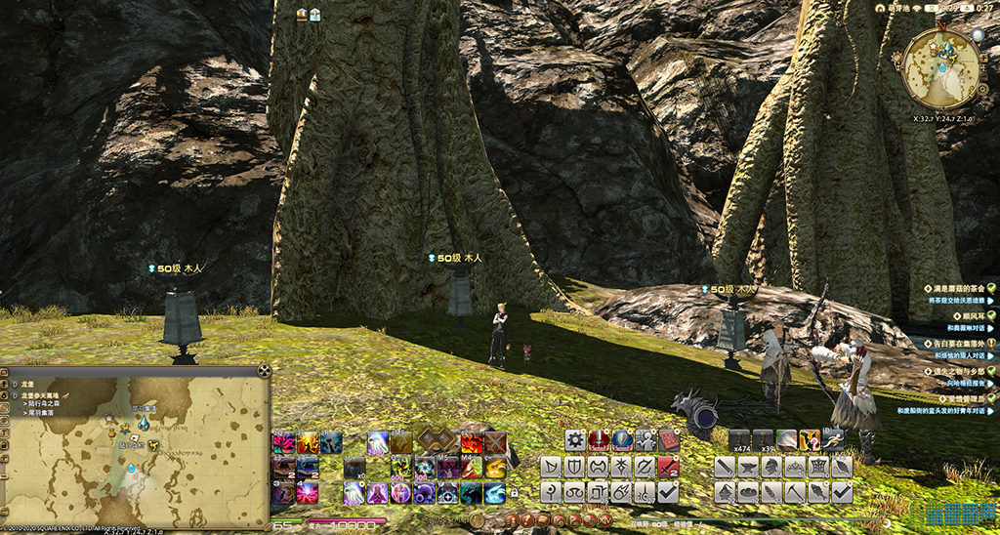

尾羽集落<Pos name="龙堡苍天高地" :x="32.7" :y="24.7" />
;;;
;;;.guide .col .figcap
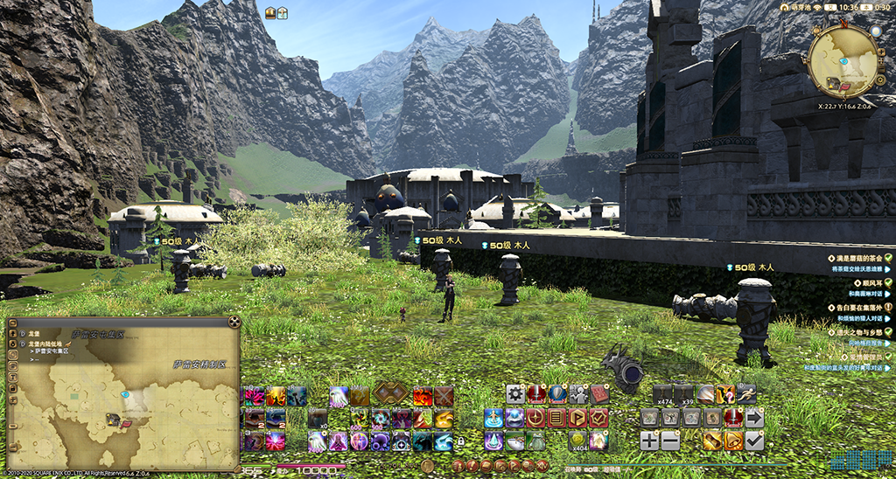

萨雷安屯集区<Pos name="龙堡内陆低地" :x="22.7" :y="16.6" />
;;;
;;;

### 60级木桩
;;;
;;;

;;;.guide .cols3
;;;.guide .col .figcap
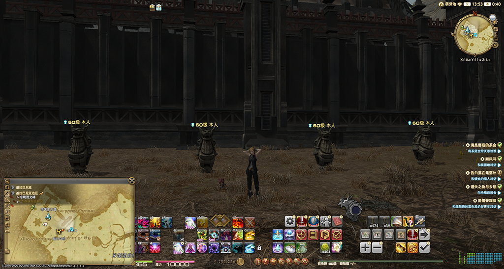

帝国东方堡<Pos name="基拉巴尼亚边区" :x="10.0" :y="11.9" />
;;;
;;;.guide .col .figcap
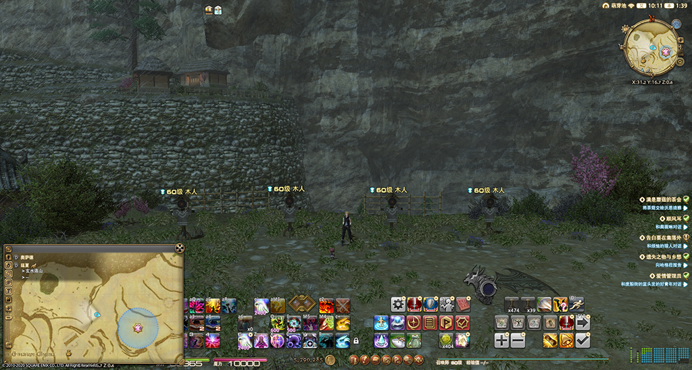

茨菇村<Pos name="延夏" :x="31.2" :y="16.7" />
;;;
;;;.guide .col .figcap
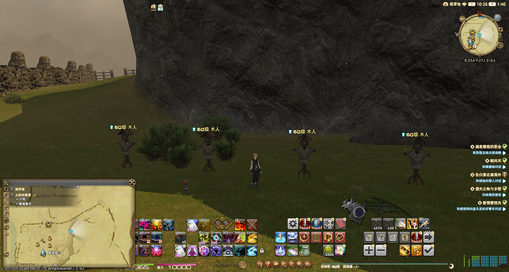

重逢集市<Pos name="太阳神草原" :x="33.9" :y="27.1" />
;;;
;;;

### 70级木桩
;;;
;;;

;;;.guide .cols3
;;;.guide .col .figcap
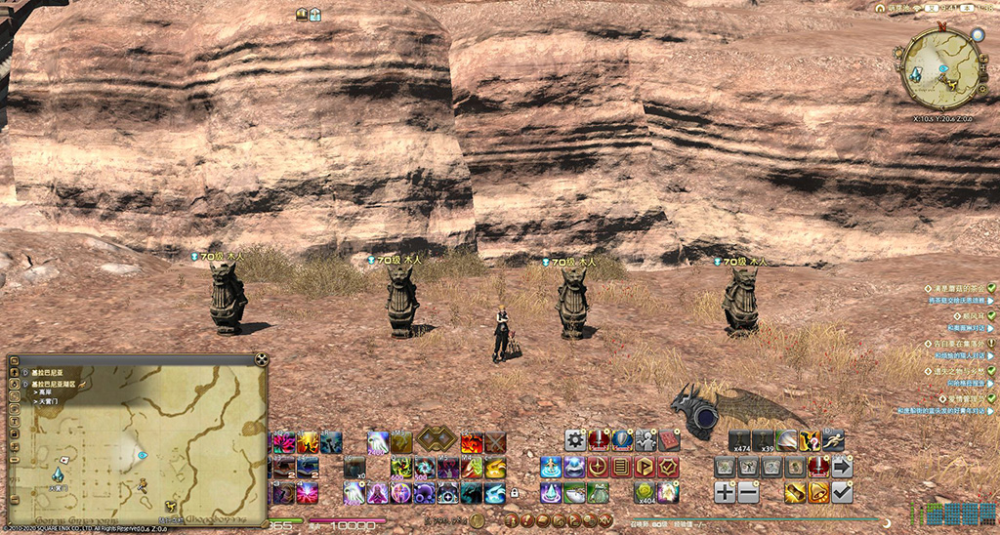

天营门<Pos name="基拉巴尼亚湖区" :x="10.5" :y="20.6" />
;;;
;;;.guide .col .figcap
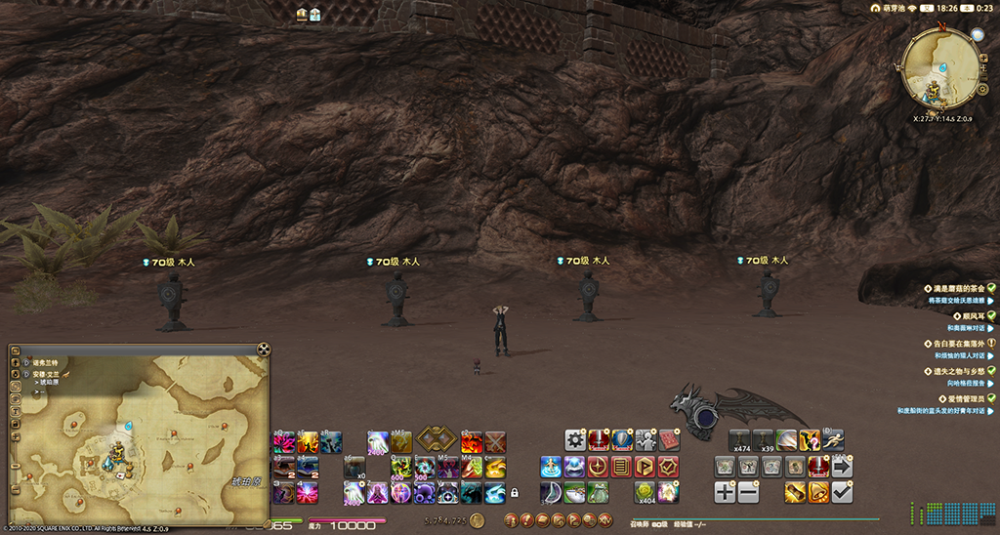

鼹灵集市<Pos name="安穆·艾兰" :x="27.7" :y="14.5" />
;;;
;;;.guide .col .figcap
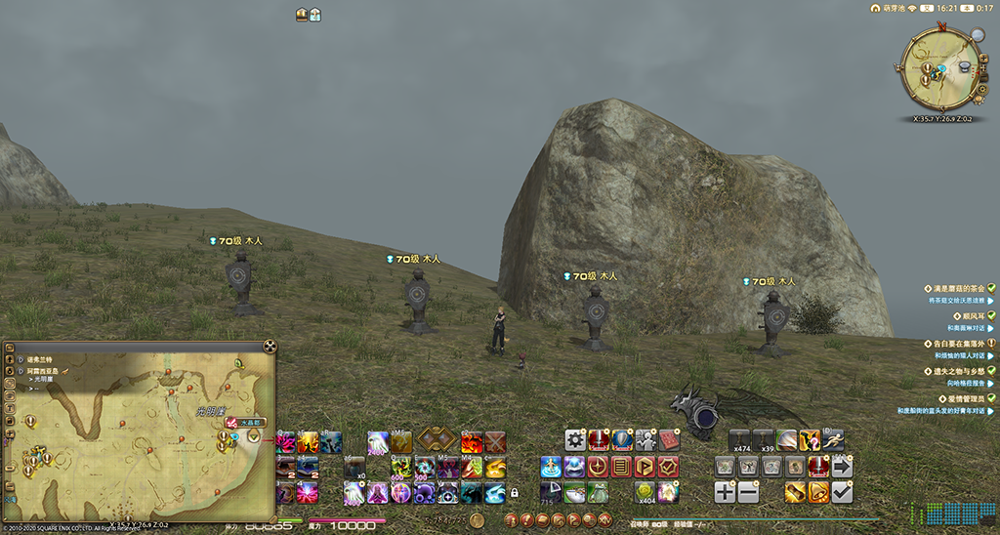

滞潮村<Pos name="珂露西亚岛" :x="35.7" :y="26.9" />
;;;
;;;

### 80级木桩

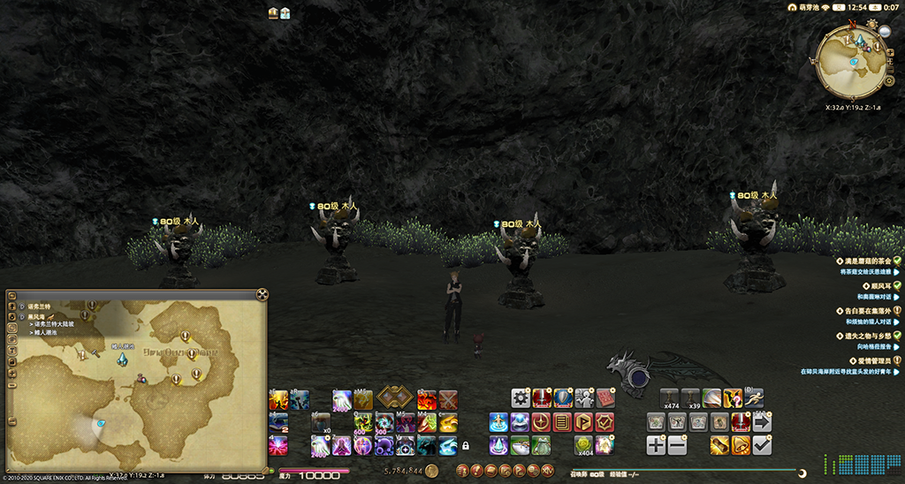

鳍人謿池<Pos name="黑风海" :x="32.0" :y="19.2" />

## PVP木桩

PVP有完全独立于PVE的专属技能及其效果，在参与PVP之前，调整并熟悉技能是非常重要的。

;;;
;;;

;;;.guide .cols2
;;;.guide .col .figcap
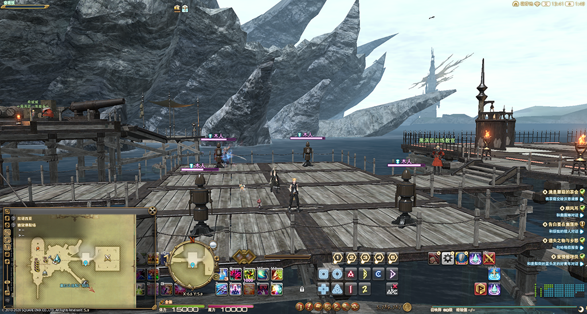

狼狱停船场<Pos name="狼狱停船场" :x="6.5" :y="5.9" />
;;;
;;;.guide .col .figcap
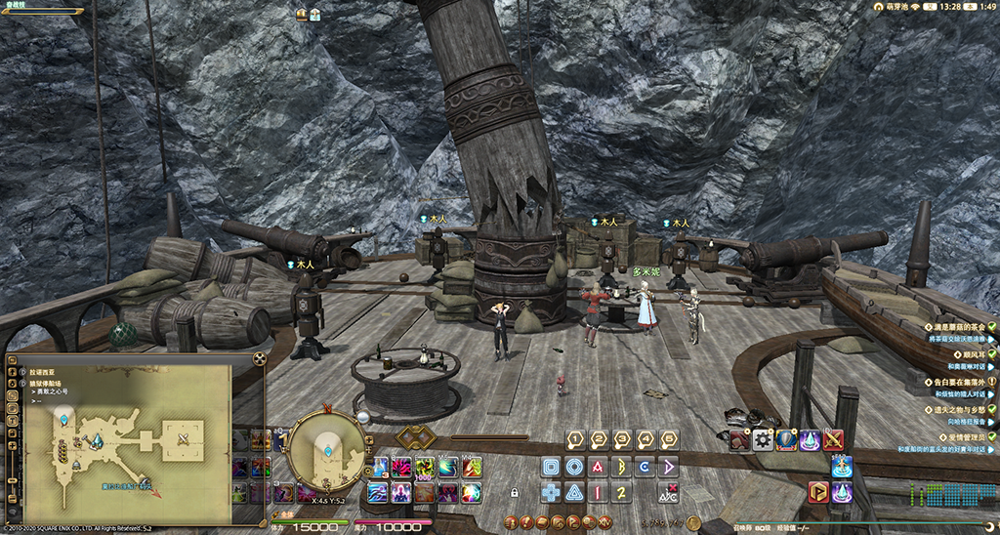

狼狱停船场<Pos name="狼狱停船场" :x="4.5" :y="5.2" />（二层甲板）
;;;
;;;