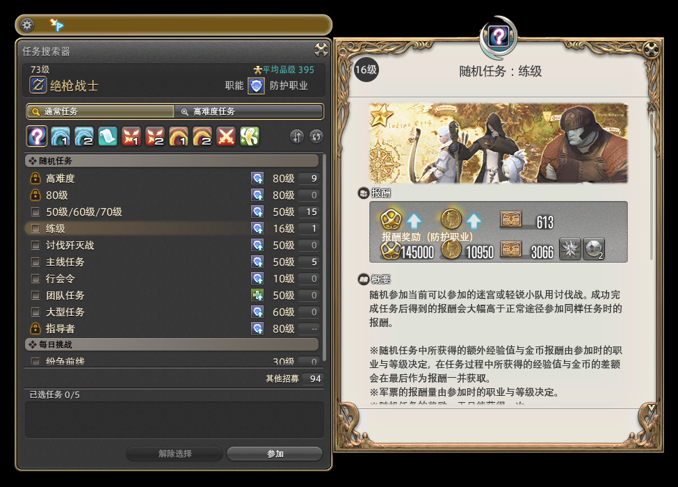
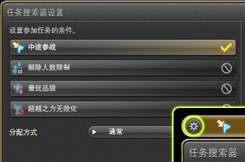

# 关于副本

副本是MMORPG游戏的最大乐趣之一，只要保持礼貌和谦虚的态度，就可以收获非常多快乐。

在菜单-任务情报-任务搜索器（默认快捷键`U`）可以打开任务搜索器，勾选自己想要参加的副本并点击下方的==参加==，就可以由系统自动匹配其他玩家。

在参加副本时，预习攻略是非常有礼貌的行为，本站准备了尽可能无剧透的简洁[副本攻略](/duty/)，可以放心阅读。如果想要挑战高难度副本，可以参考[挑战副本](/topic/raid.md)介绍了解。

## 副本交流

在副本中，你会与同副本的玩家组成一个小队，聊天频道会为这个小队形成专用的小队频道，在这个频道里的聊天内容，其他人不会看到。在聊天框里输入`/p`，或者点击输入框前面的小气泡，并选择“小队”，就可以在小队里发言了。

默认小队频道的聊天颜色是亮蓝色，如果看到聊天窗口中有亮蓝色的文字，那就是队友在说话了。如果发现队友在跟你说话，你又顾不过来打字，可以在不需要打怪的间隙先打个`==`（等于号，意思是等等），然后停下来慢慢打字。（要注意自己的发言频道，如果不是小队频道，那队友是看不到你说话的）

FF14的副本机制较为复杂， 不乏有机制杀的现象。如果是初次进本不熟悉攻略，不妨刚进本就在小队频道打字说一句“初见，请多关照”，心地善良的老司机通常会愿意一句话讲解。交流是团队合作非常重要的一部分，只要好好交流，很多问题都可以迎刃而解。

### 遇到很好的队友

;;;.guide .cols2
;;;.guide .col
 
;;;

;;;.guide .col .grow

在打完副本的最后一个BOSS之后，屏幕右下角的通知区域会弹出**最优队员推荐**的提示，点击提示，就可以打开推荐最优队员的窗口。

虽说叫“最优队员”，其实无论是努力的队员，还是有趣的队员，又或者是友善的队员，都可以为他点赞。

怀着友好愉快的心情，为你的队友点赞吧~

;;;
;;;

### 遇到出状况的队友

;;;.guide .cols2
;;;.guide .col
 
;;;

;;;.guide .col .grow

如果你的队友站在原地发呆迟迟不动，在小队频道怎么也叫不到，又或者他掉线之后再也没回来，或者他出口成脏，让人气愤，遇到这些情况都可以使用驱逐队友功能。

按`O`（或菜单 - 小队 - 小队队员）可以打开当前小队的队员列表，在你想要驱逐的玩家上右键“投票驱逐”，就可以在“离开”、“离线”、“不良行为”和“作弊行为”中选择一项，并发起驱逐投票。

这时队伍中的其他玩家会收到投票窗口，如果有超过半数的玩家同意驱逐，那么被投票的玩家就会被强制驱离该副本。

同一玩家不可连续发起驱逐投票，所以要慎重行事哦。如果遇到严重的情况，可以通过[这个平台](https://actff1.web.sdo.com/project/20210621ffviolation/index.html#/index)向游戏运营发起举报，经过运营核实，会给予违规玩家相应的惩罚。

;;;
;;;

## 随机副本

;;;.guide .cols2
;;;.guide .col

任务右侧的职能图标表示当前的稀缺职能，使用这个职能排本可以获得额外的奖励。奖励内容显示在右侧报酬奖励的第二行。
;;;

;;;.guide .col .grow

菜单-任务情报-任务搜索器（默认快捷键`U`）可以打开任务搜索器，搜索器第一页的随机任务推荐每天都打一次，每日随机会给大量经验。

如果没多少时间打随机，推荐优先打==练级==和==讨伐==，==团队任务==也可以选择，==主线任务==耗时极长但奖励极多，如果有1小时游戏时间可以打一打，剩下的不推荐。

如果不打每日随机的话，会比较容易出现等级跟不上主线要求的情况。

<IncludePage file="_includes/basic/daily.md" />

;;;
;;;

## 副本攻略

FF14的副本会随着等级的提升有明显的变化，逐渐增加的机制让副本充满变化，我们准备了没有剧透的简易文字攻略，如果遇到问题可以及时查看。

[副本攻略](/duty/)，另外也推荐[副本机制综合介绍视频(大约15分钟)](https://www.bilibili.com/video/av17541239/)。

## 招募

;;;.guide .cols2
;;;.guide .col

;;;

;;;.guide .col .grow

在菜单-小队-队员招募中可以打开招募板，国服玩家大都通过招募板进行高难度副本或其他游戏内容的组队。

未开放的内容会显示为++未开放任务++，新人玩家可以在招募板上**吃宝宝**(不知道吃宝宝什么意思？[点我学黑话](/advanced/glossary.md)，通常非当前版本的Raid副本也会通过招募+[解除限制](#副本解除限制)的方式进行速刷。

当然招募板上还会有固定队组队的招募、RP店的广告、商人出售装备的广告等等（如果看到有买卖金、买卖房的广告请不要相信，顺手点一波举报维护游戏环境哦~[违规处理平台](https://actff1.web.sdo.com/project/20210621ffviolation/index.html#/index)）。

;;;
;;;

## 排本设置

;;;.guide .cols2
;;;.guide .col

;;;

;;;.guide .col .grow

在副本搜索器左上角有一个小齿轮，点开后可以打开排本设置。

- 中途参战：可以加入正在补充队员的副本任务中。
- 解除人数限制（俗称解限）：可以以任意人数参与副本任务，不会发生等级、装备品级同步。（解限后无法获得经验值，也无法获得怪物掉落物，但是可以获得关底宝箱）。
- 等级同步：令副本的等级同步生效。
- 最低品级：将等级和装备品级同步到副本的最低要求。
- 超越之力无效化：不可获得超越之力。
- 自由探索：副本内将不会出现怪物，玩家可以在副本内骑乘坐骑、切换职业，自由移动。并且可以在副本内放置木桩，自由使用极限技。（主要用来拍照）。
- 分配方式：可以将战利品的分配方式改为仅限贪婪或队长分配。

设置的更多信息可以在游戏内查看。

;;;
;;;

## 副本录像

FF14为部分高难度副本提供“录像”功能。每个版本可供“录像”的副本任务都不相同，版本更新之后，以往的录像可能会无法播放。

首先需要在==菜单 - 任务情报 - 任务回顾==中启用任务记录设置，接下来在进入可录像的副本之后，需要在5分钟内进行“记录准备确认”。

当小队队员全部同意后，会进行战斗倒计时并开始记录。接下来团灭了的话，也推荐使用战斗倒计时功能来进行倒计时（这样录像会自动分段）。

录像记录最多保存3场（以进入副本任务，并全员确认记录准备开始，到退出副本任务为一场），新的录像会自动覆盖最早的录像。

;;;.guide .cols2
;;;.guide .col

;;;

;;;.guide .col .grow

录像过的副本，可以在主城的旅馆里进行回放。进入旅馆后，打开==菜单 - 任务情报 - 任务回顾==窗口，就可以看到录像记录。

在回放的过程中，玩家可以选择自己、队友，甚至BOSS为主视角，欣赏自己的英姿，或观察队友的走位，或者看看出糗搞笑的瞬间。

::: collapse 播放器按钮说明
（1）播放／暂停
（2）播放速度：1倍速
（3）播放速度：2倍速
（4）播放速度：4倍速
（5）设置/解除焦点目标
（6）显示/隐藏HUD
（7）显示帮助
（8）启动集体姿势
（9）启动景观摄像
（10）下一章
（11）上一章
（12）选择章节
（13）回顾播放中的图标
（14）回顾结束
:::

;;;
;;;
