# 染色与投影
<FloatTOC />
玩家可以对身上的装备进行染色，另外也可以把高等级的装备投影成低等级的样子，更可以保存投影模板，方便随时随地换装。

++FF14游戏中并没有所谓“时装”的东西，好看的衣服通常会作为1级装备存在（当然很多高等级的装备也很好看）++。

## 装备染色

;;;.guide .cols2
;;;.guide .col

;;;
;;;.guide .col
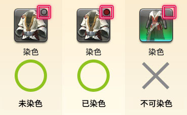
;;;
;;;

图标右上角有点或十字标记的道具都可以进行染色（武器、装备、饰品、家具），而染剂则可以通过生产、NPC商人、市场板交易等方式获得。

;;;.guide .cols2
;;;.guide .col
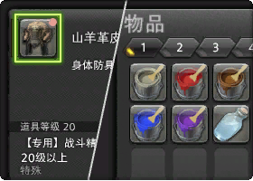
;;;

;;;.guide .col .grow

完成任务<quest name="色彩斑斓的世界" type="plus"/>，就可以使用染剂给装备染色了。

;;;
;;;

装备的染色，首先要从技能列表中使用“染色”技能。

另外，直接在想要染色的物品上点击右键，在子命令中选择染色也可以。

::: collapse 染色步骤介绍

##### ① 打开技能列表，选择“染色”技能！

;;;.guide .cols2
;;;.guide .col
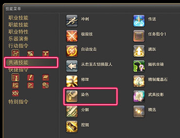
;;;

;;;.guide .col .grow
从快捷指令 > 角色 > 技能列表里的共通技能中选择“染色”技能。

Tips:
经常染色的话，也可以把这个技能放在热键栏上，就可以立刻打开染色窗口。
;;;
;;;

##### ② 选择想要染色的装备！

;;;.guide .cols2
;;;.guide .col

;;;

;;;.guide .col .grow
从染色窗口的列表中，选择想要染色的装备。

**想给装备以外的物品染色**
从下拉菜单中选择其他筛选方式查看
;;;
;;;

##### ③ 确认想要染色的物品，选择染剂！

;;;.guide .cols2
;;;.guide .col

;;;

;;;.guide .col .grow
确认想要染色的物品，从染剂列表中选择色系和具体颜色，然后点击“开始染色”。

**圆形的图标：**切换色系
**方形的图标：**选择染剂

※方形图标上打叉的话，表示你没有这个颜色的染剂，因此无法进行染色。
;;;
;;;

##### ④ 染好了

;;;.guide .cols2
;;;.guide .col

;;;

;;;.guide .col .grow
装备染色完成了。
快看看吧！

※染过色的物品图标右上角，会有染剂色系的标记。
※具体染剂的名称，可以从装备信息中查看。
;;;
;;;

##### 从图标的子命令染色

;;;.guide .cols2
;;;.guide .col

;;;

;;;.guide .col .grow
打开角色或者兵装库，右键想要染色的装备，然后选择“染色”，也可以进行染色。

※背包中的物品也可以使用同样的方法染色。
;;;
;;;

:::

### 想把染过色的装备恢复成原来的颜色

;;;.guide .cols2
;;;.guide .col
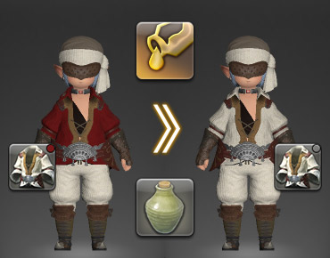
;;;

;;;.guide .col .grow
想把装备恢复成原色，就需要使用<item name="松节油" />了。1瓶松节油可以去除1件物品上的染色。

松节油可以从市场布告板或者NPC商店中购买。
;;;
;;;

## 武具投影

;;;.guide .cols2
;;;.guide .col
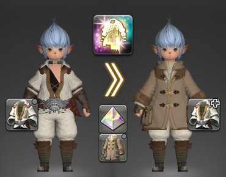
;;;
;;;.guide .col
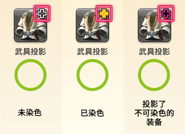
;;;
;;;

学会武具投影技能之后，就可以改变装备的外观了。武具投影需要使用被称作<Item name="幻象棱晶" />的触媒来进行。

完成支线任务<Quest name="华丽的投影世界" />就可以获得武具投影技能。15级就可以接取这个任务了，快点去完成吧！

武具投影可以通过技能列表，子命令，旅馆的投影台进行。

**武具投影的状态**
武具投影的状态和染色状态一起，显示在物品图标的右上角。

※性别、种族、职业等等因素导致装备角色无法装备投影物品时，投影效果不会显示。

;;;.guide .cols2
;;;.guide .col
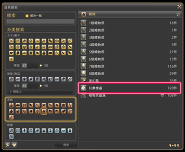
;;;

;;;.guide .col .grow

幻象棱晶是武具投影所必须的触媒物品。

每进行1次武具投影，就要使用1枚幻象棱晶。提前准备好需要投影的棱晶数量吧。

幻象棱晶除了可以从市场布告板、大国防联军的补给负责人那里弄到，也可以学习秘籍之后，通过能工巧匠职业制作。

完成支线任务<Quest name="美与幻影的秘籍" />之后，就可以从格贝林<Pos name="西萨纳兰" :x="12.2" :y="15.1" />、塔塔罗伽<Pos name="摩杜纳" :x="22.2" :y="6.8" />那里购买到相关秘籍。
;;;
;;;

武具投影，首先要从技能列表中使用“武具投影”技能。
另外，直接在想要投影的物品上点击右键，或者从旅馆的投影台中也可以进行相同的操作。

::: collapse 武具投影步骤介绍

;;;.guide .cols2
;;;.guide .col
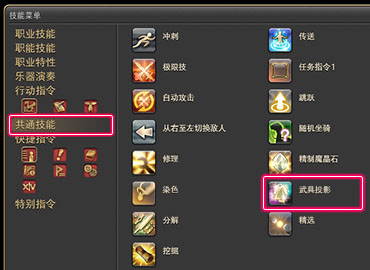
;;;

;;;.guide .col .grow
从快捷指令 > 角色 > 技能列表里的共通技能中选择“武具投影”技能。

Tips:
经常投影的话，也可以把这个技能放在热键栏上，就可以立刻打开武具投影窗口。
;;;
;;;

##### ② 从武具投影的窗口中，选择作为基础的投影道具！

;;;.guide .cols2
;;;.guide .col

;;;

;;;.guide .col .grow
从武具投影窗口的列表中，选择想要改变外观的装备（基础物品），以及想要显示的外观装备（投影物品）。

基础物品选择之后，右侧就会显示出可以投影的物品了。

**想要对装备物品以外的物品进行投影**
从下拉菜单中选择其他筛选方式查看
;;;
;;;

##### ③ 从武具投影的窗口中，选择“武具投影”！

;;;.guide .cols2
;;;.guide .col
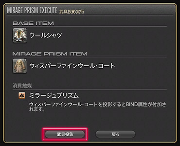
;;;

;;;.guide .col .grow
在窗口中确认要进行的投影内容，按武具投影按钮。

※进行武具投影时会消耗1枚幻象棱晶。
※进行武具投影后，投影物品会附加绑定属性。
;;;
;;;

##### ④ 完成了！

;;;.guide .cols2
;;;.guide .col

;;;

;;;.guide .col .grow
武具投影完成了。
快看看吧！

※投影过的物品图标右上角，会显示表示武具投影状态的十字标记。
※另外，对投影过的装备又染了色的情况，十字标记的中央会显示染剂的色系。
;;;
;;;

##### 从图标的子命令进行武具投影

;;;.guide .cols2
;;;.guide .col
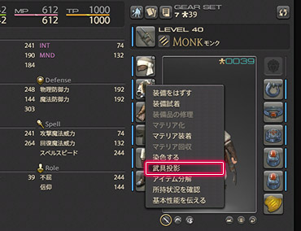
;;;

;;;.guide .col .grow
打开角色或者兵装库，右键想要投影的装备，然后选择“武具投影”，也可以进行武具投影。

※背包中的物品也可以使用同样的方法投影。
;;;
;;;

:::

::: collapse 使用投影台进行投影

;;;.guide .cols2
;;;.guide .col
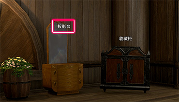
;;;

;;;.guide .col .grow
在旅馆的客房里找到投影台。

所有主城（利姆萨·罗敏萨、乌尔达哈、格里达尼亚、伊修加德、黄金港、水晶都、旧萨雷安）都有旅馆，在地图上有床铺图标的地方即是。

;;;
;;;

##### 把装备投影化

;;;.guide .cols2
;;;.guide .col
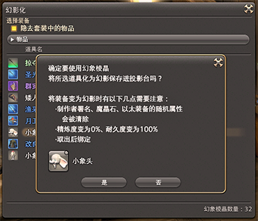
;;;

;;;.guide .col .grow
在弹出的列表中找到想要使用的装备，并将其幻影化

※幻影化的时候需要消耗1枚幻象棱晶。
※幻影化的装备取出时会附加绑定属性，同时装备上原有的制作者署名、镶嵌的魔晶石、精炼度都会清空。

;;;
;;;

##### 编辑保存投影模板

;;;.guide .cols2
;;;.guide .col
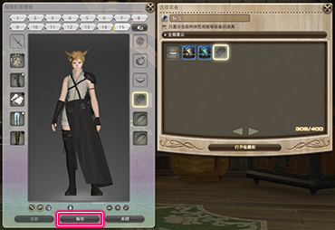
;;;

;;;.guide .col .grow

点击投影台下方的**编辑投影模板**按钮，就可以开始制作投影模板了。
※制作投影模板时可以选择使用收藏柜中的装备，收藏柜可以收藏节日活动等特殊装备。
※投影模板不用全部添加，留空的部位会保留装备原来的外观。

制作好投影模板后，点击下方的**保存**按钮，就可以保存投影模板了！
※制作好的投影模板可以直接点击保存左侧的**投影**进行整套投影。
;;;
;;;

##### 使用投影模板

;;;.guide .cols2
;;;.guide .col
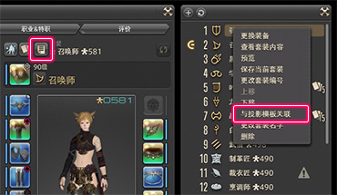
;;;

;;;.guide .col .grow

点击角色信息上方的**投影模板**按钮，就可以随时使用投影模板进行投影。

点击角色信息上方的**套装列表**按钮，就可以将投影模板绑定到套装上，这样当你每次切换职业的时候，都可以自动套用投影模板了。
;;;
;;;

:::

##### 武具投影与投影台的区别

  <table class="ui compact grey striped unstackable table">
    <thead>
      <tr>
        <th style="width:3.5em"></th>
        <th style="17em">直接投影</th>
        <th style="23em">投影台 + 投影模板</th></tr>
    </thead>
    <tbody>
      <tr>
        <td>优点</td>
        <td>简单，方便，快捷， 只要有棱晶，随时随地都可以操作</td>
        <td>频繁切换原始装备的时候，可以更快地投影（并且不再消耗棱晶）。
           可以为不同职业的共通装备准备不同的投影模板（模板可直接绑定套装，在套装上右键就可以看到选项）。</td></tr>
      <tr>
        <td>缺点</td>
        <td>
        <ul>
            <li>必须保留外观装备占格子。</li>
            <li>棱晶消耗较大，每更换一次原始装备，都需要重新消耗棱晶投影。不能为共通装备准备不同投影（否则消耗棱晶剧增）。</li></ul>
        </td><td>
        <ul>
            <li>准备手续较为复杂，并且只能在主城旅馆里准备。</li>
            <li>所有部位加起来一共只能存放 400 个幻影</li>
            <li>一共只能储存 15 套模板。</li>
            <li>只能在安全区使用（野外或副本里不能用）</li></ul>
        </td>
        </tr>
    </tbody>
  </table>

### 想要解除武具投影

;;;.guide .cols2
;;;.guide .col
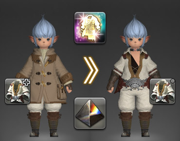
;;;

;;;.guide .col .grow
想要把投影过的装备变回原来样子，就需要使用<item name="驱幻晶" />。

每使用1枚驱幻晶，可以解除1件物品上的投影。

驱幻晶可以通过市场布告板或NPC商店获得。
;;;
;;;

### 想让装备变透明

;;;.guide .cols2
;;;.guide .col
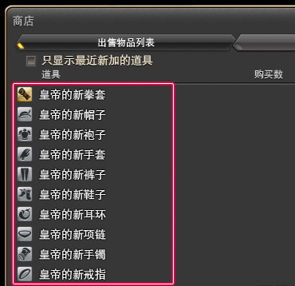
;;;

;;;.guide .col .grow
使用<item name="皇帝的新" search/>系列装备进行武具投影，就可以让装备变成透明的。

根据所要投影的物品部位不同，不仅能让防具、饰品透明，甚至可以让拳套、盾牌变透明。

完成支线任务<quest name="美与幻影的秘籍" type="plus"/>之后，就可以从格贝林<Pos name="西萨纳兰" :x="12.2" :y="15.1" />、塔塔罗伽<Pos name="摩杜纳" :x="22.2" :y="6.8" />那里购买到这些装备了。

※ 这些商店根据玩家条件不同，会出售的物品也会有所区别。
;;;
;;;

> * [发光武器介绍](/topic/shine.md)
> * [外观检索、获取指南](https://bbs.nga.cn/read.php?tid=14869355)
> * [时装套装介绍](https://ff14.huijiwiki.com/wiki/%E6%97%B6%E8%A3%85%E5%A5%97%E8%A3%85)
