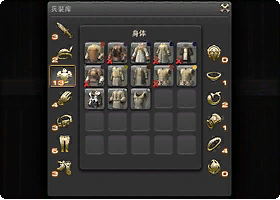
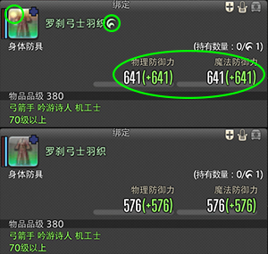
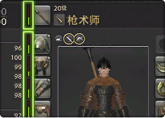
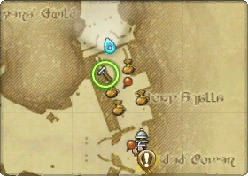
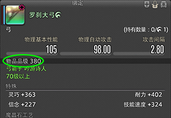
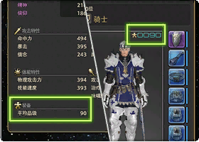
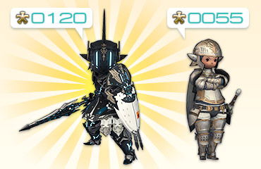
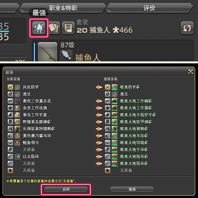

# 装备
<FloatTOC />
主线任务<quest name="备战" type="main"/>/<quest name="猛者的风度" type="main"/>/<quest name="佣兵之道" type="main"/>任务要求“希望冒险者能备齐一身足以胜任工作的装备。在头部、身体、手臂、腿部、脚部装备上品级5级以上的防具。”，在任务点附近的修理工兼杂货商处就可以购得所需装备。

> 本节介绍装备的强度与分类，如果想要改变装备的颜色或样子，请阅读[装备外观](/basic/equip-looking.md)小节。

## 兵装库

;;;.guide .cols2
;;;.guide .col

;;;

;;;.guide .col .grow

在最终幻想14中，武器、获得防具这些装备的时候，会放进专门收纳它们的格子里。要在兵装库中找到它们（默认快捷键`Shift`+`I`，或者从菜单 > 角色中找到==兵装库==）。

※ 兵装库满了的话，就会放到背包里。

Tips：
可以在角色设置 > 物品设置中改变收纳的优先级。

打开兵装库，右键点击想要装备的物品，在弹出的子命令中选择 “装备” 就可以了。

;;;
;;;

## 装备分类

;;;.guide .cols2
;;;.guide .col

;;;

;;;.guide .col .grow

FF14的装备图标有多种颜色，但是这些图标颜色与装备的强度毫无关系，这些颜色一般标示装备的来源（比如白装一般是生产制作，或者NPC就能买到的，绿装通常是4人副本掉落的，当然也有一些生产出来的绿装）。

最简单区分装备好坏的方式就是查看装备品级。部分装备带有<i class="xiv hq"></i>（HQ）标记，带有<i class="xiv hq"></i>标记的装备会比没有HQ标记的同名装备属性更高。

;;;
;;;

## 装备修理

;;;.guide .cols2
;;;.guide .col

;;;

;;;.guide .col .grow

玩家使用中的装备，只要进行各种活动（战斗、生产、采集），就会消耗装备的耐久度，可以在角色信息（菜单 > 角色 > 角色，默认快捷键`C`）界面的缩略图中看到，也可以在装备信息中查看。

当装备耐久降到0之后，装备就“烂掉了”，所有属性都将无法生效，因此要记得及时修理装备。

可以在遍布各地的修理工那里修理装备，修理费会根据装备等级和剩余耐久度计算。

※ 如果你有生产职业，也可以自己修理对应职业的装备。

;;;
;;;

## 装备信息

;;;.guide .cols2
;;;.guide .col

;;;

;;;.guide .col .grow

装备基础信息下面会标记**品级**，品级是衡量一件装备好坏最直接的标准，品级470的装备一定比450的好（满级后个别极端情况除外）。品级下面显示该装备适用的职业和等级，战斗精英为所有物理职业都可以穿着，魔法导师则是所有魔法职业才能穿着，能够穿着的装备这里会显示为绿色。

装备属性下方显示该装备的具体属性和魔晶石镶嵌孔，在满级之前都不必考虑镶嵌魔晶石的问题，只要努力提升装等即可。但适当制造魔晶石，也有机会以比较理想的价格出售。关于如何获得魔晶石、镶嵌魔晶石的方法请参考[这个页面](https://ff14.huijiwiki.com/wiki/魔晶石)。

;;;
;;;

;;;.guide .cols2
;;;.guide .col
 
;;;

;;;.guide .col .grow

角色的平均装等就是你身上所有装备品级的平均数，显示在你角色信息栏的右上方，以及角色信息（菜单 > 角色 > 角色，默认快捷键`C`）界面左下角==装备==分类下，通常在游戏中问装等的时候，都是问的平均装等。/

;;;
;;;

::: collapse 各等级推荐装等

对于50级以下的职业来说，只要平均装等不低于你当前等级10级，都是可以安然无恙的（<Role name="tank" />T职业在副本中，最好把装等与等级差控制在5以内，否则对<Role name="healer" />治疗将是比较困难的挑战）。

;;;.guide .cols2
;;;.guide .col
 
;;;

;;;.guide .col .grow

- 50级初始装等是<i class="xiv ilv"></i>90，主线任务会赠送<i class="xiv ilv"></i>110装备，完成所有50级主线（或使用主线包）进入伊修加德后装等应该<i class="xiv ilv"></i>115以上，若装等不足需使用诗学点数兑换<i class="xiv ilv"></i>130装备。如果你有一身<i class="xiv ilv"></i>130品级的装备，则能够游刃有余地升到55级左右，之后需要换上副本装或任务赠送的装备。
- 60级的初始装等是<i class="xiv ilv"></i>150，直升包会赠送<i class="xiv ilv"></i>270的装备，60级主线会赠送<i class="xiv ilv"></i>240装备，诗学点数可以兑换<i class="xiv ilv"></i>270装备。如果你之前准备了一身270装备，可以顺利用到65级，之后主线或副本赠送的高品级装备请务必及时换上。
- 70级的初始装等是<i class="xiv ilv"></i>290，直升包会赠送<i class="xiv ilv"></i>400的装备，70级主线<quest name="探秘" type="main" />会送一套<i class="xiv ilv"></i>370装备，诗学点数可以兑换<i class="xiv ilv"></i>400装备。如果你之前准备了一身<i class="xiv ilv"></i>400的装备，可以顺利用到75级，之后副本或主线赠送的装备需要及时更换。
- 80级的初始装等是<i class="xiv ilv"></i>430，直升包会赠送<i class="xiv ilv"></i>530的装备，80级主线<quest name="此方与彼方" type="main" />会送一套<i class="xiv ilv"></i>500装备，诗学点数可以兑换<i class="xiv ilv"></i>530装备。如果你之前准备了一身<i class="xiv ilv"></i>530的装备，可以顺利用到85级，之后副本或主线赠送的装备需要及时更换。

;;;
;;;

:::

> [使用亚拉戈神典石兑换高级装备](/advanced/currency.md#战斗通货)

## 套装保存

;;;.guide .cols2
;;;.guide .col

;;;

;;;.guide .col .grow

在完成10级职业任务之后，就可以自由学习其他职业，并且开放==兵装库==功能了。

兵装库用来储存玩家所有的装备（兵装库放满之后会自动放入背包），并且提供套装保存（套装列表中保存好的套装，可以拖到快捷栏中）。

;;;
;;;

;;;.guide .cols2
;;;.guide .col

;;;

;;;.guide .col .grow

在玩家完成30级职业任务之后，获得灵魂水晶，装备灵魂水晶后就变为特职职业了。习得特职之后记得保存带灵魂水晶的套装，避免使用基础职业进行游戏。

;;;
;;;

### 一键最强装备

另外游戏提供方便的一键最强功能，系统会自动选择你身上符合你职业需求的最强装备，在练级阶段可以经常使用该功能更新装备（记得保存套装哦）。

;;;.guide .cols2
;;;.guide .col

;;;

;;;.guide .col .grow
打开角色窗口，点击上方的“最强”按钮。

确认切换的装备列表，没问题的话就点“应用”按钮。

※发生变化的装备会有<i class="xiv arrow-right"></i>符号。
※如果有占用多个装备部位的装备的话，会显示“无装备”。

※变更装备之后，记得登记到套装中吧。登记之后，就可以一键切换套装了。
;;;
;;;