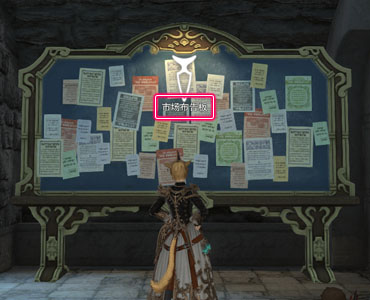
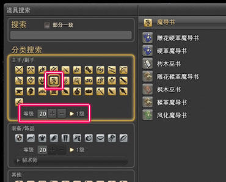
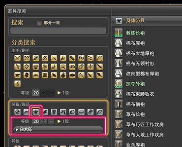
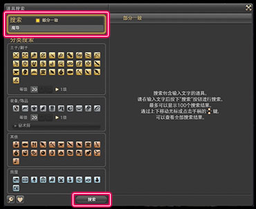
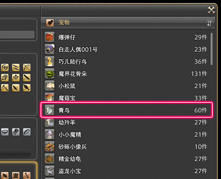
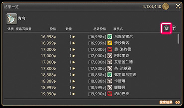
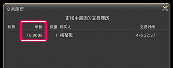

# 道具与背包
玩家获得的道具会放在背包中（默认快捷键`I`），背包默认有140个格子，可以在[角色设置](/basic/config.md)中将背包展开为单页布局。

背包中还有一个单独的“任务道具与水晶”分页，水晶是[生产制作](/topic/craft.md)时所需的媒触，任务道具则是一些只能在任务中使用的物品，物品名通常是橙黄色的，如果你在背包中找不到某样道具，也可以在任务道具分栏里找找看。

装备有单独的存储空间，名为==兵装库==（默认快捷键`Ctrl+I`），按装备部位分栏，如果兵装库满了，获得的装备会自动进入背包（如果背包也满了，则会提示无法获得）。可以在角色设置中，将获得装备时的默认收纳改为背包。

## 背包扩展

在完成陆行鸟相关任务<quest name="可靠的搭档" type="plus" />后，会获得==陆行鸟鞍囊==（俗称鸟包，默认快捷键`Ctrl+Shift+I`），鸟包只能在副本以外的地区打开，算是随身携带的扩展包。

在[后勤补给站](https://actff1.web.sdo.com/project/141028dgf/index.html)可以购买神典石服务，能游戏内开启第二个陆行鸟鞍囊，但需要保持续费（15元/月）才能一直使用。

完成17级主线之后，可以在市场雇佣雇员，作为仓库和销售的渠道，关于雇员的具体介绍请[查看本页](/advanced/retainer.md)。

::: segment green
### 道具检索

在消息栏中输入`/道具检索 关键字`，就可以在装备中的物品、背包、陆行鸟鞍囊、兵装库、雇员物品栏、收藏柜、投影台中检索拥有该关键字的物品。在检索结果列表中<i class="xiv mouse-right-button"></i>右键道具名字，并选择==查看持有情况==，就能看到这件物品目前的位置了。

如果长时间未使用雇员、鸟包、幻化台，道具检索会无法检索到这些地方的物品（提示“该搜索结果可能无法反映当前最新的情报。”），建议在开始检索之前打开一次雇员、鸟包。
:::

## 市场交易

绝大部分道具都可以在市场上交易，不可在市场交易的物品，会在其信息栏最下方标识==不可在市场出售==。

;;;.guide .cols2
;;;.guide .col

;;;

;;;.guide .col .grow
玩家可以在各个主城、住宅区设置的市场布告板上使用市场功能。

地图上标记有板子图标的位置就是市场布告板。

※所有市场布告板上的出售列表是共通的。
※出售物品需要通过雇员进行，记得去雇佣雇员哦。

> [雇员介绍](./advanced/retainer.md)

;;;
;;;

像是装备这种数量太多，不容易找到想要物品的时候，可以使用分类搜索，限制装备等级、适合职业等条件，筛选搜索结果。

;;;.guide .cols2
;;;.guide .col .figcap .grow

**想找主/副手**
选择分类，输入装备等级，点击下方的搜索按钮！
※ 排在越靠上的装备性能越好
;;;
;;;.guide .col .figcap .grow

**想找装备/饰品**
选择分类，输入装备等级和职业，点击下方的搜索按钮！
※ 排在越靠上的装备性能越好
;;;
;;;

;;;.guide .cols2
;;;.guide .col

;;;

;;;.guide .col .grow
如果只记得想要物品的部分名称，推荐使用“部分一致”搜索功能筛选物品！

在输入关键字的输入框上面，勾选“部分一致”，就可以扩大搜索范围，按`回车`键或者按下方的搜索按钮都可以。

※搜索结果显示在右边。
;;;
;;;

从市场上购买道具需要支付2%的手续费，如果想要购买昂贵的物品，也可以选择面对面交易（注意面对面交易的单笔金额上限为100万<i class="xiv gil"></i>）。装备还可以从住宅区房屋的模特上整套购买。

### 价格查询

市场中物品的售价是由冒险者自由决定的，因此相同的商品也会有价格差异。这个时候只要打开 “交易履历”，就可以比较现在的售价和过去的成交价格。出售商品时，如果不好定价，也可以参考交易履历来决定。一定要好好利用这个功能。

;;;.guide .base .cols3
;;;.guide .col

打开市场布告板，找到想要的物品。
;;;

;;;.guide .col

点击“查看市场情况”右上角的“显示履历”， 会弹出选中物品的交易履历。
;;;

;;;.guide .col

在交易履历里，可以看到过去成交的单价、数量、 购买时间以及购买人的名字等交易信息。
;;;
;;;

## 物品获取方式查询

可以从NPC购买的道具，会在道具信息上显示NPC售价，除此以外玩家很难在游戏中找到一件物品的来源和价格。

此时可以通过第三方玩家网站，查询物品获取方式及价格：

> * [FF14灰机维基物品检索器](https://ff14.huijiwiki.com/wiki/ItemSearch)
> * [加兰德数据库](https://garlandtools.cn/db/)
> * [Universalis布告板价格统计站](https://universalis.app/)