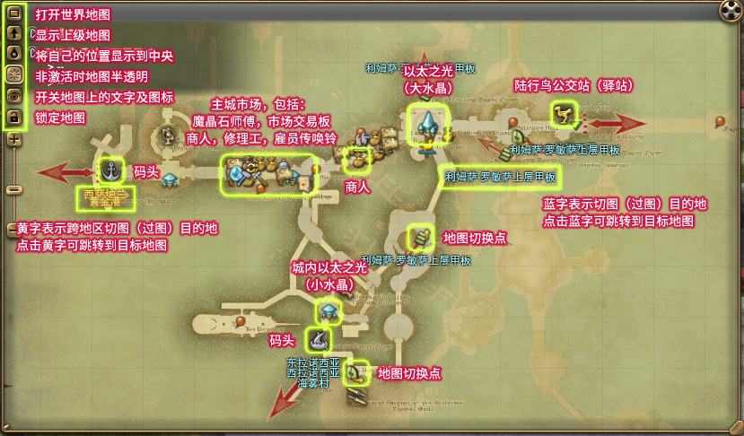
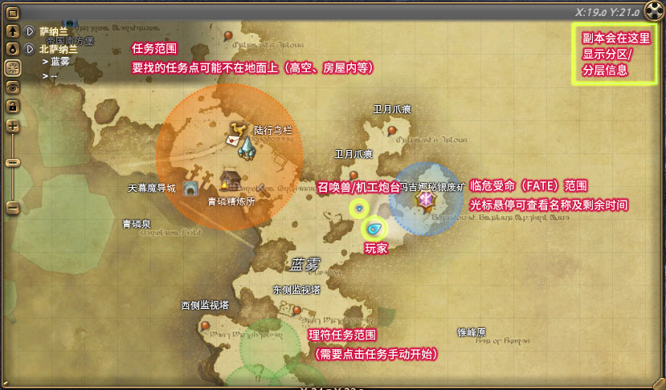
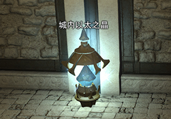
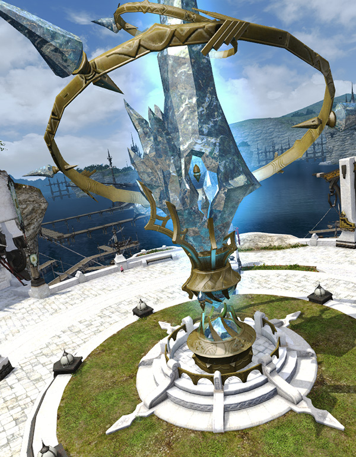
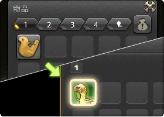
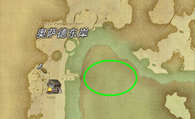

# 地图与移动

## 地图

默认界面右上角的圆形窗口小地图，点击小地图（或按键盘`M`，手柄按`X`）就能打开大地图。由于FF14不是无缝地图，因此追踪任务时需要注意观察选择路径。

另外使用鼠标滚轮可以缩放地图，地图放大到一定程度之后，会显示小地名。

FF14的任务经常带有日式游戏特有的恶意，部分任务点在屋里(楼上或地下)，山顶、水沟里，而楼梯、坡道也许并不在圈内。不要过于依赖地图，仔细观察地形。

::: collapse 如何阅读地图

扩展阅读：[萌新防迷路指南 by 延夏 千霄霄](https://img.nga.178.com/attachments/mon_201809/08/-8renrQ5-ejuqZ16T3cSm8-2am.jpg)
:::

在聊天栏中输入 `<pos> `就可以在聊天中发送自己的坐标，点击别人发送的坐标就会自动弹出地图（并有一个小旗子标志）。如果你的地图上已经有了小旗子标志，可以输入 `<flag>` 发送小旗子的坐标。

通常在野外意外被打死的时候，可以在喊话频道发送坐标求救，应该会有友善的冒险者来救你（不是NPC哦，记得跟人家道谢）~

## 移动方式

艾欧泽亚幅员辽阔，从山岳到草原，从沙漠到密林，从雪山到海底。冒险者们也因此拥有了多种多样的移动方式。

### 徒步移动

游戏中的最基本移动方式是徒步移动，通常的行进速度是小跑，轻推摇杆/按下小键盘的` / `键可以切换为走路模式（再次按下`/`键可以切回常速），游戏中提供共通技能冲刺，可以在30s内提升30%移动速度。

::: collapse 其他可以提升移动速度的方式

* <item name="赫尔墨斯之靴" />、<item name="阔步高筒靴" />：可以延长城内冲刺技能的效果时间。
* 速行：可以在战斗外提升范围内本队队员的移动速度。
* 疾风体势：可以提升武僧玩家的移动速度。
* 移动速度提高：可以提升忍者玩家的移动速度。

:::

### 驿站和码头

当玩家第一次出城，并移动到其他聚落后，点击聚落门口的<mark>陆行鸟房（呼喊石、大隼房）</mark>开启站点，就可以乘坐公交鸡在已开启站点之间移动。在公交移动路线上不会被攻击，而且在移动中可以随时跳车，也可以在鸟房租用陆行鸟自由移动（价格也不是很高，但是一次性的，下鸟就结束了）。新玩家在没坐骑、缺钱阶段推荐使用这种方式移动。

另外部分地区会有码头，或守门NPC进行传送，如果在地图上看到门、船或者锚的标记，就意味着有此类传送NPC了。

### 传送与返回

;;;.guide .cols2
;;;.guide .col

;;;

;;;.guide .col .grow

在主城和主要休息区内有小水晶，把城内小水晶都共鸣过一次之后，就可以免费在任意小水晶之间移动（城内水晶全摸过之后，还会开放通往城门的传送）。

;;;
;;;

;;;.guide .cols2
;;;.guide .col

;;;

;;;.guide .col .grow

在主要地区有大水晶，共鸣过2个大水晶之后，就可以使用传送技能或直接点击大地图上的大水晶（如果大水晶的图标被任务图标埋上了，可以按`Ctrl`把大水晶顶出来），从任意地点传送到指定大水晶（需要消耗不菲的传送费）。新人在缺钱期间，建议慎重使用传送功能（还是比较容易掏空的）。

在大水晶右键可以加入收藏或设置返回点，当玩家在野外HP减为0后，自动返回就会返回设置好的返回点，任何时候使用返回技能可以直接回到返回点（在副本内使用返回则是返回副本起点，每15分钟能使用一次）。

传送到收藏的大水晶传送费可以半价。每名玩家可以收藏3个大水晶，并设置1个返回点。

;;;
;;;

推荐每抵达一个新地方，先把大小水晶和鸟房都摸过一遍，这样以后移动起来就会方便很多啦。

###  坐骑
;;;.guide .cols2
;;;.guide .col
 
;;;

;;;.guide .col .grow

玩家完成20级主线任务<quest name="前行之路" type="main" />后，边上会有重要任务<quest name="我的专属陆行鸟" type="plus" />。只要再继续做一个主线任务，就可以获得300军票，拿着这300军票就可以去交陆行鸟任务了。[其他获得军票的方式]()。

完成任务的陆行鸟笛在背包里，右键使用之后就会进入坐骑列表。只有在主城以外的地方才能上坐骑（野外的房屋里也可以骑坐骑哦）。

要注意的是，在获得专属陆行鸟之前，从商城购买的坐骑也无法使用。

;;;
;;;

50级后开放狩猎功能，可以使用狩猎点兑换地图加速，狩猎的玩法和兑换方式[参看这个帖子](https://bbs.nga.cn/read.php?tid=13635886)。

### 飞行

在剧情前进到伊修加德之后，玩家可以解锁飞行功能了（仅限3.x以上的地图，即野怪等级高于50级的地图）。

首先需要完成50级主线任务<quest name="苍穹骑士" type="main" />获得**风脉仪**，风脉仪存在背包任务道具里，右键使用就会跳出文字提示，指示离玩家“直线距离”最近的风脉泉的方向和距离。

玩家需要与地图上的10个风脉泉共鸣，并通过任务解锁5个特殊风脉泉，解锁全部15个风脉泉之后，就可以在这张地图上飞行了。

共鸣解锁的情况可以在==地图&移动 → 风脉泉==中查看。

风脉泉的位置几经调整，现在基本上都位于主线任务线路附近，只要在做主线的中途时不时使用道具查看即可。或者也可以使用[外部工具](https://tools.ffxiv.cn/lajipai/)查看风脉的具体位置和部分路线。

一般来说当你解锁了一个地图的飞行之后，你的主线任务也已经离开这里了……

### 游泳潜水

;;;.guide .cols2
;;;.guide .col

;;;

;;;.guide .col .grow

61级主线任务<quest name="遨游大海！" type="main" />会解锁潜水功能，默认潜水快捷键是`Ctrl+空格`，这个键位与国内电脑切换输入法的键位冲突，建议在==键位设置==中进行修改。

之后在地图上标示为这样深色的水域，就可以使用快捷键潜水了。另外如果已经解锁了该地图的飞行功能，也可以骑着飞行坐骑直接扎进水里，会自动进入潜水状态。

;;;
;;;

上面提到的“冲刺”、“返回”、“传送”等技能，以及“召唤随机坐骑”等共通技能，都在菜单-角色-技能(默认快捷键P)→共通技能中，可以拖到技能栏里。

## 地图分线

在服务器高峰时期，人数多的地图会自动开启分线功能，通过传送等方式移动的玩家，会被自动分配到随机线路中，可以在大水晶切换自己所在的线路。

可以在聊天频道中输入`/instance`了解自己所在的线路（分线地图会在地名后显示1、2、3等数字）。

## 跨界传送

跨界传送是指玩家传送到相同大区的其他服务器中“旅行”。只要在主城的大水晶处就可以申请跨界传送，在申请跨界传送的时候不能排随机任务。

跨界传送会有一些功能上的限制，具体的传送方法及功能限制，请看[官网介绍](http://act.ff.sdo.com/project/20190613worldvisit/pc/index.html)
