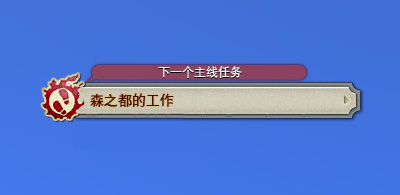

# 任务系统

## 主线任务

;;;.guide .cols2
;;;.guide .col

;;;

;;;.guide .col .grow
有标记的就是主线任务，在屏幕左上角还有主线任务的提示，如果不小心跟丢了任务，可以点击主线提示打开任务介绍。
;;;
;;;

::: segment orange

##### 做任务常见问题

;;;.guide .cols2
;;;.guide .col

;;;

;;;.guide .col .grow
如果发现任务图标变成，这通常是玩家角色不满足任务要求所致，右键任务NPC可以查看具体要求。

如果你迷路、跑丢了，不知道该去哪，请参考[地图与移动](/basic/map.html)章节。

有些任务需要选择奖励才能够交任务，如果任务窗口的“提交”按钮是灰的，那么你需要从“选项”字样后面的若干道具之间选择一样，才能够提交。
;;;
;;;

:::

## 职业任务、重要支线

在跟随主线剧情之余，你需要每5级回到职业行会，接新的职业任务。当你30级之后，转为特职职业，每5级的职业任务会送给你一个专属技能或者职业套装，请务必优先完成。如果你有未完成的职业任务，屏幕左上角的主线任务指引上也会有所显示，注意查看即可。

直升玩家在60级之后，也需要做职业任务，满足职业任务开放条件时，主线任务指引上会有所体现，不要忽略了。

在游戏进程中，会遇到部分带有标记的任务，它们都是重要任务，涉及到各种功能、副本的开放，如果你在主线过程中看到了这些任务，务必把它们接下来并完成。

对于新人来说，下列任务是重中之重，务必及时完成(直升玩家不会自动完成这些任务(获得坐骑任务除外)，因此记得抽时间去把这些任务做了)：

* 主线10级：<quest name="挑战理符" />挑战理符任务、行会特令。完成对应主城9级主线任务之后，在出生城冒险者行会接取。
* 主线15级：遗失的挑战笔记。解锁每周挑战笔记，完成笔记上的项目可以获得大量经验、金钱、以及金蝶币。
* 主线17级：雇员大探险。任意主城冒险者行会接取，完成后开放雇员探险功能。[雇员介绍(仓库、出售)]。
* 主线20级：我可爱的陆行鸟。完成20级主线任务前行之路并加入大国防联军后接取，完成任务可获得坐骑(推荐使用军团讨伐笔记(菜单-手册-讨伐笔记-选择军团旗帜)完成，性价比最好)。
* 职业30级：解锁特职，务必及时完成30级职业任务，并获得灵魂水晶转为特职。
* 可靠的搭档，解锁专属陆行鸟辅助战斗，在黑衣森林南部林区恬静路营地接取。
* 主线15级：天才美容师的过激绝技(利姆萨·罗敏萨上层甲板 X:11.2 , Y:11.1)，解锁洗剪吹功能，可花2000金币改变发型、染发及面妆。
* 主线15级：色彩斑斓的世界、华丽的投影世界(西萨纳兰 X:12.6 , Y:14.3)，解锁染色及幻化功能。[幻化投影系统详细介绍](https://bbs.nga.cn/read.php?tid=14869355)

玩家15级之后，世界各地的冒险者指导教官会出现任务，这是初学者学堂的任务，无论你是否有MMORPG经验，都推荐你完成这个任务(任务会按T奶DPS职能有所区别)，任务会分别赠送职能适合的一身装备，和提升获取经验的饰品。
