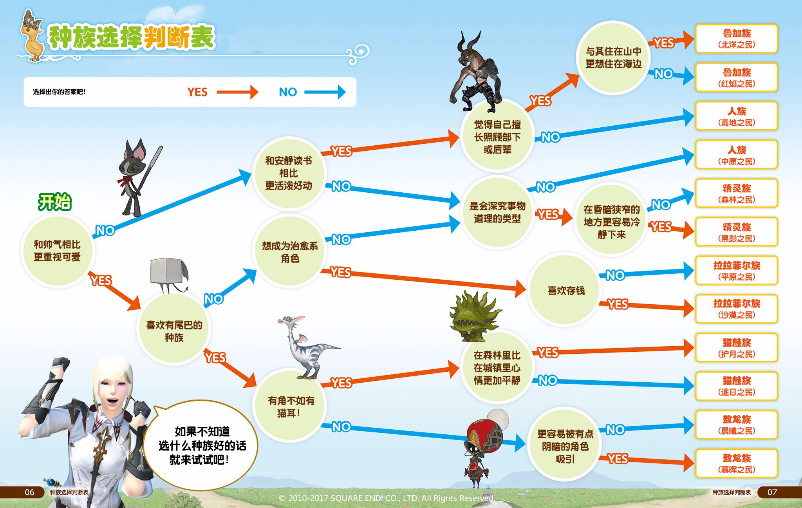

# 创建角色

登陆游戏需要先创建盛大账号(也可以使用已有盛大账号)或使用WeGame登陆，登陆后就需要创建角色。每个账号可以创建8个角色，这8个角色共享点卡/月卡/雇员，另外如果封号的话是封账号下所有角色。

[[TOC]]

## 选择服务器

FF14国服目前有两个大区，国服一区下设9个服务器，二区下设4个服务器，大区下各服务器共享招募板、副本搜索器(跨服排本)，可以添加跨服好友、跨服通讯贝等等，大区之间数据不互通。服务器之间的区别主要体现在物价、房屋上，某些服务器会有一些小特色。

如果没有亲友的话请相信自己的直觉或随缘，如果已有亲友的话可洽询亲友。**飘红**的服务器有新服奖励：59级以下的职业经验获取+100%(含生产采集)。

* 中国一区：紫水栈桥；静语庄园；神意之地；摩杜纳；拉诺西亚；幻影群岛；萌芽池；延夏；红玉海
* 中国二区：**潮风亭；白银乡；神拳痕；白金幻象**

目前没有鬼服，而且副本、pvp均可跨服，因此不用担心人少没人玩的情况。

另外目前所有服务器均采用**动态绝育**机制，指当在线玩家达到某一数值时，该服务器自动禁止创建新角色的情况。若有心仪的目标服务器但发现无法创建新角色，可以改在夜间、上午等人少时段尝试。

## 捏人选项

捏人选项很多，建议仔细阅读选项，慎重选择。种族虽然会“稍稍”影响一点点属性，但是现在已经完全不影响输出了，可以不用担心。

:::collapse 不知道选什么种族？

:::

进入游戏后如果对自己捏的人物不满，可以在商城购买幻想药(刚到50级的主线任务会赠送一瓶)修改，另外游戏里有美容师，可以花费游戏币更改发色、面妆。

捏人最后需要选择守护神和诞生日，这个和角色能力没有任何关联，请随意选择。

创建角色的时候需要选择职业。有关FF14的职业系统和职业的选择，请参考[职业与特职](./job.md)。
