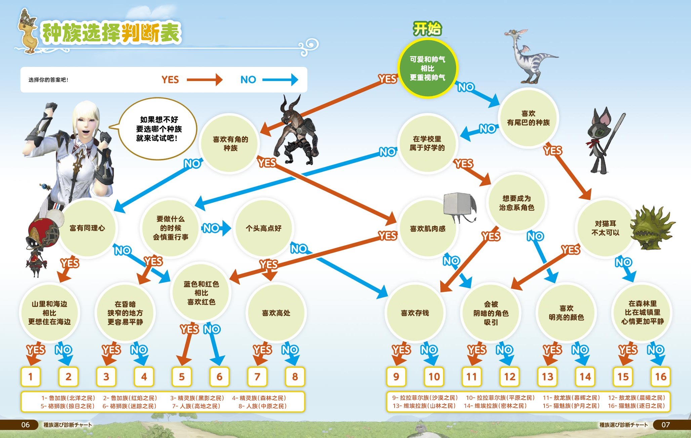

# 下载、选服与捏人

## 游戏下载

目前游戏本体可以从[国服官网](http://ff.sdo.com/web7/index/index.html)或 [WeGame](https://www.wegame.com.cn/store/2000340)上下载，使用官网启动器登陆的账号信息，无法在WeGame中使用，反之亦然。但无论使用哪个登录器，玩家都可以自由选择任意已有的服务器进行游戏，所有区服的游戏版本、活动进度都是一样的，而且都是由盛趣游戏（原盛大）拂晓组运营。

二者功能上的唯一的区别是，从WeGame启动游戏，可以直接使用QQ账号登陆，并用Q币充值(以及可以使用腾讯WeGame提供的三方功能)；从官方网站上下载的启动器，只能使用支付宝/微信/盛趣点卡等方式充值。

登陆游戏需要先创建盛大账号（也可以使用已有盛大账号）或使用WeGame登陆，登陆后就需要创建角色。每个账号可以创建8个角色，这8个角色共享点卡/月卡/雇员，另外如果封号的话是封账号下所有角色。

::: segment orange
### 账号保护

FF14最常见的盗号手段是撞库（[什么是撞库](https://zhuanlan.zhihu.com/p/120341665)）。

使用盛大客户端的玩家可以下载[手机叨鱼](https://daoyu.sdo.com/#/)（请勿下载桌面版叨鱼）并绑定自己的盛大通行证，在账号管理中**开启静态密码锁**，这样可以最大限度保护账户不被盗窃（亦可同时开启登录保护及设备保护作为辅助手段，但核心保护方法是开启静态密码锁）。

使用WeGame的玩家可以使用WeGame提供的App扫码登录，或使用[QQ安全中心](https://aq.qq.com/cn2/index)提供的QQ账号保护功能。

如果不方便使用手机APP登录，除了设置更为复杂的密码之外，也推荐使用独立密码（即不在其他任何地方使用过的唯一的密码，比如平时常用的密码是123456，那么ff14游戏的密码可以写成123456ff14）。**千万不要将自己的账号密码交给他人。**
:::

## 选择服务器

FF14国服目前有四个大区，豆豆柴区下设4个服务器，猫小胖区下设7个服务器，陆行鸟区下设8个服务器，莫古力区下设8个服务器。同一个大区内的各服务器之间可以跨服排本，另外也有==跨界传送==功能，可以传送到其他服务器观光、购物、游玩（[跨界传送介绍及限制一览](https://ff14.huijiwiki.com/wiki/%E8%B7%A8%E7%95%8C%E4%BC%A0%E9%80%81)）。不同大区之间数据完全不互通，无法跨大区联系、排本。服务器之间的区别主要体现在物价、房屋上，某些服务器会有一些小特色。

如果没有亲友的话请相信自己的直觉或随缘，如果已有亲友的话可洽询亲友。**橙色**的服务器有[新服奖励](/basic/levelup.md)：70级以下的职业经验获取+100%(含生产采集)。

<ServerList />

服务器开放注册时均采用**动态绝育**机制，动态绝育是指当在线玩家达到某一数值时，该服务器临时自动关闭新角色创建以及角色转入功能。若有心仪的服务器在网页中显示可创建新角色，但在游戏中无法创建新角色，可以改在夜间、上午等人少时段尝试。

## 捏人选项

捏人选项很多，建议仔细阅读选项，慎重选择。种族虽然会“稍稍”影响一点点属性，但是现在已经完全不影响输出了，可以不用担心。
<!-- 这里应该补几张图来着…用UI的双图并排界面 -->

:::collapse 不知道选什么种族？

:::

进入游戏后如果对自己捏的人物不满，可以在商城购买[幻想药](https://qu.sdo.com/product-detail/ba74b28d5c262bb8e2b4)（**初次完成50级的主线任务会赠送一瓶**）修改，另外游戏里有美容师NPC，可以找他花费2000<i class="xiv gil"></i>（游戏币）更改发色、面妆。

捏人最后需要选择守护神和诞生日，这个和角色能力属性没有任何关联，请随意选择。

创建角色的时候需要选择职业。有关FF14的职业系统和职业的选择，请参考[职业与特职](./job.md)。

## 转服及改名

FF14游戏提供付费的转服及改名服务，如果有此类需求，可以前往官网[后勤补给站](http://act.ff.sdo.com/project/141028dgf/index.asp)购买。

这两项服务都是购买即生效的，因此**请仔细阅读服务说明及规则，慎重下单**。

如果由于系统设置更新，导致玩家角色名出现屏蔽字的情况，可以联系客服，免费获得一次改名机会。
