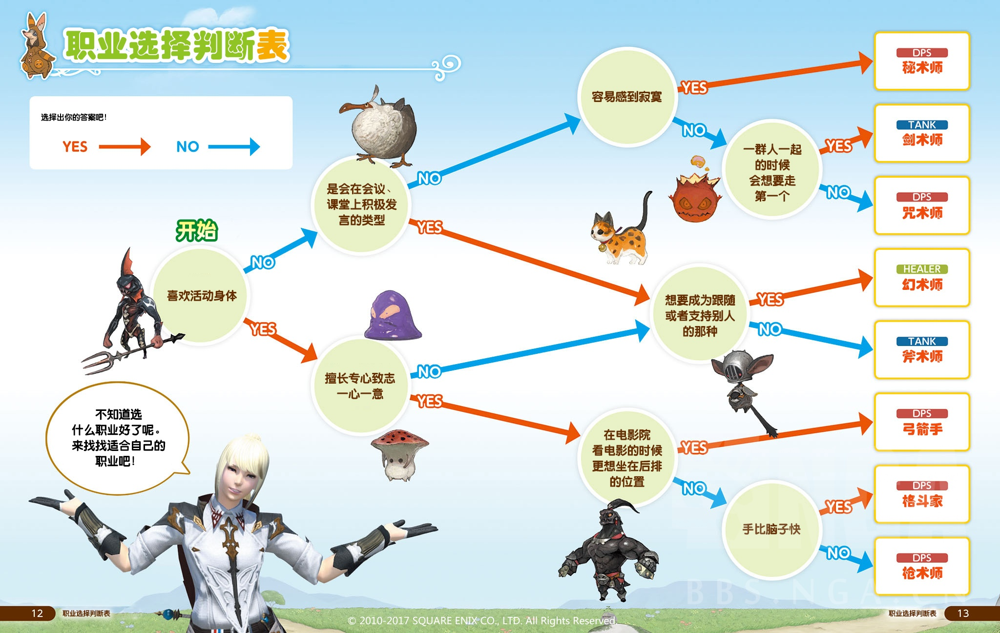

# 职业选择
<!-- 【补】来个banner！ -->
新玩家在建号的时候，需要选择一个战斗职业作为自己的出生职业，但是这并不是你的终身职业。FF14的战斗职业系统比较特殊，你可以用**一个角色畅玩所有职业**（切换武器就可以切换职业了），全职业满级大佬也遍地都是。因此不用太过于纠结职业，玩的不爽换一个就是。

FF14的职业平衡做的相对较为良好，在推进主线剧情时，所有职业都可以正常完成单人战斗任务。而在挑战大型困难副本时，基本不存在哪个职业失业的情况，更重要的参考是玩家的学习能力、反应能力和对职业的理解与操作。所以在选择职业时，要以自己的能力和喜好为主。

职业选择互动视频：[点我体验](https://www.bilibili.com/video/av73594017)

## 职业系统

FF14的战斗职业分为==基础职业==和==特职==，创建新角色时所选择的是**基础职业**，而我们通常所说的职业（骑士、龙骑等等）都是指的**特职**。当你满足主线进度要求，并且基础职业达到30级时，职业行会导师就会带你去找你的特职导师了~
一般来说，转职前的基础职业和转职后的特职会被视为同一职业（因为经验、等级都是共通的），下文小标题中会一并注明特职和对应的基础职业，方便你在进入游戏时选择。

FF14初始只能选择8个职业（可转9个特职），而后随着版本更新追加了10个新职业，下面会介绍所有的19个职业。追加的新职业无法在创建新角色时选择，需要满足以下要求才能转职：
| 职业| 转职要求 |
|-------|-----|
| 忍者（双剑师） | 完成任意战斗职业10级职业任务，并且能够前往利姆萨罗敏萨 |
| 暗黑骑士、占星术士和机工士 | 任意战斗职业等级达到50级，并且能够前往伊修加德(3.0版本主城) |
| 武士和赤魔法师 | 任意战斗职业等级达到50级，并且能够前往乌尔达哈 |
| 绝枪战士 | 任意战斗职业等级达到60级，并且能够前往格里达尼亚 |
| 舞者 | 任意战斗职业等级达到60级，并且能够前往利姆萨罗敏萨 |
| 钐镰客 | 任意战斗职业等级达到70级，并且能够前往乌尔达哈 |
| 贤者 | 任意战斗职业等级达到70级，并且能够前往利姆萨罗敏萨 |

## 战斗职能

FF14的职业分工与其他MMORPG很相似，都是<Role name="tank" />坦克(T)+<Role name="healer" />治疗(H/N)+<Role name="dps" />输出(D/DPS)分工的制度。一般的4人副本中，采取1T1奶2DPS的轻锐小队组合；而高难度副本中，采用8人满编小队组合，需要2T、2奶和4个DPS。

::: segment orange
### 职业操作难度、强弱与队伍需求

FF14在设计的时候非常注重职业平衡，这种平衡包括了操作、难度和职业特性。操作简单的职业输出相对较低，没有团辅能力的职业输出就会较高，并不存在简单粗暴无脑打得高的职业。在目前版本（6.0），输出以黑魔、武僧、忍者、龙骑 > 武士、钐镰 > 赤魔、召唤、诗人、舞者 > 机工（在不同层次的玩家中，输出排行会发生变化，比如顶级黑魔玩家的输出可以与顶级武僧媲美，但底层的黑魔甚至打不到底层召唤的伤害）。

强不强通常是一个版本的事，帅不帅才是一辈子的事。

一般在小队分配中，不出现相同的职业，习惯上4个DPS需要有至少1名，最多2名近战，以便在副本中安排站位和走位。同时，队伍中拥有不同职能的玩家，可以为全队增加一定的主属性，所以目前的标准配置均是不重复的2T2奶2近战1物远1法系。

在挑战大型困难副本时，基本不存在哪个职业完全失业的情况，更重要的参考是玩家的学习能力、反应能力、副本经验，对职业的理解与操作。所以在选择职业时，要以自己的能力和喜好为主。

从玩家分布来说，T奶玩家相对较少，而DPS玩家较多；绝大多数随机副本和招募都是DPS等T奶，部分招募会等近战，如果你希望自己好进本，也推荐T奶或近战DPS职业。

:::

## 职业介绍

本页面列出了游戏当前版本可以选择的所有职业，并给出主观评分和给人留下的第一印象。同时我们为每个职业准备了详细介绍和练级、满级手法，在每个职业的**详细信息**中可以看到，也可以通过侧栏导航的**职业专题**查看。

<IconHeader img="/images/jobs/dps.png">进攻职业 (DPS)</IconHeader>

DPS就是在副本中攻击BOSS的主力，躲开技能、处理各种机制和不浪费GCD正确打出输出循环是所有DPS的基本功。在5.0中，DPS被划分为 <Role name="melee" /> 近战物理、<Role name="ranged" /> 远程物理和 <Role name="magic" /> 远程魔法3种类型。

<IconHeader img="/images/jobs/melee.png">近战物理进攻职业</IconHeader>

近战物理进攻职业是贴近BOSS进行近战物理输出的职业。如果你喜欢贴近boss的刺激感，那么近战一定是你的心头好。通常来说副本中都是近战伤害最高，然而这些职业的技能或多或少都有身位要求(也就是技能要求在BOSS的背面、侧面使用)，如果不能在正确的身位使用技能，伤害量就会大幅下降，无法成为合格的近战DPS。

;;;.jobs-container
:::job monk dps
武僧(格斗家) {.header}

拳拳到肉行云流水，同时可以攒脉轮使用必杀技，输出非常高。

- 上手难度：★★★★★
- 副本输出：★★★★★
- 团辅能力：★★★
- PVP强度：★★★★
:::

:::job dragoon dps
龙骑士(枪术师) {.header}

跳跃类技能繁多，天上飞的长枪使。是3.0版本的主角，非常帅气。

- 上手难度：★★★
- 副本输出：★★★★
- 团辅能力：★★★★
- PVP强度：★★★
:::

:::job ninja dps
忍者(双剑师) {.header}

手速要求高，技能多。移动速度比其他人快。有最强的高频团辅。

- 上手难度：★★★★
- 副本输出：★★★★
- 团辅能力：★★★★★
- PVP强度：★★★★
:::

:::job samurai dps
武士 {.header}

使用武士刀获得“闪”，然后消耗闪使用居合术。充满传统武士的风情。

- 上手难度：★★★
- 副本输出：★★★★★
- 团辅能力：★
- PVP强度：★★★★
:::

:::job reaper dps
钐镰客 {.header}

手持镰刀召唤妖异与己同行的异客，炫酷好上手的新人友好职业。

- 上手难度：★★
- 副本输出：★★★★
- 团辅能力：★★
- PVP强度：？？？？？
:::
;;;

<IconHeader img="/images/jobs/ranged.png">远程物理进攻职业</IconHeader>

远程物理职业使用枪、箭、投掷武器进行远程物理攻击，诗人和舞者以辅助为主，而机工是纯DPS。

如果你不喜欢挨着boss站，又不喜欢磨磨唧唧的读条，物远就是你最好的选择。

;;;.jobs-container
:::job bard dps
吟游诗人(弓箭手) {.header}

唱歌弹琴样样精通，有职业专属演奏模式，战斗休闲两不误。

- 上手难度：★★★★
- 副本输出：★★★
- 团辅能力：★★★★
- PVP强度：★★
:::

:::job machinist dps
机工士 {.header}

使用枪械、召唤炮塔和机器人协助攻击。

- 上手难度：★★★
- 副本输出：★★
- 团辅能力：★
- PVP强度：★★
:::

:::job dancer dps
舞者 {.header}

通过战舞为队友进行支援，遇强则强。动作优雅。

- 上手难度：★
- 副本输出：★★
- 团辅能力：★★★★
- PVP强度：★★★★
:::
;;;

<IconHeader img="/images/jobs/magic.png">远程魔法进攻职业</IconHeader>

远程魔法职业就是需要通过读条进行魔法输出的职业，每个魔法职业的输出核心思路都完全不同。另外魔法职业的技能特效也都格外惹眼(近战被晃瞎)。

如果你喜欢读条又不想玩奶妈，或者想时刻看到绚烂的技能特效，那就要选魔法职业了。

;;;.jobs-container
:::job blackmage dps
黑魔法师(咒术师) {.header}

打击感和画面完美结合的职业，制作人钦点完美职业。不擅长移动战。

- 上手难度：★★★★★
- 副本输出：★★★★★
- 团辅能力：★
- PVP强度：★★★
:::

:::job summoner dps
召唤师(秘术师) {.header}

拥有帅气召唤兽，可以召唤巴哈姆特和不死鸟。读条少机动性强。

- 上手难度：★★
- 副本输出：★★★★
- 团辅能力：★★★★
- PVP强度：★★★
:::

:::job redmage dps
赤魔法师 {.header}

同时使用魔法和附魔刺剑攻击。辅助能力强，开荒团队生存保障。

- 上手难度：★★★
- 副本输出：★★★★
- 团辅能力：★★★★★
- PVP强度：★★★
:::
;;;

<IconHeader img="/images/jobs/tank.png">防护职业(T/坦克)</IconHeader>

T在副本中负责拉住怪，保护其他队友，掌控副本节奏，带领团队走向胜利，如同团队的领导者一般。因此T需要十分熟悉各个副本的路线、机制和应对方法，优秀的T更是能够把握团队每名成员的特性，并以此安排攻略节奏。

;;;.jobs-container
:::job paladin tank
骑士(剑术师) {.header}

标准剑盾T职业，配有魔法精通能力，杂活全能T。

- 上手难度：★★★
- 减伤能力：★★★★
- 控场能力：★★★★★
- PVP强度：★★★
:::

:::job warrior tank
战士(斧术师) {.header}

最接近狂暴战设定的职业，可花式回血。团减优秀。PvP钦点T职。

- 上手难度：★★
- 减伤能力：★★★★★
- 控场能力：★★★★
- PVP强度：★★★★★
:::

:::job darkknight tank
暗黑骑士 {.header}

5.0的封面职业，是T里输出最高的，但是相对防御能力略逊一筹。

- 上手难度：★★★★★
- 减伤能力：★★★
- 控场能力：★★
- PVP强度：★★★★
:::

:::job gunbreaker tank
绝枪战士 {.header}

输出亮眼但操作断手，爆发期开不动减伤。输出防御非常均衡。

- 上手难度：★★★★
- 减伤能力：★★★★★
- 控场能力：★★★
- PVP强度：★★★
:::
;;;

<IconHeader img="/images/jobs/healer.png">治疗职业(H/N/奶)</IconHeader>

治疗职业故名思义就是负责给掉血的 T 和 DPS 提供抬血服务的人。治疗需要认得很多buff图标，针对不同的buff采取不同的处理措施。在某些场合，奶妈必须及时驱散负面buff，否则轻则团队掉血降DPS，重则直接灭团。

;;;.jobs-container
:::job vvhit3mage healer
白魔法师 {.header}

传统概念的治疗，有强力的治疗技能，掉血加血，奶的高打得也高。

- 上手难度：★★
- 辅助能力：★★
- 救场能力：★★★★★
- PVP强度：★★★★
:::

:::job scholar healer
学者(秘术师) {.header}

使用召唤兽辅助治疗，能为队友附加厚实的护盾，以保护代替治疗。

- 上手难度：★★★★
- 辅助能力：★★★★★
- 救场能力：★★★★
- PVP强度：★★★★
:::

:::job astrologian healer
占星术士 {.header}

有团队BUFF型治疗，治疗量非常可观，但也是操作难度最高的治疗。

- 上手难度：★★★★★
- 辅助能力：★★★★★
- 救场能力：★★★
- PVP强度：★★★★
:::

:::job sage healer
贤者 {.header}

可以在输出的同时进行治疗，虽然是盾奶但是却有纯奶的治疗量。

- 上手难度：★★★★
- 辅助能力：★★★★★
- 救场能力：★★★★
- PVP强度：？？？？？
:::
;;;

## 快速选择

* 如果你没有任何MMORPG的经验，又觉得自己不打算认真研究，仅仅是想随便体验这个游戏，推荐使用**弓箭手**或**秘术师**进入游戏(可以在后期转到**舞者**或**召唤师**)；  
* 如果你喜欢贴身战斗的感觉，那么早期的**枪术师**比较适合初学者，而**格斗家**的打击感更强，当然也需要更多操作；  
* 如果你曾经玩过MMORPG，并且了解T奶的职责；或者虽然没有MMORPG经验，但是有信心挑战T奶职业，那么建议从战士(T，**斧术师**)和白魔(奶，**幻术师**)开始玩起。  
* 如果你想直接玩武士/赤魔/黑骑/机工/占星，那么你需要任意一个职业达到50级，并且主线任务能够抵达对应主城；如果你想直接玩绝枪战士/舞者，则需要有任意职业达到60级。如果你想直接玩钐镰客/贤者，则需要有任意职业达到70级。具体任务可以查看各个职业内攻略。

SE 官方也给出了根据个人性格来测试的职业自测量表，如果你对MMORPG实在是不够熟悉，看完之后还是没有头绪，可以参考：

