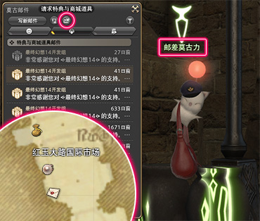

# FF14的收费模式与入坑福利

FF14国服采用**点卡/月卡并行**的计费模式，同时对于刚入坑的新人提供**免费试玩、绑定好礼**等多重福利。
FF14国际服/韩服采用本体CD-Key+月卡服务费的收费模式，下面的介绍将仅限于国服规则。国际服相关规则请查看[国际服专题](/basic/international.md)。

## 免费试玩

FF14可以在14天内免费试玩30小时，也就是说，从你进入角色选择界面开始的14天（地球时间）里，你可以在30小时（游戏在线时间）里不花一分钱体验这个游戏。

当然，免费试玩账号有很多功能上的限制，比如有等级限制，不能发私信，不能主动组建小队等等。

::: collapse 试玩账号的具体功能限制

官方的[试玩规则](https://actff1.web.sdo.com/project/150714free/)页面说明了所有的功能限制：

* 每个服务器最多建立1个角色，每个大区合计最多建立8个角色。
* 到达60级后，不可继续获得经验。
* 拥有300,000金币后，无法再继续获得金币。
* 不能使用呼喊，喊话，悄悄话功能。
* 无法使用市场布告板购买道具。
* 无法与其他玩家申请交易。
* 无法使用莫古邮件。
* 无法雇佣雇员，雇员上限为0。
* 无法建立通讯贝，但可加入其他人的通讯贝。
* 无法加入部队。
* 无法建立小队，或使用队员招募功能。但可以加入他人小队，也可以使用任务搜索器，进入副本后自动结成小队。
* 可以使用改名服务，但无法使用转服服务。
* 若在道具商城中购买了道具，不正式激活账号的话，将无法收取到购买的道具。
* 试玩有效期过后90天内若没有正式激活，则试玩账号的数据将被清除。

:::

当你首充（最低39元）之后，就算激活账户，可以通畅自如地使用游戏中所有的功能了。

## 萌新招待领多重福利

游戏为新人提供了包含直升在内的多重福利，激活后只要访问[萌新招待站](https://actff1.web.sdo.com/20190315Zhaodai/index.html#/bnot)并登陆，就可以直接领取**60级职业直升包**1个，成功绑定招待并满足一定条件后，还可以领取**50级主线直升包**等其他道具。

只有绑定之后才能领取后续奖励，并且只有在91级之前才能接受招待，所以务必在**没有任何职业达到91级**的时候完成招待绑定哦。

::: collapse 如何获得招待码？

如果有亲友拉你入坑，那么只需要向ta要招待码就行啦。招待码同样会为招待者提供一些奖励道具，老玩家都会很乐意招待你的。++不过请尽量选择熟悉或可靠的人绑定，大部分绑定招待者都会为与自己绑定的新人提供一些帮助，这样也许会使你的光呆之路更加轻松顺利(减少单机感)++

除了贴吧、微博这样的地方，在[NGA交友帖](https://bbs.nga.cn/read.php?tid=41956772)或[石之家论坛（官方论坛）](https://ff.web.sdo.com/ff14risingstones/index.html)上也可以找到招待码。

如果你想做一名独狼玩家，只想要奖励道具，不需要额外的社交关系，可以填写编辑的招待码：<ZhaoDai />

PS：当你满足招待者要求后，也可以将自己的招待码发给给新人玩家绑定。
:::

::: segment blue

##### 职业直升包和主线直升包有什么区别？

<IncludePage file="_includes/basic/level.md" />

因此直升包分为剧情和职业两种功能道具，同时又会根据直升等级分成重生（50级）、苍穹（60级）、红莲（70级）、暗影（80级）、晓月（90级）5种前缀。

[点击查看各个直升包的详细介绍](https://actff1.web.sdo.com/project/20190918adventure/index.html)。

**强烈推荐对捏人有强迫症，或者担心种族、外观不满意的玩家手动完成主线任务到50级，50级主线任务会送给玩家一瓶价值70元的幻想药，吃掉剧情直升包就没有幻想药了。**

虽然作为老玩家，我并不推荐新人玩家立刻使用直升功能，可以考虑直升第二想玩的职业，而使用最想玩的职业推进主线，但如果你确信游戏剧情无法给你带来快乐，那么推荐在35级或刚刚满50级（拿到幻想药）时使用剧情直升包。

无论如何，就算你用了直升包也没什么大碍，只要认真参考其他章节，你仍然可以享受艾欧泽亚带给我们的乐趣。

:::

::: segment blue

#### 如何在游戏里领取直升包和其他商城道具？

;;;.guide .cols2
;;;.guide .col

;;;

;;;.guide .col .grow
在主城里找到邮差莫古力，打开窗口后点击窗口上方的**请求特典与商城道具**，然后关闭窗口稍等一会。当听到有来信的提示音后就可以从邮差莫古力的特典邮件分类里找到了。

※ 邮差莫古力在地图上是一个信封的标志。
※ 有的时候邮差送信会有点慢，如果超过24小时仍未收到特典的话，可以前往官网联系客服解决。
;;;
;;;
:::

## 收费方式和充值奖励

充值和道具商城都在官方网站上——[FF14国服官网](https://ff.web.sdo.com)，游戏内并没有任何购买入口。购买充值、福利领取请认准以 **.sdo.com** 结尾的地址（如 **[qu.sdo.com](https://qu.sdo.com/)**、**[pay.sdo.com](https://pay.sdo.com/)**)。

FF14国服提供点卡和月卡两种收费模式(国际服仅有月卡)，但是不分点卡服或月卡服。点卡为0.6元/小时，月卡为88元/月(支付宝还能再打98折)。

各种游戏时间的消耗优先级：赠送的天数（特殊情况时的官方补偿等） > 月卡 > 试玩账号赠送的免费时长 > 点卡。

以后充值足够点卡/月卡的玩家可以在[陆行鸟礼物站](https://ffpay.sdo.com/DepositActivity/index.htm)领取对应的充值奖励，另外在前面说的[萌新招待站](https://actff1.web.sdo.com/20190315Zhaodai/index.html#/bnot)也有对应的充值奖励。

::: collapse 关于商城

[游戏商城](https://ff.web.sdo.com/web8/index.html#/shop)分改名、转服服务；游戏道具商城；周边商城；和累充赠礼等4个版块。

游戏道具商城提供一些外观、坐骑、动作，还有往年季节活动赠送的外观、家具等等。游戏外观是1级的装备，必须通过[幻化投影](/basic/equip.md#装备染色、投影)的方式使用（直接穿着时装下本可是会被说的），商城坐骑的移动速度和游戏内的其他坐骑也是一样的（唯一例外的是SDS芬里尔，它自带一级加速，通常只有完成该地区的主线任务之后，才能够获得一级加速；如果购买SDS芬里尔并完成该地区主线任务，坐骑的速度仍然是一级加速）。

用一句著名的话说就是：商城不能使你变强，只能让你从一个菜鸡变成一个花里胡哨的菜鸡。所以如果有中意的服装或者坐骑，就买下来吧！

商城消费和完成游戏内任务可以获得积分，积分可以在[积分商城](https://qu.sdo.com/unit-shop?merchantId=1)兑换各种珍稀道具、坐骑等，获取积分的方式可以查看[官方介绍](https://ff.web.sdo.com/web8/index.html#/newstab/newscont/350263)。

:::

