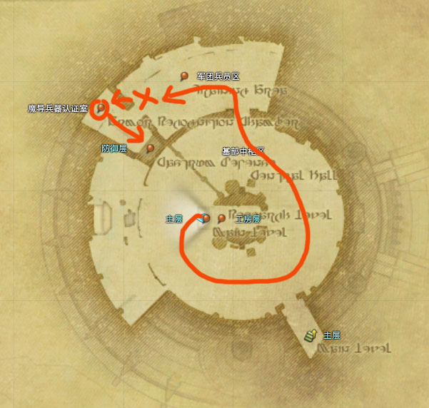

# 天幕魔导城最终决战

2.0主线最后一个副本，冒险者变成大英雄的开端，副本主旨是，一路狂奔。事后西德会把副本里乘坐的魔导机甲送给玩家(哦副本本身就是跑路MAX……)。中途尽量不要死，不吃技能就不会死，死了我也不知道怎么跟回大部队……

## 进场 ~ BOSS 1

;;;
;;;

;;;.guide .cols2
;;;.guide .col .figcap

跑路示意图 （虚线是自动切换地图的地方，可以无视）

;;;
;;;.guide .col .grow

进门往左前方走（就是有怪的地方），点==魔导终端==【1】就可以直接传送（小怪不打），如果点不到可以狂砸小键盘0（<Role name="tank" />T被攻击的话会被强制打断，如果是新人T不会搞可以选择跑后面）。

下楼之后左转打怪捡钥匙开门【x】，开门之后右侧墙壁是被炸开的，一路狂奔【2】，沿着左墙会又有一个炸开的缺口，进去以后地板也被炸开，直到跑到==魔导传送装置==【3】点击下楼（同上，如果是新人T，不推荐跑第一个，请让认路的大佬带路）。

如果拉怪的玩家被一路的小怪打死，可以直接返回起点并快速传送即可。如果发现自己被落下不要慌，开疾跑往前走，这里都是单向的。传送下来之后打小怪捡钥匙开门。

;;;
;;;

BOSS 1 **魔导巨兵二型**，丢人玩意儿，瞎打就行。

## BOSS 1 ~ BOSS 2

;;;
;;;

;;;.guide .cols2
;;;.guide .col .figcap

跑路示意图 一定要记得获得认证，否则不能骑机甲。

;;;
;;;.guide .col .grow

打完小怪之后所有人都上平台，开电梯。下电梯之后左转，路上会碰到一个斜坡上有隔离墙，不管它继续往前跑，有一个**魔导巨兵**堵门，<Role name="tank" />T拉住沿途这堆还有巨兵，进门左手一堆怪，拉一起打掉捡钥匙开门【x】。 

开门之后先右转，调查==魔导装甲认证装置==【o】，然后回头上电梯平台。上楼之后调查右前方魔导装甲，骑机甲啦！！动画过后被传送到魔导城外面，这里如果玩家不小心阵亡，可以回到门口传捷径过来重新上机甲。

;;;
;;;

机甲有2个技能，1是指定范围AOE(固定伤害4500)，2是面前10米AOE(固定伤害3000)，一般用第一个就可以了。往前跑到头左转进门下楼，右前方就是之前忽略的隔离墙，现在可以用魔导机甲的技能打爆它了。墙爆了之后下楼，下楼之后是一条路，不会迷路，中间会出现==究极神兵原型机械臂==，机械臂有近战范围击退，注意不要离它太近。最后打掉合金墙就是老二了。

### BOSS 2 尼禄·托尔·斯卡艾瓦

开战后场地四周会出现电浆池，<Role name="healer" /><Role name="dps" />远程注意稍微往里站

BOSS对<Role name="tank" />MT有无预警击退（没什么好的防范方法，MT注意时刻保持自己在场地中央即可）。场地内会时不时招出**机械爪**，并与一名玩家连线并靠近，推荐<Role name="dps" />远程转火快的职业迅速转火，击杀机械爪，机械爪碰到与之连线的玩家后，被连线玩家会被击退到墙边，如果在电浆池里呆的时间过久也是会掉血的，更大的问题是影响输出，场地里会充满连线、爪子，没人能打着BOSS了。<Role name="healer" />治疗注意关照被击退的玩家还有带电的玩家，虽然这个BOSS现在已经不容易团灭了，但是还是小心驶得万年船。

## BOSS 2 ~ BOSS 3456

打完尼禄后往里走调查魔导终端，后面几个BOSS是连打，不需要跑路了，如果中间有迷路的返回的玩家，调查完魔导终端后也会被一并强制传送。(这段动画还是推荐好好看一看的，毕竟也不能直接跳过)

BOSS 3 **盖乌斯·范·巴埃萨**，现在基本上站撸就可以了。如果你的队伍输出比较慢，注意他会在地上放一个掉血的圈(输出快的话就站在圈里直接撸掉，输出慢的话一定要拉出来)，然后他还会瞬移、击退，在面前画个叉，过几秒沿直线飞出去(注意躲开叉的正面方向)。

BOSS 4 **究极神兵**，刚开打的时候神兵是接近无敌的，<Role name="tank" />T开怪之后可以不用理它，它会四周发射激光，然后屏幕中央弹出台词，神兵无敌护盾被打破。打破护盾之前，队友造成攻击的仇恨并不高，所以破盾之后嘲讽+飞盾/飞斧/伤残就可以拉住了，然后注意带到场边。这个究极神兵会使用风神的扇形AOE(以场地中央为圆心)，火神和土神的地面圈，随着玩家削减神兵的HP，会依次剥离出风神、土神和火神，蛮神被剥离出来之后，就不会使用对应的技能了。(现在打的快，基本上见不到风神的技能，一次火土圈)<Role name="healer" />治疗注意火神和土神的圈是连续使用的，很容易中招，如果有人中招了注意及时抬血。

BOSS 5 **〇〇〇〇**，<Role name="tank" />T可以直接上。打到一半的时候场地上会刷出来魔导浮游炮，不打也不影响击杀，但是T和读条职业会被迫动来动去，很麻烦，还是推荐击杀掉。场地上会出现根据距离衰减的范围提示，注意向衰减方向躲避(<Role name="tank" />T推荐把BOSS固定12点，发现12点是炮落点的时候，开无敌或大减伤硬吃也没关系)。BOSS还会点名一名玩家放一个绿球，远离人群后撞掉即可。最后BOSS会消失，然后回到场中读条团灭技，读条结束前击杀即可（读条非常慢）。

BOSS 6 **〇〇〇〇〇**，丢人的玩意儿。就撸，没了。