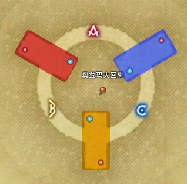

# 禁忌城邦玛哈

## BOSS 1 之前

没啥特别要注意的，蜘蛛小怪打掉之后会获得<Status :id="645" name="消化中" />debuff，但没什么影响。

### BOSS 1 阿剌克涅

BOSS会扫尾，站在后面的玩家（尤其远程）要注意。BOSS会随机点名三名玩家吐蜘蛛网（头顶红色点名标记），建议往场边放置，踩上去会有减速效果，对近战输出不利，但可以应对特殊机制。

屎黄色点名和方舟的那个一样，圈里有多人或重叠的话，在圈里的所有玩家都会被粘液连线定身，需要自由玩家撞线解除。注意撞线会有可能跟BOSS场地机制重合，优先救人。

打一会BOSS会带着全体玩家上天，天上会出现**酸液蜘蛛**，打掉这个蜘蛛之后，脚下的蛛网会出现空洞，从空洞跳下去就可以回到下场。留在上半场的玩家需要击杀其他小怪，并挡住从场边飞往场中央的球（否则会造成巨大的AOE伤害），下场的玩家需要打掉**蛛丝结扣**。原则上要求上半场留2队，下去1队（至少包括1T1奶，拉住下场的小怪），由于现在输出较高，不用特别强制规划（除非队伍输出较差或严重失误）。

打掉所有结扣之后，所有玩家返回地面击杀BOSS。如果队伍输出较慢的话，可能会出现新的流沙机制，BOSS下潜之后出现流沙，需要站在远离中场的蛛网上防止被吸入。

## BOSS 1 ~ BOSS 2

没什么特别要注意的，全部拉一起A掉。

### BOSS 2 弗加尔

场地上的绿球周围会现绿圈，踩1个绿圈会获得<Status :id="1045" name="渐渐僵尸化" />，踩2个以上绿圈（重叠的）就会变<Status :id="371" name="僵尸" />。

地面上出现红色圆圈接天黑色光柱，需要玩家踩上去，如果同时出现其它AOE技能，请优先躲避其它AOE再迅速归位，由于踩光柱会获得流血debuff，因此不要多踩（一人一个，没的踩的安心挂BOSS）。太多人不踩的话，接下来的AOE会伤害会直接团灭。

被点名红色倒三角的玩家集合，原则上BOSS身下集合，如果太远赶不过去，（同是倒三角点名的）两三人抱团也是可以的，否则会变呱，而且受到巨量伤害。被红色箭头（比较长条的，不是倒三角）点名的玩家远离人群，会被连续点名AOE。

小怪阶段从左到右分别是**被召唤出的扎哈克** （9点，A队）， **被召唤出的梦魔** （12点，B队）， **被召唤出的哈加提** （3点，C队）。扎哈克会超大范围喷吐扫尾，注意横拉，头尾都不要面向中场；梦魇会读条==欺瞒雾==，注意打断（眩晕打断）；哈加提读条==致命射线==，注意背对，没有背对的会获得<Status :id="210" name="死亡宣告" dispel/>，治疗可驱散。原则上推荐先处理梦魇和哈加提，最后处理扎哈克。

打完小怪转场之后，再出现绿球必须靠近（但注意区分，不要踩在两个绿球的交界处），BOSS会读条==超即死==，需要玩家身上带有<Status :id="1045" name="渐渐僵尸化" />debuff才能平安（否则直接扑街），只要记住每次出现绿球都靠近吃绿圈即可。

## BOSS 2 ~ BOSS 3 

道中会遇到**石面**，这是一个糖葫芦形的场地，左A右C，开怪后不久，左右两边圆形场地里就会出现小怪，需要AC队前往各自的圆台处理（<Role name="ranged" />远程注意站进圆台里面，会锁门的），打完各自小怪之后回到中场，BOSS会读条==碑文魔法==，所有人站在石面面前的圆圈里，可以竖起防护罩，近战可以继续输出（原则上可以在读条结束之前打完），读条结束之前进入防护罩躲避AOE即可。

### BOSS 3 奥兹玛

;;;.guide .cols2
;;;.guide .col

ABC为实际标点位置，红黄蓝三色为分别对应队伍的站位，蓝色圆点是ABC各队T的位置，红点是放陨石的位置。其他人原则上站在T右侧（图中未标出），不与T重叠即可。
;;;
;;;.guide .col .grow

场地会掉下去，要注意（有突进和后跳的职业尤其注意）。进场长方形平台是B队，左侧长方形平台是A队，右侧是C队。按各队顺时针方向标ABC（参见示意图）。

战斗中会随机点名玩家放巨大黑圈陨石点名（第一次是每队1人，之后每队点名2人），被点名黑圈的玩家需要放在自家平台右后角（示意图中红点）或对应队伍标点位置放陨石，万不可重叠（重叠基本上即死）。黑圈消失后立刻回人群，陨石掉下来会出现小怪，需要立刻击杀，否则会造成全场AOE。

;;;
;;;

在战斗中，奥兹玛会变形为三角锥或立方体：

* 三角锥：所有人离开本队平台到走廊上，奥兹玛会对平台发动直线AOE，AOE结束后可以回来。
 同时奥兹玛点名玩家一个小范围AOE，会对范围里的玩家造成<Status :id="343" name="出血" dispel/>，可驱散，<Role name="healer" />治疗注意抬血。另外还会点名玩家<Status :id="1384" name="加速度炸弹" />，加速度炸弹倒计时到0的时候，如果玩家仍在行动（自动攻击也算）则会造成巨大伤害，被点名的玩家（尤其是近战和远敏）注意停手（背对疯狂ESC到弹出系统菜单即可）。
 * 立方体：所有人在本队平台靠近奥兹玛，奥兹玛会发动覆盖整个走廊范围的圆形AOE。
 同时奥兹玛会对3个队的T释放直线AOE，T注意开启减伤，治疗注意抬血。另外走廊上还会出现蓝色的球顺时针移动，需要玩家去撞球（推荐奶去，1人的血量只够撞1个球的，奶可以一边撞球一边给自己加血）。最后BOSS还会有小击退，撞完球的玩家注意及时回到平台上。

中间BOSS会读条==黑洞==，把玩家吸入压缩世界。首先是3个队的长条形平台，需要每队至少有4人踩台子，解除邻队大怪的无敌状态，击杀完毕后跳下台子打**奥兹玛之影**。如果DPS较慢的话，会遇到BOSS读条==融合==，需要背对回避，否则会获得<Status :id="1068" name="渐渐浸蚀" />，并不断加深，4层之后会变为<Status :id="1069" name="浸蚀" />，并出现**压缩块**小怪，需要打掉解救。打掉之后跳入场中央就回到原本的场地里，继续循环奥兹玛圆球方块三角，就过了。

### BOSS 4 卡洛菲斯提莉

BOSS喊话++我的魔发，是斩肉的刃、吸血的根！++ ，会让自己一侧的头发变成刀刃（发黑）（提示++卡洛菲斯提莉的魔发完成了变异……++ ），此时向另一侧走位躲避即可（技能非常快，看到场地预警再躲基本来不及），另外有一些MT会选择旋转BOSS来让队友半场全部安全（如果你是MT，而你不会拉，就不要动，让大家自己躲）。治疗注意抬血。

BOSS读条==接发==后，场地上会出现紫色的圈，千万不要站进去，踩到的话会出现一个三倍于紫圈范围的巨大陷阱，把玩家吃掉，如果不及时打掉陷阱，就会被绞杀。

小怪阶段会同时有潜地式波动炮点名，被点名的玩家注意贴边绕场狂奔，不要带到人。

最后一个阶段，BOSS读条==接发==后，会出现规整的黄色AOE范围预警，注意圈里弹出来的东西的模型，站在双刃斧形怪发的正下方（远离圆球种子形的怪发），否则会被击飞+易伤，非常疼。BOSS读条==透耳尖啸==后，场地中央会出现3个圈，玩家需要背对BOSS（推荐面向门口）被击退，面向BOSS的话就会被吸入（然后+易伤）。

最后BOSS读条==蓄力冲击==时，注意BOSS的面向和它的头发，尤其建议MT提前走位拉好面向，它冲击后会立刻使用魔发斩，如果面向不对就会变成24人斩。

## 其他参考攻略

* [子言姐姐考据视频攻略](https://www.bilibili.com/video/BV1AW411i7eX)
* [susu攻略](https://www.ffxiv.cn/detail/article/161)