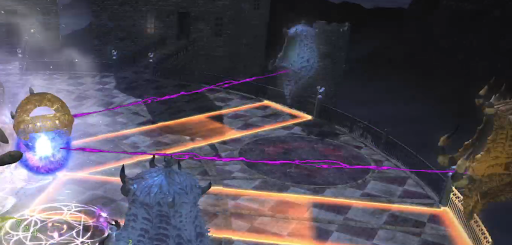

# 影之国

## BOSS 1 虚空死亡凝视 

长方形场地前后（船头船尾）是安全的，两侧会掉下去（有BOSS的方向）。

BOSS读条==虚空即死==，同时场中央会出现红黑色的圈，把玩家往中间吸，所有人要尽全力向外跑，一共会吸2次，第二次吸完立刻判定，所以第一次跑慢的人就跑不出去了。

读条==虚空暴风==同时场地中央出现旋风圈，所有玩家站在旋风边上，判定时旋风内的玩家即死，其余玩家被吹飞，要保证自己能被吹到船头船尾，否则就会掉下去。

虚空冰澈+虚空飙风，场地上出现距离衰减提示，玩家需要向距离衰减的落点对侧方向移动（比如衰减落点在左舷，那么玩家需要去到对应方向右舷位置），落点会落下大冰块，冰块落下后BOSS会开始读条吹风，需要让冰块挡住玩家，否则就掉下去了。

其他的出啥打啥有啥躲啥，BOSS读条==死亡宣告==会随机点名2名玩家上<Status :id="910" name="死亡宣告" />，需要治疗驱散（诗人也可以用光阴神驱散）。场地上会逐块变黑，当场地全部变黑并最后一次判定虚空极死时就是团灭。

## BOSS 1 ~ BOSS 2 

路上会遇到两次**虚无结晶**，需要在结晶读条结束之前击杀，否则会出现妖异。第二次会搭配冥鬼的石化视线，注意背对。

### BOSS 2 虚空弗迪亚

;;;.guide .cols2
;;;.guide .col

蓝色阿托莫斯连线环，黄色阿托莫斯连线球。无连线的蓝色阿托莫斯脚下安全。
;;;
;;;.guide .col .grow

核心机制1==虫洞==，BOSS会放出若干个阿托莫斯（场边的怪），并且有跟它连线的球或环。球或环表示近身AOE（远离安全）或周身AOE（脚下安全），而实际AOE出现的位置是没有连线的同色阿托莫斯。因此如果有环，则先看与环连线的阿托莫斯颜色，然后去没有连线的同色阿托莫斯脚下；如果没有环，远离没有连线的阿托莫斯；如果两个都是环，随便去哪个没连线的脚下。

;;;
;;;

核心机制2，==弱点生成==，所有玩家会获得<Status :id="1137" name="火属性耐性大幅降低" />或者<Status :id="1157" name="水属性耐性大幅降低" />，同时场地上出现水/火的机关，需要把机关踩成与自己耐性相反的属性：如果是火耐性降低，那么需要把所有机关都踩成水；如果是水耐性降低，则需要都踩成火。远位通常由远程负责，近战注意打身位的时候不要反复踩机关。AOE伤害与机关错误数量成正比，如果错的太多就会团灭。

其他的出啥躲啥有啥打啥。

## BOSS 2 ~ BOSS 3

沿途中会有一只**究极神兵原型**，田园郡会有任务<quest name="不明飞行物" />，接任务打到这个怪之后回去交任务，可以获得<item name="究极神兵原型装甲片" />，用于兑换饰品和衣服。

这只究极神兵本身很好打，注意优先击杀各种小怪，有连线时神兵无敌，在神兵最后读条==空间错乱==时可以使用LB击杀。

###  BOSS 3 斯卡哈

BOSS伸出两条丝带并读条==阴影回旋==时，注意向没有丝带的方向躲避。

有两个比较难躲的技能：==阴影重击==读条后会随机跳跃一个地方，不要追，会立刻有近身范围AOE。 ==阴影直刺==随机点名一名玩家放直线AOE，注意看面相躲避。

手形小怪会随机连线2名玩家，只要面对小怪（连线变为白色），小怪就会停止移动，其他玩家趁此机会击杀。如果连线玩家背对小怪，小怪就会不断接近玩家，撞上之后玩家即死。

场地变红的时候不要移动，否则会中debuff<Status :id="1790" name="影之脚镣" />，移动速度大幅降低，很难躲避后续机制。

当出现距离衰减AOE时，MT带BOSS远离落点，落点会出现小怪**康拉**，需要有一名T拉住康拉，远离BOSS，其他人转火击杀（康拉与BOSS距离过近会给BOSS上增强buff，非常危险）。

被红黑色大饼点名，同时周身出现黑圈的玩家，需要带球向后场躲避（其他人注意避让），这个技能范围极大，伤害也比较高，要注意。

场地上出现图腾时注意需要有人去踩（图腾边缘发光证明踩上了），中央的大图腾伤害比较高，建议由T去踩，但无论如何每个图腾里都必须有人，否则极易团灭。

### BOSS 4 迪亚波罗斯

分为两段，基本上出啥躲啥，场地上会召唤门，注意及时转火打掉。

后半段和斯卡哈很像，==暗影直刺==是无范围预警直线AOE，同时还有大饼追踪点名（这次是3个人），也需要踩图腾。

需要注意的是紫色带眼睛标记的分摊，需要玩家帮助分摊的同时背对，所以被点名的玩家注意不要太过靠近人群，防止误伤友军。

后半段场中央会出现一个带特效的门，这个门不可打掉，需要进去把里面的怪打掉（进去一个队就行，外面还有其他门需要打）。

最后一个团灭点是场地上会出现红色的晶球，要么大家都躲开（但基本不太可能），要么去把球撞掉，撞球会产生一个中等范围的AOE伤害，而且比较疼，如果两三个球撞在一起就极有可能团灭，要注意。

## 其他参考攻略

* [子言姐姐考据视频攻略](https://www.bilibili.com/video/av18941431)
* [susu攻略](https://www.ffxiv.cn/detail/article/270)