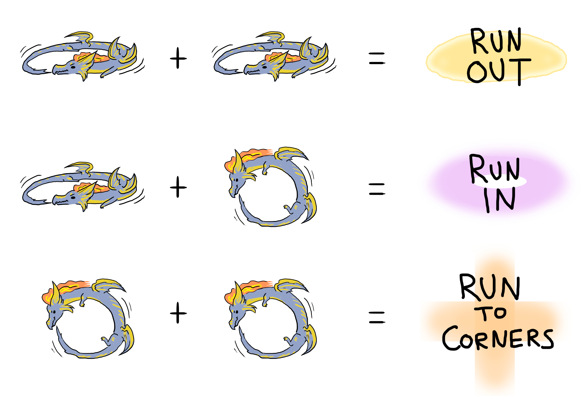

# 欧米茄时空狭缝 阿尔法幻境2

开场BOSS放场地中央。

;;;.guide .cols2
;;;.guide .col

图片来自[Chariflame @Reddit](https://www.reddit.com/r/ffxiv/comments/9hg1v8/i_made_myself_a_silly_visual_o10_guide_since_all/)

;;;
;;;.guide .col .grow

玩家需要通过观察BOSS的旋转方式判断接下来的AOE形状/范围：

* 横→横：远离
* 横→竖：靠近（目标圈下）
* 竖→竖：四角（BOSS释放以自身为中心，面向前后左右的十字AOE，如果BOSS歪/转了，那么AOE也会跟着歪/转）

（零式难度有竖→横的组合，普通难度没有）
;;;
;;;

* 随机点名4人：互相散开不要重叠，未被点名玩家不要站在BOSS与点名的连线上。
* ==死亡轮回==：点名1人连续4次大伤害，集合刷血（点T可无敌单吃）。
* ==天光轮回==：随机点名玩家放原地AOE，看到读条结束立刻移动即可。

转场后BOSS会有一次从北场来的俯冲+地上一堆火球，注意回避。之后刷新一只小龙和一堆柱子，<Role name="tank" />MT带小龙去场边面向场外，<Role name="tank" /><Role name="healer" /><Role name="dps" />其他人集火输出柱子，打掉所有柱子后可解除小龙的无敌，击杀小龙。小龙有大量正面扇形AOE，MT以外的人不要去正面，<Role name="healer" />治疗注意T血。

其他出啥躲啥即可。

## 其他参考攻略

* [子言考据攻略1~4（视频）](https://www.bilibili.com/video/av39719792/)
