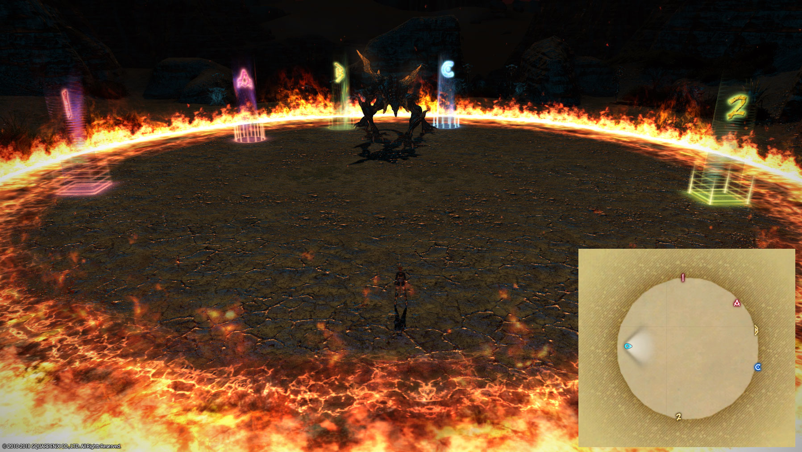
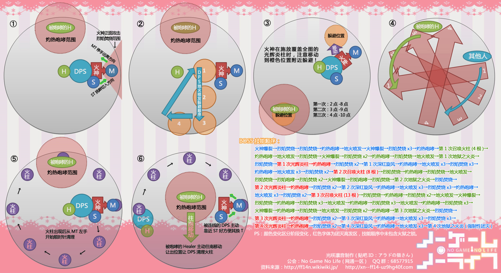

# 伊弗利特歼殛战

;;;.guide .cols2
;;;.guide .col

标点示意图
;;;

;;;.guide .col .grow

++伊弗利特的场地是横着的，也就是进场时玩家在地图9点方向，BOSS在地图3点方向，为了方便表述，下文均以玩家入场时视为6点(BOSS方向为12点)。++

在10.5点标A(BOSS左侧一个男精躺平的距离)，11.5点标B(BOSS左侧一个肥的距离)，12.5点标C(BOSS右侧一个肥的距离)(这个位置比较奇怪，初见一般都标不准(我打了那么多次也没标准过hhh
两个治疗互相打个招呼认识一下(……

;;;
;;;

开场后MT把BOSS放在AB之间，面向A点(自己在A点)，ST在B点输出。BOSS正面AOE会给当前MT叠[img]./mon_201803/05/-8renrQ5-6nxtKfSo-w.png[/img]灼烧buff，最高5层越打越疼，原则上3层换T，到5层仍不换T基本就是倒T换T or 团灭之路。由于buff技能范围很大，两名T需要酌情调整自己的站位，并适当开启减伤。如果在T这边出了问题，请治疗最优先cover，否则不可能过本。

两名治疗分别站在3、9点最远处，其他人不要与治疗重合输出。

BOSS会点名灼热咆哮，为一名治疗上<Status :id="1578" name="灼热" />BUFF，这名治疗会每3s原地爆发一次热风，自己没事，但会把自己周围的人弹飞且造成伤害，所以这名治疗请在能奶到人的前提下尽可能远离其他人。

火柱仍然需要DPS集火，如果解限的话可以选择爆发全开强撸BOSS无视火柱(可以做到)，但需要一定的DPS输出数据，如果在场上仍有火柱的情况下，BOSS使用地狱之火焰，则直接灭团(PS，如果有人没有死，BOSS会重复使用地狱之火焰…不要问我怎么知道……)。

打火柱期间，会有<Status :id="377" name="火狱之锁" />连线，连线无法扯断，**距离越近伤害越低**，被连线的人请尽可能彼此接近。另外每打掉一根火柱，造成一次全场AOE，并对全队玩家叠一层持续仅3s的伤害增加debuff，需要DPS玩家适当控制火柱击杀速度，或者治疗不间断大量刷血(5层以上容易导致灭团)。

当BOSS起飞并开始出现在场边时，是冲锋阶段，仍有<Status :id="1578" name="灼热" />的治疗(此时buff应不足5s，不会再炸人)跟人群一起从A点(10点方向)顺时针行进，另一名治疗从3点逆时针，或者9点顺时针躲避，如果觉得自己躲不开，可以硬吃一个并给自己加血。

每次BOSS使用完地狱之火炎（超华丽全场AOE）之后，都会很快使用一个几乎覆盖全场的光辉炎柱，安全点第一次在A点方向，第二次在B点方向，第三次在C点方向。需要远离人群的治疗则在A、B、C的对侧躲避（假设人群在10点，那么那名治疗应该在4点），如果感觉来不及跑到安全点，则直接对自己使用大加血亦可扛过。

最后一根柱子的血量安全线可以视为20%~15%，如果你们输出过快注意停手。

## 过往版本攻略

* [开荒版本攻略](http://games.sina.com.cn/o/z/ff14/2014-10-08/1150576145.shtml)