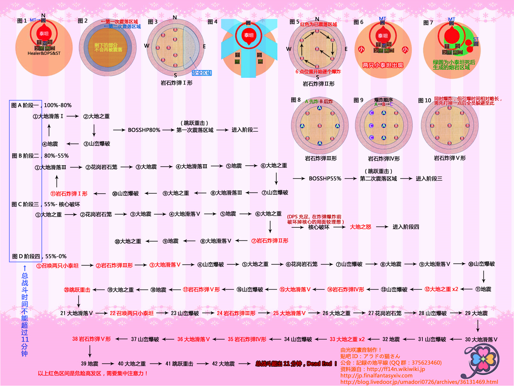

# 泰坦歼殛战

开场MT把BOSS放12点不用太靠边，边上的台子都是会掉的。原则上MT之外的所有人都要站在BOSS正后方重叠放置流沙，这是开荒时的习惯，现在不强求，但是请不要站的过于分散（会导致遍地流沙）。

和真泰坦一样，JTT也有掀桌，特征是JTT突然换手糊你，注意开好减伤。原本需要被掀2~3次换T，现在基本不用，如果MT因为掀桌倒了请检讨。

石牢默认点1DPS和1奶，当发现点名石牢的时候，被点名的DPS前往BOSS脚下，被点名的治疗前往场地6点边缘（如果发现队伍中有看其他攻略或不会打的玩家，两个点名最优先互相远离），其他人集火石牢（先打BOSS脚下的，如果都很远请先不要远离BOSS）。

点石牢的同时JTT会抬脚撅腚便秘状，MT请穿过BOSS（或打开防击退技能），接下来是一个击飞（打石牢的玩家也请注意），击飞后再解救远处的石牢。

进入核心阶段之后，一般来说一套石牢就打掉了，慢一点的会出圆圈雷（不知道圆圈雷请参看真泰坦部分）。

核心打掉之后是小泰坦&米字雷，正常打法要求ST把场地9点的小泰坦拉到3点，同时拉住两只之后DPS集火小泰坦，小泰坦死后会在地上留下一滩减速的岩浆，不要踩。

米字雷是先落下包含中场雷在内的5颗雷(摆成X型)，然后落下4颗雷(在12、3、6、9点位置)，要求所有人在12、3、6、9点位置等旁边雷爆炸之后，前往中场(或其他没有雷的地方)。如果感觉搞不明白，可以硬吃一次雷。

通常来说快一点的可以在击杀小泰坦后结束战斗，慢一点的在米字雷处理过程中也可以结束战斗，后面的循环见不到的。

如果你们死成了轻锐小队（请严格BOSS身后站位，接下来会有二连流沙（就是连续点名2次流沙）和全屏雷，全屏雷需要所有玩家集火11点方向的雷（可以标号）打掉后，在场地边缘等其他雷爆炸。

## 过往版本攻略

[开荒版本攻略](http://ff14.17173.com/content/2014-10-15/20141015121358311.shtml)