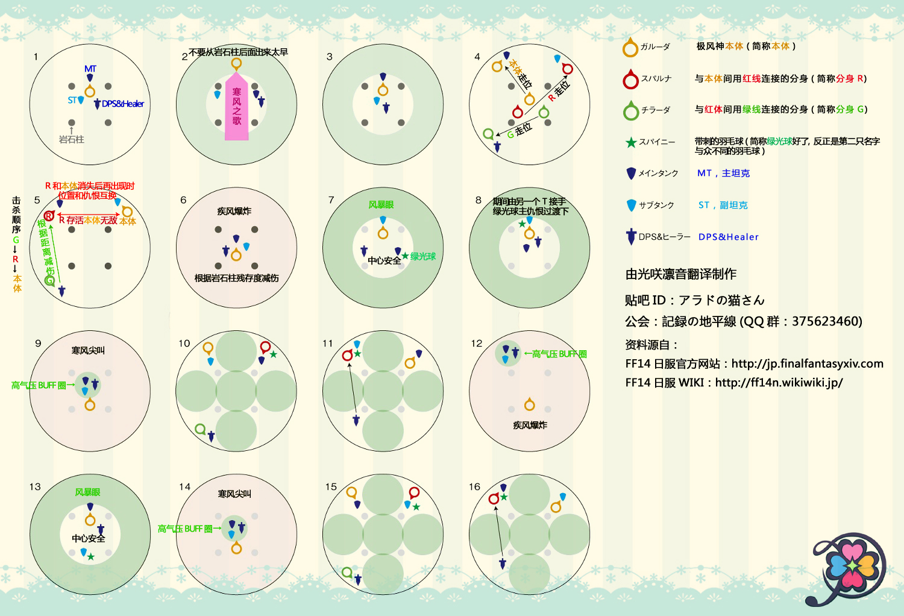

# 迦楼罗歼殛战

进场11点标A，1点标B。2T同普通迦楼罗一样注意==螺旋气流==读条穿背躲避。

开场T把BOSS拉在北半场2个柱子之间偏外，面朝场外，其他人在场地中央(不要站在柱子边上)。

BOSS消失后所有人躲在石柱后面（BOSS从12点方向出现直线AOE），如果快的话不会进入羽毛阶段，正常速度会出现一堆羽毛。DPS第一时间击杀**柔羽**（否则全场沉睡），然后再击杀剩下的羽毛。

（解限的话基本这里就跳到大气爆发了）

BOSS出现后先在原地打一小会，很快BOSS带着两个分身下来，MT带着BOSS和红线小怪去A点，ST带着绿线小怪去B点，治疗主要关注MT的血，DPS先击杀绿线分身，绿线半血之后BOSS和红线分身会互换仇恨和位置，T不用慌张，下来哪个接着打那个就行。绿线打完之后打红线分身，之后进入大气爆发。

大气爆发之后，两T互相焦点（解限直接撸不用看后文，基本上出事之前就能撸掉），所有人场地中央打BOSS，出现羽毛时，ST嘲讽**刺羽远离BOSS不要打**，一般推荐治疗使用一个大群疗拉住剩下的羽毛站在BOSS附近，集火其他羽毛。MT看到ST身上的buff变为2层时<Status :id="379" name="低气压" :stack="1"/>，嘲讽**刺羽**不要打。（如果发现T不会换嘲，请治疗做好群盾减伤和群疗预读的工作）等BOSS上天时击杀**刺羽**并在其后生成的防护罩内躲避接下来的AOE。

正常来说在这里就可以击杀完BOSS了，如果再出分身的话重复上面操作。

## 过往版本攻略

* [开荒版本攻略](http://ff14.17173.com/content/2014-09-09/20140909192609695.shtml)