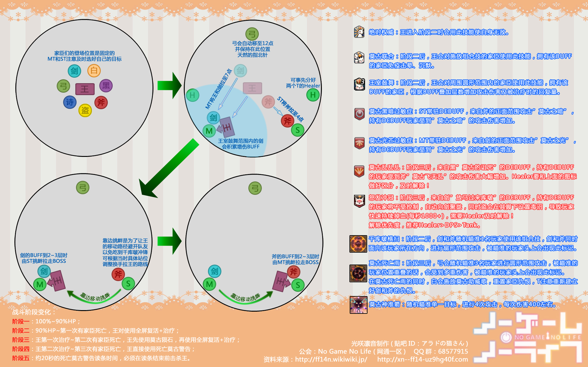

# 莫古力贤王歼殛战

开场MT拉住BOSS，BOSS召唤小怪之后，MT带着BOSS和“壁”前往场地一角（一般为7、8点方向），ST拉住“斧”前往场地另一边（一般为3、4点方向），二人距离以能嘲讽到BOSS贤王为准。当ST观察到MT身上的<Status :id="474" name="王室鼓舞" :stack="2"/>叠到3层左右的时候，就可以嘲讽BOSS。当MT发现ST身上的<Status :id="474" name="王室鼓舞" :stack="2"/>buff叠到3层的时候，就再嘲回来，如此往复。另外由于**愈**会使用技能清仇恨，请保持自身对于斧和壁的仇恨。

如果有不擅于换T的情况，也可以由1名T拉住BOSS，另一名T拉住壁和斧远离BOSS，注意开启减伤亦可。

机制上是 当有小怪阵亡后，BOSS会将自己的HP分给所有的小怪（如果已阵亡则满血复活），第二次再有小怪阵亡的时候，再分一次，第三次有小怪阵亡后，BOSS读条莫古死亡警告（20s），读条结束后强制灭团(如果有人挺过第一下则会再读一次短的，不断重复）。

因此需要让贤王BOSS每次分出去的HP尽可能多，保证最后击杀阶段的顺利渡过。

小怪保留**力**和**愈**，当场地上出现巨大黄色AOE预警时，集火**力**打断，出现巨大蓝紫色AOE预警时，集火**愈**打断。当发现某名玩家头顶出现乌黑发青的圆形点名时，远离他。其他小怪尽量压到10%以下，进入击杀阶段则爆发全开尽可能多地击杀，直到小怪原地复活为止。

有很多可以驱散的buff，治疗尽量驱散(因为场面较为混乱，每次屏幕中央出现BOSS喊话之后就有可能出现大技能)。如果你们团队输出较弱，可能需要治疗多费心一些。

召唤请管好你的宝宝。

## 其他参考攻略

* [开荒版本攻略](http://ff14.17173.com/content/2014-07-13/20140713000745799.shtml)
