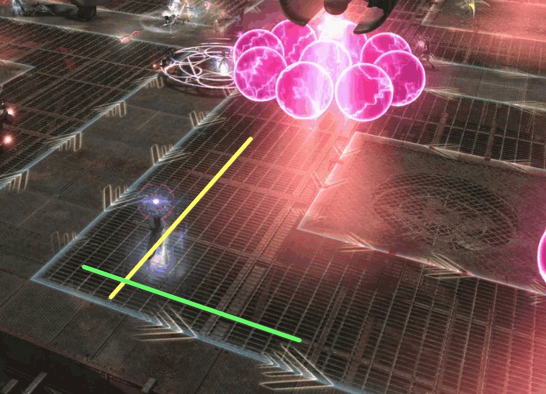
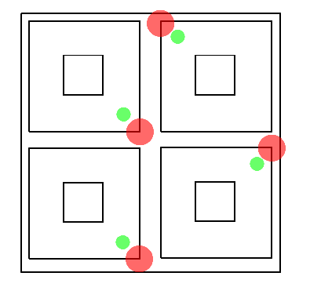
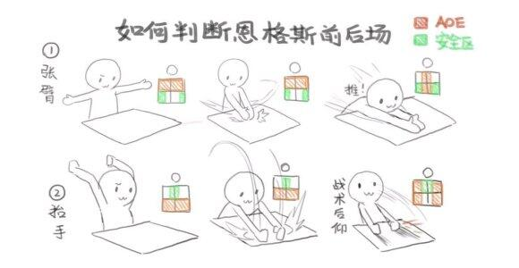

# 复制工厂废墟

尼尔副本的伤害大都为**动画判定**，不要在AOE预警圈消失后就回位，否则极易吃到技能。

[尼尔官方专题站](https://actff1.web.sdo.com/project/190920shadowbringers/yorha/index.html)：就是个介绍，没有攻略。

## BOSS 1 多关节型：司令机

;;;.guide .cols2
;;;.guide .col

空袭安全点。来自[NGA论坛](https://bbs.nga.cn/read.php?tid=20469216)
;;;

;;;.guide .col .grow

基本上出啥躲啥，有一些需要注意的读条技能：

* ==连续能量弹==：随机点名译名玩家施放正面扇形弹幕球，很容易暴毙，发现BOSS突然转身时要提高警惕。站在BOSS两侧及身后可回避。
* ==制导阵型==：点名并有连线，被点名玩家注意把线引导向场外，并且不要跟其他线重合。
* ==侧方/中央旋转攻击==：读条结束后时有不足1s的AOE范围提示，所以要提前躲避，侧方往中间躲，中央往两侧躲。
* ==空袭阵型==：空中出现小飞机人并不断移动、制造圆形AOE，参照左图确认安全点（或跑步躲避）；第二次BOSS会出现==冲击波==读条，可以开启防击退技能处理。
-安全点说明：小飞机刷出来的位置内侧，地板下方两根水管的交叉处（红色表示小飞机的出现位置，绿色表示对应的安全点）。

其他的努力躲好就行了！

;;;
;;;

## BOSS 1 ~ BOSS 2 

道中有很多小怪，各队<Role name="tank" />T注意拉住小怪仇恨，不要漏怪，其他人努力打掉即可。

## BOSS 2 霍布斯

玩家会根据ABC队被自动丢到不同的场地中，除了场地本身有机关之外，场地周围的墙壁也会旋转切换机关。屏幕中央会有各种提示台词提示机制。推荐<Role name="tank" /><Role name="healer" /><Role name="dps" />所有人在场地右前方集合输出。

共通机制：
* ==耐激光测试==：全场AOE，有点疼，推荐做一些减伤，<Role name="healer" />注意抬血。
* ==环形激光==：步进式环形AOE，有提示但和常见AOE提示不同，速度很慢，推荐躲完第一个之后去场外回避剩下的AOE。
* ++墙面的火炎放射器开始运作……++：回头看墙壁，找没有点燃的放射器方向躲避（放射器方向略有点斜，两侧放射的话是∧形状的火焰。。
* ++墙面的右臂开始运作……++：场地中央出现一个蓝圈，然后会出现大量AOE范围提示，AOE会连续放3次，按中央箭头旋转方向旋转。
* ++墙面的左臂开始运作……++：场地中央出现一个集装箱，集装箱四面壁会向外倒下，<Role name="tank" /><Role name="healer" /><Role name="dps" />所有人在场地右前方躲避倒下的集装箱壁之后，<Role name="tank" />一人接两根线远离人群吃小爆炸。如果没有T处理，请其他队友灵性带位。

各队机制（地板机制）：3个队伍所在地板会出现机关，出啥躲啥即可。B队机关为强制移动，注意不要被移动到场边即可。

## BOSS 2 ~ BOSS 3

道中有2个小怪：

* **大型战车**：注意环形AOE等粉球出现后再移动，被连线的玩家不要带球炸人群即可（吃2个圈即死）。
* **飞行装置**：连线点名是向点名方向的步进式AOE，点名消失后向左右移动回避后续的AOE伤害。其他人注意躲开连线方向。

## BOSS 3 昂格士

基本全场都需要观察BOSS胳膊，注意经常抬头。

;;;.guide .cols2
;;;.guide .col

老三动作判断方法（作者请与本站联系）
;;;

;;;.guide .col .grow

BOSS举单臂的时候，注意向没有抬手的一侧躲避。举双臂时参见左图安全区说明（第一次必为情况①，第二次为情况②，之后随机）。

各种点名基本上离开人群都没错，其中有一种黄色箭头跟踪尾巴的点名是跟踪式AOE，会有多次AOE判定，不要急着回人群。

读条==能量弹幕==，BOSS胸口出现激光蓄力，同时地面出现12个塔，激光会覆盖住中间的6个塔，等激光结束后立刻去踩（每个塔里都要有人）。

小怪阶段各队<Role name="tank" />T注意拉好大个的面向场外，小个的2P会帮我们轰掉，不用管。

;;;
;;;

小怪阶段结束后，所有人南场集合，玩家会被崩到另一个台子上。（如果不在南半场的话基本上必死，要么被砸死要么掉下去摔死）

新台子上开场两侧会出现机械臂向中央碾过，一共碾3次，注意观察机械臂位置躲避。之后出啥躲啥即可。

## BOSS 4 〇〇

基本上出啥躲啥即可，也可以选择跟着其他人跑，如果实在不行可以考虑硬吃1个技能（别四处乱跑吃个饱，治疗会生气的）。

* ==主炮激光==：随机点名正面激光，注意躲开正面。
* ==前后/左右齐射==：前后躲两侧，左右躲前后。
* 对接解除：〇〇离开战车变为小飞机，会从场地某一侧按1/3场地宽度轰炸场地。2P会提前飞到轰炸末端（比如〇〇由北向南轰炸，那么2P会提前移动到南场），可以给她标记方便找位置。
**轰炸伤害判定以烟雾特效为准，不要提前移动。**
* 场地边上出现大齿轮：会有1/4场地面积的大AOE，向没有齿轮的地方躲避。
* 场地2角掉下来2辆战车：BOSS会无敌，<Role name="tank" />T注意拉好战车仇恨。打完后BOSS会连线其中一辆战车，<Role name="tank" /><Role name="healer" /><Role name="dps" />所有人去另一辆战车背后躲避AOE，结束后立刻远离这辆战车。
* 最后一波小怪跟BOSS 1很像，同样会读条==中央/侧方旋转攻击==，注意向两侧/中央躲避。

## 其他参考攻略

* [susu图文攻略](https://www.ffxiv.cn/detail/article/544)
* [子言姐姐考据视频攻略](https://www.bilibili.com/video/av17434279)