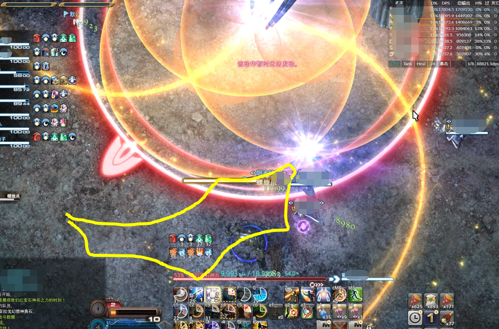

# 红宝石神兵破坏作战

由于BOSS会频繁地回到场中面向6点，因此推荐<Role name="tank" />MT开怪后就把BOSS放在场地中央，面向南场。

## P1

BOSS回到场中读条==凶鸟爪==，场地上会出现8根树枝一样的东西，树枝长成后会出现AOE范围提示，长枝靠近BOSS的地方是安全的（短枝远离BOSS的地方也安全）。接下来读条==地面液化==（没有AOE范围提示），需要玩家站在枝条上才不会陷进去。如果读条是==掘地雷==的话（有AOE范围提示），则要躲开树枝的范围。

读条==红宝石射线==，为正面BOSS目标圈宽度的直线AOE，随机点名<Role name="tank" /><Role name="healer" /><Role name="dps" />所有人都要注意躲开正面。

;;;.guide .cols2
;;;.guide .col

图片来自[NGA](https://bbs.nga.cn/read.php?tid=22860274)
;;;

;;;.guide .col .grow

核心机制==螺旋爪==，安全区大概如图所示，如果需要打极神兵的话需要熟练掌握安全区的位置。

大约是两个圆公切线以外，公共弦左侧。

;;;
;;;

高功率诱导射线是点名2名治疗的分摊，<Role name="tank" /><Role name="dps" />其他人都要去参与分摊，不可同时参与2个分摊。

BOSS跳到场地一侧读条==凶鸟冲==时，需要前往BOSS脚下箭头后方面向BOSS（BOSS并非面向场中，而是偏一侧的，玩家需要站在另一侧），等BOSS冲出去后一直沿着场边向前跑。

另外一种是在场地中央读条==凶鸟冲==，需要去BOSS的左前方场边，等BOSS冲锋后延场边顺时针跑即可。

诱导射线需要先前往BOSS脚下躲避AOE，然后散开处理个人点名。

## P2

转场动画结束后很快会下来2只小怪，<Role name="tank" />T分别拉住击杀即可。击杀过程中会有点名DPS的陨石流，<Role name="dps" />DPS注意互相分散，<Role name="healer" />治疗注意抬血。==红宝石之爪==是对T的5次连续大伤害，<Role name="tank" />T务必开大减伤应对，治疗及时跟进。

处理完小怪之后先是会提示距陨石坠落还有x秒，注意时间布置减伤。

之后BOSS读一堆条，场地四周落下4颗彗星，需要在彗星后躲避AOE。

最后场地4个方向会出现4个带箭头的圆印子，圆印子走到第5次的时候会落下一颗陨石，每个印子需要一名玩家接陨石，推荐<Role name="tank" /><Role name="healer" />T奶接陨石，<Role name="dps" />DPS集中火力输出（先救奶，后救T）。

之后就是站桩AOE，<Role name="healer" />治疗注意维持血线即可。