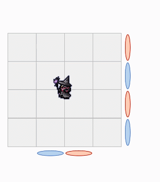

# 伊甸希望乐园 共鸣之章3

BOSS没有面向不会动，整个BOSS圈内部到边缘（大概1/4场地面积）都能打到它。但是跌落场边会逝世要注意。

## P1

开场AOE后BOSS读条==暗光钉==，会对<Role name="tank" />MT连线并施放直线大伤害技能，MT横向移动离开人群并开好减伤，其他人注意不要跟MT站在一起。（之后还会多次出现）

核心技能1：波状号令，正面会按顺序出现球，先出现的球先冲锋，在后出现的球处躲避，等第一波球冲出去之后移动到无球的位置（比如左边先出，右边后出，那就站在右半场，等左半场的球冲出去了，向左移动躲开右半场的球）。

第二次波状号令会带传送门，不过这次是演示，无脑在前半场处理即可。

;;;.guide .cols2
;;;.guide .col

图中传送门颜色和球的出现顺序仅供参考，请以实际副本中的颜色顺序为准。

;;;
;;;.guide .col .grow

第三次波状号令会带完整传送门，处理方式是，看先出的球所在的位置，左右调整好后，回头看它所对应的传送门颜色（场地后方），然后心中默念这个颜色，再看左右侧的的传送门，前后移动找到异色格子站好。前方的球处理完之后，看左右侧的门，前后移动处理。

;;;
;;;

强制传送，玩家身上会出现<Status :id="2240" name="前" /><Status :id="2241" name="后" /><Status :id="2242" name="左" /><Status :id="2243" name="右" />的buff，buff倒计时结束后，玩家会按照特效的方向传送走。

之后的2组分摊必须分开吃，不可以一人吃俩，否则原地去世。

夜袭号令和之前的波状号令十分相似，只不过选球的方式从看先后，变为看<Status :id="2238" name="光" />、<Status :id="2239" name="暗" />，如果自己身上是<Status :id="2238" name="偏属性：光" />buff，就要去撞黑色的球，如果是<Status :id="2239" name="偏属性：暗" />buff，就要撞白色的球。

## P2

小怪阶段会有强制传送配合靠近、远离，在传送时务必注意传送方向，别掉下去了…

## P3

技能都见过，只是略有加强。==强制传送==会配合踩塔（在前后场），尽可能传送到场中前后方，要不然容易来不及回来。

夜袭号令在判断横向门的时候，需要找异色的门（即如果自己初次站的那列背后是红门，那么前后移动找横向门的时候就要找蓝门）。

号令是最容易站错or发生减员的地方，<Role name="healer" />治疗要当心。