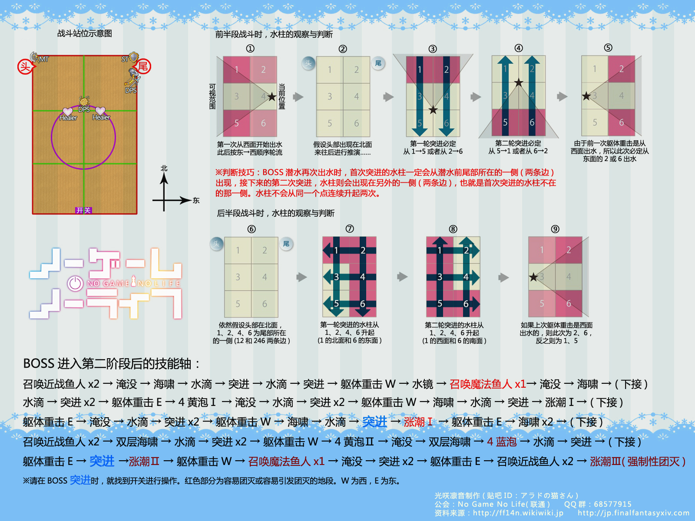

# 利维亚桑歼殛战

和真水神几乎没有什么区别，需要会看俯冲。

通常建议战士拉尾部(因为战士自身可以回血)，黑骑也可以拉尾。

对拉尾部的T进行治疗会获得<Status :id="433" name="水镜" />，一层减少2m治疗距离，16层时就算你贴脸都无法治疗。建议治疗使用仙女、鼓舞、阳星相位、再生等治疗次数较低但效果较好的技能（祭奠天国的石肤）。

**魔法渔人** （单独出现在甲板右舷的小怪），需要T拉住，在小怪80%~70%的时候使用眩晕技能（6s眩晕3s眩晕1s抗性），其他DPS迅速集火击杀，否则该小怪会扔一地的恐慌圈（恐慌时无法打断），踩到基本就水里见了（解限也要最优先击杀）。

其他同真水神一样，水泡优先击杀后停手等以太充能，BOSS分别会在60%和30%强制巨浪，如果此时防护罩以太不足，解限照样团灭（部分DPS较高的的团队在解限的前提下可以强压掉第二次巨浪）。

## 其他参考攻略

* [开荒版本攻略](http://games.sina.com.cn/o/z/ff14/2014-09-16/1811570481.shtml)
