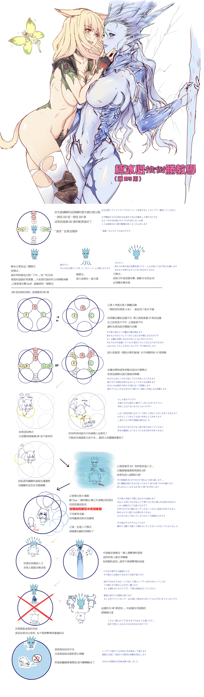

# 希瓦歼殛战

MT开怪拉场中央，BOSS背对人群。当BOSS气泡++被冻结了千年的知识++或看到BOSS身上有<Status :id="527" name="冰霜之杖" />的时候，所有人散开，冰圈不互相重叠即可。当BOSS气泡++严冰之刃守卫我的兄弟++或看到BOSS身上有<Status :id="526" name="冰霜之剑" />时，MT穿过BOSS带BOSS转身，全体8人分摊伤害(解限就不用了，自己开个大减伤吃了就行)。当MT发现BOSS读条==冰河怒击==时，穿BOSS躲避。

小怪阶段推荐ST去拉小怪，MT要处理==冰河怒击==和剑姿分摊，所以其他人尽量接近站在一起打小怪即可。和雷神一样，若血量过低但没打掉小怪则会团灭。

高跟鞋踩碎之后BOSS会对当前MT进行一次普攻，由于之前MT吃了BOSS的易伤，因此这个普攻会非常疼，MT可以选择看到BOSS落下后开大减伤，或治疗准备瞬发抬血。之后进入各种花样冰圈躲避阶段。不解限的情况下，在看到圆圈冰圈(9个冰圈从场边依次出现最后到场中)时，如果会躲则躲(和泰坦圆圈雷机制相似，先去场边最后一个圆圈处等中央的圆圈炸了之后立刻回中央)，不会躲可以硬吃一个。

圆圈冰圈之后，MT带着BOSS退到场地边缘（通常为12点），BOSS会切换为<Status :id="528" name="冰霜之弓" />，弓箭为正面200度超大范围AOE，MT看到BOSS气泡的时候就可以穿BOSS躲避了，与此同时建议ST挑衅嘲讽换T。

过一会会有一名玩家头上出现蓝色点名，如果不是当前T，请在BOSS屁股后面蹲好等着被砸飞，其他人在BOSS两侧躲避。如果点名当前T，请使用<Action name="亲疏自行" />防击退。如果被吹飞玩家，或被波及玩家撞到场边变成冰块，请及时解救（不过这会应该都快打完了，不救也没事）。

弓箭形态结束后希瓦会冰冻全场，推荐当前T滑冰带BOSS回中场以应对后续技能（包括击飞）。

## 过往版本攻略

* [开荒版本攻略](http://games.sina.com.cn/o/z/ff14/2015-03-12/1047607770.shtml)