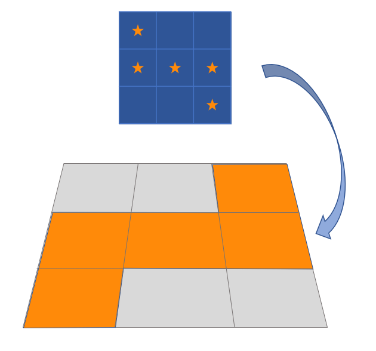

# 〇〇〇〇歼灭战

开场AOE全体HP归1，<Role name="tank" /><Role name="healer" /><Role name="dps" />所有人集合，方便<Role name="healer" />治疗抬血。

之后BOSS连线场边，蓝色三角为“以连线位置为顶点，对边为底边的等腰三角形范围”AOE，靠近连线位置贴场边躲避；粉色方块为所在半场范围AOE，离开连线位置半场躲避。

对T死刑是范围攻击，其他人注意远离。

召唤小怪阶段，贝希摩斯为圆形AOE，场地边缘的蛇是直线AOE，第一次出现时间很长可以慢慢观察。

点名<Role name="healer" />治疗的分摊是多次连续分摊，注意开好减伤。

;;;.guide .cols2
;;;.guide .col

BOSS升天机制
;;;

;;;.guide .col .grow

核心技能，领导夹菜我转桌：根据特效指示的方向顺时针或逆时针旋转，地面转角色不转，……去之后没有aoe的地方（需要一定的空间想象力）。

绿色图腾是直线范围AOE，先出现的先放，在后出现的图腾前等待先出现的放完AOE后立刻移动到先前AOE的范围里。

BOSS去斜角是超宽俯冲AOE，去邻侧斜角躲避。

BOSS升天后，场地侧面会出现星图，对应场地分为3x3九块，有星星的地方会有AOE伤害。星图会按顺序出现在场地的3个方向，AOE也会连砸三次。

如果觉得观察有困难，可以先观察星图中央是否安全，如果中央不安全，则观察左下角或右下角是否安全（左下角对应面向星图时的左前方，右下角对应面向星图时的右前方）。

治疗<Role name="healer" />注意跑星图的时候BOSS仍然有平A，适当给MT HOT或者单盾。

;;;
;;;
