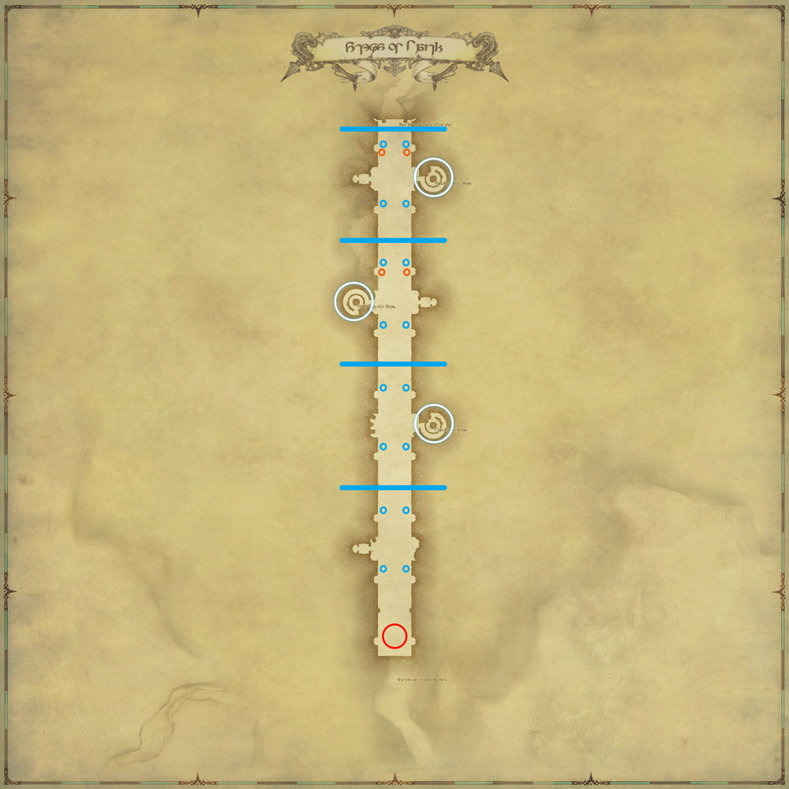

# 皇都伊修加德保卫战

这是一个长条形的场地，只要接近BOSS就算开怪，T不用为BOSS建立仇恨(它不会打人)，BOSS会慢慢接近大审门，如果未能在BOSS击破大审门前击杀BOSS，副本即告失败。要注意BOSS是在不断移动的，而被它的脚踩到也会遭到巨大伤害(尽量避免)。

在这个副本里，T的工作就是拉住所有新刷出的小怪，并把它们放在BOSS身下。
治疗在这个副本里不怎么需要加血（死人让他自己返回跑尸即可），可以在刷出新的小怪的时候使用大加血技能吸引仇恨，方便T拉怪。另外上塔（下述）一般也是由一名治疗负责。

DPS的工作是开炮(通常远程开炮)和打怪。

;;;.guide .cols2
;;;.guide .col

;;;

;;;.guide .col .grow

过道两侧的对龙加农炮(图中蓝色小圈)右键上炮之后，有3个技能，1==炮击==就是普通攻击，2==雷弹==可以眩晕目标，主要是小怪在读条大范围AOE，同伴不好躲避的时候使用，3==黏着弹==是放一滩减速的毒，一般放在BOSS身下或自己的炮前给小怪减速。平时没事就用炮轰BOSS+小怪即可，BOSS读条AOE的时候ESC下炮，在两侧耳台躲避即可。

在第一赌墙碎裂后，就开始有大的对龙弩炮，墙后第一波炮炸了之后，需要一名玩家上塔（图中白圈），接近弩炮时，地面会出现一个红色预览圈，当BOSS肚子与红色预览圈重合时（NPC也有喊话，可以注意一下），右键弩炮开炮即可。T注意会有小怪追着上塔的玩家，记得拉住。

第三堵墙开始，BOSS会在接近弩炮的时候读条矩形巨大AOE，需要两名开炮的玩家下炮去开拘束器，两个拘束器都打开后能打断BOSS读条，此时塔上的玩家再开弩炮即可（同样有NPC喊话，注意一下即可知道时机）。
近战3格LB好了就放就行了(

如果全部正常开炮的话，大概在第二个弩炮塔之前就能打完；如果只开加农炮不开弩炮，在LB的帮助下也可以打完；如果没人开加农炮和弩炮，也不放LB，那么仍然有可能失败。

;;;
;;;
