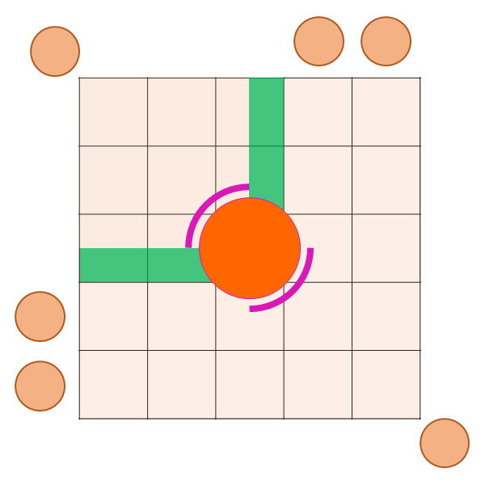

# 近东秘宝阿尔扎达尔海底遗迹群

非常具有冒险气息的副本~

## 进场 ~ BOSS 1

跑路的时候会出现着弹提示（白箭头指向AOE范围），着弹位置会落下新的小怪，<Role name="tank" />T装备合格的话可以头铁往下拉到出现着弹提示的位置。

### BOSS 1 阿卜迦

BOSS读条==触手潜行==后，会放出2条触手（第一次是1条），触手在水面画出一些鬼画符之后潜入水底，接下来会以触手消失的位置为中心放出巨大范围的AOE（半径与场地半径相同，建议贴边躲避）

读条==喷出毒酸==后，场地上会分3次出现AOE范围预警，默记顺序，在第3批AOE圈位置等第一批AOE圈炸完后立刻移动过去。

## BOSS 1 ~ BOSS 2

沿途的**阿尔扎达尔铁壁**会连线场地周围召唤小怪，如果能先集火击杀的话，可以减少后续需要应对的小怪。

### BOSS 2 装甲战车

;;;.guide .cols2
;;;.guide .col

框外的小圆为浮游炮，格子为场地花纹示意，绿色区域为安全区
;;;

;;;.guide .col .grow

这个BOSS会召唤浮游炮，同时自身周围出现防御壁，反射浮游炮的攻击：
1. 第一次为4角浮游炮，找两个防御壁之间的空档躲避即可。
2. 之后会出现对角浮游炮+单边双排浮游炮配置，在中央行列靠近2排浮游炮的半格里，找面前没有防御壁的空档（参见配图绿色安全区示意）。

召唤浮游炮时，BOSS脚下亦有伤害，不可踏入。
;;;
;;;

## BOSS 2 ~ BOSS 3 

沿途有4个拟态怪宝箱ADD，T注意拉一下，其他人如果OT了注意带给T。

### BOSS 3 门奴

核心机制1：把玩家抓到场地一侧，进入<Status :id="2973" name="旋转移动" />状态。按左右移动键可以改变头顶箭头的方向，同时转弯半径巨大（大约1~1.5个格子），感觉就像在超级滑的冰面上转向，需要提前规划好转弯的路径。

第二次旋转时，BOSS会同时附带场地直线AOE，固定第一次中央，第二次东侧（右侧），旋转调向时要注意回避，如果连续吃到2次AOE伤害会死。

核心机制2：读条==魔布附魔==的同时，BOSS抬手，粉紫色连线连接垂下的布幔，连线同色的布幔会发生圆形AOE，躲到异色布幔下方即可。