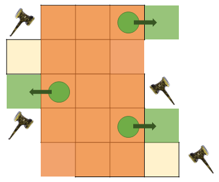

# 灿烂神域阿格莱亚

非常炫酷，而且有一定难度，建议适当提升装备再前往挑战。

## BOSS 1 比尔格

;;;.guide .cols2
;;;.guide .col

第二次锤子安全点示意（绿色圆点均为安全点）

第三次锤子安全点示意（在绿色圆点处等待，地板移动后前往绿方块区域）
;;;

;;;.guide .col .grow

场地出现蓝色圈：击退。锤子发光+BOSS脚下出现雷电提示+蓝圈时，将会以蓝圈为中心，发生黄色雷电提示的十字或叉字扇形AOE，调整击退方向时要注意。

两侧场地消失的动画并没有伤害，两侧消失后，场地图案变为3x5的格子。

场地变化后，长边两侧会出现锤子动画，锤子会将场地横推一格，第一次为演示动画，在中间一列是安全的。

第二次会在某一行的格子上出现紫色的锤子，并出现紫色的AOE范围预警。紫色锤子所在行会被侧面的锤子敲击移动，预判紫色锤子的移动方向，找安全格子躲避。

第三次BOSS会跳到场地一侧，释放覆盖3x5格子范围的AOE。找到3行都被AOE预警覆盖的行，并前往远离锤子的一边躲避（锤子敲击移动格子后出现安全区）。

读条==生成分裂体==后，场地东侧（右侧）出现5个BOSS分身，其中若干个会发光，发光分身的AOE行进速度较快。前往不发光分身的面前，待旁边发光分身的AOE走过去后，穿过AOE躲避剩余伤害。
;;;
;;;

## BOSS 1.5 拉尔戈神使

读条==坏灭雷斩==，正面180度无范围提示AOE（仅在最后一秒有展示），看到读条就绕到BOSS背后。

抬手出现雷球，2个雷球会从中央到场边，然后分别绘制1/4圆的扇形区域，被圈起来的区域会产生AOE。

之后会有一次组合技，先判定雷球的扇形场地，再判定正面的180度AOE，冷静应对即可。

## BOSS 2 拉尔戈

BOSS读条==坏灭雷击==点名3个<Role name="tank" />T的时候，T注意开启减伤并远离人群，这个大伤害技能为范围伤害。

BOSS背上有4个环，作为这个本的核心机制：

* 丢出2个环放大，2个小环在手侧，同时读条==幻天破坏拳==并蓄力：观察蓄力手一侧的小环的颜色，这个颜色对应的大环所在半场有AOE，去异色半场躲避。
* 有大环的同时还有彗星落下的标记：若蓄力侧为红色，则彗星落点正下方安全；若蓄力侧为蓝色，则远离落点且红色大环所在半场安全。

场地出现紫色范围提示，同时有较细的绿线延伸到场地的手指上：绿线表示击退的方向，找绿线一路投影到立起手指，且尽头没有其他AOE提示的手指为安全。

## BOSS 2.5 阿格莱亚双狮

2头狮子同时读条时，头顶会出现1、2的标记，标记为1的狮子先放技能，标记为2的后方，据此判断回避的时机。

如果实在躲不来，可以考虑硬吃1个技能，但不要2个都吃。

## BOSS 3 阿泽玛

BOSS读条==两翼红炎风==后，场地上会出现一些红球，这些球是会爆炸的，注意不要肆意走动。

读条==蜃景==后，会出现一些BOSS的分身，这些分身会把面前的球往分身面向所指方向吹过去（可假想为3x3的场地，一次吹1格），第一次在分身下方躲避较为安全，第二次需要根据分身位置和箭头方向自己寻找安全点。

BOSS读条==神炎==点名3个<Role name="tank" />T的时候，T注意开启减伤并远离人群，这个大伤害技能为范围伤害。

之后BOSS会丢出2把扇子，扇子沿着场地周围飞行，当BOSS读条==炎扇流舞·终炎==时，扇子会爆炸，范围非常大（与场地半径相同），建议在BOSS身下观察扇子位置，待扇子停止飞行后，立刻向没有扇子的方向躲避。

读条==烈火旋扫==为正面270°范围AOE，仅有背后安全。

红炎斩+蜃景：场地出现十字地火提示，以及2个分身；第一次前往分身所在1/4场地躲避，第二次从无分身的场地观察相邻场地的分身，没有面向自己的分身所在的场地安全。

读条==燎原之炎==后，场地中央仅剩余一块三角形区域安全，会依次出现3次击退提示，在第一次击退边中点观察并等待，被击退后立刻移动到第二次击退边的中点，以此类推。

这个BOSS伤害极高，机制很快且密集，<Role name="healer" />治疗多关照团队血线，其他有救场能力的队员也尽量多关照队友。

## BOSS 4 纳尔札尔

鳞片披风向上飘，发橙色的是纳尔，头顶有蓝色煤气灶火焰的是扎尔，所有生死之择的读条都需要观察BOSS形态进行判断（从第2次开始，BOSS有可能在读条中途进行换人，换人时会有气泡提示，建议在读条后半再进行判断）：
* ==生浪死环之择== ： 橙色炸中间，蓝色炸周围，按相反颜色躲避。
* ==生轰死爆之择== ： 橙色需要分摊的直线AOE，蓝色追踪炮。建议被点蓝色点名的人远离人群，直到判定结束，若判定为蓝色的扎尔，则需要继续在场外绕场移动，待追踪炮伤害结束后回人群。
* ==生死袭火之择== ： 出现扩散型AOE提示，根据颜色前往不会炸的AOE提示圈之间回避。这些AOE圈之间有极小的安全区，极限贴边的话也可以确保安全。
* ==生死混一之择== ： 前两种的组合，先处理圆环机制，再处理分摊/追踪炮。

其他技能：
* ==炎天净火==，点名3人扇形AOE，1人分摊。建议被点名扇形的人互不重叠远离，其他人尽可能靠近BOSS脚下进行分摊。
* ==纳尔神火==，需要3个<Role name="tank" />T进行分摊。
* ==炎狱破==，紫色激光所向半场AOE，读条中可能会变更方向。
* ==死魂爆==：天上降落若干陨石，落地时AOE范围极大（AOE直径与场地半径相同），需要走超过半场才能回避，注意观察陨石的位置和顺序进行回避。
* ==烈火之财==：BOSS移动到场边，并连线场地中随机若干个点，同时提示机制类型；第一次必定为【1点】击退+【2点】远离，第二次需要观察后判断，如果出现连续击退难以调整，可以使用防击退技能处理。
* ==天秤之试炼==：BOSS上天，场地上出现3个影子并连线玩家，没有被连线的人请跟随自己小队队员。打倒影子后，之前被连线的玩家前往另外一半场地，没有被连线的玩家留在原地。观察场地北侧的天平，需要保证天平均衡，已站定/想不明白的玩家不要随意乱跑。若天平不平则会直接团灭。

## 其他参考攻略

* [子言攻略（视频）](https://www.bilibili.com/video/BV1fW4y1171Z)