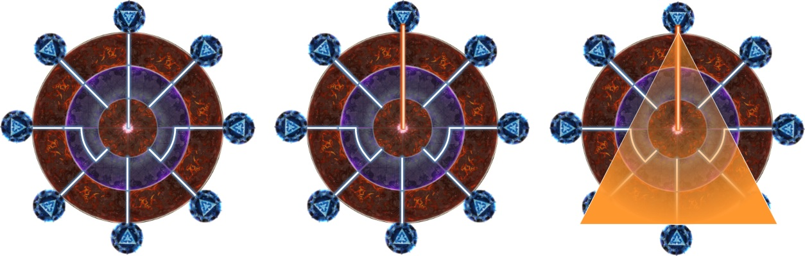

# 卢比坎特歼灭战

;;;.guide .cols2
;;;.guide .col

图片来自[いまさら攻略FF14](https://nowff14.blogspot.com/2023/01/Rubicante.html)
;;;

;;;.guide .col .grow

核心机制为==炼狱朱炎==，BOSS读条后，场地周围出现8个魔法阵，地面上变成红紫色圈，并且出现连线。但是仔细观察的话，BOSS脚下仅有一根连线，与BOSS连线的魔法阵在读条结束后，会立起并放出三角形AOE。

第一次只要找到与BOSS连线的魔法阵，并站到这个魔法阵两侧躲避即可。

第三次开始，紫色的地板会随箭头所示方向旋转45°。对于歼灭战这个副本来说，可以不用考虑旋转后的魔法阵和线，只要站在一开始连线的魔法阵下方，就一定是安全的。

;;;
;;;

其他需要注意的机制：
* 烈火赤灭爪：BOSS脚下出现旋转的箭头，箭头停下后，立刻沿箭头方向放直线AOE，然后向两侧扩散2次。这个机制非常快，不是很好躲，如果你第一下躲开了，第一下AOE后立刻向已经炸过的区域（BOSS脚下）移动；如果第一下没躲开，站在原地不要乱跑。<Role name="healer" />治疗注意抬血。
* 灭土烧尽：读条后点所有玩家不可回避的直线AOE，第一次伤害后，飞到场外的分身会向场内再次造成直线AOE。最好的处理方法是第一次点名时8人两两相对（8方分散）引导，如果一开始大家站得比较乱，会导致第二次AOE没有回避空间，此时应注意向场地边缘移动（场地边缘可能会存在安全空间）。
* 双炎流：点名2<Role name="tank" />T巨大扇形AOE，两名T在前半场分左右站，其他人在后半场躲避即可（如果场面混乱到处是人，T尽量不要乱动，让人群躲T）。

其他出啥躲啥即可。