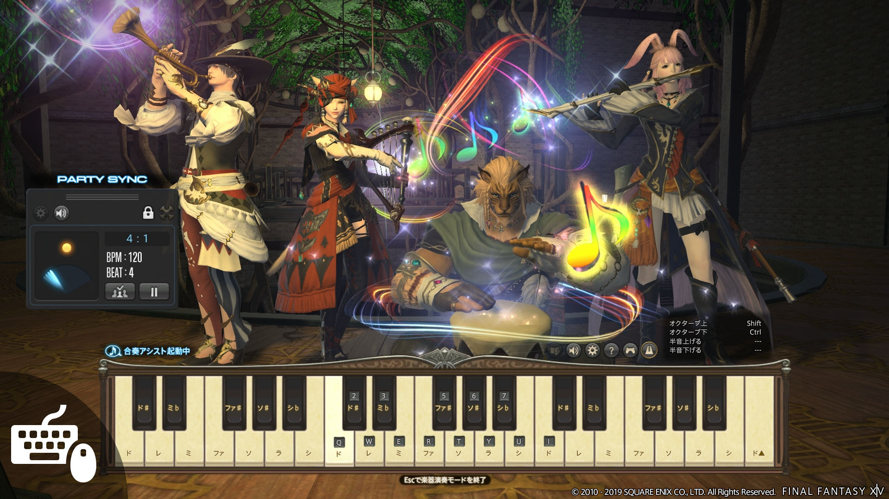

# 吟游诗人
<FloatTOC />

## 综合介绍

黑衣森林的猎手使用弓箭袭击它们的猎物，而学会了各种战歌的弓箭手就成为了吟游诗人。

诗人需要保持两个固定DOT存在，安排好自己歌单的播放顺序和时间，使用三首战歌及其特效触发更多更丰富的技能。由于诗人的DOT和触发技能比较多，所以新人在练级阶段会有比较大的技能监控压力，在4人本中自由度也不是很高。随着逐渐掌握更多的技能，并拥有完整的输出循环之后，诗人的演奏会越来越上手，越来越顺畅，最终一定能演奏出一首胜利的战歌。

作为艾欧泽亚钦定爱豆，诗人拥有独一无二的演奏模式，作为打本之余的一个不错的消遣，无论你是否学过乐器，你都可以找一个简单的谱子练上一练，然后在艾欧泽亚的各个角落为大家演奏。

## 诗人入门

想以吟游诗人开始游戏的玩家，可以在建号的时候选择==弓箭手==进入游戏。其他玩家完成自己职业10级的职业任务之后，在格里达尼亚接任务<quest name="如何加入弓箭手行会" />，并继续<quest name="百步穿杨的弓箭手" />任务，就可以获得弓箭并转职为弓箭手了。

完成弓箭手30级职业任务<quest name="毫无迷惘的眼瞳" type="plus" />，就会开启吟游诗人的转职任务<quest name="诗与弓交织的旋律" type="plus" />，完成任务获得<item name="吟游诗人之证" />并装备上，就正式成为一名吟游诗人了！

### 演奏模式

正式成为诗人之后，就可以前往格里达尼亚的露天剧场接任务<quest type="plus" name="演奏心中的旋律" />，经过对话后就可以开启诗人的演奏模式。

;;;.guide .cols2
;;;.guide .col

;;;

;;;.guide .col .grow

按`P`打开技能菜单，然后找到`乐器演奏`，在右边的乐器中选择一个，就可以进入演奏模式了。

在新弹出的键盘上，可以通过键盘上的设置键修改键位，默认按键是中央C所在八度，可以按`Ctrl`和`Shift`弹奏高八度或低八度的音符，整个键盘横跨三个八度。除了键盘，也支持手柄演奏，有外接键盘的玩家也可以映射按键直接演奏。

诗人的演奏模式无法同时弹奏2个音，而且由于服务器系统延迟的问题，导致无法直接进行合奏，在5.1追加的节拍器功能里，玩家可以通过节拍器辅助合奏。

打开演奏助手，可以在预设的几首曲子中选择一首，以类似音游的方式演奏。

;;;
;;;

## 练级手法

诗人的核心DOT是<Action name="毒咬箭" />（64升级为<Action name="烈毒咬箭" />）和<Action name="风蚀箭" />（64升级为<Action name="狂风蚀箭" />），然后通过<Action name="放浪神的小步舞曲">旅神</Action>→<Action name="贤者的叙事谣">贤者</Action>→<Action name="军神的赞美歌">军神</Action>三首歌的轮播，触发<Action name="完美音调" />、<Action name="失血箭" />CD重置和加速的效果。

只要顺畅管理好DOT和歌单，你就能成为一名合格的诗人。

### 诗人的歌单

弓箭手30级转职成为吟游诗人之后，就拥有了自己的第一首歌：<Action name="贤者的叙事谣" />，在歌曲生效的时间里，每3秒会有80%的概率减少<Action name="失血箭" />和<Action name="死亡箭雨" />的CD。

接下来习得<Action name="军神的赞美歌" />，在歌曲生效的时间里，每3秒会有80%的概率为诗人叠加加速4%的buff，最多叠4次。在78级之后，军神歌唱完还可以获得<Status :id="1932" name="军神的加护" />效果，为军神之后的歌曲持续播放军神的特效。

最后习得的<Action name="放浪神的小步舞曲" />（俗称旅神歌）是诗人对单体输出时最强大的歌曲，在歌曲生效的时间里，每3秒会有80%的概率附加一层++诗心++，这首歌的诗心可以让玩家使用<Action name="完美音调" />，而完美音调的威力会因诗心的层数不同而有不同威力，原则上都应该在3层诗心的时候使用完美音调。

三首歌的触发特效都叫做++诗心++，但它在每首歌里的效果完全不同。

在实战中，歌曲之间有相对优先的顺序，下面会简单介绍一下常用的播放顺序，但这不是唯一固定的播放列表，随着你对诗人理解的加深，也可以对歌曲的播放顺序做出自己的调整。

### 对单体输出 

30级以前的弓箭手并没有歌可以唱，如果有<Action name="毒咬箭" />就先打毒咬箭，没有的话就<Action name="强力射击" />、<Action name="失血箭" />，哪里亮了点哪里。

30级后习得唱歌之后，就需要按照<Action name="放浪神的小步舞曲">旅神</Action>(52级)→<Action name="贤者的叙事谣">贤者</Action>(30级)→<Action name="军神的赞美歌">军神</Action>(40级)的顺序轮播（等级不够就跳过这首歌），诗人每首歌的播放时间需要根据<Action name="猛者强击" />的CD和一些其他细节进行安排，在练级阶段不用管那么多，保证你总有一首歌在唱就完全可以了。

开场之后，按照<Action name="风蚀箭" />（64级之后升级为<Action name="狂风蚀箭" />）→<Action name="放浪神的小步舞曲">旅神</Action>→<Action name="烈毒咬箭" />的顺序起手，然后使用<Action name="强力射击" />（76升级为<Action name="爆发射击" />）填充，像<Action name="失血箭" />这样的技能应该好了就放；<Action name="九天连箭" />会固定触发一层诗心，因此需要在开始唱歌之后使用，而且**务必好了就用**；<Action name="纷乱箭" />可以加强一个战技，这个技能固定绑定<Action name="辉煌箭" />使用。

双毒DOT的时间快要结束的时候，需要使用<Action name="伶牙俐齿" />(56)刷新DOT，虽然这个技能本身威力不高，但它可以用一个技能完成2个技能才能做完的事，可以节省时间使用其他技能 ，并利用[快照机制](/basic/battle.md#DOT)最大化DOT伤害。如果觉得同时盯着DOT和歌曲很困难，也可以在每次准备切歌之前补一次DOT——二者都是持续45s。

80级时，诗人会获得<Action name="绝峰箭" />和灵魂之声特性，当诗人演奏歌曲时，灵魂之声会自动积累，可以简单理解为：灵魂之声超过80放最划算，如果小怪快死了，则45点时比爆发射击划算，60点时比辉煌箭划算。

### 群体AOE

在只有2只怪的时候，可以参考单体输出的歌单顺序，并把<Action name="失血箭" />换成<Action name="死亡箭雨" />，使用<Action name="连珠箭" />而非强力射击/爆发射击填充。

从3只怪开始，推荐<Action name="贤者的叙事谣">贤者</Action>优于<Action name="放浪神的小步舞曲">旅神</Action>，但是由于歌曲的播放CD间隔极长，你可能不是那么容易在4人本的途中调整播放顺序，如果是这样，就用最普通的歌单。

当你72级之后，<Action name="连珠箭" />会有一定概率触发<Action name="影噬箭" />，有了就要放。在四人本中，如果你刚好有<Action name="纷乱箭" />可以用，就先按纷乱箭，再按影噬箭。

### 辅助与应急

诗人的辅助能力在3个远敏之中算是比较多的，整体而言也是一个具有强大团辅能力的DPS：
* <Action name="光阴神的礼赞凯歌" />(35)是一个驱散，同时可以抵御部分debuff，但是使用场景比较有限，建议当做驱散使用。
* <Action name="行吟" />(62)是一个团队减伤。
* <Action name="大地神的抒情恋歌" />(66)是单独给一名玩家的治疗加成，通常可以给准备吃死刑的MT。

同时他还具有远敏通用的<Action name="速行" />给团队加速，<Action name="内丹" />用来保命，<Action name="伤头" />用来打断。

## 满级手法

> 因精力有限，本站无法提供满级手法参考，可前往NGA论坛查找[诗人的满级攻略](https://bbs.nga.cn/thread.php?key=%E8%AF%97%E4%BA%BA&fid=698)