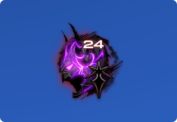

# 暗黑骑士
<FloatTOC />

## 综合介绍

暗黑骑士是伊修加德背负罪孽的骑士，他们堕入黑暗而不再使用盾牌，他们为穷苦的百姓而战，为了心中的正义而战。

黑骑是3.0追加的新特职，也是5.0版本的封面主角。帅自不必说，输出也是高的离谱。黑骑同时使用连击积攒的暗血和魔法进行攻防，是一个比较复杂的T。防御端偏向魔法防御，缺少回复手段，整体较另外三个T要难控制一些。

建议至少有一个T职业的游戏经验之后再来尝试。

## 黑骑入门

暗黑骑士不能作为进入游戏时的初始职业，需要有任意一个战斗职业到达50级并完成主线任务<quest type="main" name="希望的灯火" />之后，在伊修加德接任务<quest type="plus" name="暗黑骑士的传言" />，并继续完成任务<quest type="plus" name="来自深渊" />获得双手剑，就能成为暗黑骑士了。

暗黑骑士属于T职业，想要玩暗黑骑士的玩家，推荐以==剑术师==进入游戏，或者在[新人直升活动](/before/pay.md#萌新招待领多重福利)中选择骑士/战士直升包，在满足主线任务进度要求之后，接任务<quest type="plus" name="来自深渊" />转职。也可以在[直升活动](/before/pay.md#萌新招待领多重福利)中直接选择暗黑骑士直升包。

## 练级手法

暗黑骑士的盾姿是<Action name="深恶痛绝" />(10)，使用深恶痛绝之后，所有技能都会附加10倍基础仇恨。只要开着盾姿正常输出，理论上说几乎是很难OT的。

只要黑骑在MT的位置，就必须保持盾姿<Status :id="743" name="深恶痛绝" />常驻，反之自己如果不是MT，就需要把它关掉。

暗黑骑士作为一个T职业，除了需要掌握自身的输出、减伤等技能运用的同时，还需要有控场意识。可以阅读[T职基础攻略](https://bbs.nga.cn/read.php?tid=19311442)和[四人副本-坦克必备意识和技巧集锦](https://bbs.nga.cn/read.php?tid=15417017)这两篇文章，更详细了解T职业的减伤、空防，以及部分副本的应对实例。

### 对单体拉怪/输出

黑骑的最基本输出连是<Action name="重斩" />→<Action name="吸收斩" />→<Action name="噬魂斩" />，以及远程单拉技能<Action name="伤残" />。

;;;.guide .cols2
;;;.guide .col

暗黑状态及其持续时间
;;;

;;;.guide .col .grow

黑骑单拉的手法就是在盾姿下，以<Action name="伤残" />开怪，然后重复<Action name="噬魂斩" />连击。30级和35级顺次学会<Action name="暗黑波动" />和<Action name="暗黑锋" />之后，则应该优先使用<Action name="暗黑锋" />（之后升级为<Action name="暗影锋" />）开启暗黑状态，暗黑有10%的攻击加成，应该尽全力保持。

;;;
;;;

35级的<Action name="嗜血" />可以回复蓝和暗血，应尽早使用，好了就用，并且在持续时间内打满5个战技。

暗血可以用于使用<Action name="血溅" />，另一方面<Action name="血乱" />可以让玩家不消耗暗血使用3次<Action name="血溅" />或<Action name="寂灭" />，作为爆发技能使用。原则上黑骑应该保持暗血和蓝不溢出，尽可能多放<Action name="血溅" />，除此之外靠其他技能和普通输出连回蓝、暗血。

80级习得的<Action name="掠影示现" />是黑骑最强的能力技，但是完整伤害需要24s才能打完，因此如果怪快死了，就不要放，否则只要有暗血就优先用掠影示现。

最后<Action name="精雕怒斩" />是一个填充技，好了就放即可。<Action name="腐秽大地" />虽然是一个AOE技能，但是由于不占GCD，对单体输出也可以使用，86级后增加<Action name="腐秽黑暗" />技能，可以在腐秽大地快结束的时候使用。

### 对多怪拉怪/输出

黑骑的一般AOE连击是<Action name="释放" />→<Action name="刚魂" />，另外可以耗蓝使用<Action name="暗黑波动" />（之后升级为<Action name="暗影波动" />）。和一般单体连击思路一样，使用<Action name="暗影波动" />维持暗黑状态并泄蓝，使用普通连击获得暗血，然后消耗暗血使用<Action name="寂灭" />。

对应<Action name="精雕怒斩" />的群体技能是<Action name="吸血深渊" />，不过<Action name="吸血深渊" />仅适合在超过4个目标时使用，如果小怪数量只有2、3个，那么就仍然使用<Action name="精雕怒斩" />。

52级的<Action name="腐秽大地" />是以自身为中心的地面圆形AOE，放的时候要注意自己和怪的位置，让所有的怪都到圈里来。86级后增加<Action name="腐秽黑暗" />技能，可以在腐秽大地快结束的时候使用。

在4人本中，黑骑更容易遇到足够大的伤害打破<Action name="至黑之夜" />的护盾，而破盾可以白嫖一次<Action name="暗影波动" />还是十分划算的，与其直接耗蓝放技能，倒不如先给自己套个黑盾，治疗还会更爱你一些。

需要注意的是<Action name="暗黑波动" />/<Action name="暗影波动" />是正面直线AOE，而其他技能都是圆形AOE，需要用的时候可别打歪了。

### 减伤及辅助

职能技能<Action name="铁壁" />是20%小减伤，<Action name="暗影墙" />(38)是30%的大减伤，而<Action name="弃明投暗" />是一个20%的魔法减伤。黑骑在习得<Action name="至黑之夜" />之前，整体减伤能力是不如其他3个T的，游戏中并没有明确查看伤害类型的方式，这导致<Action name="弃明投暗" />在大多数4人本里几乎是无用的（除了人形弓箭手之外的远程攻击几乎都是魔法，近战则比较难以分辨，默认是物理，而部分高难度副本BOSS的技能虽然是近战但也有可能是魔法，更有甚者会交替魔法与物理攻击）。
<!--6_1有更新-->
因此早期的黑骑几乎只能靠<Action name="铁壁" />和<Action name="暗影墙" />苟活渡日，<Action name="行尸走肉" />虽然是一个对标无敌的技能，但是它的特性十分特殊：使用<Action name="行尸走肉" />之后，会获得一个10s的<Status :id="810" name="行尸走肉" />的debuff，在获得debuff期间如果受到了致命伤害（会让HP归0的伤害），则<Status :id="810" name="行尸走肉" />debuff消失，并另外获得一个10s的<Status :id="811" name="死而不僵" />debuff，在<Status :id="811" name="死而不僵" />debuff存续的10s内，黑骑的HP不会下降到0，而如果玩家收到了超过自己血量上限的治疗量，<Status :id="811" name="死而不僵" />debuff就会解除，否则在debuff倒计时结束后，黑骑会再次归于虚无。并不一定所有治疗都认得<Status :id="810" name="行尸走肉" />的debuff，也不一定清楚要如何应对，更多的情况是虽然打开了<Status :id="810" name="行尸走肉" />，但却一直“没死成”，或者<Status :id="811" name="死而不僵" />变成真僵。在高难度副本中，<Status :id="810" name="行尸走肉" />则几乎固定与白魔的<Action name="天赐祝福" />绑定，有默认的使用时机，或需要与队友沟通。

获得<Action name="至黑之夜" />之后的黑骑有了一定的自主权，它是一个相当于自身血量25%的护盾，非常结实，而且破盾之后还能够获得一次免费使用<Action name="暗影锋" />/<Action name="暗影波动" />的机会，所以黑骑应该尽可能多用这个技能来挣减伤、输出和治疗的爱，作为ST时也可以把这个盾给MT，毕竟治疗会看到，也会爱你。<Action name="献奉" />(82)是一个可以给自己或队友的10%减伤，但聊胜于无，使用意义不如至黑之夜。

职能技能<Action name="雪仇" />是一个降低自身周围敌人攻击的技能，在4人副本面对一群小怪时，经常与<Action name="亲疏自行" />一起组成减伤链的最后一环。而在8人副本等难度较高的副本里，雪仇通常会作为重要减伤的一环安排到团队减伤中。

而<Action name="暗黑布道" />是一个魔法团减，效果几乎等于一个魔法版的雪仇。在大多数情况下，我们都认为BOSS的大型AOE（特别华丽或者转场动画）是魔法伤害，但仍有例外，还是需要根据攻略或者ACT记录具体分析。

### 副本实战及应急

在四人本中，确认自己的<Status :id="743" name="深恶痛绝" />已打开，在八人本中，如果你不做MT，那么请把它关上，如果你不确定要不要做MT，可以打字跟队友商量一下（默认情况下则是先开盾姿的一方为MT）。

OT或需要换T时，需要先使用<Action name="挑衅" />，让自己的仇恨变为当前最高仇恨。当对方挑衅换T后，自己应该主动关掉盾姿，并对搭档使用<Action name="退避" />。

黑骑只有职能技能的<Action name="插言" />、<Action name="下踢" />可以进行打断，当怪物读条栏有发光边缘时，表示这个技能可以被打断，但是实际上有必要打断的技能并不多。<Action name="下踢" />是使敌方<Status :id="2" name="眩晕" />而打断，由于FF14中有抗性机制的存在，过多使用打断反而有可能导致需要打断的时候出现抗性，高等级的怪物大都具有眩晕抗性，无法通过眩晕打断。可以查看[副本攻略](/duty/)确认需要/能够打断的技能。

如果你在ST时发现场上倒T或倒奶了，请务必第一时间打开盾姿<Status :id="743" name="深恶痛绝" />。

黑骑和枪刃一样缺乏应急能力，用活死人苟一下，或者给队友套黑盾是他为数不多可以拖延时间的技能，应该尽量避免把你和你的队友置于危险之中。

## 满级手法

> 因精力有限，本站无法提供满级手法参考，可前往NGA论坛查找[暗黑骑士的满级攻略](https://bbs.nga.cn/thread.php?key=%E6%9A%97%E9%BB%91%E9%AA%91%E5%A3%AB&fid=698)