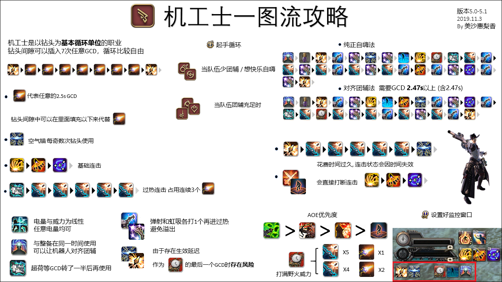

# 机工士
<FloatTOC />

## 综合介绍

帝国机械师西德·加隆德来到艾欧泽亚之后，为这片大地带来了先进的魔导技术。伊修加德自然也没有放过这个机会，他们在城内设立了“天钢机工房”，通过魔导技术开发出了独特的魔导火枪，并且诞生了一种全新的特职——“机工士”。

机工士属于远程物理输出职业，通过召唤炮塔<Action name="车式浮空炮塔" />或机器人<Action name="后式自走人偶" />协助自身进行战斗，和召唤师、学者一样是少数拥有“召唤兽”的职业之一。在**过热**状态下机工士的可使用的部分战技 GCD 为 1.5s，在打爆发时按键频率比大部分职业都高上不少，如果你觉得这个游戏慢吞吞的技能循环让你不爽，那机工一定会满足你。

机工通过控制热度和电能两种资源进行输出，虽然操作相对频率较高，但循环较为固定，70级就可以参照满级循环进行输出，理解难度不高。

## 机工入门

机工士不能作为进入游戏时的初始职业，需要有任意一个战斗职业到达50级并完成主线任务<quest type="main" name="希望的灯火" />之后，在伊修加德接任务<quest type="plus" name="如何成为机工士" />，并继续完成任务<quest type="plus" name="工房救星" />获得火枪，就能成为机工士了。转职后的初始等级为30级。

机工士属于远程物理职业，想要玩机工士的玩家，推荐以==弓箭手==进入游戏，或者在[新人直升活动](/before/pay.md#萌新招待领多重福利)中选择吟游诗人直升包，在满足主线任务进度要求之后，接任务<quest type="plus" name="工房救星" />转职。也可以在[直升活动](/before/pay.md#萌新招待领多重福利)中直接选择机工士直升包。

## 练级手法

和大部分物理输出职业类似，按连击使用对应的技能并适时插入对应的能力技是机工士的基础循环核心。

机工士的部分技能虽属于战技，但会有自己的复唱时间，这些技能会在说明中标注为**该战技有单独计算的复唱时间**。通俗地说，这些战技是有单独 CD 的、会占用 GCD 的技能。

机工士需要在输出过程中管理两种资源**热度**和**电能**。在**热度**累积到 50 时，可以使用<Action name="超荷" />切换到过热状态，以使用两个 GCD 为 1.5s 的战技。在**电能**累积到 50 以上时，可以召唤炮台或者机器人协助战斗。

### 对单体输出

#### 普通状态循环

机工的基础输出循环是<Action name="分裂弹" />(1)、<Action name="独头弹" />(2)和<Action name="狙击弹" />(26)，在后期自动升级为<Action name="热分裂弹" />(54)、<Action name="热独头弹" />(60)和<Action name="热狙击弹" />(64)。在没有其他事情可以做的时候，就打这套连击循环就可以了。因为连击的持续时间有15秒，一旦其他战技转好就可以优先打其他战技。

<Action name="热弹" />(4)是一个打出去之后会立即获取电能的技能，转好后如果没有其他优先级更高的战技，可以直接在下一个GCD里打出。这个技能到 74 级会自动升级为<Action name="空气锚" />，拥有高达700的威力。

58 级通过特职任务获得的战技<Action name="钻头" />是一个单体大伤害技能，同<Action name="空气锚" />一样拥有高达 700 的威力，转好之后请优先打出。

机工的增益技能<Action name="整备" />(10)是一个让5秒内的下一个**战技**必定直爆的技能。这个技能在单体输出时应当绑定机工的最强战技<Action name="钻头" />或者<Action name="空气锚" />使用（如果你还没学会这两个技能，应该把它绑定给你威力最高的<Action name="狙击弹" />）。

在非过热状态下的机工的所有战技 GCD 都是 2.5s，中间可以插入两个能力技，简而言之哪个亮了插哪个就行了。具体说来：

* 在电量高于 50 时，可以使用能力<Action name="车式浮空炮塔" />(40)（在 80 级升级为<Action name="后式自走人偶" />）召唤炮台和机器人协助输出。炮台和机器人的几个技能都会自动触发，因此召唤出来之后就不用再管了。
* <Action name="枪管加热" /> 好了就用。
* 其他时间可以插入能力<Action name="虹吸弹" />和<Action name="弹射" />。

#### 过热状态循环

当热度达到 50 后，使用<Action name="超荷" />即可切换到过热状态。一般而言，<Action name="野火" />作为机工的最主要输出爆发，如果<Action name="野火" />转好了，就应该在<Action name="野火" />中使用<Action name="超荷" />。

在过热状态，机工可以使用<Action name="热冲击" />(35)这个 1.5s GCD 的战技来疯狂输出，狂按就完事了。由于这个战技会减少<Action name="虹吸弹" />和<Action name="弹射" />的 CD 时间，也请记得在中间插入这两个技能以免浪费层数。注意 1.5s GCD 情况下，两个战技之间只能插入一个能力技。

过热状态结束后，如果野火还没结束，应该立即补一个除<Action name="钻头" />和<Action name="空气锚" />之外的战技（因为这两个战技生效有一点延迟）。

### 对群体输出

机工的 AOE 战技有<Action name="散射" />(18)、<Action name="自动弩" />(52)、<Action name="火焰喷射器" />(70)和群体 DoT <Action name="毒菌冲击" />(72)；此外还有能力<Action name="弹射" />(50)。

在小怪 >= 3 只时，如果在过热状态应该使用<Action name="自动弩" />；否则应按优先级从高到低依次使用<Action name="毒菌冲击" />、<Action name="火焰喷射器" />、<Action name="散射" />。<Action name="枪管加热" /> 依然可以好了就用。

小怪数量 = 2 只时，有时使用单体技能效率会更高，具体可以参考满级攻略中进行的计算。

另外，<Action name="火焰喷射器" />可以在BOSS飞天之后对空喷，这样当BOSS落地时，就可以白赚一点伤害。

<Action name="整备" />也可以加强<Action name="散射" />或<Action name="自动弩" />，不过<Action name="毒菌冲击" />不适合使用整备加强（因为DOT不吃整备的必暴加成）。

## 满级手法

满级的机工核心思路应该是保证<Action name="钻头" />和<Action name="空气锚" />不空转，在爆发或者需要对齐团辅时不浪费<Action name="虹吸弹" />和<Action name="弹射" />的层数。满级的机工有许多小细节需要注意，才能达到最大火力。

;;;.guide .cols2
;;;.guide .col

简明一图流攻略
;;;

;;;.guide .col .grow

* [跨界枪鸣 5.x 机工士 大型攻略指南 (持续更新)](https://bbs.nga.cn/read.php?tid=19544623)

;;;
;;;

