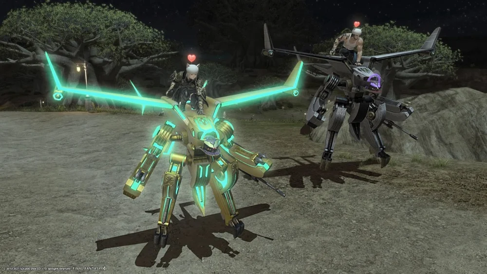
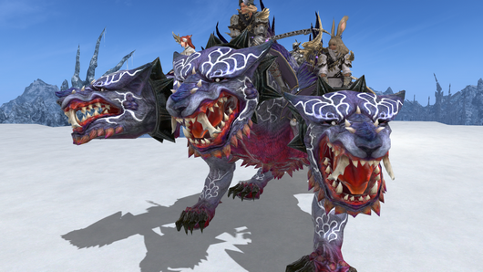

# 南方博兹雅战线
<FloatTOC /> 

::: segment red
**本篇攻略仅介绍南方博兹雅战线及扎杜诺尔高原的游戏内容，发光武器、装备的制作攻略请查看[这个页面](./resistance.md)**
:::

南方博兹雅战线/扎杜诺尔高原是5.x时期的特殊游戏内容，讲述了东方地区博兹雅抵抗帝国统治故事。玩家会深入到抗争的最前线，在战场上和起义军共同对抗帝国的侵略，并由此了解博兹雅的历史，重现第三星历时的传说中的武器——女王之刃。

玩家在博兹雅中主要为了制作5.x版本的发光武器，为71~80级职业练级，获取一些坐骑、宠物、乐谱、发型及其他物品。

;;;.guide .cols3
;;;.guide .col .figcap

劳动十四号坐骑
;;;
;;;.guide .col .figcap

加百列III号机和加百列α坐骑（图片来自[INUISM](https://inuism.com/ff14_gabriel_mark3)）
;;;
;;;.guide .col .figcap

刻耳柏洛斯坐骑
;;;
;;;

::: collapse 博兹雅专属物品产出一览

NOTE：其他途径可以获得的产出不列在此，目前没有完整产出表（主要是开箱概率过低，缺少记录）

| 名称 | 类型 | 获取方式 |
| -- | -- | -- |
|<item name="演技教材·巡视" /> |动作|<item name="博兹雅晶簇" />x 50|
|<item name="演技教材·诅咒" /> |动作|<item name="博兹雅晶簇" />x 50|
|<item name="发型样式：飞翔者" /> |发型|<item name="博兹雅晶簇" />x 25|
|<item name="趣味圆点阳伞" /> |时尚配饰|<item name="博兹雅晶簇" />x 150|
|<item name="天佑女王封印石" /> |桌上家具|<item name="博兹雅晶簇" />x 30|
|<item name="劳动十四号认证密钥" />|坐骑|<item name="博兹雅晶簇" />x 180|
|<item name="迷你贡希尔德" />|宠物|<item name="博兹雅晶簇" />x 100|
|<item name="九宫幻卡：求道之三位一体" /> |幻卡|<item name="博兹雅晶簇" />x 3|
|<item name="九宫幻卡：誓约之三位一体" /> |幻卡|<item name="博兹雅晶簇" />x 3|
|<item name="九宫幻卡：迪亚布罗魔兵" /> |幻卡|<item name="博兹雅晶簇" />x 7|
|<item name="管弦乐琴乐谱：博兹雅的血风" /> |乐谱|<item name="博兹雅晶簇" />x 25|
|<item name="管弦乐琴乐谱：动乱 帝国版（黄道年代）" /> |乐谱|<item name="博兹雅晶簇" />x 25|
|<item name="管弦乐琴乐谱：博兹雅的微风" /> |乐谱|鉴定<item name="南方战线上锁的宝箱" />获得|
|<item name="典雅方格阳伞" /> |时尚配饰|鉴定<item name="南方战线上锁的宝箱" />获得|
|<item name="达因斯莱瓦追踪型" /> |宠物|鉴定<item name="南方战线上锁的宝箱" />获得|
|<item name="加百列α认证密钥" /> |坐骑|鉴定<item name="南方战线上锁的宝箱" />获得|
|<item name="SD达因斯莱瓦" /> |桌上家具|鉴定<item name="南方战线上锁的宝箱" />获得|
|<item name="SD地狱潜者" /> |桌上家具|鉴定<item name="南方战线上锁的宝箱" />获得|
|<item name="博兹雅耳坠" />|耳坠|鉴定1000次失传碎晶成就获得|
|博兹雅装备 |装备|<item name="博兹雅古钱" />兑换（点击名称查看详情）|
|裁决装备 |装备|<item name="博兹雅古金币" />兑换（点击名称查看详情）|
|女王装备 |装备|<item name="博兹雅古白金币" />兑换（点击名称查看详情）|
|<item name="魔导地狱潜者追踪型" /> |宠物|击败攻城战BOSS1后，奖励宝箱内概率获得|
|<item name="管弦乐琴乐谱：召唤兽战（黄道年代）" /> |乐谱|击败攻城战BOSS1后，奖励宝箱内概率获得|
|<item name="管弦乐琴乐谱：潜入（黄道年代）" /> |乐谱|攻城战救出俘虏，奖励宝箱内概率获得|
|<item name="管弦乐琴乐谱：女王复活" /> |乐谱|通关女王古殿后，奖励宝箱内概率获得|
|<item name="管弦乐琴乐谱：无言之战（黄道年代）" /> |乐谱|通关女王古殿后，奖励宝箱内概率获得|
|<item name="管弦乐琴乐谱：索亨地下宫殿（黄道年代）" /> |乐谱|通关女王古殿后，奖励宝箱内概率获得|
|<item name="女王枪手的兵棋" /> |桌上家具|通关女王古殿后，奖励宝箱内概率获得|
|<item name="女王士兵的兵棋" /> |桌上家具|通关女王古殿后，奖励宝箱内概率获得|
|<item name="女王战士的兵棋" /> |桌上家具|通关女王古殿后，奖励宝箱内概率获得|
|<item name="女王骑士的兵棋" /> |桌上家具|通关女王古殿后，奖励宝箱内概率获得|
|<item name="天佑装甲" /> |陆行鸟甲|通关女王古殿后，奖励宝箱内概率获得|
|<item name="发型样式：黎明辫" /> |发型|通关女王古殿后，奖励宝箱内概率获得|
|<item name="女王枪手的兵棋" /> |桌上家具|通关女王古殿后，奖励宝箱内概率获得|
|<item name="加百列III号机认证密钥" /> |坐骑|通关女王古殿后，奖励宝箱内概率获得|
|<item name="加百列α认证密钥" /> |坐骑|鉴定<item name="南方战线上锁的宝箱" />获得|
|<item name="刻耳柏洛斯角笛" /> |坐骑|通关零式女王古殿成就获得|

:::

## 博兹雅基本情报

完成主线任务<Quest name="暗影之逆焰" type="main" />和70级24人本系列任务重返伊瓦利斯后（起始任务为<Quest name="被通缉的剧团" type="plus" />，结束任务为<Quest name="乐欲之所瓯博讷修道院" type="plus" />）后，就可以在黄金港接任务<Quest name="失传的圣遗物" type="plus" />。完成一系列剧情任务后可以来到甘戈斯，接任务<Quest name="苍鹰归巢作战" type="plus" />（需要完成<Quest name="纯白誓约、漆黑密约" type="main" />及甘戈斯的<Quest name="博兹雅堡垒蒸发事件" type="plus" />、<Quest name="重现“女王之刃”" type="plus" />任务）后就可以开启南方博兹雅战线了。

71级以上的职业可以与谢罗斯<Pos name="甘戈斯" :x="5.5" :y="5.4" />对话，进入南方博兹雅战线。在博兹雅中，所有装备被强制同步为IL430，魔晶石无效化，同时玩家有被称作<i class="xiv rlv"></i>义军等级的专属等级，义军等级不影响角色强度，只影响玩家的任务进度和活动范围。玩家参与冲突战与紧急遭遇战会获得==战果==，收集足够数量的战果就可以与NPC对话提升义军等级。玩家在<i class="xiv rlv"></i>6之后，陷入无法战斗状态的玩家会被扣除少量战果，如果自行返回或退出博兹雅则会被二次扣除大量战果，尽可能呼喊他人救援。

南方战线地图被高低差和哨所大致分为3个区域，从上到下依次被称为上层、中层、下层，前往中层和上层的哨所分别在<i class="xiv rlv"></i>5和<i class="xiv rlv"></i>8时通过任务开启（任务指示非常明确，可直接在游戏内确认，<i class="xiv rlv"></i>7和<i class="xiv rlv"></i>9的任务地点附近有大量夜行怪，建议白天或切走路完成）。

完成主线任务<Quest name="另一个未来" type="main" />和博兹雅女王古殿任务之后，可以接任务<Quest name="消逝的百合" type="plus" />，开启扎杜诺尔高原地图。扎杜诺尔高原是南方战线的延伸，地图同样被高低差和哨所分为三层，分别在<i class="xiv rlv"></i>18和<i class="xiv rlv"></i>22时开启。

目前博兹雅的基本玩法是积极参加冲突战与紧急遭遇战获得战果，积累碎晶和晶簇，<i class="xiv rlv"></i>10开始积极参与攻城战，完成女王古殿的攻略后继续前往扎杜诺尔高原。制作武器、收集战果记录等。

### 碎晶与失传技能

在博兹雅中获得的各种碎晶，可以鉴定变为失传技能，玩家可以在地图上的失传技能保管箱中编辑失传技能库。失传技能库的容量是有限的，其容量和可以鉴定的碎晶种类会随着<i class="xiv rlv"></i>义军等级的提升而增加。

失传技能库可以保存多个技能组，用于不同场合切换使用，可提前编辑好，按需选择使用。

想要使用失传技能时，打开失传技能库并选择需要的技能（可以将2个技能拖到特殊技能栏中待用），取出待用的技能在退出博兹雅后仍旧保留，下次进入时还可以继续使用。

失传技能在决斗、攻城战、女王古殿以及旗舰战中都是非常重要的技能，具体技能组的选择请参考具体副本/任务攻略。

::: collapse 碎晶获取方式

|南方战线|上层|中层|下层|
|--|--|--|--|
|一般野怪（机械、不死除外）|<item name="未鉴定的祝福失传碎晶" />|<item name="未鉴定的催眠失传碎晶" />|<item name="未鉴定的强化失传碎晶" />|
|元精|<item name="未鉴定的献身失传碎晶" />|<item name="未鉴定的治愈失传碎晶" />|<item name="未鉴定的支援失传碎晶" />|
|<i class="xiv diaem-nm"></i>标精英（S怪）|<item name="未鉴定的暗杀失传碎晶" />|<item name="未鉴定的熟练失传碎晶" />|<item name="未鉴定的新锐失传碎晶" />|

上层紧急遭遇战：<item name="未鉴定的决意失传碎晶" />

|扎杜诺尔高原|北部（3）|西部（2）|南部（1）|
|--|--|--|--|
|一般野怪（机械、不死除外）|<item name="未鉴定的死守失传碎晶" />/<item name="未鉴定的祝福失传碎晶" />|<item name="未鉴定的月光失传碎晶" />|<item name="未鉴定的怒涛失传碎晶" />/<item name="未鉴定的狰狞失传碎晶" />|
|不死野怪|<item name="未鉴定的推进失传碎晶" />|<item name="未鉴定的治愈失传碎晶" />|<item name="未鉴定的支援失传碎晶" />|
|元精|<item name="未鉴定的献身失传碎晶" />|<item name="未鉴定的华丽失传碎晶" />|<item name="未鉴定的时空失传碎晶" />|
|<i class="xiv diaem-nm"></i>标精英（S怪）|<item name="未鉴定的推进失传碎晶" />|<item name="未鉴定的华丽失传碎晶" />|<item name="未鉴定的时空失传碎晶" />|

北部（3层）紧急遭遇战：<item name="未鉴定的结实失传碎晶" />

攻城战：<item name="未鉴定的信仰失传碎晶" />、<item name="未鉴定的觉醒失传碎晶" />、<item name="未鉴定的战术失传碎晶" />、<item name="未鉴定的睡魔失传碎晶" />、<item name="未鉴定的福音失传碎晶" />、<item name="未鉴定的技巧失传碎晶" />

旗舰战：<item name="未鉴定的英雄失传碎晶" />、<item name="未鉴定的天启失传碎晶" />、<item name="未鉴定的战略失传碎晶" />

使用<item name="博兹雅晶簇" />兑换/女王古殿：<item name="未鉴定的探索失传碎晶" />、<item name="未鉴定的睿智失传碎晶" />、<item name="未鉴定的剑豪失传碎晶" />、<item name="未鉴定的射技失传碎晶" />、<item name="未鉴定的豪勇失传碎晶" />、<item name="未鉴定的祈祷失传碎晶" />、<item name="未鉴定的奇迹失传碎晶" />（仅能用碎晶购买）

:::

[失传技能一览](https://nga.178.com/read.php?tid=23729024)<!--等个链接-->

### 博兹雅晶簇

击杀地图上所有的机械类及部分不死类野怪会掉落<item name="博兹雅晶簇" />，可以用于兑换CE优先权以及一些道具、碎晶（点击道具名称查看详情）。

### 冲突战（SM）与紧急遭遇战（CE）

冲突战（简称SM），是地图上自动刷新出的像FATE一样的区域战斗。完成战斗后，会根据金银牌评价获得战果及经验（71~79级职业）或神典石（80级职业），是获取战果的主要方式，建议积极参加。[南方战线冲突战一览](https://ff14.huijiwiki.com/wiki/%E5%8D%97%E6%96%B9%E5%8D%9A%E5%85%B9%E9%9B%85%E6%88%98%E7%BA%BF/%E5%86%B2%E7%AA%81%E6%88%98%E4%B8%80%E8%A7%88)

紧急遭遇战（简称CE），是完成特定SM之后出现的特殊FATE。需要队长在博兹雅搜索器中申请加入（参加申请1分钟）。CE的参加人数是有限的，当申请人数超过限制人数时，会有一定数量玩家落选，其中小队是以整队为单位中选/落选，可以使用5个<item name="博兹雅晶簇" />兑换申请优先权，但当一个小队申请时，需要所有队员均兑换出<Status :id="2358" name="攻击请求" />后方才有效。如果申请人数不足，则会在申请时间结束后开启追加申请，以个人为单位，先到先得。

CE申请期结束后，进入2分钟的准备期，在准备期间随时可以点击博兹雅搜索器进入CE战斗区域（可以在进入战斗区域之前切换职业，进入CE战斗区域后不可切换职业）。CE的所有奖励都比SM要高，推荐积极参加。[南方战线紧急遭遇战一览](https://ff14.huijiwiki.com/wiki/%E5%8D%97%E6%96%B9%E5%8D%9A%E5%85%B9%E9%9B%85%E6%88%98%E7%BA%BF/%E7%B4%A7%E6%80%A5%E9%81%AD%E9%81%87%E6%88%98%E4%B8%80%E8%A7%88)。

#### 决斗

在部分CE中未曾错误处理机制（即不吃到任何可回避伤害）的玩家，可以获得抽选决斗（单挑）的权利。

决斗需要准备合适的失传技能，建议提前看好攻略之后再考虑参与报名决斗。也可以先围观他人决斗，若他人决斗成功，附近的围观群众可以获得<Status :id="2365" name="士气高涨" />	，战果获得+50%。[南方战线决斗一览](https://ff14.huijiwiki.com/wiki/%E5%8D%97%E6%96%B9%E5%8D%9A%E5%85%B9%E9%9B%85%E6%88%98%E7%BA%BF/%E7%B4%A7%E6%80%A5%E9%81%AD%E9%81%87%E6%88%98%E4%B8%80%E8%A7%88#.E5.86.B3.E6.96.97)。

> 参加SM、CE和决斗会有一定概率获得“战果记录”，右键使用战果纪录可以获得一些NPC的情报故事（在菜单 > 重要物品处查看）。
>
> 多余的战果记录可以在义军情报军官<Pos name="南方博兹雅战线" :x="15" :y="29.1" />处兑换为<item name="南方战线上锁的宝箱" />。
>
> 集齐全部战果记录可以获得坐骑<item name="王冠号认证密钥" />。战果记录获取途径查询：[1~20](https://www.ffxiv.cn/detail/article/564)，[21~50](https://www.ffxiv.cn/detail/article/565)。

### 义军勋章

玩家达到<i class="xiv rlv"></i>25之后，可以在白沙恩<Pos name="扎杜诺尔高原" :x="35.1" :y="34.2" />处接任务<Quest name="鲜血女王的进军" type="plus" />，完成任务之后可以开启战果认定和义军勋章功能。

使用2000万战果可以兑换3张战果认定证，使用战果认定证就可以兑换义军勋章，义军勋章分为勇猛（每个加3%输出）、坚守（每个加5%血量）、救命（每个加10%治疗量）三种，每种最多可兑换10个，兑换所需的战果认定证会随着兑换徽章的数量增加而增长。勋章所提供的增强均只能在博兹雅相关地区内生效。

|义军勋章等级|1、2|3、4|5、6|7、8|9、10|
|--|--|--|--|--|--|
|所需认定证|1张|2张|3张|4张|5张|

兑换一种义军勋章需要2亿战果，3种勋章全部需要6亿战果。通常会优先兑换<Status :id="2626" name="勇猛彗星勋章" />。

## 攻城战

当玩家达到<i class="xiv rlv"></i>10后，剧情开放帝国湖岸堡攻城战，攻城战属于特殊的CE，和其他CE一起排本，如果想要参加攻城的玩家请注意同时不要排其他CE。

攻城战大约1小时刷新一次（也许有其他条件，目前不明确），玩家可以在进入攻城战之后自行组队。

攻城每个BOSS/阶段结束后都有宝箱，而且是个人宝箱，需要自己去开，要注意。

## 女王古殿

需要<i class="xiv rlv"></i>10以后并至少完成过一次攻城战，剧情开启女王古殿的任务。

女王古殿需要使用80级的职业在谢罗斯<Pos name="甘戈斯" :x="5.5" :y="5.4" />处申请参加，由于是自由参加的，所以可能出现没有T/奶的情况，要注意。

完成女王古殿的玩家，可以接任务<Quest name="海滨之约" type="plus" />开启零式女王古殿（需要<i class="xiv rlv"></i>15并拥有7万战果）。

女王古殿难度较高，推荐先看攻略再进本，并准备适量失传技能。[女王古殿子言视频攻略](https://www.bilibili.com/video/BV1Rf4y1h79B)。

零式女王古殿参考攻略：[susu文字预备课](https://www.ffsusu.com/detail/article/557)，[魔法少女 x 钰子烧视频攻略](https://space.bilibili.com/8162492/video)。

## 旗舰战

当玩家达到<i class="xiv rlv"></i>25后，剧情开放旗舰达尔里阿达号攻略战，和攻城战一样，旗舰战也属于特殊CE，如果想要参加旗舰战的玩家请注意同时不要排其他CE。

攻城战大约1小时刷新一次（也许有其他条件，目前不明确），玩家可以在进入攻城战之后自行组队。

攻城每个BOSS/阶段结束后都有宝箱，而且是个人宝箱，需要自己去开，要注意。